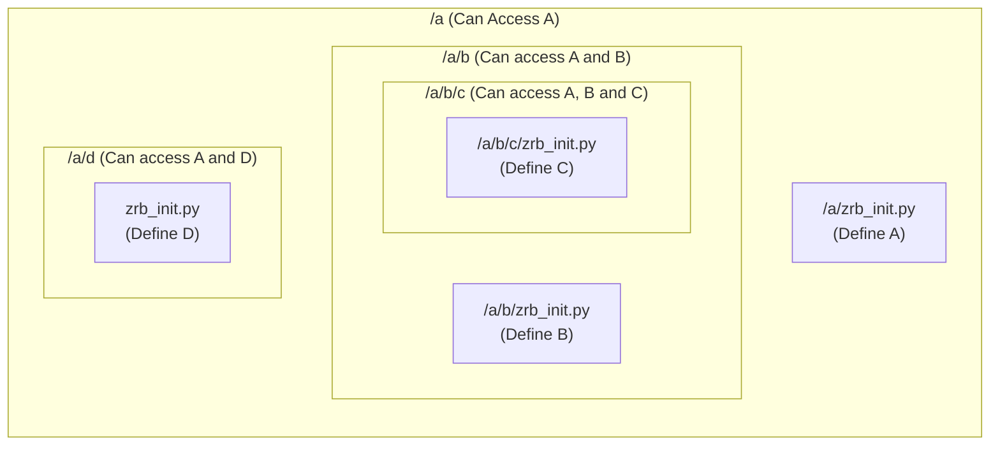

🔖 [Home](../../README.md)

# Welcome to the Zrb Documentation!

Zrb is a powerful and flexible automation tool designed to make your life easier. It helps you streamline repetitive tasks, build custom workflows with Python, and even integrate with modern technologies like Large Language Models (LLMs).

Whether you're a beginner looking to automate your first script or an experienced developer building complex CI/CD pipelines, Zrb provides the structure and tools you need to get the job done. This documentation is your guide to mastering Zrb, from its core principles to its most advanced features.

## The Core Principles

Zrb is designed to be intuitive. Here are the key principles to keep in mind as you get started.

### 1. Everything Starts with `zrb_init.py`

This is your magic file. When you run `zrb`, it looks for `zrb_init.py` in the current directory and all parent directories. This creates a powerful inheritance system.

*   Place a `zrb_init.py` in any directory to define tasks and configurations.
*   Tasks defined in a parent directory are available in all its subdirectories.



### 2. The `cli` Object is Your Entry Point

All tasks must be connected to the global `cli` object to be accessible. You can add tasks directly or organize them into `Group`s.

```python
from zrb import cli, Group, CmdTask

# Add a task directly to the cli
cli.add_task(CmdTask(name="hello", cmd="echo hello"))

# Organize tasks in a group
alarm_group = cli.add_group(Group(name="alarm"))
alarm_group.add_task(CmdTask(name="wake-up", cmd="echo 'Wake up!'"))

alarm_critical_group = alarm_group.add_group(Group(name="critical"))
alarm_critical_group.add_task(CmdTask(name="fire", cmd="echo 'Fire!!!'"))

```


The resulting hierarchy can be visualized as:

```
cli
    [task] hello          zrb hello
    [group] alarm
        [task] wake-up      zrb alarm wake-up
        [group] critical
            [task] fire       zrb alarm critical fire
```


### 3. Define Dependencies with `upstream`


Before Zrb runs a task, it verifies that all its upstream dependencies have been completed.

By assigning individual retry strategies to each task, you can create more resilient and efficient workflows.

```python
from zrb import cli, CmdTask

become_novice = CmdTask(name="become-novice", cmd="echo become novice")
become_merchant = CmdTask(
    name="become-merchant",
    cmd="echo become merchant",
    upstream=become_novice,  # To become a merchant, you must first be a novice.
)
become_alchemist = cli.add_task(
    CmdTask(
        name="become-alchemist",
        cmd="echo become alchemist",
        upstream=become_merchant,  # To become an alchemist, you must first be a merchant.
    )
)
```

or

```python
from zrb import cli, CmdTask

become_novice = CmdTask(name="become-novice", cmd="echo become novice")
become_merchant = CmdTask(name="become-merchant", cmd="echo become merchant")
become_alchemist = cli.add_task(CmdTask(name="become-alchemist", cmd="echo become alchemist"))

become_novice >> become_merchant >> become_alchemist
```

Because `become_alchemist` depends on `become_merchant`, and `become_merchant` depends on `become_novice`, the tasks will always run in that sequence when you invoke the `become-alchemist` task.

```sh
zrb become-alchemist
```

```
become novice
become merchant
become alchemist
```

### 4. Gather User Input with `input`

Make your tasks interactive by defining `input`s. Zrb will prompt the user if values are not provided as flags.

```python
from zrb import cli, CmdTask, StrInput

cli.add_task(
    CmdTask(
        name="hello",
        input=[
            StrInput(name="name"),
            StrInput(name="prefix", default="Mr./Ms."),
        ],
        cmd="echo 'Hello {ctx.input.prefix} {ctx.input.name}'",
    )
)
```

### 5. Access Environment Variables with `env`

Use the `env` parameter to define and access environment variables within your tasks via `ctx.env`.

```python
from zrb import cli, CmdTask, Env

cli.add_task(
    CmdTask(
        name="hello",
        env=[
            Env(name="USER", default="nobody"),
            Env(name="SHELL", default="sh"),
        ],
        cmd="echo 'Hello {ctx.env.USER}, your shell is {ctx.env.SHELL}'",
    )
)
```

### 6. Share Data with `xcom`

Tasks can communicate with each other by passing data through `xcom` (cross-communication). A task's return value is automatically pushed to its `xcom` queue.

```python
from zrb import cli, CmdTask

create_magic_number = CmdTask(name="create-magic-number", cmd="echo 42")
cli.add_task(
    CmdTask(
        name="show-magic-number",
        upstream=[create_magic_number],
        cmd="echo 'The magic number is: {ctx.xcom['create-magic-number'].pop()}'",
    )
)
```

### 7. Use `@make_task` for Python Functions

The `@make_task` decorator is an elegant way to turn any Python function into a Zrb task.

```python
from zrb import cli, make_task, AnyContext, StrInput

@make_task(
    name="count-word",
    input=StrInput(name="text"),
    group=cli,
)
def count_word(ctx: AnyContext) -> int:
    return len(ctx.input.text.split(" "))
```

## Explore the Documentation


*   [**Installation and Configuration**](./installation-and-configuration/README.md)
    *   [Configuration](./installation-and-configuration/configuration/README.md)
*   [**Core Concepts**](./core-concepts/README.md)
    *   [CLI and Group](./core-concepts/cli-and-group.md)
    *   [Task](./core-concepts/task/README.md)
    *   [Input](./core-concepts/input/README.md)
    *   [Env](./core-concepts/env/README.md)
    *   [Session and Context](./core-concepts/session-and-context/README.md)
        *   [Session](./core-concepts/session-and-context/session.md)
        *   [Context](./core-concepts/session-and-context/context.md)
        *   [XCom](./core-concepts/session-and-context/xcom.md)
    *   [Built-in Tasks](./core-concepts/builtin-tasks.md)
*   [**Advanced Topics**](./advanced-topics/README.md)
    *   [CI/CD Integration](./advanced-topics/ci_cd.md)
    *   [Upgrading Guide 0.x.x to 1.x.x](./advanced-topics/upgrading_guide_0_to_1.md)
    *   [Maintainer Guide](./advanced-topics/maintainer-guide.md)
    *   [Creating a Custom Zrb Powered CLI](./advanced-topics/creating-custom-zrb-powered-cli.md)
*   [**Changelog**](./changelog.md)


---
🔖 [Home](../../README.md)