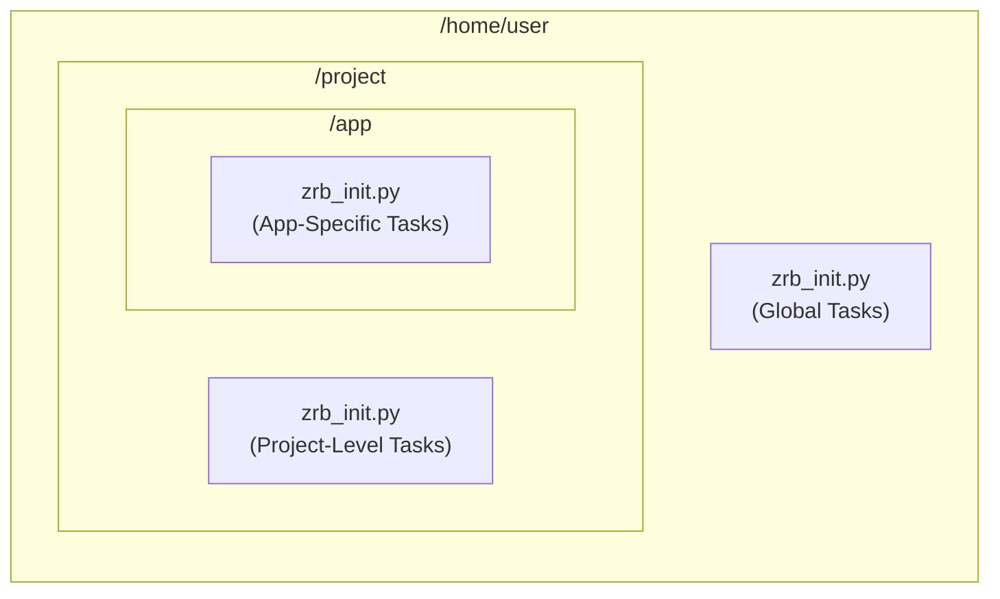

🔖 [Home](../../README.md)

---

# Welcome to the Zrb Documentation!

This is your comprehensive guide to **Zrb**, a powerful and flexible automation tool designed to make your life easier. Zrb helps you streamline repetitive tasks, build custom workflows with Python, and even integrate with modern technologies like Large Language Models (LLMs).

Whether you're a beginner looking to automate your first script or an experienced developer building complex CI/CD pipelines, Zrb provides the structure and tools you need to get the job done.

---

## 🚀 The Core Principles

Zrb is designed to be intuitive and powerful. Here are the key concepts to understand as you get started.

### 1. Everything Starts with `zrb_init.py`

This is your magic file. When you run `zrb`, it searches for `zrb_init.py` in the current directory and then recursively in all parent directories. This creates a powerful inheritance system where tasks defined in a parent directory are available to all its subdirectories.


*When you run `zrb` from `/home/user/project/app`, you can access tasks defined in all three `zrb_init.py` files.*

### 2. The `cli` Object is Your Entry Point

All tasks must be connected to the global `cli` object to be accessible. You can add tasks directly or organize them into `Group`s for better structure.

```python
from zrb import cli, Group, CmdTask

# Add a task directly to the root
cli.add_task(CmdTask(name="hello", cmd="echo 'Hello, World!'"))

# Organize tasks into a group
alarm_group = cli.add_group(Group(name="alarm"))
alarm_group.add_task(CmdTask(name="wake-up", cmd="echo 'Wake up!'"))
```

This creates a clean, hierarchical command structure:
```
zrb hello
zrb alarm wake-up
```

### 3. Define Dependencies with `>>`

Zrb ensures that all upstream dependencies are completed before a task runs. You can define the order of execution easily using the `>>` operator, creating resilient and efficient workflows.

```python
from zrb import cli, CmdTask

# Define individual tasks
become_novice = CmdTask(name="become-novice", cmd="echo 'Welcome, Novice!'")
become_merchant = CmdTask(name="become-merchant", cmd="echo 'You are now a Merchant.'")
become_alchemist = cli.add_task(CmdTask(name="become-alchemist", cmd="echo 'Greetings, Alchemist!'"))

# Chain them together to define the workflow
become_novice >> become_merchant >> become_alchemist
```
When you run the final task, Zrb executes the entire chain in the correct order.
```sh
$ zrb become-alchemist
Welcome, Novice!
You are now a Merchant.
Greetings, Alchemist!
```

### 4. Gather User Input Interactively

Make your tasks dynamic by defining `input`s. If a value isn't provided as a command-line flag, Zrb will automatically prompt the user for it.

```python
from zrb import cli, CmdTask, StrInput

cli.add_task(
    CmdTask(
        name="hello",
        input=[
            StrInput(name="name", help="Your name"),
            StrInput(name="prefix", default="Mr./Ms.", help="Your title"),
        ],
        cmd="echo 'Hello, {ctx.input.prefix} {ctx.input.name}'",
    )
)
```

### 5. Access Environment Variables Securely

Use the `env` parameter to define and access environment variables within your tasks via `ctx.env`. This is perfect for managing configuration and secrets.

```python
from zrb import cli, CmdTask, Env

cli.add_task(
    CmdTask(
        name="hello",
        env=[
            Env(name="USER", default="nobody"),
            Env(name="SHELL", default="/bin/sh"),
        ],
        cmd="echo 'Hello {ctx.env.USER}, your shell is {ctx.env.SHELL}'",
    )
)
```

### 6. Share Data Between Tasks with XCom

Tasks can communicate with each other by passing data through **XCom (Cross-Communication)**. A task's return value is automatically pushed to its XCom queue, making it available to downstream tasks.

```python
from zrb import cli, CmdTask

# This task returns "42"
create_magic_number = CmdTask(name="create-magic-number", cmd="echo 42")

# This task consumes the value from the first task's XCom
cli.add_task(
    CmdTask(
        name="show-magic-number",
        upstream=[create_magic_number],
        cmd="echo 'The magic number is: {ctx.xcom['create-magic-number'].pop()}'",
    )
)
```

### 7. Turn Python Functions into Tasks with `@make_task`

The `@make_task` decorator is an elegant way to convert any Python function into a Zrb task, allowing you to write complex logic without leaving Python.

```python
from zrb import cli, make_task, AnyContext, StrInput

@make_task(
    name="count-words",
    input=StrInput(name="text", help="The text to analyze"),
    group=cli,
)
def count_words(ctx: AnyContext) -> int:
    """Counts the number of words in the input text."""
    word_count = len(ctx.input.text.split())
    print(f"The text has {word_count} words.")
    return word_count
```

---

## 🗺️ Explore the Documentation

Ready to dive deeper? Choose your path:

*   [**Installation and Configuration**](./installation-and-configuration/README.md)
    *   [Configuration](./installation-and-configuration/configuration/README.md)
*   [**Core Concepts**](./core-concepts/README.md)
    *   [CLI and Group](./core-concepts/cli-and-group.md)
    *   [Task](./core-concepts/task/README.md)
    *   [Input](./core-concepts/input/README.md)
    *   [Env](./core-concepts/env/README.md)
    *   [Session and Context](./core-concepts/session-and-context/README.md)
    *   [Built-in Tasks](./core-concepts/builtin-tasks.md)
*   [**Advanced Topics**](./advanced-topics/README.md)
    *   [CI/CD Integration](./advanced-topics/ci-cd.md)
    *   [Creating a Custom Zrb-Powered CLI](./advanced-topics/creating-custom-zrb-powered-cli.md)
    *   [Upgrading Guide](./advanced-topics/upgrading-guide-0-to-1.md)
    *   [Maintainer Guide](./advanced-topics/maintainer-guide.md)
*   [**Changelog**](./changelog.md)

---
🔖 [Home](../../README.md)

➡️ [Next: Installation and Configuration](./installation-and-configuration/README.md)