🔖 [Home](../../README.md)
# Zrb Documentation

Welcome to the official documentation for Zrb, your automation powerhouse!

Zrb is a powerful and flexible tool designed to help you automate repetitive tasks, integrate with modern technologies like Large Language Models (LLMs), and build custom workflows using Python. Whether you are a beginner looking to automate simple scripts or an experienced developer building complex CI/CD pipelines, Zrb provides the tools and structure you need.

This documentation is your starting point to learn more about Zrb, understand its core concepts, and explore its capabilities.

## Basic Principles

When working with Zrb, there are some common principles you should have in mind.

* Everything defined in `zrb_init.py`
    * You can place `zrb_init.py` anywhere.
    * You can define tasks, groups, and configurations in your `zrb_init.py`
    * Any tasks and configurations defined in `<dir>/zrb_init.py` will works on the `<dir>` as well as its sub-directories. 

    ```mermaid
    flowchart LR
    subgraph homeDir ["(Can Access A)"]
        homeDirZrbInit["zrb_init.py<br/>(Define A)"]
        subgraph projectDir ["(Can access A and B)"]
            projectDirZrbInit["zrb_init.py<br />(Define B)"]
            subgraph subProjectDir ["(Can access A, B and C)"]
                subProjectDirZrbInit["zrb_init.py<br />(Define C)"]
            end
        end
        subgraph otherProjectDir ["(Can access A and D)"]
            otherProjectDirZrbInit["zrb_init.py<br />(Define D)"]
        end
    end
    ```
* Task access hierarchy always started with a `cli`.
* You can use `upstreams` parameter or `>>` operator to define task dependencies.
* Use `task`'s `input` to get user inputs.
* Use `task`'s `env` to get environment variable values.
* Use `xcom` to for inter `task` communication.


# Topics

* [Installation and Configuration](./installation-and-configuration/README.md)
    * [Configuration](./installation-and-configuration/configuration/README.md)
* [Core Concepts](./core-concepts/README.md)
    * [CLI and Group](./core-concepts/cli-and-group.md)
    * [Task](./core-concepts/task/README.md)
    * [Input](./core-concepts/input/README.md)
    * [Env](./core-concepts/env/README.md)
    * [Session and Context](./core-concepts/session-and-context/README.md)
        * [Session](./core-concepts/session-and-context/session.md)
        * [Context](./core-concepts/session-and-context/context.md)
        * [XCom](./core-concepts/session-and-context/xcom.md)
*   [Advanced Topics](#advanced-topics)
    * [CI/CD Integration](./ci_cd.md)
    * [Upgrading Guide 0.x.x to 1.x.x](./upgrading_guide_0_to_1.md)
    * [Troubleshooting](./troubleshooting/)
    * [Maintainer Guide](./maintainer-guide.md)
    * [Changelog](./changelog.md)
    * [Creating a Custom Zrb Powered CLI](./creating-custom-zrb-powered-cli.md)


### Quick Start

Dive right in and build a simple automation workflow with two tasks: one using an LLM and another executing a command. This guide will walk you through creating your `zrb_init.py` file and running your tasks.

Start the Quick Start guide: [Build Your First Automation Workflow](./task/creating_tasks.md)

## Core Concepts

Understanding these core concepts is key to effectively using Zrb.

```mermaid
flowchart LR
    %% Layout: group related nodes in subgraphs to avoid overlap
    subgraph CLI_Group ["CLI & Group"]
        direction TB
        CLI["💻 CLI"]
        Group["🏛️ Group<br/>(class)"]
    end

    subgraph Task_Hierarchy ["Task Hierarchy"]
        direction TB
        AnyTask["🧩 AnyTask<br/>(interface)"]
        BaseTask["🏗️ BaseTask<br/>(core base class)"]
        Task["✅ Task<br/>(user-facing base)"]
        BaseTrigger["⏩ BaseTrigger<br/>(event/callback base)"]
        Scheduler["⏰ Scheduler<br/>(scheduled task)"]
        CmdTask["🖥️ CmdTask"]
        LLMTask["🤖 LLMTask"]
        Scaffolder["🛠️ Scaffolder"]
        HttpCheck["🌐 HttpCheck"]
        RsyncTask["🔄 RsyncTask"]
        TcpCheck["📡 TcpCheck"]
    end

    subgraph CallbackBlock ["Event/Callback"]
        direction TB
        Callback["🔔 Callback"]
    end

    subgraph ContextBlock ["Session & Context"]
        direction TB
        Session["🗃️ Session"]
        Context["🧠 Context (ctx)"]
        XCom["🔄 XCom"]
    end

    subgraph EnvBlock ["Environment"]
        AnyEnv["🧩 AnyEnv<br/>(interface)"]
        Env["🌿 Env"]
        EnvMap["🧬 EnvMap"]
        EnvFile["📄 EnvFile"]
    end
    subgraph InputBlock ["Inputs"]
        AnyInput["🧩 AnyInput<br/>(interface)"]
        BaseInput["🏗️ BaseInput"]
        StrInput["📝 StrInput"]
        IntInput["🧮 IntInput"]
        FloatInput["🔢 FloatInput"]
        BoolInput["🔘 BoolInput"]
        OptionInput["🎚️ OptionInput"]
        PasswordInput["🔑 PasswordInput"]
        TextInput["🗒️ TextInput"]
    end

    %% CLI/Group relations
    CLI -->|is a| Group
    Group -->|has| AnyTask
    Group -->|has| Group

    %% Task hierarchy
    BaseTask -->|implements| AnyTask
    Task -->|inherits| BaseTask
    BaseTrigger -->|inherits| BaseTask
    Scheduler -->|inherits| BaseTrigger
    CmdTask -->|inherits| BaseTask
    LLMTask -->|inherits| BaseTask
    Scaffolder -->|inherits| BaseTask
    HttpCheck -->|inherits| BaseTask
    RsyncTask -->|inherits| CmdTask
    TcpCheck -->|inherits| BaseTask

    %% BaseTask properties and access
    BaseTask -->|has| AnyEnv
    BaseTask -->|has| AnyInput
    BaseTask -->|accesses| Context
    AnyTask -->|is upstream of| BaseTask
    AnyTask -->|is checker of| BaseTask

    %% Callback usage
    BaseTrigger -->|has| Callback
    Callback -->|executes| AnyTask

    %% Session/Context relations
    Session -->|runs| AnyTask
    Session -->|provides| Context
    Context -->|has| AnyEnv
    Context -->|has| AnyInput
    Context -->|has| XCom

    %% Expanded Env relationships
    Env -->|inherits| AnyEnv
    EnvMap -->|inherits| AnyEnv
    EnvFile -->|inherits| EnvMap

    %% Expanded Input relationships
    BaseInput -->|inherits| AnyInput
    StrInput -->|inherits| BaseInput
    IntInput -->|inherits| BaseInput
    FloatInput -->|inherits| BaseInput
    BoolInput -->|inherits| BaseInput
    OptionInput -->|inherits| BaseInput
    PasswordInput -->|inherits| BaseInput
    TextInput -->|inherits| BaseInput
```



> **Legend:**
> - 💻 CLI: Command-line interface entry point
> - 🏛️ Group: Group class for organizing tasks
> - 🏗️ BaseTask: Core base class for all tasks
> - 🧩 ... (interface): Interface/abstract base (e.g., AnyTask, AnyEnv, AnyInput)
> - 🌿 Env: Single environment variable class
> - 🧬 EnvMap: Environment variable map class
> - 📄 EnvFile: Environment file loader class
> - 🏗️ BaseInput: Base input class (parent of all concrete input types)
> - 📝 StrInput: String input
> - 🧮 IntInput: Integer input
> - 🔢 FloatInput: Float input
> - 🔘 BoolInput: Boolean input
> - 🎚️ OptionInput: Option (select) input
> - 🔑 PasswordInput: Password/secret input
> - 🗒️ TextInput: Multi-line text input
> - ✅ Task: Main user-facing base class (inherits from BaseTask)
> - ⏩ BaseTrigger: Event/callback base task
> - ⏰ Scheduler: Scheduled/cron task
> - 🖥️ CmdTask: Command execution task
> - 🤖 LLMTask: Language model/AI task
> - 🛠️ Scaffolder: File/template generation task
> - 🌐 HttpCheck: HTTP health check task
> - 🔄 RsyncTask: File sync task
> - 📡 TcpCheck: TCP port check task
> - 🔔 Callback: Event/callback handler (used by triggers/schedulers, executes an AnyTask)
> - 🗃️ Session: Execution session
> - 🧠 Context: Task/session context
> - 🔄 XCom: Cross-task communication
>
> **All edges are labeled. Subgraphs are used to avoid overlap and clarify relationships.**
### Tasks

Tasks are the fundamental units of work in Zrb. Each task represents a specific action or step in your automation workflow. Tasks can be defined using Python classes or functions and can have inputs, environment variables, dependencies, and actions.

*   [Overview of Tasks](./task/README.md)
*   [Creating Tasks](./task/creating_tasks.md)
*   [Key Components of a Task](./task/key_components.md)
*   [Built-in Task Types](./task/types/README.md) (Includes links to `CmdTask`, `LLMTask`, `Scaffolder`, etc.)

### Groups

Groups allow you to organize related tasks and subgroups into a hierarchical structure. This helps manage complexity in larger projects and provides a logical way to access tasks via the CLI or web interface.

*   [Documentation on Groups](./group.md)

### CLI

The Command-Line Interface is the primary way to interact with Zrb from your terminal. You can list available tasks and groups, run specific tasks, and provide inputs and configuration via command-line arguments and environment variables.

*   [Documentation on the CLI](./cli.md)

### Context

The `Context` object (`ctx`) is passed to the `action` method of every task. It provides access to all the information a task needs during execution, including inputs, environment variables, shared session data, logging utilities, and rendering capabilities.

*   [Documentation on Context](./context.md)

### Session

A Session represents a single execution run of one or more Zrb tasks. It manages the task lifecycle, dependency resolution, context provisioning, and state logging for the entire workflow triggered by a single command or web request.

*   [Documentation on Sessions](./session.md)

### Inputs

Inputs are used to pass parameters to your tasks. Zrb provides a flexible input system with multiple input types, each designed for different use cases. You can define various types of inputs (string, integer, boolean, options, etc.) with default values and descriptions. Zrb handles prompting the user for input if not provided via the command line or other means.

**Available Input Types:**

- **AnyInput**: The abstract base class/interface for all input types. All input types inherit from this and must implement its required methods and properties.
- **BaseInput**: A concrete base class that implements most of the logic for standard inputs. Most input types extend this.
- **StrInput**: Standard string input. Accepts any string value.
- **IntInput**: Integer input. Accepts integer values, with optional default and prompt.
- **FloatInput**: Floating-point input. Accepts decimal numbers.
- **BoolInput**: Boolean input. Accepts true/false values, typically rendered as a select/dropdown.
- **OptionInput**: Input with a predefined set of string options. Renders as a dropdown/select in UI and validates input against allowed options.
- **PasswordInput**: Input for sensitive data (e.g., passwords). Hides input in CLI and UI.
- **TextInput**: Multi-line text input, optionally opened in an external editor. Useful for longer text or code snippets.

*   [Documentation on Inputs](./input.md)

### Environment Variables

Environment variables are used for configuration. Zrb allows you to define environment variables for tasks, load them from `.env` files, and link them to system environment variables. These are accessible via the `ctx.env` object.

**Available Environment Variable Types:**

- **AnyEnv**: The abstract base class/interface for all environment variable types. All env types inherit from this and must implement its required methods.
- **Env**: Represents a single environment variable, with support for default values, auto-rendering, and linking to OS environment variables.
- **EnvMap**: Represents a collection (map) of environment variables, which can be defined as a static dictionary or generated dynamically via a function.
- **EnvFile**: Loads environment variables from a `.env` file using the `dotenv` format. Inherits from EnvMap and supports auto-rendering and OS variable linking.

*   [Documentation on Environment Variables](./env.md)

### XCom

XCom (Cross-Communication) is a mechanism for tasks to exchange small amounts of data. Tasks can push data to their XCom queue, and downstream tasks can pull data from the XCom queues of their upstream dependencies.

*   [Documentation on XCom](./xcom.md)

## Advanced Topics

Once you are familiar with the core concepts, explore these guides for more advanced use cases and configuration options.

*   **Configuration:** Learn how to configure Zrb's behavior using various environment variables.
    *   [Detailed Configuration Guide](./configuration.md)
*   **CI/CD Integration:** Integrate your Zrb tasks into popular CI/CD platforms like GitHub Actions and GitLab CI using the official Zrb Docker image.
    *   [CI/CD Integration Guide](./ci_cd.md)
*   **Upgrading:** If you are migrating from an older version of Zrb (0.x.x), this guide details the key changes and how to update your task definitions.
    *   [Upgrading Guide from 0.x.x to 1.x.x](./upgrading_guide_0_to_1.md)
*   **Troubleshooting:** Find solutions and tips for common issues you might encounter.
    *   [Troubleshooting Guides](./troubleshooting/)
*   **Maintainer Guide:** Information for those interested in contributing to the Zrb project.
    *   [Maintainer Guide](./maintainer-guide.md)
*   **Changelog:** Review the changes and new features introduced in each Zrb release.
    *   [Changelog](./changelog.md)

## Demo & Community

*   **Video Demo:** See a quick demonstration of Zrb's capabilities.
    *   [](https://www.youtube.com/watch?v=W7dgk96l__o)
*   **Community & Support:** Join the Zrb community, ask questions, report bugs, or contribute to the project.
    *   Report issues or suggest features on [](https://github.com/state-alchemists/zrb/issues).
    *   Submit code changes via [GitHub Pull Requests](https://github.com/state-alchemists/zrb/pulls).
