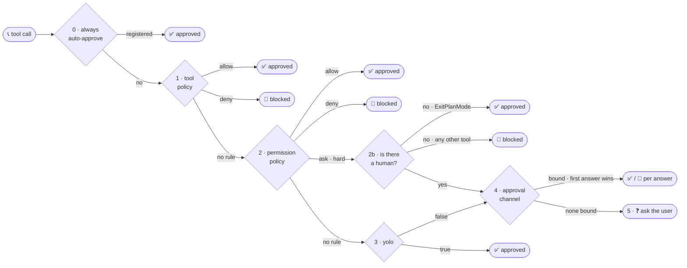

🔖 [Documentation Home](../../README.md) > [ADR](README.md)

# ADR-0062 — One approval chain: permission policy, then tool policy, then yolo

**Status:** Accepted

**Context.** Three authorization mechanisms overlap and can contradict each other — a system-configured **permission policy** returning allow/ask/deny per tool, capability or argument; **tool policies** registered programmatically (`auto_approve("Tool")`, command validation); and **yolo**, a session toggle that is `True`, `False`, or a set of exempt tool names. Evaluated in an ad-hoc order, the execution gate caught denials only *after* the user was prompted, and with the wiring on only one of the two task classes, a bare `LLMTask` with `yolo=True` bypassed the permission policy entirely.

**Decision.** One flat delegation chain, evaluated top to bottom. Each level answers: do I have a rule for this tool? `allow` → approved, `deny` → blocked, no opinion → delegate to the next level.

A permission-policy `ask` is a **hard ask**: not "prompt now" but "no lower level may auto-approve this", so it skips yolo and routes to 2b, then straight to a human. Tool policies run first because they are the argument-level layer closest to the call, so a tool-policy `deny` stops a call before the ruleset is consulted.

Two things sit outside the cascade and make it safe:

- **A permission-policy `deny` is also enforced at execution time** by the gate in the tool wrapper (ADR-0061), so it is absolute whatever an earlier level decided — cascade position only determines whether a prompt is wasted first.
- **Validation tool policies** — `bash_safe_command_policy`, the file-edit validators — run at execution time, orthogonal to approval. They are argument-level technical checks, not policy decisions: a failure returns a `[SYSTEM SUGGESTION]` hint, and they block even when the permission policy says `allow`.

`_resolve_approval` is the single choke point for **every** path — main agent, sub-agents, web — so the next two branches hold everywhere rather than per-runner.

**Priority 0: intrinsic always-auto-approve.** `AskUserQuestion` *is* the user interaction: the tool renders the model's question and blocks until answered. Approving it is meaningless — the user would be asked "allow tool execution?" before the question renders, with a banner showing only raw YAML. A per-runner `auto_approve("AskUserQuestion")` entry did not travel: sub-agents, the web runner and bare `LLMTask`s gated the question behind a redundant prompt, or left it un-surfaced after the deferred round-trip. So auto-approval is intrinsic to the tool: a dependency-free leaf registry (`tool_call/always_approve.py`) into which the tool registers its model-visible name at definition time, consulted as Priority 0.

**Non-interactive runs resolve hard-ASK deterministically.** Plan mode uses exactly one hard-ASK rule, so leaving plan mode always shows the plan to a human. Under `--interactive false` the chat task still wires a confirmation UI, so that ASK fell through to a CLI prompt blocking on stdin for a "Y" that never arrives — a 600-second hang that caused **16 of 21 timeouts** in an 8-model benchmark. So when the policy returns ASK and interactive mode is false:

- `ExitPlanMode` is **approved** — its gate exists only to show a plan to a human, so with no human it is a no-op.
- Any other hard-ASK tool is **denied** with an explanatory message, so a sensitive tool is never silently auto-run unattended, and the cascade can never block on stdin.

**Background sub-agents short-circuit at the yolo level** — anything the permission policy does not deny is auto-approved, so they never block the main agent (ADR-0069).

**Consequences.** One predictable decision path; no wasted prompts, since a denial stops at the gate before the cascade; identical behaviour on both task classes. `AskUserQuestion` never renders an approval prompt in any runner, and its auto-approval is discoverable next to the tool rather than buried in a per-runner list.

Costs:

- A tool self-registered for Priority 0 bypasses *all* approval layers, including an explicit `deny` — acceptable only because an interaction tool has no external side effect and self-disables when non-interactive.
- The always-approve registry is process-global module state, so registration must be idempotent and order-independent.
- A non-`ExitPlanMode` hard-ASK in an unattended run is denied, not prompted; a caller needing such a tool unattended must ALLOW it explicitly.

**Alternatives rejected.**

| Alternative | Why rejected |
| --- | --- |
| Flat last-match-wins across one merged ruleset (opencode's model) | Conflates rules of different authority (admin, code, session) into one namespace, so "who set this rule?" becomes unanswerable. |
| Let `yolo=True` override permission `deny` | `deny` is the admin's boundary and must be absolute. |
| Treat permission-policy `ask` as "prompt immediately" | Too rigid; `auto_approve("Read")` would be skipped whenever the policy has no opinion. |
| Keep relying on the per-runner `auto_approve` entry | Silently absent for sub-agents, web and bare tasks, which was the reported bug. |
| Auto-approve the whole `META` capability | Too broad; `ExitPlanMode` is also harness-control but must keep asking. |
| Render the formatted question inside the approval banner | Still two interactions for one, and it does not fix the missing question in non-CLI runners. |
| Auto-approve every ASK when non-interactive | `--interactive false` is not an authorization to run anything. |
| Install a null approval channel in the non-interactive branch | Localized, but the same blanket auto-approve semantics. |
| Guard inside `exit_plan_mode` itself | Too late; the prompt fires in the cascade before the tool body runs. |
| Fix only the prompt text so models avoid the gate | Necessary but insufficient; any other prompt that nudges toward the gate would still hang. |

**Where it lives.** `src/zrb/llm/agent/run/deferred_calls.py` (`_resolve_approval` — the whole chain), `src/zrb/llm/tool_call/always_approve.py`, `src/zrb/llm/tool/ask.py` (self-registration), `src/zrb/llm/agent/subagent/yolo.py`, `src/zrb/llm/agent/common.py` (`_permission_gate`), `src/zrb/llm/tool_call/tool_policy/`.

🔖 [Documentation Home](../../README.md) > [ADR](README.md)
