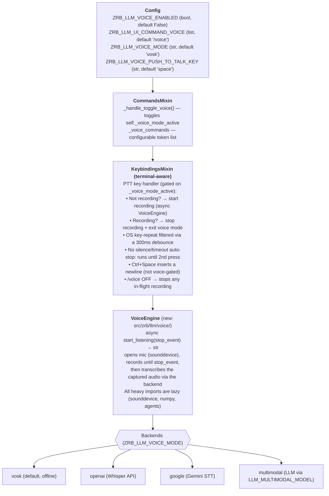

🔖 [Documentation Home](../../README.md) > [ADR](README.md)

# ADR-0081 — Voice dictation via `/voice` command with push-to-talk keybinding

**Status:** Accepted

**Context.** Claude Code introduced a voice dictation feature: `/voice` toggles
voice mode, then holding the spacebar activates push-to-talk recording, and
releasing transcribes the speech into the input buffer at the cursor position.
This enables hybrid input — typing precise file paths while voicing reasoning —
without switching contexts. zrb has no equivalent; all input is keyboard-only.

However, Claude Code runs as a desktop application with access to OS-level
keyboard APIs (key-down/key-up). zrb runs in a terminal via prompt_toolkit,
where simple keys like the spacebar only emit a single byte (`0x20`) on press —
there is no key-release event and holding the key generates OS key-repeat
(kernel-emitted repeated key-down bytes). This means the
hold-to-record/release-to-transcribe model is **unavailable**. zrb uses a
**press-to-start / press-again-to-stop** model: the first press of the
push-to-talk key starts recording, and a second deliberate press stops the
recording and exits voice mode. OS key-repeat (a held key emits a key-down byte
roughly every 67ms on macOS) is filtered with a 300ms debounce so a held key
cannot self-trigger a stop. There is no silence-based or duration-based
auto-stop — recording continues until the second press. To leave voice mode
without recording, type `/voice` again (which also stops any in-flight
recording).

zrb-extras already ships a complete speech-to-text pipeline (`create_listen_tool`
with Vosk/Google/OpenAI backends, VAD-based silence detection, and optional
sound classification), but it is designed as an **agent-callable tool** — the LLM
calls `listen()` to hear the user. Voice dictation is a different integration
point: a **UI-level input method** that replaces keyboard typing at the
prompt_toolkit layer.

**Decision.** Add a `/voice` toggle command and a push-to-talk keybinding to the
default prompt_toolkit TUI. The feature is gated behind an opt-in config flag
(`ZRB_LLM_VOICE_ENABLED`, default `False`) and only activates when the
configured STT backend is available.

### Architecture

### Design choices

1. **Opt-in, not on-by-default.** Voice mode requires microphone access and
   audio dependencies (`sounddevice`, `vosk` or API keys). Enabling it by
   default would break on systems without these. `ZRB_LLM_VOICE_ENABLED=false`
   keeps the status quo.

2. **Configurable command token.** Follows the existing pattern in
   `LLMUICommandsMixin` — `ZRB_LLM_UI_COMMAND_VOICE` is a comma-separated list
   defaulting to `"/voice"`. Users can add aliases or change the token.

3. **Configurable push-to-talk key.** `ZRB_LLM_VOICE_PUSH_TO_TALK_KEY` defaults
   to `"space"` but can be rebound (e.g. `"c-t"` for Ctrl+T). This avoids
   hard-coding the spacebar and matches Claude Code's keybinding configurability.

4. **Press-to-start / press-again-to-stop.** Terminals cannot detect
   key-release for the spacebar, and OS key-repeat means holding the key
   generates repeated key-down events. The first press starts recording; a
   second deliberate press stops it and exits voice mode. A 300ms debounce
   (macOS key-repeat interval is ~67ms) filters OS key-repeat so a held key
   cannot self-trigger a stop. There is **no** silence- or duration-based
   auto-stop — recording runs until the second press (or until `/voice` stops
   it). Ctrl+Space inserts a literal newline and is not gated on voice mode, so
   multi-line input still works while voice mode is active. (Because the
   push-to-talk key is the spacebar by default, you cannot type a literal space
   into the prompt while voice mode is active — rebind the key or toggle voice
   off to type spaces.)

5. **Transcription at cursor, not replacement.** The transcribed text is
   inserted at the current cursor position in the input buffer via
   `buffer.insert_text()`. This enables hybrid input: type file paths, voice the
   reasoning, all in one prompt.

6. **No model capability gating in v1.** Checking whether the active model
   supports voice/multimodal input is deferred. Voice dictation is a
   speech-to-text input method — the transcribed text is plain text fed to the
   LLM, so any text model can consume it. Multimodal voice (audio-as-input) is a
   separate feature.

7. **Voice engine is in zrb core, not zrb-extras.** The engine is a thin async
   wrapper around the same audio libraries zrb-extras uses, but it lives in core
   because it's a UI input method, not an agent tool. The heavy dependencies
   (`sounddevice`, `numpy`, the `vosk` recognizer, and the agent stack for the
   multimodal backend) are lazy-imported so they don't affect startup time when
   voice is disabled.

8. **Vosk is the default backend; the model auto-downloads on first use.** With
   `ZRB_LLM_VOICE_MODE=vosk` (the default), the small English model is fetched
   from `ZRB_LLM_VOICE_VOSK_MODEL_URL` and extracted to `~/.cache/vosk/` the
   first time voice is used (when no extracted model directory is found). The
   response body is read in 64 KiB chunks with an `await` between each, so the
   download is **cancellable**: `/q` and Ctrl+C abort it at the next chunk
   boundary (both cancel the in-flight voice task, and the socket is closed in
   `finally` to release the worker thread). A pre-downloaded model must be
   **extracted** (a bare `<model>.zip` in `~/.cache/vosk/` is not detected —
   only the extracted `~/.cache/vosk/<model>/` directory is).

9. **Run-while-thinking toggle.** `/voice` is a `run_while_thinking=True`
   command (like `/plan` and `/yolo`), so the user can toggle voice mode even
   while the LLM is responding.

**Consequences.** Users who enable voice mode get push-to-talk dictation in the
chat TUI. No new mandatory dependencies — `sounddevice`, `numpy`, the `vosk`
recognizer, and the agent stack are lazy-imported and only needed when voice is
enabled (the `voice` extra installs `sounddevice`, `numpy`, and `vosk`). The
push-to-talk key is only intercepted when voice mode is active, so normal typing
is unaffected when voice mode is off. When voice mode is on, the first press
starts recording and a second press stops it; OS key-repeat is filtered by a
300ms debounce. Because there is no silence- or timeout-based auto-stop, a
recording that is started and then forgotten runs until the user presses the key
again or types `/voice` — and the captured audio is held in memory until then.
With the default `vosk` backend, the speech model downloads on first use; that
download is chunked and cancellable, so `/q` or Ctrl+C aborts it promptly.
Ctrl+Space inserts a literal newline.

**Alternatives rejected.** *Build it in zrb-extras only* — zrb-extras' listen
tools are agent tools, not UI input methods; the prompt_toolkit integration
belongs in core. *Always-on voice (no `/voice` toggle)* — would break spacebar
typing and require microphone access on every session. *Use a separate key
(not spacebar) as the only option* — spacebar is the ergonomic choice (thumb
key, always available); configurability covers users who prefer a different key.
*Auto-stop on silence/timeout (as Claude Code does)* — zrb-extras has VAD-based
silence detection, but it was not ported in v1; the press-again-to-stop model is
simpler and fully terminal-safe. *Multimodal as the default* — the `multimodal`
backend (via `LLM_MULTIMODAL_MODEL`) works with any audio-capable model the user
already has configured, but it is slower and more expensive per utterance than a
dedicated STT engine; `vosk` runs fully offline with no API key and no
per-utterance cost, so it is the default. On macOS the `voice` extra pins
`vosk>=0.3.44,<0.3.45` (the last release with macOS wheels). *Stream audio to a
cloud API for transcription* — adds latency, requires API keys, and leaks audio;
the `openai`, `google`, and `multimodal` backends remain available as opt-in
alternatives.

**Evidence.** `src/zrb/config/mixins/llm_ui_commands.py`
(`LLM_UI_COMMAND_VOICE`), `src/zrb/config/mixins/llm_voice.py`
(`LLM_VOICE_ENABLED`, `LLM_VOICE_MODE` default `vosk`,
`LLM_VOICE_PUSH_TO_TALK_KEY`, `LLM_VOICE_VOSK_MODEL_NAME/URL`),
`src/zrb/llm/voice/engine.py` (`VoiceEngine.start_listening(stop_event)`,
`_make_multimodal_transcriber`, `_get_vosk_model_dir`, `_download_vosk_model`),
`src/zrb/llm/ui/base/commands_mixin.py`
(`_handle_toggle_voice`, `_exit_voice_mode`, `_voice_commands`),
`src/zrb/llm/ui/default/keybindings_mixin.py`
(press-to-start / press-again-to-stop handler with 300ms debounce),
`src/zrb/llm/ui/default/ui.py` / `output_mixin.py` (`_voice_mode_active`,
`_voice_recording_active` state, status indicator),
`src/zrb/llm/task/chat/task.py` (`ui_voice_commands` parameter). [DOCUMENTED] in
this ADR and inline comments.

🔖 [Documentation Home](../../README.md) > [ADR](README.md)
