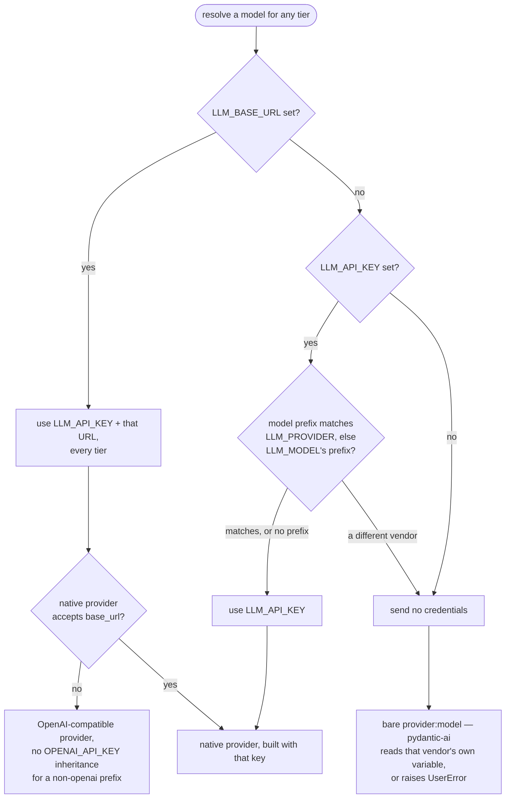

🔖 [Documentation Home](../../README.md) > [ADR](README.md)

# ADR-0094 — `LLM_API_KEY` reaches only the provider it was configured for

**Status:** Accepted

**Context.** zrb is provider-agnostic (ADR-0037): one `LLM_MODEL` names the model, and `LLM_API_KEY` / `LLM_BASE_URL` carry the credentials, whichever vendor is behind them. pydantic-ai works the other way round — each provider reads its own variable (`ANTHROPIC_API_KEY`, `DEEPSEEK_API_KEY`, `GROQ_API_KEY`, …). `ModelResolver` sits between the two.

Handing a natively supported model back as a bare `"anthropic:claude-…"` string, for pydantic-ai to build from the vendor variable, silently drops an explicit `LLM_API_KEY`: a user who set only zrb's knob is told to "set the `DEEPSEEK_API_KEY` environment variable" they deliberately did not use.

Injecting `LLM_API_KEY` into every native provider fixes that and breaks a commoner case. With two providers in play the knob is ambiguous: `LLM_SMALL_MODEL` and `LLM_MULTIMODAL_MODEL` resolve through the same credentials as `LLM_MODEL`, so `LLM_MODEL=openai:gpt-5` plus `LLM_SMALL_MODEL=anthropic:claude-haiku-…` feeds the OpenAI key to Anthropic and 401s on every summarization.

So the question is not *which credential source is more specific* but **which vendor `LLM_API_KEY` is a key for** — knowable, and in exactly one place.

**Decision.** `LLM_API_KEY` belongs to the provider named by `LLM_PROVIDER`, or failing that by `LLM_MODEL`'s own prefix. `resolve_configured_model` / `_small_model` / `_multimodal_model` withhold it from a model that names a *different* provider, passing no credentials at all — which returns the bare name and leaves that vendor's own variable to pydantic-ai, the only credential that could be right there.

**`ModelResolver` stays literal: credentials handed to `resolve()` are credentials it uses** — no probing, no ambient lookup. Explicit configuration beats an ambient variable, as with every other zrb knob. Any caller with credentials that apply — including every non-zrb caller of the public `resolve()` — gets them honored.

**The vendor test is decided at the config layer, not in the resolver.** Only `resolve_configured_*` reads `LLM_MODEL`, so only it can answer whose key `LLM_API_KEY` is. Pushing the question down into `ModelResolver` would make the resolver read `CFG` to reinterpret its own arguments — the deferred-config-read hazard of ADR-0023, and an API that quietly ignores what it was passed.

**An explicit `LLM_BASE_URL` disables the test.** One endpoint means that endpoint serves every tier (the LiteLLM / OpenRouter gateway case), so the key travels with it to every model regardless of prefix.

**An explicit provider names the vendor for a bare model name.** A provider *name* carries no credentials, so routing `LLM_PROVIDER=anthropic` with an unprefixed `LLM_MODEL` to a bare `"anthropic:claude-x"` would discard `LLM_API_KEY` and `LLM_BASE_URL`, sending traffic meant for a private gateway to the vendor's public endpoint. The provider therefore sets the prefix when the model lacks one, and every branch that would hand a bare provider *name* to `_resolve_model` first builds the OpenAI-compatible provider from the credentials. A `Provider` instance counts as a credential in its own right, so one supplied without `api_key`/`base_url` is honored.

**A bare model name (no prefix) never mismatches.** There is no vendor to compare, so `LLM_MODEL=gpt-5` with `LLM_API_KEY` set keeps working unchanged.

**A compatibility fallback may not inherit `OPENAI_API_KEY` for a foreign vendor.** `OpenAIProvider(api_key=None)` forwards `None` to the OpenAI SDK, which then reads `OPENAI_API_KEY` itself. Right for OpenAI; wrong when a `deepseek:`-prefixed model lands on the OpenAI-compatible path because its native provider takes no `base_url` — the user's OpenAI secret would go as a bearer token to whatever host `LLM_BASE_URL` names. `_openai_compatible_key` substitutes pydantic-ai's own `api-key-not-set` placeholder for any *prefixed, non-openai* target, so a keyless local gateway still works and a real endpoint rejects the request loudly instead of quietly receiving the wrong credential. An unprefixed name still inherits it — no prefix means the OpenAI backend by definition (ADR-0037).

Inside `_resolve_native_model` the rest is mechanical: a `Provider` instance passed in for that same vendor wins outright (matched on `Provider.name`, so the `OpenAIProvider` built from `LLM_API_KEY` upstream never qualifies for a non-openai prefix); otherwise `api_key` / `base_url` are passed as whichever keyword arguments that constructor actually declares (`AnthropicProvider` takes `base_url`, `DeepSeekProvider` does not); with neither, the bare name. A `base_url` the native provider cannot accept falls through to the OpenAI-compatible path rather than being dropped — every provider reached this way speaks that wire format.

**Consequences.** Setting only `ZRB_LLM_API_KEY` works against any native provider; vendor variables keep working; a mixed setup (one vendor for the main model, another for the small model) resolves each from its own credential; and an ambient vendor variable can no longer shadow the configured key (a 401 with no override short of `unset`).

The cost: `LLM_API_KEY` has a scope, though its name reads unscoped. With `LLM_MODEL=openai:gpt-5`, an `anthropic:`-prefixed small model gets the vendor variable, not `LLM_API_KEY` — correct, but not what the name promises. `LLM_BASE_URL` is the escape hatch when one endpoint serves everything.

**Alternatives rejected.**

| Alternative | Why rejected |
| --- | --- |
| Always inject `LLM_API_KEY` | Breaks any setup where `LLM_SMALL_MODEL` or `LLM_MULTIMODAL_MODEL` names a different vendor from `LLM_MODEL` — a 401 with no hint that a key meant for another provider was substituted. |
| Never inject; always return the bare name | The original bug: an explicit `LLM_API_KEY` is silently ignored and the user is told to set a vendor variable they chose not to use. |
| Let the vendor variable win, probed by constructing the provider with no arguments | Inverts explicit-over-ambient: an exported `DEEPSEEK_API_KEY` the user may have forgotten silently displaces the key they configured, failing as a 401 with no way to override it in zrb. The probe is also not the test it claims to be — `OllamaProvider()` constructs happily with nothing set, so an explicit key was dropped for a vendor that was never "already configured". |
| Match the prefix against `LLM_PROVIDER` only | `LLM_PROVIDER` is usually unset, so the mixed-vendor case would be unchanged. Falling back to `LLM_MODEL`'s prefix is what makes the test answer in the common configuration; `LLM_PROVIDER` stays the more direct statement and outranks it. |
| Per-provider knobs (`LLM_ANTHROPIC_API_KEY`, …) | A new knob per vendor, and the vendor's own variable already is that knob. Provider-agnostic configuration (ADR-0037) is the point. |
| A hand-maintained provider → env-var table | Duplicates pydantic-ai's own registry and rots on every provider it adds. Not needed: pydantic-ai reads the variable itself once zrb declines to supply one. |

The table of every `LLM_API_KEY` / `LLM_BASE_URL` / vendor-variable combination is reference material, so it lives in [LLM & Rate Limiter Configuration → Which API Key Gets Used](../configuration/llm-config.md#which-api-key-gets-used).

**Where it lives.** `src/zrb/llm/config/model_resolver.py` (`_configured_credentials`, `_provider_prefix`, `_openai_compatible_key`, `_credentialed_provider`, `_resolve_provider`, `_resolve_model_by_name`, `_resolve_native_model`, `_is_native_provider`), `test/llm/config/test_model_resolver_credentials.py`. See ADR-0037 for provider-agnostic configuration and ADR-0023 for why the resolver does not read `CFG` to reinterpret its arguments.

🔖 [Documentation Home](../../README.md) > [ADR](README.md)
