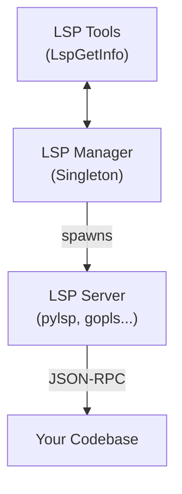

🔖 [Documentation Home](../../README.md) > [Advanced Topics](./) > LSP Support

# LSP (Language Server Protocol) Support

Zrb includes native LSP integration for semantic code intelligence. When LSP servers are installed, zrb's AI assistant can understand your code at a deeper level—providing IDE-like features such as go-to-definition, find-references, and diagnostics.

---

## Table of Contents

- [What is LSP?](#what-is-lsp)
- [Supported Languages](#supported-languages)
- [Installation](#installation)
- [Auto-Detection](#auto-detection)
- [Available Tools](#available-tools)
- [Usage Examples](#usage-examples)
- [How It Works](#how-it-works)
- [Troubleshooting](#troubleshooting)

---

## What is LSP?

The Language Server Protocol (LSP) is a protocol for communication between editors and language servers. It provides:

| Feature | Description |
|---------|-------------|
| **Go to Definition** | Jump to where a symbol is defined |
| **Find References** | Find all usages of a symbol |
| **Document Symbols** | List all classes, functions, variables in a file |
| **Diagnostics** | Get errors, warnings, and hints |
| **Hover Info** | Type information and documentation |
| **Rename** | Safely rename symbols across a project |

> 💡 **Why LSP for AI?** LSP provides structured semantic information that's much more token-efficient than reading entire files. Instead of parsing code text, the AI receives precise symbol names, locations, and types.

---

## Supported Languages

Zrb supports **21+ Language Servers** out of the box:

| Language | LSP Server | Install Command |
|----------|------------|-----------------|
| **Python** | pylsp | `pip install python-lsp-server` |
| **Python** | pyright | `npm install -g pyright` |
| **Python** | jedi-language-server | `pip install jedi-language-server` |
| **Go** | gopls | `go install golang.org/x/tools/gopls@latest` |
| **TypeScript/JavaScript** | typescript-language-server | `npm install -g typescript-language-server typescript` |
| **Rust** | rust-analyzer | `rustup component add rust-analyzer` |
| **C/C++** | clangd | `sudo apt install clangd` or `brew install llvm` |
| **Java** | jdtls | Download from [Eclipse](https://download.eclipse.org/jdtls/) |
| **PHP** | intelephense | `npm install -g intelephense` |
| **C#** | omnisharp | `dotnet tool install -g OmniSharp` |
| **Ruby** | ruby-lsp | `gem install ruby-lsp` |
| **Ruby** | solargraph | `gem install solargraph` |
| **Swift** | sourcekit-lsp | Included with Xcode/Swift |
| **Kotlin** | kotlin-language-server | Download from [GitHub](https://github.com/fwcd/kotlin-language-server) |
| **Scala** | metals | Install via [coursier](https://coursier.io/) |
| **Lua** | lua-language-server | `brew install lua-language-server` |
| **YAML** | yaml-language-server | `npm install -g yaml-language-server` |
| **JSON** | vscode-json-languageserver | `npm install -g vscode-json-languageserver` |
| **HTML** | html-languageserver | `npm install -g html-languageserver` |
| **CSS** | css-languageserver | `npm install -g css-languageserver` |

---

## Installation

### Quick Start

Install the LSP server(s) for your language:

```bash
# Python
pip install python-lsp-server

# Go
go install golang.org/x/tools/gopls@latest

# TypeScript/JavaScript
npm install -g typescript-language-server typescript

# Rust
rustup component add rust-analyzer
```

### Verify Installation

Check which LSP servers are detected:

```python
from zrb.llm.lsp.server import detect_available_lsp_servers

servers = detect_available_lsp_servers()
for name, path in servers.items():
    print(f"✅ {name}: {path}")
```

### Verify in Chat

Start `zrb llm chat` and ask:

```
What LSP servers are available on my system?
```

The assistant will use the `LspListServers` tool to show detected servers.

---

## Auto-Detection

Zrb automatically detects installed LSP servers using the system PATH. No configuration required!

### Detection Flow

```
1. zrb starts or LSP tools are used
        ↓
2. detect_available_lsp_servers() scans PATH
        ↓
3. Found servers are cached for the session
        ↓
4. File → LSP matching by extension
        ↓
5. LSP server started on-demand per project root
```

### File Extension Matching

| File Extension | LSP Server |
|----------------|------------|
| `.py`, `.pyi`, `.pyw` | pylsp, pyright, or jedi |
| `.go` | gopls |
| `.ts`, `.tsx`, `.js`, `.jsx` | typescript-language-server |
| `.rs` | rust-analyzer |
| `.c`, `.cpp`, `.h`, `.hpp` | clangd |
| `.java` | jdtls |
| `.rb`, `.rake` | ruby-lsp or solargraph |
| ... | ... |

### Multiple Servers for Same Language

If multiple LSP servers are installed for the same language, zrb picks one automatically. The order is determined by which server is detected first in the PATH.

---

## Available Tools

The following LSP tools are available in `zrb llm chat`:

| Tool | Description |
|------|-------------|
| `LspFindDefinition` | Find where a symbol is defined |
| `LspFindReferences` | Find all usages of a symbol |
| `LspGetDiagnostics` | Get errors, warnings, hints for a file |
| `LspGetDocumentSymbols` | List all symbols in a file |
| `LspGetWorkspaceSymbols` | Search symbols across workspace |
| `LspGetHoverInfo` | Get type info and docs at position |
| `LspRenameSymbol` | Rename a symbol across the project |
| `LspListServers` | List detected LSP servers |

---

## Usage Examples

### In Chat

Ask the assistant to use LSP:

```
# Find a definition
Where is the LSPManager class defined?

# Show file structure
Show me all symbols in src/zrb/llm/lsp/manager.py

# Get diagnostics
Are there any errors in server.py?

# Find references
Find all references to find_definition

# List available servers
What LSP servers are available?
```

### In AnalyzeCode

LSP is automatically used in `AnalyzeCode` for token-efficient analysis:

```python
from zrb.llm.tool.code import analyze_code

# LSP pre-analyzes Python files for symbol structure
result = await analyze_code("./src", "What classes are defined?")
```

### Programmatic Usage

```python
from zrb.llm.lsp.manager import lsp_manager

# List available servers
servers = lsp_manager.list_available_servers()

# Get document symbols
symbols = await lsp_manager.get_document_symbols("src/my_file.py")

# Find definition
result = await lsp_manager.find_definition("MyClass", "src/my_file.py")

# Get diagnostics
diags = await lsp_manager.get_diagnostics("src/my_file.py")

# Clean up
await lsp_manager.shutdown_all()
```

---

## How It Works

### Architecture



### Symbol-Based API

Unlike traditional LSP clients that use line/column positions, zrb provides a **symbol-based API**:

```python
# Traditional LSP (positions)
await lsp.goto_definition(file_path, line=42, character=10)

# zrb LSP Manager (symbol names)
await lsp_manager.find_definition("MyClass", "src/my_file.py")
```

> 💡 **Why symbol-based?** LLMs think in terms of "find class MyClass" not "go to line 42, column 10". The symbol-based API handles position resolution automatically.

### Lazy Initialization

LSP servers are started **on-demand** per project root:

1. First LSP call → detect project root (`.git`, `pyproject.toml`, etc.)
2. Start server process for that root
3. Cache server instance for subsequent calls
4. Shutdown on `lsp_manager.shutdown_all()`

---

## Troubleshooting

### LSP Server Not Detected

**Symptom:** `LspListServers` shows fewer servers than expected.

**Solution:** Ensure the LSP server binary is in your PATH:

```bash
# Check if binary is accessible
which pylsp
which gopls
which typescript-language-server

# Add to PATH if needed
export PATH="$HOME/.local/bin:$PATH"  # for pip-installed
export PATH="$HOME/go/bin:$PATH"        # for Go
export PATH="$(npm bin -g):$PATH"       # for npm -g
```

### LSP Server Start Failure

**Symptom:** Error messages when using LSP tools.

**Solution:** Test the LSP server manually:

```bash
# Test pylsp
echo '{"jsonrpc":"2.0","id":1,"method":"initialize","params":{"rootUri":"file:///tmp"}}' | pylsp

# Test gopls
echo '{"jsonrpc":"2.0","id":1,"method":"initialize","params":{"rootUri":"file:///tmp"}}' | gopls serve
```

### Project Root Not Detected

**Symptom:** LSP works for some files but not others.

**Solution:** Ensure your project has a root marker:

- `.git/` directory
- `pyproject.toml`, `setup.py`
- `go.mod`
- `Cargo.toml`
- `package.json`
- Or create a `.zrb-root` file

### Multiple LSP Servers Conflict

**Symptom:** Wrong LSP server is used for a file.

**Solution:** Set preferred servers in your code:

```python
from zrb.llm.lsp.manager import lsp_manager

# Prefer pyright over pylsp for Python
lsp_manager.PREFERRED_SERVERS = {
    '.py': ['pyright', 'pylsp', 'jedi-language-server'],
}
```

---

## Related Topics

- [LLM Integration](./llm-integration.md) - AI assistant overview
- [AnalyzeCode Tool](#) - Using LSP in code analysis
- [Custom Tools](./llm-integration.md#custom-tools-and-sub-agents) - Adding your own tools

---

## Quick Reference

| Task | Command / Tool |
|------|----------------|
| Check available LSP servers | `LspListServers` |
| Find symbol definition | `LspFindDefinition` |
| Find symbol references | `LspFindReferences` |
| Get file symbols | `LspGetDocumentSymbols` |
| Get diagnostics | `LspGetDiagnostics` |
| Rename symbol | `LspRenameSymbol` |

| Python Import | Use |
|---------------|-----|
| `from zrb.llm.lsp.manager import lsp_manager` | Programmatic LSP access |
| `from zrb.llm.lsp.server import detect_available_lsp_servers` | Detection check |

---