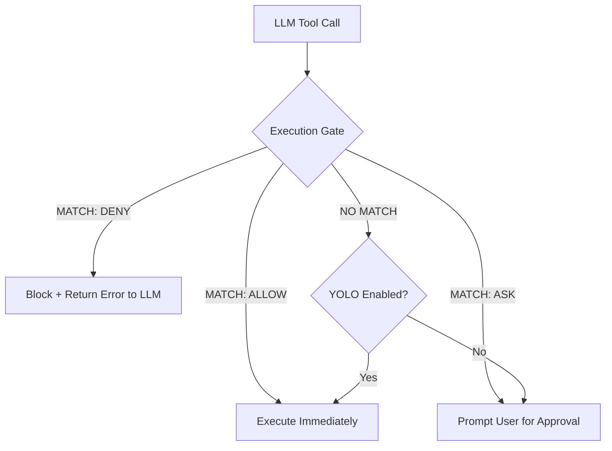

🔖 [Home](../../README.md) > [Advanced Topics](./) > Permission Policy

# Permission Policy System

Zrb includes a robust, first-match-wins permission system designed to provide fine-grained control over which tools an LLM agent can call. This system acts as a security gate, ensuring that agents operate within safe boundaries even when YOLO mode is enabled.

> **Permission vs. sandbox.** The permission policy controls *intent* — which
> tool calls the user agrees to. The opt-in [sandbox](sandbox.md) controls
> *blast radius* — what an approved call can actually touch on the filesystem.
> At execution time the two gates run back-to-back in `agent/common.py`:
> `_permission_gate` first, then `_sandbox_gate`.

---

## Table of Contents

- [Overview](#overview)
- [How it Works](#how-it-works)
- [Defining a Policy](#defining-a-policy)
- [The Precedence Chain](#the-precedence-chain)
- [Strict ASK (YOLO Override)](#strict-ask-yolo-override)
- [Configuration](#configuration)

---

## Overview

The Permission Policy system allows you to define rules based on **Capabilities** (e.g., `READ`, `EDIT`, `EXECUTE`) and **Tool Names**. Each rule specifies an action: `ALLOW`, `DENY`, or `ASK`.

- **`ALLOW`**: The tool call is automatically approved (auto-YOLO for this specific case).
- **`DENY`**: The tool call is blocked silently; the model receives a "Blocked" message, and no user prompt is shown.
- **`ASK`**: The user must explicitly approve the tool call via the UI or approval channel.

---

## How it Works

The system evaluates tool calls through an **Execution Gate** before they are actually invoked.



### Capabilities

Tools are tagged with capabilities in `src/zrb/llm/permission/capability.py`:

| Capability | Description | Example Tools |
|------------|-------------|---------------|
| `READ` | Pure-read operations | `Read`, `LS`, `Glob`, `Grep` |
| `EDIT` | Filesystem mutation | `Write`, `Edit` |
| `EXECUTE` | Arbitrary side effects | `Shell`, `Bash`, `RunZrbTask` |
| `NETWORK` | Outbound network access | `WebSearch`, `WebFetch` |
| `DELEGATE` | Spawning sub-agents | `DelegateToAgent` |
| `META` | Harness control | `TodoWrite`, `AskUserQuestion` |

---

## Defining a Policy

A `PermissionPolicy` is an ordered tuple of `Rule` objects.

```python
from zrb.llm.permission import PermissionPolicy, Rule, ALLOW, DENY, ASK, Capability

my_policy = PermissionPolicy((
    # Deny editing any .env or .git files
    Rule("Edit", DENY, arg_pattern="**/.env"),
    Rule("Edit", DENY, arg_pattern="**/.git/**"),
    
    # Allow all reads
    Rule(Capability.READ, ALLOW),
    
    # Force confirmation for all shell commands (both tool names)
    Rule("Bash", ASK),
    Rule("Shell", ASK),
    
    # Deny everything else by default
    Rule("*", DENY)
))
```

### Rule Matching

Rules can match on:
1.  **Exact Tool Name:** e.g., `"Shell"`, `"Bash"`, `"Write"`.
2.  **Capability:** e.g., `Capability.EDIT`.
3.  **Wildcard:** `"*"` matches everything.
4.  **Arg Pattern:** An optional glob pattern matched against salient arguments (like `path` or `command`).

---

## The Precedence Chain

When pydantic-ai requests a tool call, Zrb resolves the outcome using this priority order (ADR-0055, ADR-0062):

0.  **Always-Approve:** Tools that *are* the user interaction (e.g. `AskUserQuestion`) are auto-approved unconditionally — gating them behind a prompt is meaningless, since approval would render *before* the question itself. A tool opts in by self-registering via `register_always_auto_approve(...)`, so the guarantee travels with the tool and holds in every path (main agent, sub-agents, web), independent of any policy list below.
1.  **Permission Policy:** If a rule matches, its action (`ALLOW`/`DENY`/`ASK`) is final.
2.  **Tool Policy:** (Legacy middleware layer)
3.  **YOLO Toggle:** If YOLO is ON, the call is approved.
4.  **Approval Channel:** Remote/multi-channel handlers.
5.  **CLI Fallback:** User is prompted in the terminal.

---

## Strict ASK (YOLO Override)

A critical security feature of the system is the **Strict ASK** behavior. 

If a Permission Policy explicitly returns `ASK` for a tool call, the system **ignores the YOLO toggle** and forces a manual confirmation. This ensures that high-risk transitions (like exiting [Plan Mode](./plan-mode.md)) can never be automated away by a model.

---

## Configuration

You can set the default policy globally or per-task.

### Global Configuration

```bash
export ZRB_LLM_PERMISSIONS="read:allow,edit:ask,execute:ask,*:deny"
```

### Gating the built-in `zrb llm chat`

To constrain the chat task that `zrb llm chat` runs, set `permissions` on the
built-in `llm_chat` task in your `zrb_init.py`:

```python
from zrb.builtin.llm.chat import llm_chat

llm_chat.permissions = my_policy
```

`permissions` is a read/write property, so this also works to change the policy
after construction on any task.

### Per-Task Configuration

Both `LLMTask` and `LLMChatTask` accept a `permissions` argument — pass the
policy directly when you define your own task:

```python
from zrb import LLMChatTask, LLMTask, cli

safe_task = cli.add_task(
    LLMTask(
        name="safe-single-shot",
        permissions=my_policy,
    )
)

safe_chat = cli.add_task(
    LLMChatTask(
        name="safe-chat",
        permissions=my_policy,
        ui_greeting="I'm operating under a strict permission policy.",
    )
)
```

Run a custom task by its own name (`zrb safe-chat`), not `zrb llm chat` — the
latter runs the built-in `llm_chat` covered above.

Or set the default for every task via environment variable:

```bash
export ZRB_LLM_PERMISSIONS="read:allow,edit:ask,execute:ask,*:deny"
zrb llm chat
```

**Precedence:** the explicit `permissions` argument wins over
`ZRB_LLM_PERMISSIONS`, which wins over the ambient policy a parent run set (how
sub-agents inherit their parent's policy). Plan Mode's read-only preset
overrides all of them while it is active.

### Advanced: the ambient policy ContextVar

Under the hood every policy resolves to the `current_permission_policy`
ContextVar, which each tool call reads via `get_effective_policy()`. The
`permissions=` argument is the normal way to set it. For dynamic cases — e.g.
choosing a policy at runtime based on live state — you can set the ContextVar
directly with `set_current_permission_policy(policy)` from
`zrb.llm.permission.state`. The explicit `permissions=` argument, when given,
takes precedence over a value set this way.

---
🔖 [Home](../../README.md) > [Advanced Topics](./) > Permission Policy
