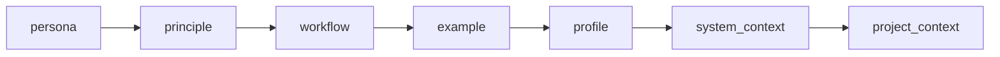

🔖 [Documentation Home](../../README.md) > [Advanced Topics](./) > Programming the Prompt

# Programming the Prompt

Both `LLMTask` and `LLMChatTask` are "just" tasks, and everything the model reads is a value you supply — a string, a template, a Python callable, or a fully composed `PromptManager`. This page walks the **ladder**, from the one-liner you reach for 90% of the time up to a model-adaptive, multi-section prompt assembled at runtime.

You climb the ladder only as far as your problem requires. Every rung is a superset of the one below it, so nothing you learn early is wasted.

## The one mental model: message vs. system prompt

Before the ladder, the distinction that everything else hangs on:

| | `message` | `system_prompt` / `prompt_manager` |
|---|---|---|
| **Answers** | *What should the agent do this turn?* | *Who is the agent, and what does it always know?* |
| **Lifetime** | This request | Every request in the conversation |
| **Rendered by default?** | **Yes** (`render_message=True`) | **No** (`render_system_prompt=False`) |
| **In a chat** | The opening user turn | Persona + standing rules the user then converses against |

When you have some data (a command's output, a file, an API response) and want the LLM to act on it, the question is always: **is this data "the task" or "background"?**

- *The task* → put it in `message` (`"Summarize this:\n{...}"`).
- *Background the user will ask about* → put it in the system prompt, and leave `message` for the user.

The rest of this page is how to get data into either one.

---

## The ladder at a glance

| Rung | Mechanism | Reach for it when |
|---|---|---|
| 1 | `message="plain string"` | The instruction is fixed. |
| 2 | `message="… {ctx.xcom['x'].pop()} …"` | Inject an upstream task's output, an input, or an env var. |
| 3 | `message=lambda ctx: …` | You need real Python to build the prompt. |
| 4 | `system_prompt=…` (string or callable) | Set persona / standing rules, separate from the per-turn message. |
| 5 | `prompt_manager=PromptManager(include_sections=[…])` | Reorder or drop the built-in prompt sections. |
| 6 | `pm.append_prompt(...)` / `pm.add_live_context(...)` | Content must reflect live runtime state, or land after the built-ins. |
| 7 | Override `markdown/` files + `ZRB_LLM_PROFILE` | Author prompts as files, with per-model-class profile phrasing. |

---

## Rung 1 — a plain string

The floor. `message` is the user prompt; a bare string is sent as-is.

```python
from zrb import cli, LLMTask

cli.add_task(
    LLMTask(
        name="haiku",
        message="Write a haiku about the sea.",
    )
)
```

## Rung 2 — a template (inject data with `{ }`)

`message` is a `StrAttr`, and because `render_message` defaults to `True`, any `{ ... }` expression is evaluated against the active context before the prompt is sent. This is Python **f-string** syntax — single braces, not Jinja `{{ }}`.

Three sources are almost always what you want:

- `{ctx.xcom['task-name'].pop()}` — an **upstream task's output** (see [XCom Deep Dive](../core-concepts/xcom-deep-dive.md)).
- `{ctx.input.some_input}` — a **declared CLI input**.
- `{ctx.env.SOME_VAR}` — an **environment variable**.

This is the tool-free way to hand the model everything it needs to decide. A `CmdTask` runs a command; its stdout stringifies straight into the prompt (a `CmdResult`'s `str()` is its `output`), and the LLM reasons over it — no custom tool required:

```python
from zrb import cli, CmdTask, LLMTask

# 1. A deterministic command produces context. Its output lands in XCom.
diff = cli.add_task(CmdTask(name="collect-diff", cmd="git diff --staged"))

# 2. The LLM reads that output straight from the template and decides.
review = cli.add_task(
    LLMTask(
        name="review",
        upstream=[diff],  # guarantees `collect-diff` has run first
        message=(
            "You are a code reviewer. Review the staged diff below and reply "
            "with a bulleted list of concerns, or 'LGTM' if there are none.\n\n"
            "{ctx.xcom['collect-diff'].pop()}"
        ),
    )
)

diff >> review
```

`review`'s answer is itself pushed to XCom under `review`, so a downstream task consumes it exactly the same way — `fetch → reason → act`, with the LLM as the middle node. See [the pipeline-node pattern](programming-the-agent.md#the-agent-as-a-pipeline-node) for the full three-step shape.

> **Turning rendering off.** If your prompt legitimately contains literal braces (a code sample, a JSON blob), set `render_message=False` so `{ }` is left untouched — you then lose templating for that task.

## Rung 3 — a callable

When the prompt needs branching, loops, or a call into your own code, pass a `Callable[[AnyContext], str]` instead of a string. It runs once per execution with the active context.

```python
def build_message(ctx) -> str:
    raw = str(ctx.xcom["collect-diff"].pop())
    if not raw.strip():
        return "There is no staged diff. Reply with exactly: NOTHING TO REVIEW."
    return f"Review this diff and list concerns:\n\n{raw}"

LLMTask(name="review", upstream=[diff], message=build_message)
```

A callable is not rendered afterwards — you are already in Python, so build the final string yourself.

## Rung 4 — the system prompt

Everything above shaped the *per-turn message*. To set **who the agent is** — persona, standing rules, background knowledge that should persist across every turn — use `system_prompt`. It takes the same shapes (string or `Callable[[AnyContext], str]`).

```python
LLMTask(
    name="deploy-helper",
    system_prompt="You are a cautious release engineer. Never suggest force-pushing.",
    message="{ctx.input.request}",
)
```

Two things to internalize:

1. **`system_prompt` is *not* rendered by default** (`render_system_prompt=False`). If you want `{ ... }` substitution in a system-prompt *string*, pass `render_system_prompt=True` — or, more commonly, pass a callable and interpolate in Python:

   ```python
   system_prompt=lambda ctx: f"You are deploying to {ctx.env.DEPLOY_TARGET}. Be careful in prod.",
   ```

2. **`system_prompt` is sugar over the next rung.** Under the hood, both tasks wrap it into `PromptManager(prompts=[system_prompt])`. So when a single string is no longer enough, you are not switching mechanisms — you are just naming the `PromptManager` it was already building for you.

### Seeding a chat with context

For an interactive `LLMChatTask`, the system prompt is where you put data the user will *ask about*, leaving `message` empty so the human drives the conversation. A `CmdTask` can feed it the same way:

```python
from zrb import cli, CmdTask, LLMChatTask

status = cli.add_task(CmdTask(name="git-status", cmd="git status && git log --oneline -20"))

chat = cli.add_task(
    LLMChatTask(
        name="ask-repo",
        upstream=[status],
        # Rendered callable → the command output becomes standing knowledge.
        system_prompt=lambda ctx: (
            "You are a git assistant. Here is the current repository state; "
            "answer the user's questions about it.\n\n"
            f"{ctx.xcom['git-status'].pop()}"
        ),
        ui_greeting="Ask me anything about the current repo state.",
        # No `message` → the TUI opens and waits for the user.
    )
)

status >> chat
```

Now `zrb ask-repo` runs the command, hands the output to the model as background, and drops the user into a conversation about it.

## Rung 5 — composing sections with `PromptManager`

The system prompt Zrb ships is not one blob — it is an ordered list of **sections**, each owning one concern. Five are file-backed rule sections, two carry runtime facts:



> Per-tool rules are **not** a section. They live in each tool's docstring, which pydantic-ai ships with the schema on every request (ADR-0045).

A `PromptManager` lets you control that assembly. Two independent levers:

- **`prompts=[...]`** — extra content appended after the built-ins. This is exactly what `system_prompt` populates.
- **`include_sections=[...]`** — the full ordered list of section names to emit. Drop or reorder the built-ins; the built-in set itself is fixed (ADR-0044).

Dropping a section is an intentional deployment trade-off: shipped prompt files
are plain markdown and are not conditionally rewritten. Keep the sections that
the remaining instructions depend on (ADR-0046).

```python
from zrb import cli, LLMChatTask
from zrb.llm.prompt.manager import PromptManager

pm = PromptManager(
    prompts=["Prefer standard-library solutions over new dependencies."],
    include_sections=[
        "persona", "workflow", "system_context", "project_context",
        # dropped: principle, example, profile
    ],
)

cli.add_task(LLMChatTask(name="lean-chat", prompt_manager=pm))
```

You can also set the order without touching code, via the `ZRB_LLM_INCLUDE_SECTIONS` env var (comma-separated, order-sensitive).

## Rung 6 — sections that reflect live state

The built-in section set is fixed, so there are no user-defined system-prompt sections (ADR-0044). Two public hooks cover the same ground:

- **`pm.append_prompt(...)`** — static, dynamic, or full-middleware content emitted **after** all built-in sections; part of the cached system prompt.
- **`pm.add_live_context(name, provider)`** — inject volatile per-turn state into the `<live-context>` block appended to each user message, **without** invalidating the cacheable system-prompt prefix.

```python
pm = PromptManager()
pm.add_live_context("sprint", lambda ctx: f"Active sprint: {load_current_sprint()}")
```

The `add_live_context` provider runs every turn, so the injected block always reflects current state. Providers run in registration order, after the built-in live-context lines (time, git, worktree, mode, todos); re-registering the same name replaces the previous provider.

👉 Runnable end-to-end example: [`examples/live-context`](../../examples/live-context).

## Rung 7 — file-backed sections and profiles

Section wording ships as files, so you can override any of them without Python: place a same-named file higher on the override chain (project override → env → base-prompt-dir → package) and it replaces the packaged wording, `{PLACEHOLDER}` substitution included.

Independently, `ZRB_LLM_PROFILE` selects one of three **profiles** — `minimal`, `standard`, or `capable` — that swap the final `profile` section via `profile.{name}.md`, and for `minimal` only, drop the delegate (sub-agent) tools:

- `minimal` — concise, one clear next action; no delegate tools. For very small models (~3B).
- `standard` (default) — balance autonomy with clear communication.
- `capable` — strong ownership of substantial work.
- `auto` — derived from the model id: a declared size of ≤4B selects `minimal`, 5–14B `standard`, above 14B `capable`; an id declaring nothing stays `standard`.

A profile changes **only** the `profile` section and the `minimal` delegate restriction — not the other sections, their wording, or the rest of the tool surface (ADR-0049). Override a profile's wording by dropping a `profile.{name}.md` into `ZRB_LLM_PROMPT_DIR`; run `ZRB_LLM_PROFILE=minimal` for a session on a small local model. See `AGENTS.md` → *LLM Prompt System*, ADR-0049.

---

## Which rung should I use?

- **Inject one command's / task's output → the model decides.** Rung 2 (`message` template). No tool needed.
- **Build the prompt with branching or your own code.** Rung 3 (callable).
- **Give the agent a lasting persona / standing rules.** Rung 4 (`system_prompt`).
- **Seed an interactive chat with context, then let the user drive.** Rung 4, output in `system_prompt`, `message` left empty.
- **Reorder or trim the built-in prompt.** Rung 5 (`PromptManager` + `include_sections`).
- **A section must reflect live runtime state.** Rung 6 (`add_live_context`).
- **Author prompts as files, adapt phrasing per model.** Rung 7 (files + profiles).

## See also

- [Programming the Agent](programming-the-agent.md) — the full map: tools, hooks, dynamic prompts, history processors, agent-as-pipeline-node
- [XCom Deep Dive](../core-concepts/xcom-deep-dive.md) — how task outputs flow into `{ctx.xcom[...]}`
- [LLMChatTask API Reference](../task-types/llmchat-task.md) — the full constructor and builder API
- [LLM Assistant & AI Tasks](llm-integration.md) — TUI, `LLMTask`/`LLMChatTask` usage, troubleshooting
- [Extending the LLM](extending-the-llm.md) — tools, sub-agents, context management
- `AGENTS.md` → *LLM Prompt System* and ADR-0044, ADR-0049 — section resolution, profiles and the auto ladder

🔖 [Documentation Home](../../README.md) > [Advanced Topics](./) > Programming the Prompt
