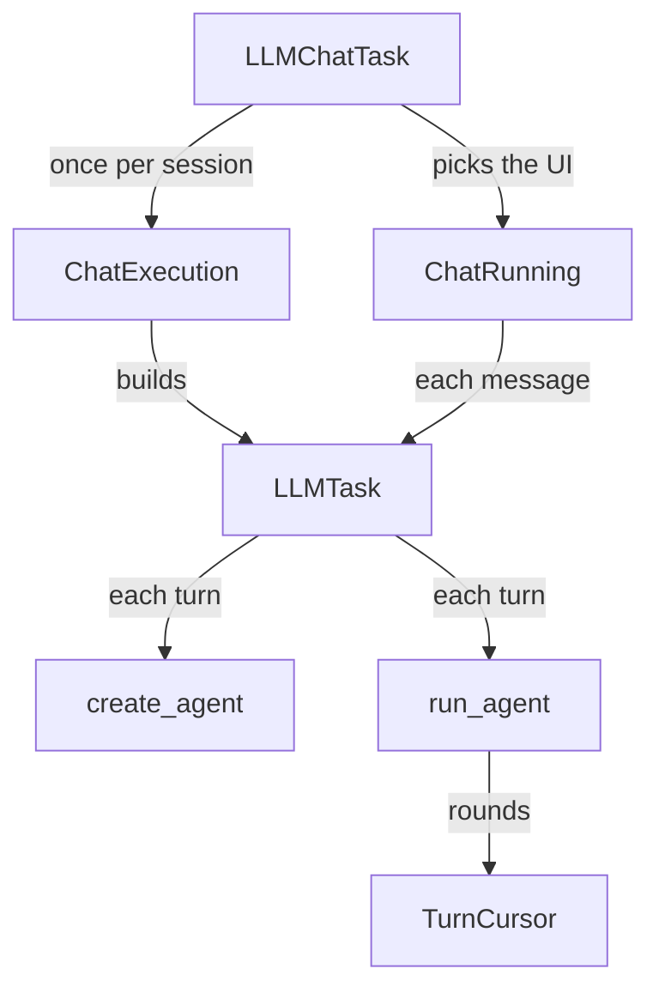
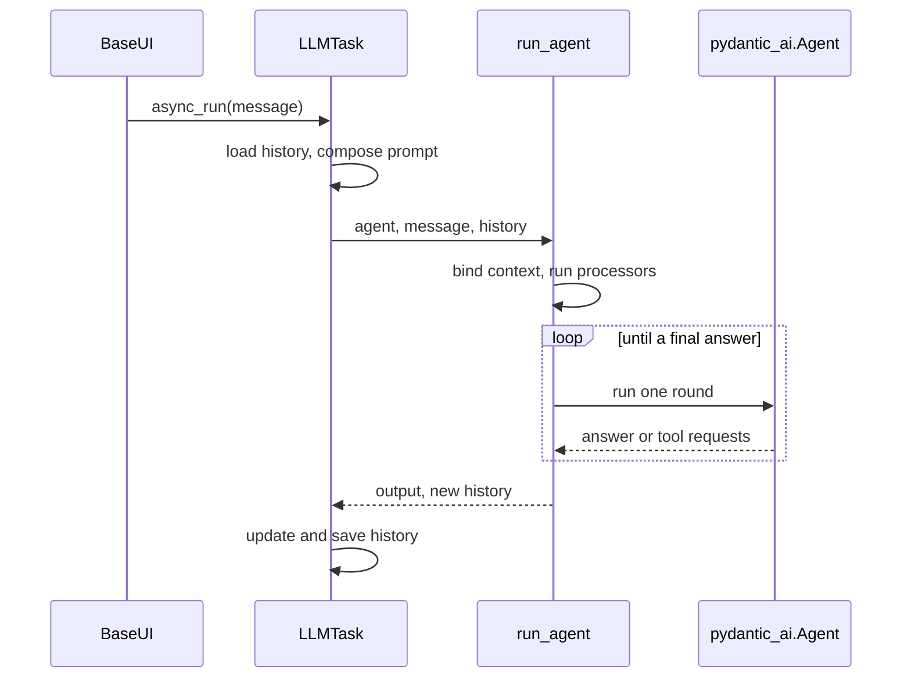

🔖 [Documentation Home](../../README.md) > [Architecture](../README.md) > The LLM Turn

# The LLM Turn

> **Tier 1 · Spine** · Code: `src/zrb/llm/agent/run/` · Read first: [Task Execution](task-execution.md)

A turn is what happens between the user pressing Enter and the reply landing: load the conversation, ask the model, run the tools it asks for, and save the result. The one idea to take away: zrb lets pydantic-ai talk to the model, but zrb owns everything around that call, including the history, the retries, the approvals and the stopping point.

## Table of Contents

- [Design](#design)
  - [The problem](#the-problem)
  - [Principles](#principles)
  - [Invariants](#invariants)
- [Realization](#realization)
  - [The parts](#the-parts)
  - [How it runs](#how-it-runs)
  - [Variations](#variations)
  - [Change it here](#change-it-here)
- [See Also](#see-also)

## Design

### The problem

One turn is several model calls, and each one can go wrong in a different way:

- **A turn is a loop, not one request.** The model asks for a tool, the tool runs, the model answers or asks again. Some tools need a human to approve them first, so the loop can stop halfway and pick up later.
- **History is shared state that is easy to corrupt.** A tool call without its result, or two messages in a row from the same side, makes a provider reject the next request. A broken history is saved, so every later turn inherits the damage.
- **Providers fail in many different ways.** Rate limits, prompt-too-long, malformed tool calls and empty answers each need their own fix. Blindly retrying a request that already ran a tool runs that tool twice.
- **Many parts need the same per-run facts.** The UI, the permission policy, the sandbox, the hook manager and the rate limiter are needed deep inside tools, and passing them all down as arguments does not scale.
- **Prompt caching only works if the start of the request stays the same.** Anything that changes every turn, like the time or the git status, breaks the cache if it sits in the system prompt.

### Principles

1. **Wrap the agent framework thinly.** pydantic-ai streams the model and calls the tools; zrb builds the agent in one place and drives the loop around it. zrb can then override history and retries where the library's defaults do not fit. → [ADR-0036](../../adr/adr-0036.md)

2. **zrb owns the history.** History processors (summarization) run once, before the first model call of a turn, by zrb rather than by the framework. Between the rounds of one turn the history is carried forward untouched, so compaction can never drop the message holding an approved tool call. → [ADR-0041](../../adr/adr-0041.md), [ADR-0040](../../adr/adr-0040.md)

3. **Each kind of failure gets its own one-shot fix.** A stream error is classified first: back off on 429, drop the oldest turn on prompt-too-long, correct a bad tool call once, fall back to text-only history last. A tool that already ran is committed to history before any retry, never resent. → [ADR-0039](../../adr/adr-0039.md)

4. **Per-run facts are ambient and scoped.** The run binds the UI, policies, model and limiter as context variables for its whole life and resets them all when it returns. An explicit argument always beats the inherited value, which is how a sub-agent inherits from its parent without being handed everything. → [ADR-0004](../../adr/adr-0004.md)

5. **Keep the cached prefix byte-stable.** The system prompt holds only facts that do not change during a session. The per-turn state goes into a live-context block at the end of the user's message, where it is frozen into history. → [ADR-0042](../../adr/adr-0042.md)

### Invariants

Each one fails silently if broken: the turn still finishes, but history or side effects are wrong.

| Must stay true | If it breaks | Pinned by |
| --- | --- | --- |
| History processors run once per turn, never between tool-approval rounds | Summarization drops the approved call and the loop fails or repeats it | `test/llm/agent/run/test_runner_deferred.py::test_run_agent_deferred_never_reapplies_processors` |
| A retry after an approved tool ran does not run that tool again | A deploy, write or delete happens twice | `test/llm/agent/run/test_runner_deferred_approval.py::test_retry_after_approved_tool_ran_does_not_run_it_again` |
| Every round of a multi-round turn reaches the Stop payload | A hook that reviews written files misses a write the user approved | `test/llm/agent/run/test_runner_deferred.py::test_stop_event_wrote_files_true_after_deferred_tool_approval` |
| Run-scoped context is reset when the run returns | The next run, or a sibling sub-agent, sees this run's scope and policies | `test/llm/agent/run/test_runner_lifecycle.py::test_run_agent_resets_run_scope_after_returning` |
| Mid-turn checkpoint saves finish before the run returns | A late checkpoint overwrites the final save with older history | `test/llm/agent/run/test_runner_limits.py::test_run_agent_checkpoint_awaited_before_run_agent_returns` |
| `SessionEnd` fires once at teardown, not every turn | Hook consumers get a false "session over" signal after each reply | `test/llm/task/chat/test_llm_chat_task_teardown.py::test_interactive_teardown_fires_terminal_session_end` |

## Realization

### The parts

| Part | Where | What it is responsible for |
| --- | --- | --- |
| `LLMChatTask` | `src/zrb/llm/task/chat/task.py` | The chat session's configuration: tools, UIs, hooks, history processors, approval channels |
| `ChatExecution` | `src/zrb/llm/task/chat/execution.py` | Resolves the session once and builds the inner `LLMTask`, adding the summarizer processor |
| `ChatRunning` | `src/zrb/llm/task/chat/running.py` | Chooses the UI (one, several via `MultiUI`, or the default terminal UI), replays a resumed session, runs the session loop |
| `LLMTask` | `src/zrb/llm/task/llm_task.py` | One turn: load history, compose the prompt, build the agent, call `run_agent`, save |
| `create_agent` | `src/zrb/llm/agent/common.py` | The only place a `pydantic_ai.Agent` is built; stores history processors on it as `zrb_history_processors` |
| `run_agent` | `src/zrb/llm/agent/run/runner.py` | Binds the run's context, prepares history, drives the rounds, fires `Stop`, returns output and new history |
| `TurnCursor` | `src/zrb/llm/agent/run/turn_cursor.py` | The loop's state across rounds: history, pending tool results, this turn's new messages |
| `handle_stream_error` | `src/zrb/llm/agent/run/retry_loop.py` | Classifies a failed round and decides the one-shot fix |
| `process_deferred_requests` | `src/zrb/llm/agent/run/deferred_calls.py` | Asks for approval of the tool calls the model made, and returns their results |
| `setup_print_and_events` | `src/zrb/llm/agent/run/setup.py` | Resolves the UI and other dependencies; builds the handler that renders streamed events |
| `ModelResolver`, `resolve_configured_model` | `src/zrb/llm/config/model_resolver.py` | Turning a configured model name, API key and base URL into a pydantic-ai model; the small and multimodal models resolve the same way |
| `LLMLimiter` | `src/zrb/llm/config/limiter.py` | Request and token rate limits, token counting, and fitting history into `max_token_per_request` before each request |

### How it runs

`LLMChatTask` builds one inner `LLMTask` per chat session. The UI then calls `LLMTask.async_run` once per message, and each call is one turn with a fresh agent:

Inside `run_agent`, each round of the loop does the same steps:

1. `sanitize_history` repairs the history, and `TurnCursor.begin_round` installs it.
2. `agent.run` streams the round. The event handler sends each event to the UI and any stream observers. It also saves a checkpoint in the background each time a tool round trip completes.
3. The round ends one of four ways. A stream error goes to `handle_stream_error`. Tool calls that need approval go to `process_deferred_requests`, and the loop goes round again with their results. An empty answer is regenerated, up to `max_empty_completion_retries` times. A real answer goes to the `Stop` hook.
4. `Stop` either ends the turn or, when a hook blocks it, starts one more round with the hook's reason as the message.

When the run returns, `LLMTask` saves the new history. On an error or a cancel, it saves what actually happened instead (see [History & Compaction](../3-peripheral-flow/history-and-compaction.md)).

### Variations

| Case | Where it is decided | What is different |
| --- | --- | --- |
| Non-interactive run (web chat, scripts) | `ChatRunning.run_non_interactive_session` | One `async_run`; UIs from factories become output sinks, and there is no session loop |
| `/compress` | `LLMTask` (before any agent is built) | Calls `summarize_history(force=True)`, saves, and returns without a model turn |
| A `UserPromptSubmit` hook blocks | `run_agent` startup hooks | The turn ends before the model runs; the block reason is the output |
| Approval arrives later through a channel | `process_deferred_requests` returns nothing | The turn suspends: the pending requests and history return, and `Stop` does not fire |
| A `Stop` hook blocks | `apply_turn_end_extension` in `src/zrb/llm/agent/run/session_extension.py` | Another round runs with the reason injected, up to `STOP_HOOK_BLOCK_CAP` times in a row |
| A sub-agent's run | `run_agent(nested=...)` | No turn snapshot is taken, and the `Stop` payload marks `nested_run` — see [Sub-agents](../2-extension-surface/sub-agents.md) |
| A message typed mid-turn | `steer_into_live_run` | Steers into the live run instead of queuing ([ADR-0078](../../adr/adr-0078.md)) |

### Change it here

| To… | Open | Then run |
| --- | --- | --- |
| Change how the inner task is built per session | `src/zrb/llm/task/chat/execution.py` | `test/llm/task/chat/test_execution.py` |
| Change UI selection or session replay | `src/zrb/llm/task/chat/running.py` | `test/llm/task/chat/` |
| Change what a turn loads, sends or saves | `src/zrb/llm/task/llm_task.py` | `test/llm/task/test_llm_task.py` |
| Change the round loop or the `Stop` handling | `src/zrb/llm/agent/run/runner.py` | `test/llm/agent/run/` |
| Change the state carried between rounds | `src/zrb/llm/agent/run/turn_cursor.py` | `test/llm/agent/run/test_turn_cursor.py` |
| Change how a failed round is retried | `src/zrb/llm/agent/run/retry_loop.py` | `test/llm/agent/run/test_retry_loop.py` |
| Change how agents are constructed | `src/zrb/llm/agent/common.py` | `test/llm/agent/test_common_agent_creation.py` |
| Change how a model name becomes a model | `src/zrb/llm/config/model_resolver.py` | `test/llm/config/` |
| Change rate limiting or token counting | `src/zrb/llm/config/limiter.py` | `test/llm/config/` |

## See Also

- [LLM Chat Request Lifecycle](../../llm/llm-chat-lifecycle.md) — the tour from the CLI to the saved history
- [History & Compaction](../3-peripheral-flow/history-and-compaction.md) — load, summarize, repair and save
- [Tools](../2-extension-surface/tools.md) — how tools reach the agent
- [Tool Call & Approval](../3-peripheral-flow/tool-call-approval.md) — what `process_deferred_requests` decides
- [Hooks](../../llm/hooks.md) — `Stop`, `PreCompact` and the other lifecycle events

🔖 [Documentation Home](../../README.md) > [Architecture](../README.md) > The LLM Turn
