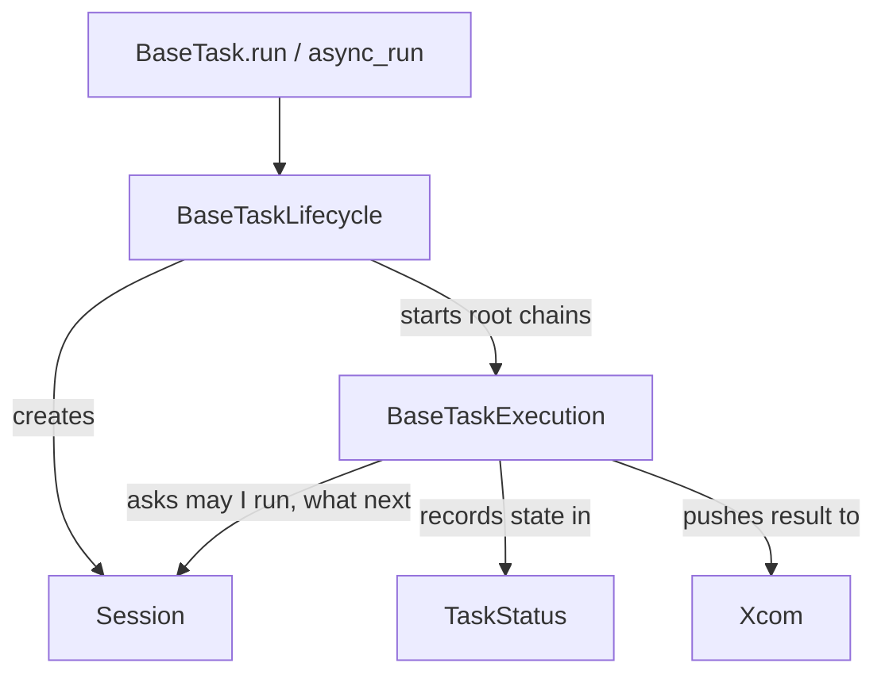
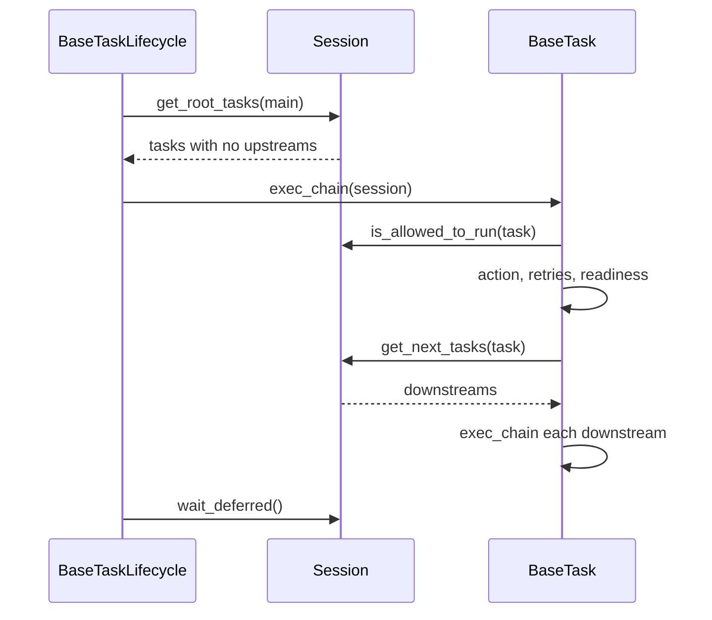
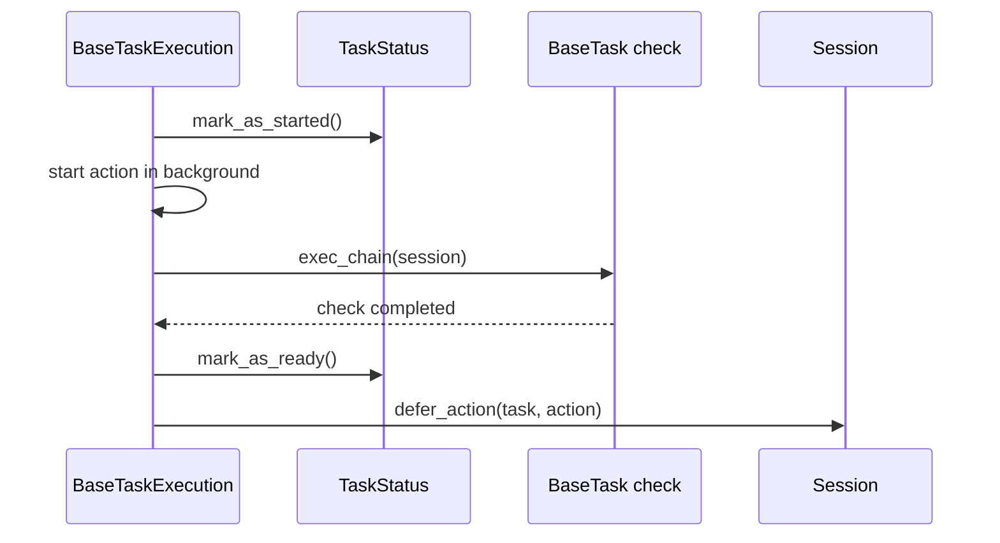

🔖 [Documentation Home](../../../README.md) > [Architecture](../README.md) > Task Execution

# Task Execution

> **Tier 1 · Spine** · Code: `src/zrb/task/base/` · Read first: [The System](../0-system/system.md)

When you run `zrb deploy`, the engine works out which tasks `deploy` depends on, runs each one once, in the right order and as concurrently as the graph allows, and decides what happens when one fails. The one idea to take away: a task is a small state machine, and the engine's whole job is to move each task through its states and let the graph react.

## Table of Contents

- [Design](#design)
  - [The problem](#the-problem)
  - [Principles](#principles)
  - [Invariants](#invariants)
- [Realization](#realization)
  - [The parts](#the-parts)
  - [How it runs](#how-it-runs)
  - [Variations](#variations)
  - [Change it here](#change-it-here)
- [See Also](#see-also)

## Design

### The problem

- **Most of the time is spent waiting** — on processes, HTTP, services, LLM streams. Waiting one task at a time would make a pipeline as slow as the sum of its steps.
- **Graphs have diamonds.** Two upstreams can finish in the same instant and both try to start the task below them. It must still run once.
- **Some tasks never finish.** A task that starts a server runs forever. Its downstreams must start when the server is *ready*, not when the task returns.
- **Failure needs a plan, not a crash.** A flaky step should retry, a broken deploy should roll back, and Ctrl+C should stop everything cleanly instead of being retried.
- **Errors surface deep inside the engine.** A traceback from a concurrent gather points at engine code, not at the task you wrote.

### Principles

1. **Async all the way down.** The engine is built on `asyncio`, and independent tasks run concurrently. The synchronous `run()` is only a thin door that starts an event loop around `async_run()`. → [ADR-0003](../../adr/adr-0003.md)

2. **Every task moves through explicit states.** Started, ready, completed, skipped, failed, permanently failed. A downstream runs only when each upstream is ready or skipped, so "may this run?" is always a lookup, never a guess. → [ADR-0015](../../adr/adr-0015.md)

3. **Ready is not the same as done.** A task may declare readiness checks, which are themselves tasks. Its action then runs in the background while the checks poll, and downstreams start as soon as the checks pass. → [ADR-0012](../../adr/adr-0012.md)

4. **Recovery is part of the graph.** Retries are a number on the task; fallbacks and successors are ordinary tasks that run on permanent failure or on success. Rolling back is automation too, so it composes like any other step. → [ADR-0011](../../adr/adr-0011.md)

5. **Cancellation is not failure.** Ctrl+C, a cancelled coroutine, or `sys.exit()` from an action marks the task failed and is re-raised at once. It is never retried and never triggers fallbacks or successors. → [ADR-0017](../../adr/adr-0017.md)

### Invariants

Each one fails silently if broken: the run keeps going and does the wrong thing.

| Must stay true | If it breaks | Pinned by |
| --- | --- | --- |
| A task reached by two paths at once runs once | A deploy or migration runs twice, concurrently | `test/task/base/test_execution_readiness.py::test_diamond_upstreams_run_readiness_task_once` |
| Downstreams wait for ready or skipped; only a *permanent* failure blocks them | A retry in progress silently drops every downstream task | `test/task_status/test_task_status.py::TestTaskStatusAllowRunDownstream::test_allow_run_downstream_when_ready_with_transient_failure` |
| A readiness-checked task hands its action to the session instead of returning its result | The run ends before the long-running action does, or reads `None` as its result | `test/task/base/test_execution_task_chain.py::test_execute_action_until_ready_with_readiness_checks` |
| A failing successor does not re-run the action that already succeeded | A notification failure re-runs the deploy | `test/task/base/test_execution_retry.py::test_failing_successor_neither_reruns_action_nor_is_swallowed` |
| `sys.exit()` in an action is not retried | A deliberate stop is retried and reported as a failed attempt | `test/task/base/test_execution_retry.py::test_system_exit_is_not_retried_as_a_task_failure` |
| One crashed long-running task fails the whole run immediately | `frontend` keeps the run alive after `backend` died | `test/session/test_session_lifecycle.py::test_failing_deferred_action_does_not_wait_for_a_never_ending_sibling` |
| The ambient task context is restored after every action, even a failing one | One task's logger and inputs leak into the next task's code | **unpinned** |

## Realization

### The parts

| Part | Where | What it is responsible for |
| --- | --- | --- |
| `BaseTask` | `src/zrb/task/base/base_task.py` | The public surface (`run`, `async_run`, `exec_chain`, `exec_action`); composes the parts below |
| `BaseTaskLifecycle` | `src/zrb/task/base/lifecycle.py` | Creating the session, filling inputs and envs once, dispatching root tasks, waiting for deferred work, cleanup |
| `BaseTaskExecution` | `src/zrb/task/base/execution.py` | One task's run: the condition check, readiness, the retry loop, fallbacks and successors |
| `BaseTaskMonitoring` | `src/zrb/task/base/monitoring.py` | Re-checking readiness after a task is ready, and restarting the action when it fails |
| `BaseTaskOperators` | `src/zrb/task/base/operators.py` | The `>>` and `<<` operators that declare graph edges |
| `Session` | `src/zrb/session/session.py` | The graph for one run, the per-task `Context` and `TaskStatus`, the gate `is_allowed_to_run`, deferred work |
| `TaskStatus` | `src/zrb/task_status/task_status.py` | One task's state and history; `allow_run_downstream` is the rule downstreams check |
| `Xcom` | `src/zrb/xcom/xcom.py` | A per-task queue that holds each result, keyed by task name in the `SharedContext` |

### How it runs

**Starting a run.** `run()` wraps `BaseTaskLifecycle.run_and_cleanup` in `asyncio.run`. That creates a `Session` if none was given, resolves inputs and envs once, and calls `exec_root_tasks`. Its `finally` terminates the session and cancels any asyncio task still pending. At this outermost door a Ctrl+C returns `None`; every layer below re-raises it.

**Walking the graph.** The session registers the whole graph, then `get_root_tasks` finds the tasks with no upstreams. Both walks are iterative, so a chain of thousands of tasks cannot hit Python's recursion limit, and a cycle raises `ValueError`. Each root starts a chain:

`is_allowed_to_run` is the whole gate: the session is not terminated, the task has not started, and every upstream reports `allow_run_downstream`. Sibling chains run under `gather_isolated`, which lets every sibling finish before re-raising the first error, so one failure does not orphan its peers.

**One task's action.** `execute_task_action` sets `current_ctx` with a token and resets it in `finally`; code deeper down reads it through `get_current_ctx()`. A false `execute_condition` marks the task skipped and stops there. Otherwise `execute_action_with_retry` runs up to `retries + 1` attempts, `retry_period` apart; a `retry_if` that returns false ends the loop early. On success the result is pushed to the task's `Xcom` and successors run, outside the `try`. On the last failure the task is marked permanently failed, successors are skipped and fallbacks run.

`exec_action` attaches `Task: <name> (<file>:<line>)` as a note to any exception, so a failure deep in a gather still names the task you declared ([ADR-0016](../../adr/adr-0016.md)). Subclasses override `_exec_action`, never `exec_action`, so the note survives.

**With readiness checks** the action is not awaited in place:

`mark_as_started` comes before the first `await`; that is what keeps a diamond from starting the task twice. The checks are bounded by `readiness_timeout`. If they fail, the action is cancelled, the task is marked permanently failed and fallbacks run. Either way the method returns `None`, and the real result arrives when `wait_deferred` awaits the deferred action at the end of the run.

### Variations

| Case | Where it is decided | What is different |
| --- | --- | --- |
| Condition is false | `BaseTaskExecution.execute_task_action` | Marked skipped; pushes nothing to XCom, runs no fallback, and still unblocks downstreams ([ADR-0013](../../adr/adr-0013.md)) |
| `monitor_readiness=True` | `BaseTaskMonitoring.monitor_task_readiness` | Checks keep running after ready; after `readiness_failure_threshold` failures the action is restarted |
| Several long-running tasks | `Session.wait_deferred` | Deferred actions use `gather_fail_fast`: the first crash cancels the rest instead of waiting for a server that never exits |
| Caller already in an event loop | `BaseTask.async_run` | Same path without `asyncio.run` and without the pending-task cleanup |
| Run from the CLI | `Cli.run` in `src/zrb/runner/cli.py` | A run that ended neither completed nor skipped is raised as `KeyboardInterrupt`, so the shell sees a failure |
| Run from the web | `serve_task_session_api` | Scheduled with `async_run` and returned at once — see [Web Requests](../3-peripheral-flow/web-requests.md) |

### Change it here

| To… | Open | Then run |
| --- | --- | --- |
| Change entry, session setup or cleanup | `src/zrb/task/base/lifecycle.py` | `test/task/base/test_base_task.py` |
| Change retries, fallbacks or successors | `src/zrb/task/base/execution.py` | `test/task/base/test_execution_retry.py` |
| Change readiness checks | `src/zrb/task/base/execution.py` | `test/task/base/test_execution_readiness.py` |
| Change monitoring after ready | `src/zrb/task/base/monitoring.py` | `test/task/base/test_monitoring_readiness.py` |
| Change graph registration, the run gate or deferred waiting | `src/zrb/session/session.py` | `test/session/` |
| Change task states or the downstream rule | `src/zrb/task_status/task_status.py` | `test/task_status/test_task_status.py` |
| Change what XCom holds | `src/zrb/xcom/xcom.py` | `test/xcom/` |

## See Also

- [The System](../0-system/system.md) — where the engine sits among the other parts
- [Tasks & Execution Lifecycle](../../core-concepts/tasks-and-lifecycle.md) — writing pipelines, the user-facing view
- [Custom Tasks](../../task-types/custom-tasks.md) — subclassing `BaseTask`
- [Readiness Checks](../../task-types/readiness-checks.md) — `HttpCheck` and `TcpCheck`
- [Session, Context & XCom](../../core-concepts/session-and-context.md) — the three state objects
- [Web Requests](../3-peripheral-flow/web-requests.md) — the other way a task gets started

🔖 [Documentation Home](../../../README.md) > [Architecture](../README.md) > Task Execution
