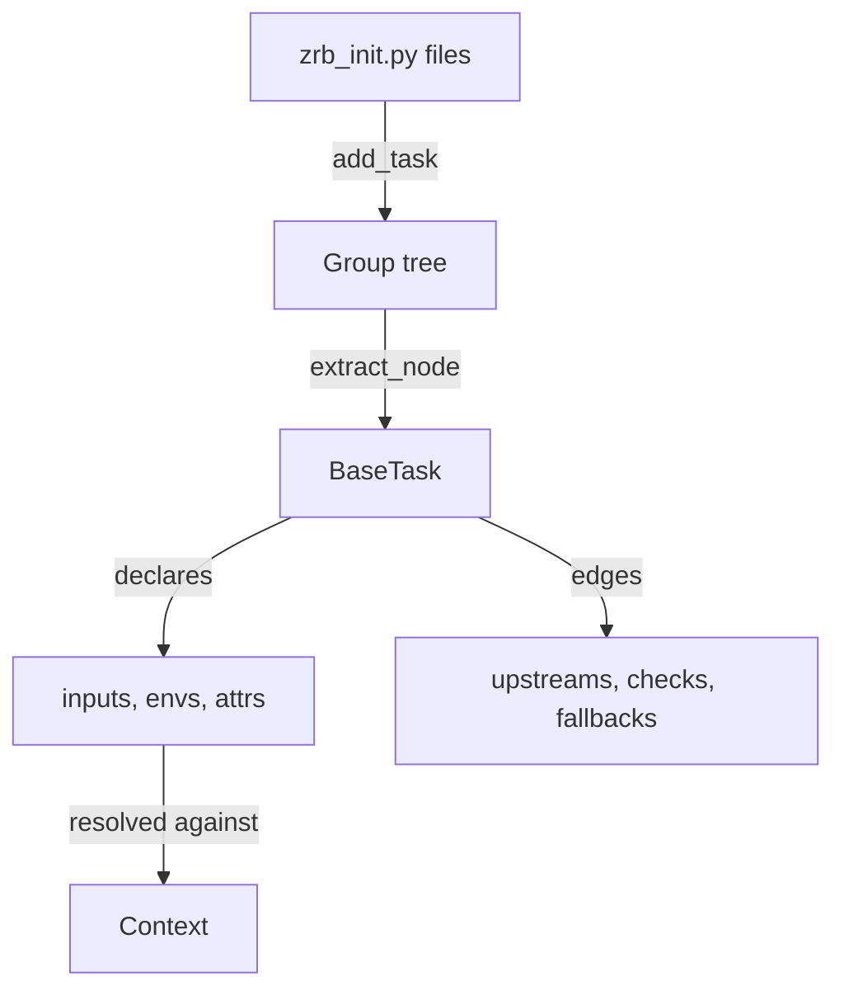
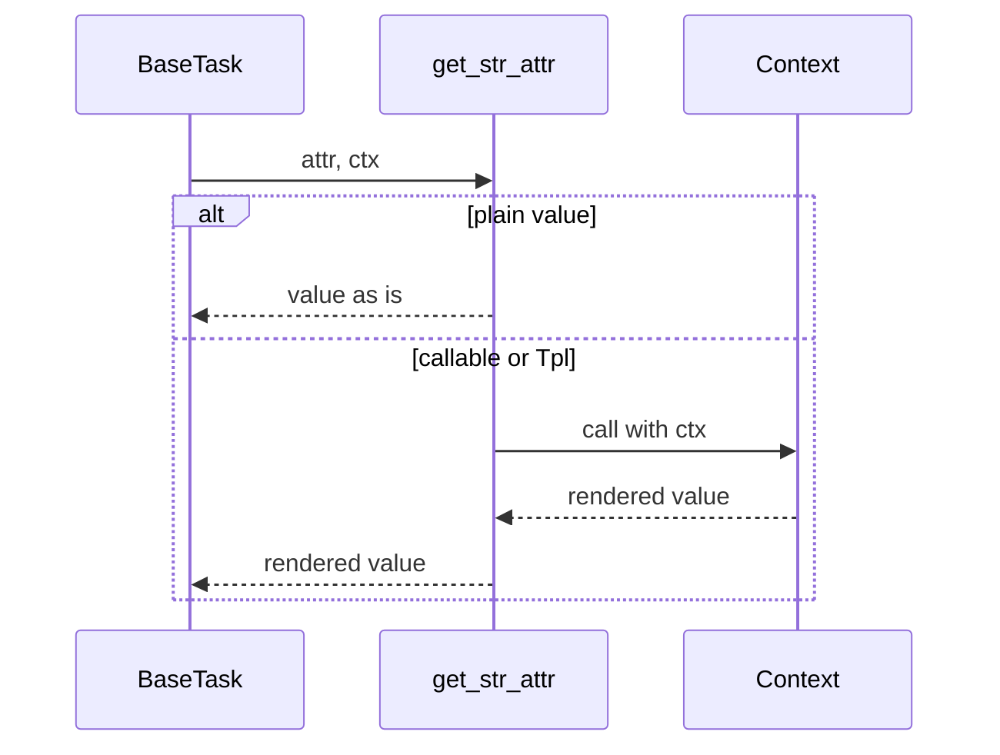

🔖 [Documentation Home](../../README.md) > [Architecture](../README.md) > The Task Model

# The Task Model

> **Tier 1 · Spine** · Code: `src/zrb/task/`, `src/zrb/attr/`, `src/zrb/input/`, `src/zrb/env/`, `src/zrb/group/` · Read first: [The System](../0-system/system.md)

[Task Execution](task-execution.md) explains how a run moves through the graph. This page explains what the engine is given to run: a task, its parameters, and how it is found from a command line. The one idea to take away: a task is declared once, as a plain Python object whose values are deferred until a run supplies the context to resolve them.

## Table of Contents

- [Design](#design)
  - [The problem](#the-problem)
  - [Principles](#principles)
  - [Invariants](#invariants)
- [Realization](#realization)
  - [The parts](#the-parts)
  - [How it runs](#how-it-runs)
  - [Variations](#variations)
  - [Change it here](#change-it-here)
- [See Also](#see-also)

## Design

### The problem

- **Values do not exist when the task is declared.** A command line, a path or a URL often depends on an input the user types, an env value, or an upstream result, none of which exist when `zrb_init.py` is loaded.
- **The same parameters must work everywhere.** One input must prompt in a terminal, render as a field in a web form, parse from a flag, and fail clearly when stdin is closed.
- **Parameters repeat down a graph.** A deploy and its build and test steps share envs and inputs; declaring them on every task invites drift, and inheriting them must not depend on how the graph happens to be shaped.
- **Work differs, lifecycle does not.** A shell command, a Python function, an HTTP probe, a cron trigger and an agent all need dependencies, retries and readiness, but execute in completely different ways.
- **Tasks come from many files.** A project, its parent directories and the user's home can each declare tasks, and "why is this command here?" must stay answerable.

### Principles

1. **Tasks are plain Python, not a DSL.** A task is an object built in ordinary code, so the language's own tools — imports, functions, loops, a debugger — are the configuration language. → [ADR-0001](../../adr/adr-0001.md)

2. **Values are deferred until a run resolves them.** A parameter is a literal, a callable taking the context, or a `Tpl` template rendered against the context. A plain string is always a literal, so braces in a shell command never surprise anyone. → [ADR-0005](../../adr/adr-0005.md)

3. **Inputs and envs are typed objects, inherited upstream-first.** Each input type owns its prompting, parsing, default and web rendering. Inheritance is one walk over the graph that visits each task once, and a task's own envs always override what it inherits, whatever the graph's shape. → [ADR-0009](../../adr/adr-0009.md), [ADR-0092](../../adr/adr-0092.md)

4. **One lifecycle, many task types.** `BaseTask` owns dependencies, retries and readiness; each task type supplies only how its action runs. → [ADR-0007](../../adr/adr-0007.md)

5. **Nothing runs unless it was registered.** `zrb_init.py` files are loaded from the filesystem root down to the working directory, and a task becomes a command only through an explicit `add_task` or `@make_task(group=...)`. A declared task nobody can reach is reported, not silently ignored. → [ADR-0010](../../adr/adr-0010.md)

6. **Long-running automation is still a task.** A trigger or scheduler is a daemon task that pushes events into an XCom queue; each event runs a callback task in its own session, through the same engine. → [ADR-0014](../../adr/adr-0014.md)

### Invariants

Each one fails silently if broken: the task still runs, with the wrong values or in the wrong place.

| Must stay true | If it breaks | Pinned by |
| --- | --- | --- |
| A bare string parameter is a literal; only a `Tpl` is rendered | A shell command containing `{}` is rewritten, or raises, at run time | `test/attr/test_tpl.py::test_a_bare_string_attr_is_a_literal` |
| A task's own env overrides the same env from any upstream, at any depth | A deploy runs with its build step's settings | `test/task/test_dag_shape.py::test_a_task_overrides_an_env_its_transitive_upstream_declares` |
| A diamond graph contributes each inherited env once | Inheritance grows exponentially with depth and `zrb <task>` never returns | `test/task/test_dag_shape.py::test_diamond_dag_env_aggregation_returns_one_entry_per_env` |
| A dependency cycle raises instead of looping | Reading a task's inputs hangs or overflows the stack | `test/task/base/test_context_cycle.py::test_longer_cycle_raises` |
| A required input with closed stdin fails naming the flag to pass | A scripted run hangs forever waiting for a prompt | `test/input/test_non_interactive.py::test_closed_stdin_without_a_default_fails_with_the_flag_to_pass` |
| A declared but unregistered task is reported once, with how to fix it | A task the user wrote never appears, with no explanation | `test/group/test_task_diagnostics.py::TestUnregisteredDiagnostics::test_unregistered_task_is_reported_once_with_remediation` |
| A secret input is masked before it reaches the session log | Passwords are written to disk in plain text | `test/session/test_session_lifecycle.py::test_as_state_log_masks_secret_input` |
| A failing callback does not cancel its sibling callbacks | One bad event handler stops a trigger from serving every other one | `test/callback/test_callback.py::TestCallbackBehavior::test_callback_handles_task_error` |

## Realization

### The parts

| Part | Where | What it is responsible for |
| --- | --- | --- |
| `StrAttr`, `BoolAttr`, `IntAttr`, … | `src/zrb/attr/type.py` | The deferred-value types a task parameter may take |
| `Tpl` | `src/zrb/attr/tpl.py` | A template rendered against the context through `render` |
| `get_attr`, `get_str_attr`, … | `src/zrb/util/attr.py` | Resolving a deferred value against a context to a plain value |
| `BaseInput` and its subclasses | `src/zrb/input/` | One typed input: prompt, parse, default, HTML field, closed-stdin behaviour |
| `Env`, `EnvMap`, `EnvFile` | `src/zrb/env/` | Envs from a value, a mapping, or a `.env` file, optionally linked to `os.environ` |
| `BaseTaskContext` | `src/zrb/task/base/context.py` | Combining inputs and envs over the upstream closure, and filling them into the shared context once per run |
| `DotDict` | `src/zrb/dot_dict/dot_dict.py` | The mapping behind `ctx.input`, `ctx.env` and `ctx.xcom`, so a resolved value reads as an attribute instead of a key lookup |
| `Group`, `Cli` | `src/zrb/group/group.py`, `src/zrb/runner/cli.py` | The command tree; `extract_node` turns words into a task or group for both the CLI and the web |
| `serve_cli`, `get_init_path_list` | `src/zrb/__main__.py`, `src/zrb/config/init_path.py` | Finding and loading every `zrb_init.py`, then reporting unreachable tasks |
| `find_task_diagnostics` | `src/zrb/group/task_diagnostics.py` | Unregistered tasks and alias collisions between the project's own tasks |
| `Callback` | `src/zrb/callback/callback.py` | Running a task for one trigger event, mapping inputs in and results back |
| `FileSessionStateLogger` | `src/zrb/session_state_logger/file_session_state_logger.py` | Writing each run's `SessionStateLog` to disk, and pruning old ones |
| `AnyContentTransformer`, `ContentTransformer` | `src/zrb/content_transformer/` | How `Scaffolder` rewrites a file it copied: `match` decides whether the file is one of its own, and `transform_file` rewrites it in place |

The task types share `BaseTask` and differ only in their action:

| Type | Where | Its action |
| --- | --- | --- |
| `Task`, `make_task` | `src/zrb/task/task.py`, `src/zrb/task/make_task.py` | A Python callable taking the context; `@make_task` is the decorator form |
| `CmdTask` | `src/zrb/task/cmd_task.py` | A shell command, streamed, local or over SSH |
| `RsyncTask` | `src/zrb/task/rsync_task.py` | An `rsync` command built from source and destination |
| `Scaffolder` | `src/zrb/task/scaffolder.py` | Copying a template tree and rewriting its files with content transformers |
| `HttpCheck`, `TcpCheck` | `src/zrb/task/http_check.py`, `src/zrb/task/tcp_check.py` | Polling until a service answers; used as readiness checks |
| `BaseTrigger`, `Scheduler` | `src/zrb/task/base_trigger.py`, `src/zrb/task/scheduler.py` | Running forever, pushing events that fan out to callbacks |
| `LLMTask`, `LLMChatTask` | `src/zrb/llm/task/` | An agent turn, or a chat session — see [The LLM Turn](llm-turn.md) |

### How it runs

**Declaring.** `serve_cli` loads each `zrb_init.py` from the filesystem root down to the working directory, so a parent directory's tasks cascade into its children. Each file builds tasks and registers them on the `Cli` group tree. After loading, `find_task_diagnostics` warns about tasks that were declared but are reachable from no command and through no edge, and about two of the project's tasks claiming one alias.

**Resolving a command.** `Cli.run` splits the arguments into words and flags. `extract_node` walks the group tree word by word; if the walk ends at a group, its help is printed. Otherwise `get_task_str_kwargs` maps positional words and flags onto the task's combined inputs. The web runner resolves a URL path through the same `extract_node`.

**Resolving values.** Before the graph runs, the lifecycle fills the shared context once: every combined input is parsed or prompted for, and every combined env is applied in upstream-first order. From then on, a parameter is resolved only when the engine needs it:

**Recording.** While the run progresses, the lifecycle writes `Session.as_state_log` through the session's state logger, so the web UI can show a run's progress while it runs and its outcome afterwards.

### Variations

| Case | Where it is decided | What is different |
| --- | --- | --- |
| Input with no value and closed stdin | `BaseInput` | Uses the default, or fails naming the flag to pass, instead of prompting |
| `cli_only` task | `Group.get_subtasks` | Hidden from the web runner's tree |
| Two tasks registered under one alias | `Group.add_task` | The later one wins; the replacement is recorded and reported if both are the project's own |
| A trigger event | `BaseTrigger`, `Callback` | Runs the callback task in a fresh session; its result, error and session name can be published back to the trigger's queues |
| A `CmdTask` with braces in a plain string | `CmdTask` | Runs verbatim, with a warning that a `Tpl` was probably meant |

### Change it here

| To… | Open | Then run |
| --- | --- | --- |
| Change how a deferred value resolves | `src/zrb/util/attr.py`, `src/zrb/attr/` | `test/attr/test_tpl.py` |
| Add or change an input type | `src/zrb/input/` | `test/input/` |
| Change env sources or precedence | `src/zrb/env/`, `src/zrb/task/base/context.py` | `test/env/`, `test/task/test_dag_shape.py` |
| Add a task type | `src/zrb/task/`, subclassing `BaseTask` | `test/task/` |
| Change how a scaffolded file is rewritten | `src/zrb/content_transformer/`, `src/zrb/task/scaffolder.py` | `test/content_transformer/` |
| Change how `ctx.input`, `ctx.env` or `ctx.xcom` is read | `src/zrb/dot_dict/dot_dict.py` | `test/util/test_dot_dict.py` |
| Change command resolution | `src/zrb/group/group.py`, `src/zrb/runner/cli.py` | `test/group/test_group.py` |
| Change `zrb_init.py` discovery or diagnostics | `src/zrb/__main__.py`, `src/zrb/group/task_diagnostics.py` | `test/group/test_task_diagnostics.py` |
| Change triggers or callbacks | `src/zrb/task/base_trigger.py`, `src/zrb/callback/callback.py` | `test/task/test_base_trigger.py`, `test/callback/` |
| Change what a session log records | `src/zrb/session/session.py`, `src/zrb/session_state_logger/` | `test/session_state_logger/` |

## See Also

- [Task Execution](task-execution.md) — what the engine does with a task once a run starts
- [Tasks & Execution Lifecycle](../../core-concepts/tasks-and-lifecycle.md) — the user's view of declaring tasks
- [CLI & Groups](../../core-concepts/cli-and-groups.md) — registering tasks and organizing commands
- [Inputs](../../core-concepts/inputs.md) and [Environments](../../core-concepts/environments.md) — the parameter objects, from the user's side
- [Basic Tasks](../../task-types/basic-tasks.md) — the task types, with examples
- [Triggers & Schedulers](../../task-types/triggers-and-schedulers.md) — daemon tasks and callbacks

🔖 [Documentation Home](../../README.md) > [Architecture](../README.md) > The Task Model
