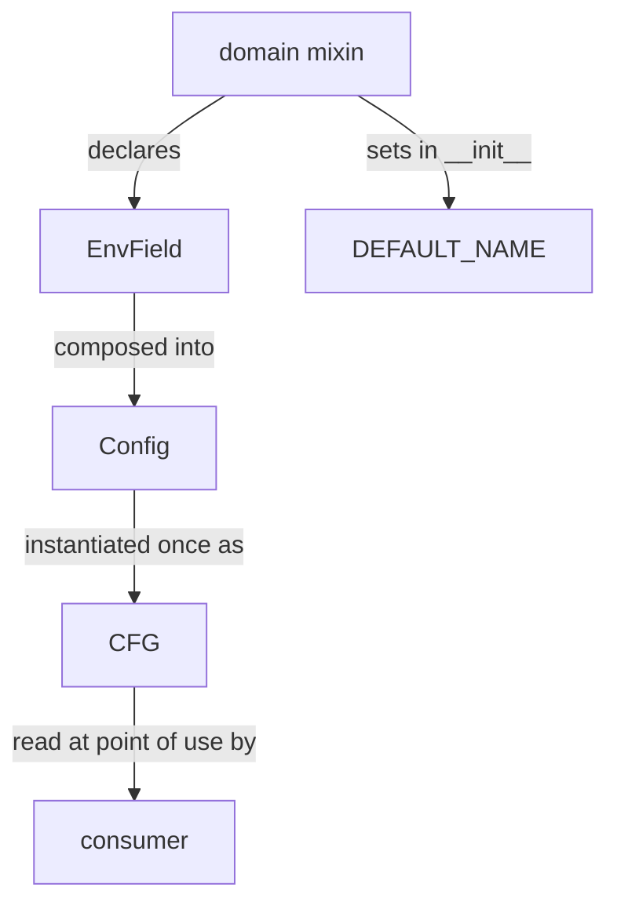
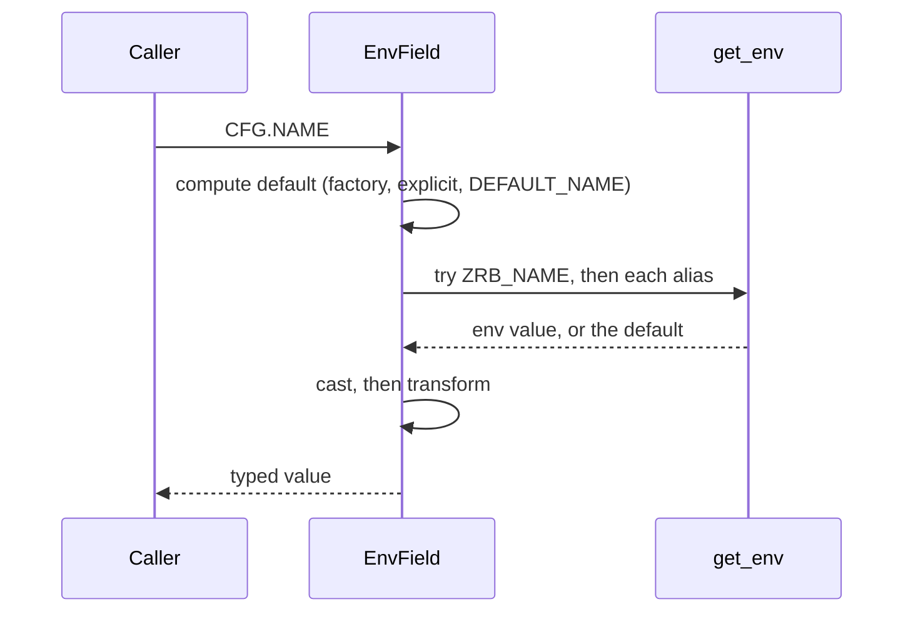

🔖 [Documentation Home](../../README.md) > [Architecture](../README.md) > Config

# Config

> **Tier 2 · Extension surface** · Code: `src/zrb/config/` · Read first: [The System](../0-system/system.md)

Config is every setting zrb reads that is not part of a task: the model, the web port, the size caps, the theme. All of it sits behind one object, `CFG`, which reads the process environment each time a value is asked for. The one idea to take away: the environment *is* the store, so an `export` and a `CFG.X = ...` in `zrb_init.py` always agree.

## Table of Contents

- [Design](#design)
  - [The problem](#the-problem)
  - [Principles](#principles)
  - [Invariants](#invariants)
- [Realization](#realization)
  - [The parts](#the-parts)
  - [How it runs](#how-it-runs)
  - [Variations](#variations)
  - [Change it here](#change-it-here)
- [See Also](#see-also)

## Design

### The problem

- **There are hundreds of settings**, across LLM, web, RAG, hooks, search, theme and limits. One class that holds them all is unreadable, and nested groups (`CFG.llm.model`) break every caller when a setting moves.
- **Values arrive two ways.** A user exports an environment variable, or a `zrb_init.py` assigns `CFG.X = ...` after zrb has already started. A reader must see the same answer either way.
- **Some defaults depend on other settings.** A directory sits under the root group's name; a colour follows the active theme. Computing them once at import would freeze the wrong value.
- **Released names live in users' shells and CI files.** Renaming or dropping one must not quietly turn a user's setting into a no-op.
- **A typo is silent by nature.** An unknown variable is simply never read, so "my setting did not apply" is the only symptom.

### Principles

1. **One singleton, read flat.** Settings are grouped into small domain mixins, but every caller writes `CFG.NAME` without knowing which mixin owns it. A setting can move between mixins without touching a single caller. → [ADR-0021](../../adr/adr-0021.md)

2. **One descriptor per setting, and the environment is the only store.** Each setting is a single `EnvField` line that knows how to read, cast and write it. Writing a value sets the environment variable, so no second copy can disagree with another reader. Nothing else is read either: no config file and no `.env`, which is a task's job, so global config never depends on the working directory. → [ADR-0022](../../adr/adr-0022.md), [ADR-0024](../../adr/adr-0024.md)

3. **Resolve on every read, in one fixed order.** The environment variable or an alias wins; then a computed default; then the mixin's static `DEFAULT_<NAME>`. Nothing is cached, so a later assignment or theme switch is visible to the next reader. → [ADR-0023](../../adr/adr-0023.md)

4. **Read where the value is used, never at import.** `zrb_init.py` runs after zrb's modules are imported, so a value captured at import time ignores the user's assignment. Code reads `CFG` inside the function that needs it, and optional chat features take their config when a session starts. → [ADR-0090](../../adr/adr-0090.md), [ADR-0102](../../adr/adr-0102.md)

5. **A released name never breaks silently.** A renamed setting keeps reading its old key while writing only the new one. A removed setting is listed as retired, and zrb names it at startup along with any near-miss typo of a real setting. → [ADR-0026](../../adr/adr-0026.md)

### Invariants

Each one fails silently if broken: zrb keeps running on a value the user did not choose.

| Must stay true | If it breaks | Pinned by |
| --- | --- | --- |
| An environment value beats every default, computed ones included | An exported override is ignored | `test/config/test_env_field.py::test_default_factory_overridden_by_env` |
| Aliases are read in order, and the first one set wins | A deployment still exporting the old name gets the default | `test/config/test_env_field.py::test_alias_read_order` |
| Assigning an unknown uppercase name raises, with a suggestion | `CFG.LLM_MODELL = ...` looks accepted and does nothing | `test/config/test_config_assignment_safety.py::test_assigning_an_unknown_uppercase_knob_raises_and_suggests` |
| A value that cannot be cast fails at the assignment | The bad value is stored and a later, unrelated read crashes | `test/config/test_config_assignment_safety.py::test_assigning_an_uncastable_value_raises_at_the_assignment` |
| A computed default is recomputed on each read | A derived path or theme colour keeps its import-time value | **unpinned** |
| No module reads `CFG` while it is being imported | A `zrb_init.py` assignment is silently ignored for that value | `test/architecture/test_deferred_config_reads.py::test_no_cfg_read_happens_at_import_time` |
| A retired setting is named at startup with its replacement | The user's export is ignored with no word | `test/config/test_config_env_warnings.py::test_a_retired_setting_names_the_one_that_replaced_it` |

## Realization

### The parts

| Part | Where | What it is responsible for |
| --- | --- | --- |
| `Config`, `CFG` | `src/zrb/config/config.py` | The thin shell that composes every mixin, the one `CFG = Config()` instance, the unknown-name guard on assignment, and the lookup guide from a setting family to its mixin |
| Domain mixins | `src/zrb/config/mixins/` | One file per area (`llm_core.py`, `llm_limits.py`, `web.py`, `theme.py`, ...). Each declares its `EnvField`s and sets its `DEFAULT_<NAME>` values in `__init__` |
| `EnvField` | `src/zrb/config/env_field.py` | Reading (prefix, aliases, cast, transform, fallback), writing (serialize, round-trip check, `write_key`), and the cast helpers (`on_off`, `path_list`, `comma_list`, ...) |
| `get_env` | `src/zrb/config/helper.py` | The prefixed environment lookup that tries names in order |
| `RETIRED_SETTINGS` | `src/zrb/config/retired.py` | Removed names and what replaces them |
| `get_retired_env_keys`, `get_mistyped_env_keys` | `src/zrb/config/config.py` | Finding retired and near-miss variables; `src/zrb/__main__.py` prints them at startup |
| `resolve_from_cfg` | `src/zrb/llm/util/feature_config.py` | Filling an optional feature's config dataclass from `CFG` when its session starts |
| `zrb config` tasks | `src/zrb/builtin/config.py` | Listing settings and explaining one (`explain_config`) |

### How it runs

**Reading a value.** A caller writes `CFG.LLM_MAX_TOOL_RESULT_CHARS`. Python finds the `EnvField` on the class and calls it:

Two details matter. An empty variable (`export ZRB_WEB_HTTP_PORT=`) counts as unset and falls back to the default instead of failing the cast. A cast error re-raises unless the field declares a `fallback`.

Callers read `CFG` where the value is used, not at import. The tool-result cap is read by `SafeToolsetWrapper` in `src/zrb/llm/agent/common.py` each time a result comes back, so a `zrb_init.py` change made after import still applies.

**Writing a value.** `CFG.NAME = value` serializes the value, casts it back to check it round-trips, and writes `os.environ` under the field's write key. `None` deletes the variable for a nullable field and is rejected otherwise. `Config.__setattr__` runs first and refuses an uppercase name no setting defines.

**Adding a setting.** In the owning mixin, set `self.DEFAULT_<NAME>` in `__init__` and declare `<NAME> = EnvField(cast, doc=...)` next to its siblings. With no `aliases` and no `no_prefix`, the environment key is the prefix plus the name — for this example, ZRB_LLM_MAX_TOOL_RESULT_CHARS. Then read `CFG.<NAME>` in the code that owns the behaviour, and document it in `docs/configuration/`. A boolean follows the naming rule in [ADR-0026](../../adr/adr-0026.md).

### Variations

| Case | Where it is decided | What is different |
| --- | --- | --- |
| A default derived from other settings | `EnvField(default_factory=...)` | Called with the config on every unset read; used for paths under `ROOT_GROUP_NAME` and theme colours |
| A renamed setting | `EnvField(aliases=[new, old], write_key=new)` | Reads either key, writes only the new one |
| A removed setting | `src/zrb/config/retired.py` | No longer read; zrb names it at startup with its replacement |
| A key outside the prefix | `EnvField(no_prefix=True)` | Reads and writes the bare name, such as `BRAVE_API_KEY` |
| An optional value | `EnvField(nullable=True)` | Unset or empty reads as `None`; assigning `None` removes the variable |
| A secret | `EnvField(secret=True)` | Read and written as usual; `zrb config` shows only set or unset |
| An optional chat feature | `resolve_from_cfg` | Fills the dataclass's `None` fields from `CFG.<PREFIX><FIELD>` at session start and copies lists |
| A sub-agent run | `src/zrb/llm/agent/run/authority_snapshot.py` | Plain settings come from the same process-wide `CFG`; permission, YOLO and sandbox travel separately with the run — see [Sub-agents](sub-agents.md) |
| A `.env` file | `EnvFile` in `src/zrb/env/env_file.py` | Loads into one task's context, never into `CFG` |

### Change it here

| To… | Open | Then run |
| --- | --- | --- |
| Add or change a setting | the owning file in `src/zrb/config/mixins/` | `test/config/` |
| Change read order, casting, aliases or writing | `src/zrb/config/env_field.py` | `test/config/test_env_field.py` |
| Change composition or the unknown-name guard | `src/zrb/config/config.py` | `test/config/test_config_assignment_safety.py` |
| Retire a setting or tune typo detection | `src/zrb/config/retired.py`, `src/zrb/config/config.py` | `test/config/test_config_env_warnings.py` |
| Add or change a theme | `src/zrb/config/theme.py`, `src/zrb/config/mixins/theme.py` | `test/config/test_config_theme.py` |
| Change when a chat feature reads config | `src/zrb/llm/util/feature_config.py` | `test/llm/util/test_feature_config.py` |
| Change `zrb config` output | `src/zrb/builtin/config.py` | `test/builtin/test_explain_config.py` |

## See Also

- [The System](../0-system/system.md) — where config sits among the other parts
- [Environment variables](../../configuration/env-vars.md) — the user-facing list of settings
- [LLM Configuration](../../configuration/llm-config.md) — model and LLM settings for users
- [Sub-agents](sub-agents.md) — what a child run inherits besides config
- [Dictation & Barge-in](../3-peripheral-flow/dictation-barge-in.md) — an optional feature that reads config at session start

🔖 [Documentation Home](../../README.md) > [Architecture](../README.md) > Config
