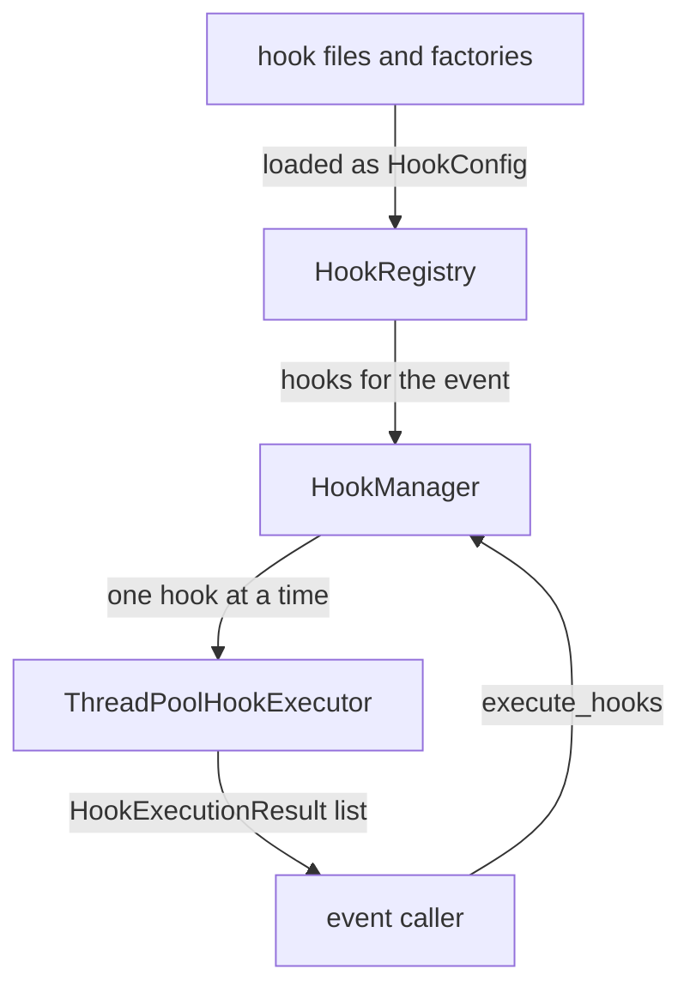
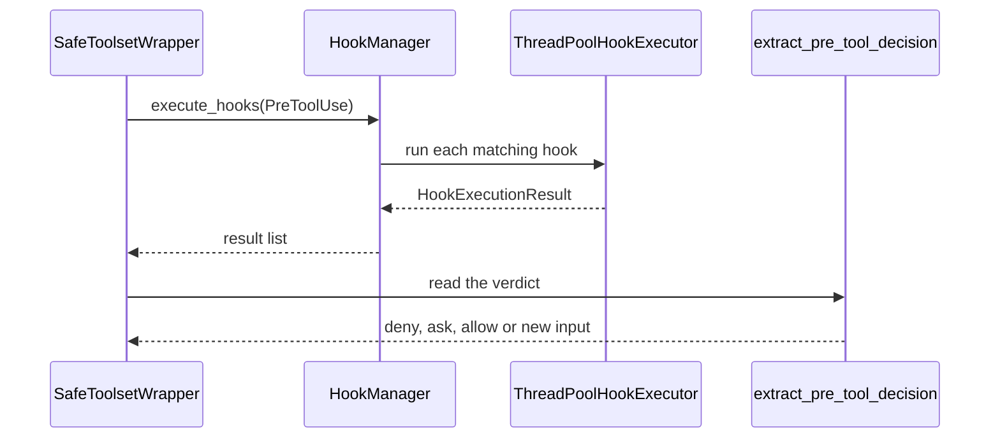

🔖 [Documentation Home](../../../README.md) > [Architecture](../README.md) > Hooks

# Hooks

> **Tier 2 · Extension surface** · Code: `src/zrb/llm/hook/` · Read first: [The LLM Turn](../1-spine/llm-turn.md)

A hook is a small program the user plugs into the agent's lifecycle: run a linter after every edit, deny a dangerous command, play a sound when the agent needs attention. This page covers how zrb finds hooks, picks the ones that apply to an event, runs them, and hands their verdict back to the turn. The one idea to take away: hooks follow Claude Code's format and control rules, so an existing Claude hook works in zrb unchanged.

## Table of Contents

- [Design](#design)
  - [The problem](#the-problem)
  - [Principles](#principles)
  - [Invariants](#invariants)
- [Realization](#realization)
  - [The parts](#the-parts)
  - [How it runs](#how-it-runs)
  - [Variations](#variations)
  - [Change it here](#change-it-here)
- [See Also](#see-also)

## Design

### The problem

- **Hooks are other people's code.** A hook can hang, crash, print garbage or never exit. None of that may take down the agent's turn.
- **Hooks must be able to act, not just watch.** Users rely on a hook to deny a tool call, rewrite its arguments, or keep the agent working. Firing the event is not enough; the verdict has to take effect.
- **An existing ecosystem.** Claude Code hooks read their event from stdin and live in `.claude/settings.json`. Translating them by hand would defeat the point.
- **Many events, some very frequent.** A hook on every tool call or every stream chunk must not stall the turn or exhaust the machine.
- **A dependency loop.** The agent fires hooks around every tool call, yet one hook type is itself an agent.

### Principles

1. **Claude-compatible, control included.** zrb fires Claude's events, reads hooks from Claude's files, sends the event as JSON on stdin, and honours Claude's verdict fields: `permissionDecision`, `updatedInput`, `decision: "block"`, `continue: false`. Hook types are a shell `command`, a one-shot LLM `prompt`, and a multi-step `agent`. → [ADR-0071](../../adr/adr-0071.md)

2. **Every tool call passes one checkpoint.** `PreToolUse`, `PostToolUse` and `PostToolUseFailure` fire from the one wrapper every tool call goes through, so no route to a tool skips them. A call that needs approval fires `PreToolUse` before the user is asked, so a hook can deny it first. → [ADR-0071](../../adr/adr-0071.md)

3. **Run in order; a block stops only what can be stopped; a failure is a result.** Hooks run one at a time, highest priority first. A block ends the chain only on events where stopping makes sense; `continue: false` ends it everywhere. A hook that crashes or times out becomes a failed result, never an exception in the turn. `async` hooks run in the background, capped, and cannot block. → [ADR-0071](../../adr/adr-0071.md)

4. **One canonical registry; each run binds the manager it uses.** A registry holds the hooks. A run binds its task's manager (by default a fresh one per execution for the chat task, a persistent one for a plain LLM task), and every event inside that run goes to it. A task's own hooks, including its denials, therefore reach every tool call and sub-agent in the run. → [ADR-0090](../../adr/adr-0090.md), [ADR-0072](../../adr/adr-0072.md)

5. **The hook package never imports the agent package.** The agent package installs the agent-type hook builder into a small registry, and the hook manager reads it from there. The loop between the two packages stays visible in the import graph. → [ADR-0086](../../adr/adr-0086.md), [ADR-0096](../../adr/adr-0096.md)

### Invariants

| Must stay true | If it breaks | Pinned by |
| --- | --- | --- |
| Tool-call hooks fire on the run's manager, not the process-wide one | A task's deny hook is skipped and the tool runs anyway | `test/llm/agent/test_common_tool_calls.py::test_call_tool_pretooluse_fires_on_the_run_hook_manager` |
| A block on a non-blocking event does not stop the other hooks | One notification hook silently disables every hook after it | `test/llm/hook/test_manager_lifecycle.py::TestHookManagerExecution::test_block_on_non_blocking_event_continues_chain` |
| `continue: false` stops the chain on any event | A hook asking zrb to halt is ignored | `test/llm/hook/test_manager_lifecycle.py::TestHookManagerExecution::test_continue_false_stops_execution` |
| A hook that raises becomes a failed result | One broken hook aborts the user's turn | `test/llm/hook/test_manager_lifecycle.py::TestHookManagerExecution::test_exception_handling` |
| A sync command hook past its timeout is killed | The turn waits until the subprocess exits on its own | `test/llm/hook/test_manager_execution.py::test_sync_command_hook_is_killed_on_timeout` |
| An `async` hook returns at once and adds no result | A slow notification hook stalls every turn | `test/llm/hook/test_manager_execution.py::test_async_command_hook_is_non_blocking` |
| No circular-import workaround exists in the source | Someone re-creates the hook-to-agent loop with a lazy import and it goes unseen | `test/architecture/test_circular_import_allowlist.py::test_circular_import_workarounds_match_the_allowlist` |

## Realization

### The parts

| Part | Where | What it is responsible for |
| --- | --- | --- |
| `HookManager` | `src/zrb/llm/hook/manager.py` | Loads hooks on first use, picks and sorts them for an event, runs them in order, applies the stop rules |
| `HookManagerLoading` | `src/zrb/llm/hook/manager_loading.py` | Base class of `HookManager`: parses Claude-nested, zrb-flat and `.hook.py` sources into `HookConfig` |
| `get_search_directories` | `src/zrb/llm/hook/hook_loader.py` | Where hooks are found: plugins, home, project (root to cwd), then `HOOKS_DIRS`, with duplicates removed |
| `HookRegistry`, `hook_registry` | `src/zrb/llm/hook/registry.py` | Global and per-event hooks with their configs; applies the `LLM_HOOKS` name allowlist |
| `HookConfig`, `HookContext` | `src/zrb/llm/hook/schema.py`, `src/zrb/llm/hook/interface.py` | A parsed hook declaration; the event payload a hook receives |
| `evaluate_matchers` | `src/zrb/llm/hook/matcher.py` | Decides whether a hook applies; every matcher must pass |
| `create_command_hook`, `create_prompt_hook` | `src/zrb/llm/hook/creator.py` | Build the subprocess hook and the one-shot LLM hook |
| `create_agent_hook` | `src/zrb/llm/agent/hook_agent.py` | Builds the agent-type hook; installed through `register_agent_hook_builder` |
| `ThreadPoolHookExecutor` | `src/zrb/llm/hook/executor.py` | Runs one hook on a worker thread with a timeout and cancellation, and normalizes the result |
| `get_run_hook_manager` | `src/zrb/llm/hook/manager.py` | The run's manager from `current_hook_manager`, else the process-wide `hook_manager` |
| Result extractors | `src/zrb/llm/agent/run/hook_result_extractor.py` | Turn a result list into a decision the caller applies |

### How it runs

Take a `PreToolUse` event, the most common one:

1. **Load.** If `HOOKS_ENABLED` is off, `execute_hooks` returns an empty list and never scans. Otherwise the first call runs the built-in factories (journal compliance, self review, skill frontmatter) and loads every search directory.
2. **Select.** The manager builds a `HookContext`, takes global hooks plus this event's hooks, and sorts them by `priority`, highest first. A hook with no config counts as 0.
3. **Run.** Each hook first checks its matchers. A command hook gets the event as JSON on stdin and as size-capped `CLAUDE_*` variables; exit 0 is success, exit 2 is a block, anything else is a failure. A timeout kills the whole process tree.
4. **Stop or continue.** A block stops the chain only for events in `BLOCKING_EVENTS`; `continue: false` stops it for any event.
5. **Apply.** The manager only returns results. The caller decides what they mean: `SafeToolsetWrapper` denies, asks or rewrites the call; `run_agent` ends or extends the turn; `apply_turn_end_extension` re-runs the agent when a `Stop` hook blocks.

### Variations

| Case | Where it is decided | What is different |
| --- | --- | --- |
| `async: true` command or agent hook | `HookManager.execute_hooks` | Matched, then started in the background on the main loop. Concurrency and backlog are capped; extra hooks are dropped |
| Agent-type hook with no builder installed | `get_agent_hook_builder` returns `None` | Logs a warning and returns a failed result; only reachable in an isolated test |
| A hook declared in a skill's frontmatter | `src/zrb/llm/hook/skill_frontmatter.py` | Kept in a process-wide record and replayed onto every manager, including fresh per-run ones and after `reload` |
| A run started inside another run | `resolve_context_dependencies` in `src/zrb/llm/agent/run/setup.py` | Inherits the parent run's manager, so a sub-agent's tools see the parent's hooks |
| A call that needs approval | `src/zrb/llm/agent/run/deferred_calls.py` | Fires `PreToolUse` before the prompt, and `PermissionRequest` when the user is actually asked |
| A Claude tool name in a matcher (`Bash`) | `evaluate_matchers` | Expanded to the zrb tool it means (`Shell`) for `tool_name` |
| `LLM_HOOKS` set | `HookRegistry` | Only hooks with those names run |

### Change it here

| To… | Open | Then run |
| --- | --- | --- |
| Change ordering or stop rules | `src/zrb/llm/hook/manager.py` | `test/llm/hook/test_manager_lifecycle.py` |
| Add an event, or change which events can block | `src/zrb/llm/hook/types.py`, then the caller that fires it | `test/llm/hook/` |
| Change how hook files are found or parsed | `src/zrb/llm/hook/hook_loader.py`, `src/zrb/llm/hook/manager_loading.py` | `test/llm/hook/test_manager_lifecycle.py` |
| Change matching | `src/zrb/llm/hook/matcher.py` | `test/llm/hook/test_matchers.py` |
| Change command-hook I/O, timeouts or kill | `src/zrb/llm/hook/creator.py`, `src/zrb/llm/hook/process_io.py`, `src/zrb/llm/hook/process_kill.py` | `test/llm/hook/test_creator_subprocess.py` |
| Change the agent-type hook | `src/zrb/llm/agent/hook_agent.py` | `test/llm/agent/test_hook_agent.py` |
| Change how a verdict is applied | `src/zrb/llm/agent/run/hook_result_extractor.py` | `test/llm/hook/test_hook_result_processing.py` |
| Change skill-frontmatter hooks | `src/zrb/llm/hook/skill_frontmatter.py` | `test/llm/hook/test_skill_frontmatter.py` |

## See Also

- [The LLM Turn](../1-spine/llm-turn.md) — where `UserPromptSubmit`, `Stop` and the compaction events fire
- [Tools](tools.md) — the checkpoint that fires the tool-call events
- [Tool Call & Approval](../3-peripheral-flow/tool-call-approval.md) — `PermissionRequest` and the pre-approval `PreToolUse`
- [Hook System](../../llm/hooks.md) — how to write and configure a hook
- [Claude Compatibility](../../llm/claude-compatibility.md) — the external format in detail

🔖 [Documentation Home](../../../README.md) > [Architecture](../README.md) > Hooks
