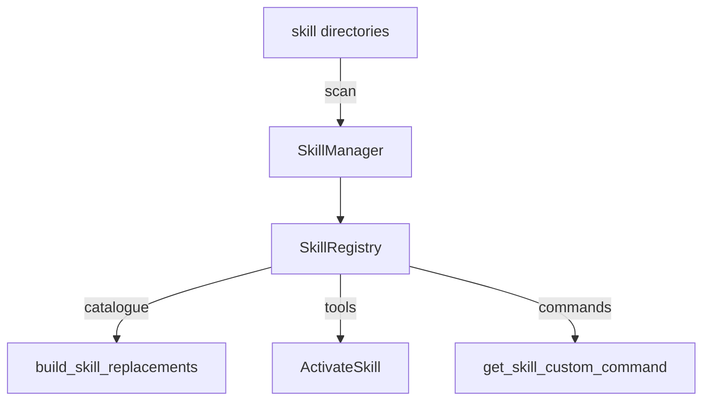

🔖 [Documentation Home](../../README.md) > [Architecture](../README.md) > Skills & Commands

# Skills & Commands

> **Tier 2 · Extension surface** · Code: `src/zrb/llm/skill/`, `src/zrb/llm/custom_command/`, `src/zrb/llm_plugin/` · Read first: [Prompts](prompts.md)

A skill is a markdown (or Python) file of domain method the agent loads only when a turn needs it. A custom command is a `/word` the user types in chat. This page covers where both come from and how one skill file becomes both. The one idea to take away: expertise is discovered from directories at run time, not compiled into the prompt.

## Table of Contents

- [Design](#design)
  - [The problem](#the-problem)
  - [Principles](#principles)
  - [Invariants](#invariants)
- [Realization](#realization)
  - [The parts](#the-parts)
  - [How it runs](#how-it-runs)
  - [Variations](#variations)
  - [Change it here](#change-it-here)
- [See Also](#see-also)

## Design

### The problem

- **Method does not fit in the system prompt.** How to debug, review or write well is long, and most turns need none of it. Putting it all in every request costs tokens and attention on every turn.
- **Expertise must travel.** A team wants one skill library for zrb and Claude Code, shared across projects and overridable per project.
- **Some skills are load-bearing.** The methodology baseline the agent relies on must always be there, while utility skills should be removable without forking zrb.
- **The same file serves two audiences.** The model activates a skill on its own; the user invokes one as a slash command. Some skills are only for one of them.
- **A catalogue grows without bound.** Listing every installed skill in the prompt does not scale past a handful.

### Principles

1. **Skills and agents are discovered from directories.** Home, project, plugin and built-in directories are scanned at run time, using Claude Code's layout, so one library serves both tools. A skill registered in code survives every rescan and wins a name collision with one found on disk. → [ADR-0052](../../adr/adr-0052.md)

2. **The catalogue comes from the live scan, and is capped.** The prompt lists the skills the scan found, up to a configured limit; the rest stay reachable through `SearchSkill`. Activation returns the skill's body, its directory and its companion files, only when the model asks. → [ADR-0053](../../adr/adr-0053.md)

3. **Core is separate from optional.** The built-in plugin is split into core skills, which always load, and utility skills and agents, which a deployment may switch off. The switches never affect user, project or plugin content. → [ADR-0054](../../adr/adr-0054.md)

4. **A command is always offered; an unavailable one explains itself.** Every slash command appears in help and completion, and a command that cannot run in this environment says why instead of disappearing. → [ADR-0093](../../adr/adr-0093.md)

### Invariants

| Must stay true | If it breaks | Pinned by |
| --- | --- | --- |
| A code-registered skill wins over a discovered one of the same name | A rescan silently replaces the skill a `zrb_init.py` installed | `test/llm/skill/test_registry.py::test_manual_wins_name_collision_with_discovered` |
| Core skills load even when built-in skills are switched off | The agent loses its methodology baseline with no error | `test/llm/skill/test_skill_manager_search_dirs.py::test_builtin_core_skills_always_searched` |
| A skill marked not model-invocable is refused, with a hint | The model runs a user-only command as if it were its own method | `test/llm/tool/test_skill.py::TestActivateSkillErrorsSelfCorrect::test_user_only_skill_says_to_do_the_work_yourself` |
| A skill marked not user-invocable never becomes a slash command | A model-only method shows up in the `/` menu | `test/llm/custom_command/test_skill_command_factory.py::TestGetSkillCustomCommand::test_get_skill_custom_command_with_non_user_invocable_skills` |
| The prompt's skill catalogue respects its cap | Every installed skill inflates every request | `test/llm/prompt/test_claude_skills.py::test_build_skill_replacements_truncates_available_skills` |

## Realization

### The parts

| Part | Where | What it is responsible for |
| --- | --- | --- |
| `Skill` | `src/zrb/llm/skill/manager.py` | One skill: name, description, path, invocability, allowed tools, fork context |
| `SkillManager` | `src/zrb/llm/skill/manager.py` | Computing the search directories and scanning them into the registry |
| `SkillRegistry` | `src/zrb/llm/skill/registry.py` | The skill collection, with the `CFG.LLM_SKILLS` allowlist |
| `LayeredRegistry` | `src/zrb/llm/util/layered_registry.py` | The two layers shared with sub-agents: manual (from code) over discovered (from disk) |
| `create_activate_skill_tool`, `create_search_skill_tool` | `src/zrb/llm/tool/skill.py` | `ActivateSkill` and `SearchSkill`, the model's way in |
| `build_skill_replacements` | `src/zrb/llm/prompt/claude.py` | The capped catalogue the prompt shows |
| `apply_skill_frontmatter_hooks` | `src/zrb/llm/hook/skill_frontmatter.py` | Hooks declared in a skill's frontmatter — see [Hooks](hooks.md) |
| `CustomCommand`, `ActionCommand` | `src/zrb/llm/custom_command/` | A prompt-template command, and a command that runs a callable |
| `get_skill_custom_command` | `src/zrb/llm/custom_command/skill_command_factory.py` | Turning each user-invocable skill into a slash command |
| `get_custom_command_match`, `run_custom_command` | `src/zrb/llm/custom_command/resolver.py` | Matching typed input to a command and running it |
| Built-in content | `src/zrb/llm_plugin/` | `core_skills/`, `skills/`, `core_agents/` and `agents/` |

### How it runs

**Discovery.** The first lookup scans. `SkillManager` builds its search directories — home and project config directories (`CFG.LLM_CONFIG_DIR_NAMES`), plugin directories, any extra skill directories, and the built-in `core_skills/` plus, when `CFG.LLM_ENABLE_BUILTIN_SKILLS` is on, `skills/` — and replaces the discovered layer with what it finds. A `SKILL.md` or `SKILL.py` in its own directory brings its companion files along.

**The model's side.** `build_skill_replacements` fills the catalogue placeholder in the prompt with the model-invocable skills, capped by `CFG.LLM_MAX_SKILLS_IN_CATALOG`. When the model calls `ActivateSkill`, the tool returns the skill's body wrapped with its directory and companion files, so relative paths in the skill resolve.

**The user's side.** The built-in `zrb llm chat` appends `get_skill_custom_command`, a factory that rescans and returns one command per user-invocable skill. `ChatRunning` resolves every command factory, and when the user types `/name args`, `get_custom_command_match` finds it and `run_custom_command` either renders its prompt as the next message or runs its action.

### Variations

| Case | Where it is decided | What is different |
| --- | --- | --- |
| A skill with `context: fork` | `Skill` | Runs in a sub-agent instead of the current context |
| A skill with `allowed_tools` | `Skill` | Those tools need no permission while the skill is active |
| A `SKILL.py` | `SkillManager` | The module provides the `Skill` object itself, so it can compute its content |
| Sub-agent definitions | `SubAgentRegistry` | Same layered discovery, from `*.agent.md` files — see [Sub-agents](sub-agents.md) |
| An allowlist is set | `CFG.LLM_SKILLS` | Only the listed discovered skills are visible; code-registered skills are not filtered |

### Change it here

| To… | Open | Then run |
| --- | --- | --- |
| Change where skills are found | `src/zrb/llm/skill/manager.py` | `test/llm/skill/` |
| Change registry layering or the allowlist | `src/zrb/llm/util/layered_registry.py`, `src/zrb/llm/skill/registry.py` | `test/llm/skill/test_registry.py` |
| Change what activation returns | `src/zrb/llm/tool/skill.py` | `test/llm/tool/test_skill.py` |
| Change the prompt's catalogue | `src/zrb/llm/prompt/claude.py` | `test/llm/prompt/test_claude_skills.py` |
| Add a kind of custom command | `src/zrb/llm/custom_command/` | `test/llm/custom_command/` |
| Ship a built-in skill or agent | `src/zrb/llm_plugin/` | `test/llm/skill/test_skill_manager_search_dirs.py` |

## See Also

- [Prompts](prompts.md) — where the catalogue sits in the system prompt
- [Sub-agents](sub-agents.md) — agent definitions use the same layered discovery
- [Claude Compatibility → Skills](../../llm/claude-compatibility.md#2-skills-skillmd) — writing a skill, from the user's side
- [Skill & Agent Search Configuration](../../configuration/llm-config.md) — the directory and allowlist settings

🔖 [Documentation Home](../../README.md) > [Architecture](../README.md) > Skills & Commands
