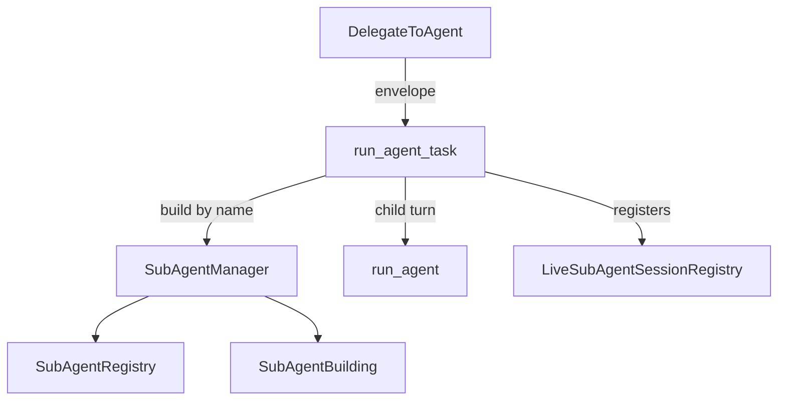
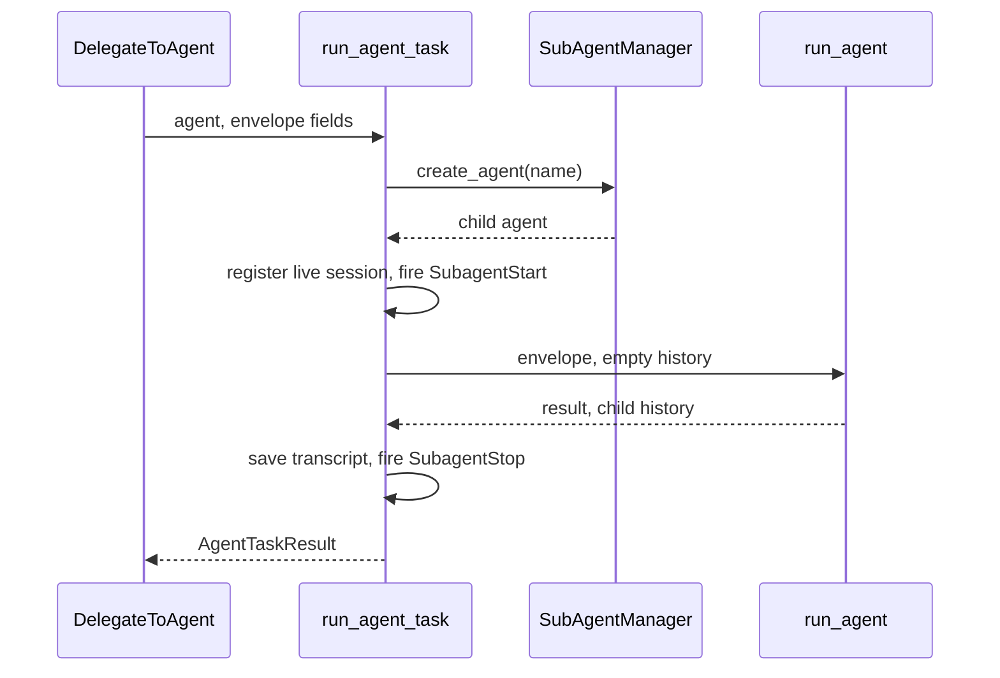
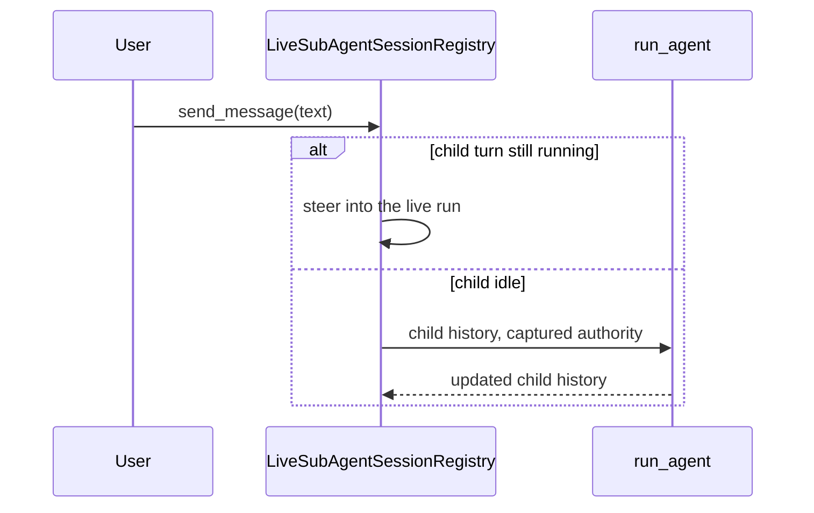

🔖 [Documentation Home](../../README.md) > [Architecture](../README.md) > Sub-agents

# Sub-agents

> **Tier 2 · Extension surface** · Code: `src/zrb/llm/agent/subagent/` · Read first: [The LLM Turn](../1-spine/llm-turn.md)

A sub-agent is a second agent the main agent hands a piece of work to: a research sweep, a review, a batch of edits. It runs its own loop with its own context and reports back one result, which keeps the main agent's context clean. The one idea to take away: a sub-agent gets a fresh mind but never more authority than its parent, even when a human keeps talking to it after the parent's turn is over.

## Table of Contents

- [Design](#design)
  - [The problem](#the-problem)
  - [Principles](#principles)
  - [Invariants](#invariants)
- [Realization](#realization)
  - [The parts](#the-parts)
  - [How it runs](#how-it-runs)
  - [Variations](#variations)
  - [Change it here](#change-it-here)
- [See Also](#see-also)

## Design

### The problem

- **Scope creep is the main failure.** A sub-agent given a fuzzy brief does more than was asked, and the parent cannot interrogate its report afterwards.
- **Authority must not grow on the way down.** A child that auto-approves what its parent would have asked about is a permission bypass. Yet a child that denies everything is useless.
- **Many children share one screen.** Fan-out and background agents run at the same time, and their output and approval prompts must not interleave or deadlock.
- **Work can outlive the call that started it.** A background agent finishes after the tool returned. A human can open a finished sub-agent in the TUI and send it another message long after the parent's turn ended.
- **Delegation must not recurse.** A child that can delegate again can fan out without bound.

### Principles

1. **A delegation is a tight brief to a fresh mind.** The parent sends a structured envelope: deliverable, non-goals, task, context, and a self-check before returning. The child starts with an empty history and returns one result. Fan-out is a parameter of the same tool, not a separate one. → [ADR-0068](../../adr/adr-0068.md)

2. **A child never exceeds its parent, even later.** While the parent's run is active, the child inherits its permission policy, sandbox, approval channel and hooks through the ambient context. A follow-up that runs after the parent's run is over uses the authority captured when the delegation started, never whatever is ambient at that later moment. → [ADR-0069](../../adr/adr-0069.md)

3. **Concurrent children share one screen through a buffer.** Each child writes to its own buffered view, and its approval requests queue behind the parent UI's current prompt. Output appears at flush, approval and completion points rather than strictly live. → [ADR-0070](../../adr/adr-0070.md)

4. **A child's file observations are its own.** Each delegation runs under its own run scope, so a read the parent or a sibling made never counts as this child having read the file before overwriting it. → [ADR-0084](../../adr/adr-0084.md)

5. **Every finished delegation leaves a transcript.** The child's history is saved under a derived name, apart from main conversations and pruned by count. It can be listed and resumed as that sub-agent, not as the main agent. → [ADR-0083](../../adr/adr-0083.md)

### Invariants

| Must stay true | If it breaks | Pinned by |
| --- | --- | --- |
| A follow-up to a finished sub-agent runs with the authority captured at delegation | A later message runs the child under a broader grant than the parent gave | `test/llm/agent/subagent/test_live_session_registry.py::test_continue_live_session_uses_captured_authority_not_ambient` |
| A sub-agent can never be given a delegate tool | Sub-agents delegate recursively | `test/llm/agent/subagent/test_tool_resolver.py::TestResolveToolsByName::test_excludes_delegate_tools_from_registry` |
| A sub-agent gets only the shared tools its definition names | A read-only agent quietly gains `Write` and `Shell` | `test/llm/agent/subagent/test_manager_building.py::test_common_tools_are_name_gated_for_sub_agents` |
| Each delegation runs under its own run scope | A child overwrites a file it never read, credited with the parent's read | `test/llm/tool/test_delegate_tool_run.py::test_delegate_passes_live_sessions_run_scope_to_run_agent` |
| A child starts with no parent history | The child sees the parent's whole conversation, so it is neither a fresh view nor cheap | **unpinned** |
| Cancelling one sub-agent does not cancel the parent's turn | Esc on one fan-out child kills the whole main turn | `test/llm/tool/test_delegate_tool_run.py::test_delegate_human_cancel_returns_gracefully` |
| Fan-out never runs more children at once than the cap allows | A large batch floods the rate limiter and the worktree store | `test/llm/tool/test_delegate_tool_cancel.py::test_delegate_fan_out_respects_parallel_cap` |

## Realization

### The parts

| Part | Where | What it is responsible for |
| --- | --- | --- |
| `SubAgentManager` | `src/zrb/llm/agent/subagent/manager.py` | Scans the agent directories on first use, holds registrations, builds agents by name |
| `SubAgentRegistry` | `src/zrb/llm/agent/subagent/registry.py` | Two layers, manual and discovered; a manual entry wins a name collision and survives a rescan |
| `SubAgentDefinition` | `src/zrb/llm/agent/subagent/definition.py` | One agent's data: prompt, model, `tools`, `disallowed_tools`, `inherit_sections` |
| `SubAgentBuilding` | `src/zrb/llm/agent/subagent/building.py` | Turns a definition into an agent: model, named tools, toolsets, inherited prompt sections, yolo |
| `resolve_tools_by_name` | `src/zrb/llm/agent/subagent/tool_resolver.py` | Looks tool names up (`Bash` maps to `Shell`), drops unknown names, never returns a delegate tool |
| `DelegateToAgent` | `src/zrb/llm/tool/delegate.py` | The parent's tool: one task, or a `tasks` list run concurrently, each optionally in its own worktree |
| `DelegateToAgentBackground` | `src/zrb/llm/tool/delegate_background.py` | Starts a child detached and returns a handle; `GetDelegationResult` collects it |
| `run_agent_task` | `src/zrb/llm/tool/delegate.py` | The shared child run: build, envelope, hooks, `run_agent`, transcript, result |
| `send_message_to_subagent` | `src/zrb/llm/tool/delegate_message.py` | The parent's tool to message a live child; the message names the main agent as sender |
| `send_message_to_parent` | `src/zrb/llm/agent/subagent/parent_message.py` | The child's tool to message the main agent mid-run; the message names the child. Both tools count against `LLM_AGENT_MESSAGE_LIMIT` |
| `BufferedUI` | `src/zrb/llm/ui/buffered_ui.py` | A child's own view: buffers output, forwards approvals to the parent UI |
| `LiveSubAgentSessionRegistry` | `src/zrb/llm/agent/subagent/live_session.py` | Children a human can open and keep talking to, for the rest of the chat session |
| `AuthoritySnapshot` | `src/zrb/llm/agent/run/authority_snapshot.py` | The permission policy, yolo, sandbox, hook manager, approval handler (tool policies, formatters, response handlers) and approval channel captured at delegation |

### How it runs

**Delegating.** The model calls `DelegateToAgent`. The tool wraps the parent UI in a `BufferedUI` and calls `run_agent_task`, which runs the child as a nested run inside the parent's tool call:

What the child gets:

- **Tools.** Only the names in its definition, minus `disallowed_tools`, from the same shared providers the main agent uses (`apply_common_tools`). Delegate tools are always removed.
- **Prompt.** Its own prompt, plus the parent prompt sections named in `inherit_sections`. A child runs one turn with no history, so when `system_context` is among those sections, the live context goes into its system prompt instead of the user turn.
- **Run state.** The parent's rate limiter, permission policy, sandbox, approval channel and hook manager, inherited because the child starts while the parent's run is bound. It gets a fresh run scope and no stream observers.

The parent's `Stop` review covers the child's file changes, so the child takes no turn snapshot of its own.

**Talking to a finished child.** Every delegation registers a live session, capturing an `AuthoritySnapshot` while the parent's run is still bound. Later, a human can open the child in the TUI and send it a message:

**Agents messaging each other.** The same registry carries agent-originated messages (ADR-0108). `send_message_to_subagent` steers into a running child or continues an idle one; `send_message_to_parent` submits to the parent UI, which steers into the main agent's live turn or queues it as its next one. Each message starts with a header naming its sender. A child's message reaches the parent mid-run only with background delegation; under synchronous `DelegateToAgent` the parent is blocked, so it arrives in the parent's next turn.

**After a restart.** `/load <conversation>` re-registers that conversation's saved child transcripts as idle sessions (ADR-0109). They carry no `AuthoritySnapshot`, so a continuation runs under the permissions in force when it starts. A restored session is titled again from its transcript's first message, so it shows its agent name until that small-model call returns.

### Variations

| Case | Where it is decided | What is different |
| --- | --- | --- |
| Fan-out (`tasks` list) | `DelegateToAgent` | All tasks run concurrently, at most `LLM_MAX_PARALLEL_DELEGATIONS` at once, and the results are combined into one reply |
| `isolate_worktree: true` | `DelegateToAgent` fan-out | The task runs in its own git worktree; a clean one is removed, one with changes is left and its path reported |
| Background delegation | `DelegateToAgentBackground` | Returns a handle at once; `GetDelegationResult` waits up to `LLM_BACKGROUND_WAIT_MAX` seconds; handles live only in this process |
| Plan mode | `PLAN_MODE_POLICY` in `src/zrb/llm/permission/policy.py` | The `DELEGATE` capability is denied, so no delegation runs at all |
| A policy denies one agent | `DelegateToAgent`'s roster | That agent is left out of the roster in the tool description |
| A human cancels a running child | `LiveSubAgentSessionRegistry.cancel` | The child returns "Cancelled by user"; if the human then continues it, its last reply is sent to the main agent when it ends |
| A definition built from a ready agent | `SubAgentDefinition` with `agent_instance` or `agent_factory` | Used as is: no tool, prompt or yolo resolution, and it cannot be resumed as a chat task |

### Change it here

| To… | Open | Then run |
| --- | --- | --- |
| Change discovery, search order or registration | `src/zrb/llm/agent/subagent/manager.py` | `test/llm/agent/subagent/` |
| Change what a child inherits (tools, prompt, yolo) | `src/zrb/llm/agent/subagent/building.py` | `test/llm/agent/subagent/test_manager_building.py` |
| Change how tool names resolve | `src/zrb/llm/agent/subagent/tool_resolver.py` | `test/llm/agent/subagent/test_tool_resolver.py` |
| Change the envelope, fan-out or the child run | `src/zrb/llm/tool/delegate.py` | `test/llm/tool/` |
| Change background handles and waiting | `src/zrb/llm/tool/delegate_background.py` | `test/llm/tool/test_delegate_background_results.py` |
| Change follow-ups to a finished child | `src/zrb/llm/agent/subagent/live_session.py` | `test/llm/agent/subagent/test_live_session_registry.py` |
| Change agent-to-agent messages | `src/zrb/llm/tool/delegate_message.py`, `src/zrb/llm/agent/subagent/parent_message.py` | `test/llm/tool/test_delegate_message.py` |
| Change what authority is captured | `src/zrb/llm/agent/run/authority_snapshot.py` | `test/llm/agent/run/test_authority_snapshot.py` |

## See Also

- [The LLM Turn](../1-spine/llm-turn.md) — the loop each child runs
- [Tools](tools.md) — the shared providers a child's tools come from
- [Tool Call & Approval](../3-peripheral-flow/tool-call-approval.md) — how a child's approvals reach the user
- [Context Propagation](../../technical-specs/context-propagation.md) — `ContextVar` scoping and `AuthoritySnapshot`
- [Programming the Agent](../../llm/programming-the-agent.md) — how to write an agent definition

🔖 [Documentation Home](../../README.md) > [Architecture](../README.md) > Sub-agents
