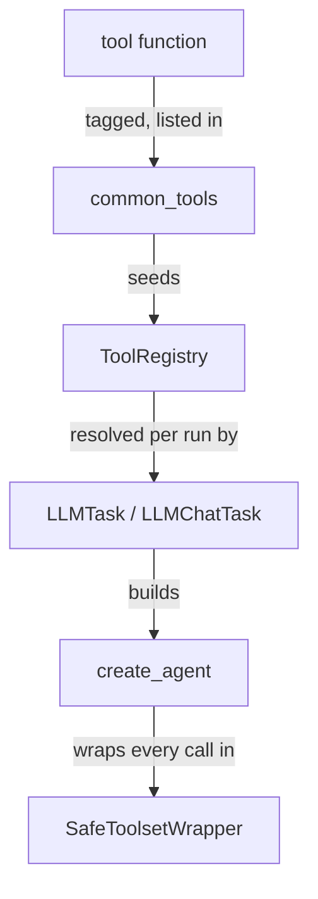
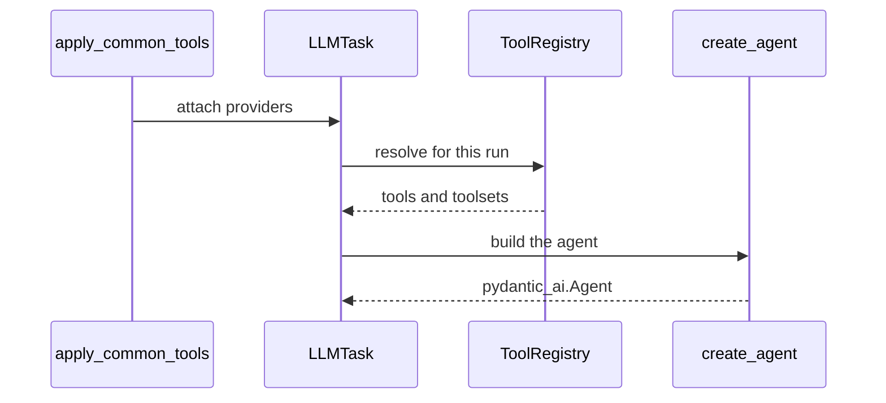

🔖 [Documentation Home](../../../README.md) > [Architecture](../README.md) > Tools

# Tools

> **Tier 2 · Extension surface** · Code: `src/zrb/llm/tool/` · Read first: [The LLM Turn](../1-spine/llm-turn.md)

A tool is how the model acts on the world: reading a file, running a command, asking a sub-agent for help. This page covers how a Python function becomes something the model can call, and why every one of those calls ends up passing through the same checkpoint.

## Table of Contents

- [Design](#design)
  - [The problem](#the-problem)
  - [Principles](#principles)
  - [Invariants](#invariants)
- [Realization](#realization)
  - [The parts](#the-parts)
  - [How it runs](#how-it-runs)
  - [Variations](#variations)
  - [Change it here](#change-it-here)
- [See Also](#see-also)

## Design

### The problem

The tool set has to work for very different readers at the same time:

- **The model** sees each tool's name and schema on every request. Every extra tool costs tokens, and a confusing name leads to a wrong call.
- **The safety layer** has to know what a tool *does* — read, edit, execute, go online — without guessing from its name.
- **Users and plugins** add their own tools, MCP servers and sub-agents, and zrb cannot audit any of them in advance.
- **Startup time** matters. `import zrb` must not pull in the agent framework just because tools exist.

### Principles

1. **A tool is a plain function.** No base class and no decorator protocol. The name the model sees is the function's `__name__`, reassigned to PascalCase (`Shell`, `Read`, `Edit`). A tool is therefore written, tested and called like any other function. → [ADR-0056](../../adr/adr-0056.md)

2. **A tool says what it does; it is never guessed.** Every built-in tool carries a capability tag (`READ`, `EDIT`, `EXECUTE`, `NETWORK`, ...). A tool without a tag is `UNKNOWN`, and `UNKNOWN` is treated as the most dangerous case. An unaudited MCP tool still works; it just doesn't get trusted. → [ADR-0060](../../adr/adr-0060.md)

3. **Permission is checked where the tool runs, not where it is approved.** Approval decides whether a call may go ahead. The permission and sandbox checks run again right before execution, in one wrapper that every call passes through. A new route to a tool cannot accidentally skip the checks. → [ADR-0062](../../adr/adr-0062.md), [ADR-0065](../../adr/adr-0065.md)

4. **Fewer tools over longer descriptions.** The cost of the tool list is managed by how many tools are visible, not by trimming prose. Rarely used tools stay discoverable by name, and their schema loads only when asked for. → [ADR-0058](../../adr/adr-0058.md)

5. **Decide late.** Tools are collected when a task is built but resolved when a run starts, so per-run facts are read fresh each time: interactivity, the journal toggle, the `LLM_TOOLS` allowlist, the active permission policy. → [ADR-0064](../../adr/adr-0064.md), [ADR-0033](../../adr/adr-0033.md)

### Invariants

Each one fails silently if broken: the code keeps running and does the wrong thing.

| Must stay true | If it breaks | Pinned by |
| --- | --- | --- |
| Every built-in tool is registered with a known capability | It becomes `UNKNOWN`: denied in plan mode and over-restricted everywhere else, with no error | `test/llm/test_common_tools.py::test_every_registered_tool_carries_a_known_capability` |
| A denied call never reaches the tool, whatever route it came by | A tool runs against the user's policy | `test/llm/permission/test_state_and_gate.py::test_gate_blocks_denied_tool` |
| The sandbox checks a tool even if it has no tag | An MCP tool writes outside the writable roots | `test/llm/sandbox/test_gate.py::test_gate_write_checks_untagged_tools` |
| Collecting tools does not resolve them | Per-run gates are frozen when the task is built | `test/llm/test_common_tools.py::test_apply_stores_providers_without_resolving_anything` |
| Tool order is preserved | The model sees a different tool list from one run to the next, and the prompt cache stops hitting | `test/llm/tool/test_registry.py::test_append_prepend_preserve_order` |
| A sub-agent cannot pick up a delegate tool | Sub-agents delegate recursively | `test/llm/agent/subagent/test_tool_resolver.py::TestResolveToolsByName::test_excludes_delegate_tools_from_registry` |

## Realization

### The parts



| Part | Where | What it is responsible for |
| --- | --- | --- |
| Tool functions | `src/zrb/llm/tool/` | One module per family: file, shell, web, delegate, plan, journal, skill, worktree, MCP, RAG |
| `common_tools` | `src/zrb/llm/common_tools.py` | The single list of built-in tools, each `tag()`-ed with a capability, plus the per-run factories |
| `ToolRegistry` | `src/zrb/llm/tool/registry.py` | Ordered static tools, per-run tool factories and toolset factories; the default list is loaded on first use |
| `apply_common_tools` | `src/zrb/llm/common_tools.py` | Gives `LLMChatTask`, `LLMTask` and `SubAgentManager` the same tool providers |
| `Capability`, `tag`, `tool_capability` | `src/zrb/llm/permission/capability.py` | Writing and reading the capability tag |
| `resolve_tools_by_name` | `src/zrb/llm/agent/subagent/tool_resolver.py` | Turning the tool names a sub-agent asks for into tool objects |
| `create_agent` | `src/zrb/llm/agent/common.py` | The only place a `pydantic_ai.Agent` is built |
| `SafeToolsetWrapper` | `src/zrb/llm/agent/common.py` | The checkpoint every call passes: hooks, permission and sandbox checks, then the call |

### How it runs

**Defining a tool.** Write a typed function, then set its model-facing name:

```python
def run_shell_command(command: str) -> str: ...
run_shell_command.__name__ = "Shell"
```

Then add it to the list in `src/zrb/llm/common_tools.py` with `tag(run_shell_command, Capability.EXECUTE)`. That's the whole contract.

**Getting tools to a run.** The registry holds providers, not finished tools. They are resolved when the run starts, so the answer can change from one run to the next:



**Calling a tool.** Every call the model makes goes through `SafeToolsetWrapper.call_tool`, in this order:

1. the `PreToolUse` hook, which may rewrite the arguments or deny the call;
2. `permission_gate`, then `sandbox_gate`, both checking the arguments that will actually run;
3. the function itself;
4. the `PostToolUse` hook, then the result-size cap.

Approval, covered in [Tool Call & Approval](../3-peripheral-flow/tool-call-approval.md), happens before all of this, and it only lets the call reach the wrapper.

### Variations

| Case | Where it is decided | What is different |
| --- | --- | --- |
| A tool that depends on config or context | A factory in `src/zrb/llm/common_tools.py` | Created fresh for each run, so its gate is read again every time |
| A rarely used tool | `Tool(..., defer_loading=True)` in `src/zrb/llm/common_tools.py` | The model sees its name; the schema loads only when requested |
| MCP or another external toolset | `src/zrb/llm/tool/mcp.py` | Arrives untagged, so it counts as `UNKNOWN` — see [MCP & LSP Servers](../3-peripheral-flow/mcp-and-lsp.md) |
| A sub-agent's `tools:` list | `resolve_tools_by_name` | Names are looked up, not invented; a name that matches nothing is silently dropped, and delegate tools are always excluded |
| A Claude-style `Bash` name | `canonical_tool_name` | Maps to the one `Shell` tool; zrb never registers a second shell tool ([ADR-0066](../../adr/adr-0066.md)) |
| Delegation | `src/zrb/llm/tool/delegate.py` | Loads eagerly, because its schema lists the available agents — see [Sub-agents](sub-agents.md) |

### Change it here

| To… | Open | Then run |
| --- | --- | --- |
| Add a built-in tool | `src/zrb/llm/common_tools.py` | `test/llm/test_common_tools.py` |
| Add a tool gated by config | `src/zrb/llm/common_tools.py` (the factories) | `test/llm/test_common_tools.py` |
| Rename a tool the model sees | the tool's `__name__` line in `src/zrb/llm/tool/` | `test/llm/tool/` |
| Change how capabilities are read | `src/zrb/llm/permission/capability.py` | `test/llm/permission/test_capability.py` |
| Change registry order or mutation | `src/zrb/llm/tool/registry.py` | `test/llm/tool/test_registry.py` |
| Change sub-agent tool lookup or aliases | `src/zrb/llm/agent/subagent/tool_resolver.py` | `test/llm/agent/subagent/test_tool_resolver.py` |
| Change the execution checkpoint | `src/zrb/llm/agent/common.py` | `test/llm/agent/test_common_tool_wrapping.py` |

## See Also

- [The LLM Turn](../1-spine/llm-turn.md) — where resolved tools enter the run
- [Tool Call & Approval](../3-peripheral-flow/tool-call-approval.md) — the decision before a call reaches the checkpoint
- [Sandbox Enforcement](../3-peripheral-flow/sandbox-enforcement.md) — what `sandbox_gate` checks
- [Sub-agents](sub-agents.md) — delegation and the tools a child gets
- [Permission Policy](../../llm/permission-policy.md) — the user-facing guide

🔖 [Documentation Home](../../../README.md) > [Architecture](../README.md) > Tools
