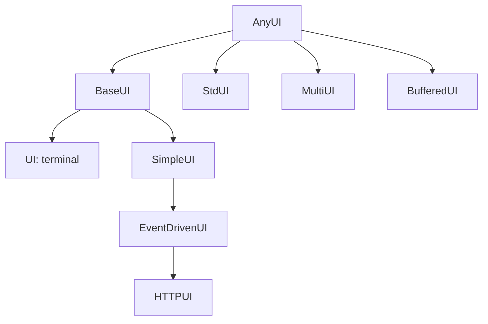
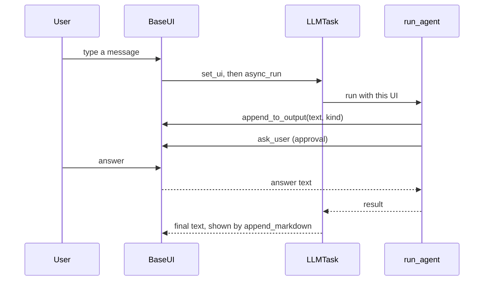

🔖 [Documentation Home](../../../README.md) > [Architecture](../README.md) > UI

# UI

> **Tier 2 · Extension surface** · Code: `src/zrb/llm/ui/` · Read first: [The LLM Turn](../1-spine/llm-turn.md)

The UI is whatever shows the agent's output and brings back the user's answers: the full-screen terminal, plain stdin/stdout, the web chat, a chat bot, or several of them at once. This page covers how one agent run talks to any of them through the same small contract. The idea to take away: the agent never knows which screen it is on.

## Table of Contents

- [Design](#design)
  - [The problem](#the-problem)
  - [Principles](#principles)
  - [Invariants](#invariants)
- [Realization](#realization)
  - [The parts](#the-parts)
  - [How it runs](#how-it-runs)
  - [Variations](#variations)
  - [Change it here](#change-it-here)
- [See Also](#see-also)

## Design

### The problem

- **The same run must work on very different surfaces.** A terminal repaints a full screen, a browser gets events over HTTP, a bot answers whenever the user replies. The agent loop cannot carry code for each.
- **Asking is harder than showing.** An approval or a question suspends the turn until someone answers, and the answer may come from any surface, or from none if a connection dies.
- **Sub-agents share one human.** Several children may run at once, each streaming output and each needing approval, on a screen that belongs to the parent.
- **Users write their own backends.** zrb cannot know them in advance, so the contract has to be small enough to implement and stable enough not to break them.

### Principles

1. **The run talks to one contract, never to a screen.** The agent loop, tools and approval channel only call the abstract UI methods: append output, ask the user, run a command. Terminal, web and bot are interchangeable implementations, so a task runs the same everywhere. → [ADR-0002](../../adr/adr-0002.md), [ADR-0028](../../adr/adr-0028.md)

2. **The UI is ambient for the length of a run.** The active UI is bound in a context variable when a run starts and reset when it ends. A nested run, such as a tool or a sub-agent, inherits it without every signature passing it along, unless the caller hands it a different one. → [ADR-0004](../../adr/adr-0004.md)

3. **A question returns a string, and richer input is optional.** Asking the user always resolves to text. Arrow-key choice is an extra method with a text fallback built into the shared base, so a backend that only knows text still answers every question and approval. → [ADR-0074](../../adr/adr-0074.md)

4. **Sub-agents buffer their output; only the parent talks to the human.** Each child writes into its own buffer and forwards its questions to the parent UI. The screen stays readable, and parallel children queue their approvals instead of fighting over the input line. → [ADR-0070](../../adr/adr-0070.md)

5. **Each surface renders in its own way, and the UI knows no features.** The web receives raw markdown and renders it in the browser; the terminal renders it itself. Optional features such as dictation and speech reach the UI only through generic hooks (status badges, triggers, turn cancellation), so no UI class imports them. → [ADR-0081](../../adr/adr-0081.md), [ADR-0102](../../adr/adr-0102.md)

### Invariants

Each one fails silently if broken: the chat keeps running and output or answers go to the wrong place.

| Must stay true | If it breaks | Pinned by |
| --- | --- | --- |
| One failing surface does not stop output to the others | A dropped web connection kills the terminal session too | `test/llm/ui/test_multi_ui_fanout.py::test_append_to_output_handles_exception` |
| A surface that errors cannot answer a question | A network error approves or denies a tool call with no human input | `test/llm/ui/test_multi_ui_confirmation.py::test_failing_child_does_not_win_the_race` |
| Answering one question leaves other open questions waiting | Approving one sub-agent silently cancels another's prompt | `test/llm/ui/test_multi_ui_confirmation.py::test_answering_one_race_leaves_a_concurrent_race_waiting` |
| Parallel sub-agents do not wait for each other's approval | Every sibling's approval queues behind the first unanswered one | `test/llm/ui/test_buffered_ui.py::test_buffered_ui_shared_lock_does_not_block_sibling_enqueue` |
| With several surfaces, session name and model come from the primary one | The session identity or approval mode changes depending on list order | `test/llm/ui/test_multi_ui.py::test_session_config_comes_from_the_primary_child_not_the_first` |
| The web gets markdown source, not terminal-rendered text | The browser shows ANSI codes and Unicode-art instead of rendered output | `test/runner/chat/test_http_ui.py::test_append_markdown_broadcasts_raw_text_as_markdown_kind` |
| A nested run with no UI argument uses the parent's UI | A sub-agent's output and questions go to stderr instead of the user's screen | **unpinned** |

## Realization

### The parts

| Part | Where | What it is responsible for |
| --- | --- | --- |
| `AnyUI` | `src/zrb/llm/ui/any_ui.py` | The contract: `ask_user`, `ask_user_choice`, `append_to_output`, `stream_to_parent`, `run_interactive_command`, `run_async`, plus the run-state properties (`is_thinking`, `yolo`, `model`, ...) and cancellation |
| `BaseUI` | `src/zrb/llm/ui/base/ui.py` | Shared chat logic: the message queue, running a turn (`stream_ai_response`), slash commands, history replay, snapshots, and the text fallback for `ask_user_choice` |
| `UI` | `src/zrb/llm/ui/default/ui.py` | The full-screen prompt_toolkit terminal, built from parts: `UIOutput` (rendering), `UIConfirmation` (the approval queue), selection and keybindings |
| `SimpleUI`, `EventDrivenUI` | `src/zrb/llm/ui/simple_ui_base.py`, `src/zrb/llm/ui/event_driven_ui.py` | The small extension levels: write `print` and `get_input`, or `print` and `start_event_loop` |
| `StdUI` | `src/zrb/llm/ui/std_ui.py` | Plain terminal output and input; the fallback when nothing else is configured |
| `MultiUI` | `src/zrb/llm/ui/multi_ui.py` | Several surfaces as one: broadcast output, race input, one shared turn queue, state from the primary child |
| `BufferedUI` | `src/zrb/llm/ui/buffered_ui.py` | A sub-agent's view: its own output buffer, prompts forwarded to the parent |
| `HTTPUI` | `src/zrb/runner/chat/http_ui.py` | The web chat: output as session broadcasts, input from the session queue; built by `create_http_ui_factory` |
| `create_ui_factory` | `src/zrb/llm/ui/ui_factory.py` | Turning a UI class into a factory a chat task can register |
| `create_combined_ui` | `src/zrb/llm/ui/multi_ui.py` | Normalizing a UI or a list: one stays one, many become a `MultiUI` |

### How it runs

**Choosing the UI.** An interactive `zrb llm chat` builds its UI in `ChatRunning.run_interactive_session` (`src/zrb/llm/task/chat/running.py`), after history and the first message are known. It collects the task's UIs and calls each registered factory. Then:

- nothing configured → the built-in terminal `UI`;
- configured UIs with the default UI turned off → that one UI, or a `MultiUI` of several;
- configured UIs plus the default → a `MultiUI` with the terminal first, as the primary child.

A non-interactive run (the web chat posts each message this way) attaches factory UIs to the task instead, and the run falls back to `StdUI` when there is none.

**Running a turn.** The user's message goes through the UI's queue, so turns run one at a time. A message submitted while a turn runs waits there instead of interrupting it; the terminal lists what is waiting in a panel above the input, recalls one with Up/Down for editing (Enter replaces it in place, Ctrl+X drops it from the queue and from every child UI's transcript), and merges a multi-line paste into a single message.

`run_agent` resolves the UI in `resolve_context_dependencies` (`src/zrb/llm/agent/run/setup.py`): the explicit argument, else the ambient `current_ui`, else a new `StdUI`, normalized by `create_combined_ui`. It binds the result to `current_ui` on an `ExitStack` and resets it when the run ends.

**Asking the user.** An approval goes through `TerminalApprovalChannel`, which writes the prompt with `append_to_output` and waits on `ask_user`. In a `MultiUI` it asks the primary child. The turn is suspended at that `await`; the UI's own event loop keeps running and delivers the answer. In the terminal, `UIConfirmation` queues concurrent prompts and shows one at a time. See [Tool Call & Approval](../3-peripheral-flow/tool-call-approval.md) for what happens to the answer.

### Variations

| Case | Where it is decided | What is different |
| --- | --- | --- |
| Several surfaces | `MultiUI` | Output goes to all; every child is asked and the first real answer wins, the rest are cancelled; turns run through one shared queue |
| The web chat | `create_http_ui_factory` | Output becomes server-sent events; the final answer is sent as raw markdown for the browser to render |
| A sub-agent | `BufferedUI`, created in `src/zrb/llm/tool/delegate.py` | Output stays in the child's buffer until flushed; the lock covers only the write to the parent, not the wait for the answer |
| A choice question | `ask_user_choice` | The terminals show an arrow-key picker; every other UI gets numbered text from `BaseUI` |
| A shell command from the UI | `UI.run_interactive_command` | Hands the real terminal to the subprocess, then takes the screen back |
| A custom backend | `create_ui_factory` | Pick a level (`SimpleUI`, `EventDrivenUI` or `BaseUI`) and write only that level's methods — see [Custom UI](../../llm/llm-custom-ui.md) |

### Change it here

| To… | Open | Then run |
| --- | --- | --- |
| Change the UI contract | `src/zrb/llm/ui/any_ui.py` | `test/llm/ui/test_extension_levels.py` |
| Change the queue, turn or command handling | `src/zrb/llm/ui/base/` | `test/llm/ui/base/` |
| Change terminal rendering or keys | `src/zrb/llm/ui/default/` | `test/llm/ui/default/` |
| Change which UI a chat picks | `src/zrb/llm/task/chat/running.py` | `test/llm/task/chat/test_running_sessions.py` |
| Change multi-surface fan-out or input races | `src/zrb/llm/ui/multi_ui.py` | `test/llm/ui/test_multi_ui_confirmation.py`, `test/llm/ui/test_multi_ui_fanout.py` |
| Change sub-agent buffering | `src/zrb/llm/ui/buffered_ui.py` | `test/llm/ui/test_buffered_ui.py` |
| Change the web output or input | `src/zrb/runner/chat/http_ui.py` | `test/runner/chat/test_http_ui.py` |

## See Also

- [The LLM Turn](../1-spine/llm-turn.md) — the run that calls the UI
- [Tool Call & Approval](../3-peripheral-flow/tool-call-approval.md) — what an approval decides
- [Sub-agents](sub-agents.md) — where `BufferedUI` is created
- [Web Requests](../3-peripheral-flow/web-requests.md) — the web runner behind `HTTPUI`
- [Dictation & Barge-in](../3-peripheral-flow/dictation-barge-in.md) — an optional feature that reaches the UI only through generic hooks
- [Custom UI](../../llm/llm-custom-ui.md) — how to build and register a backend

🔖 [Documentation Home](../../../README.md) > [Architecture](../README.md) > UI
