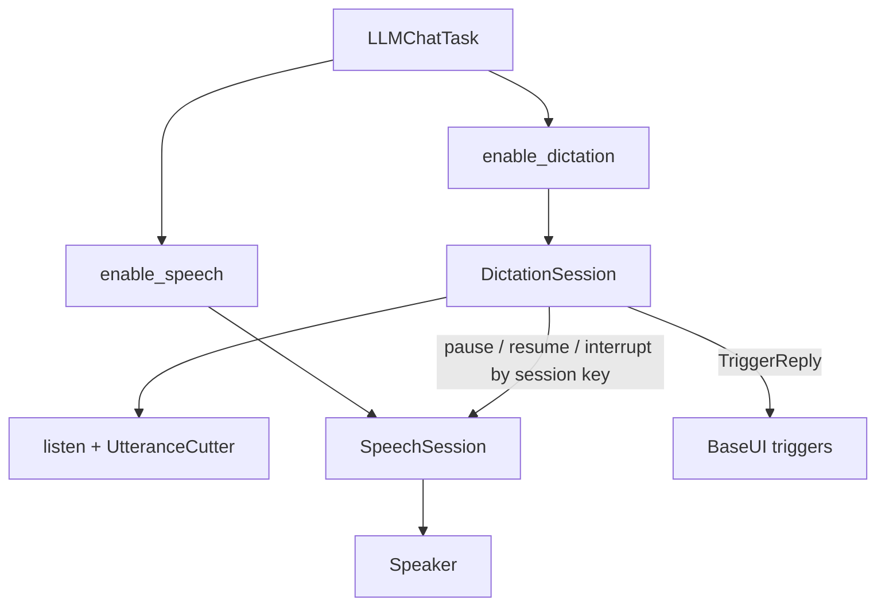
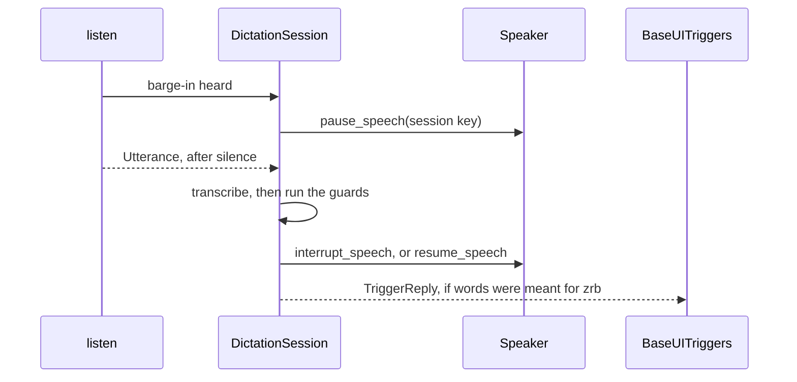
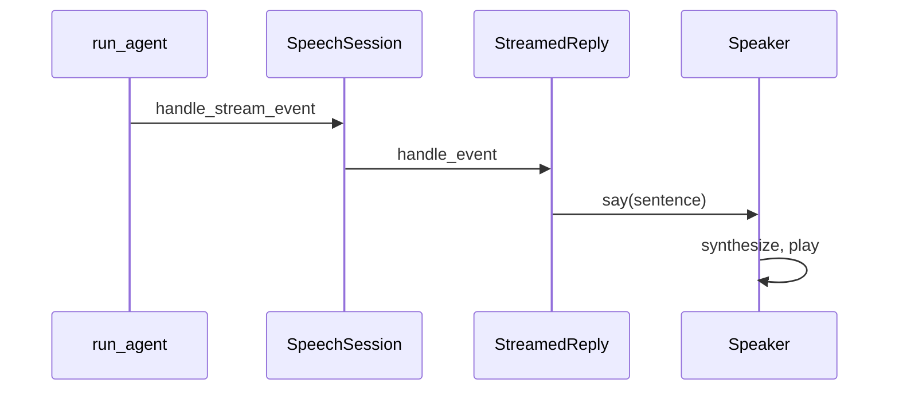

🔖 [Documentation Home](../../../README.md) > [Architecture](../README.md) > Dictation & Barge-in

# Dictation & Barge-in

> **Tier 3 · Peripheral flow** · Code: `src/zrb/llm/dictation/` · Read first: [UI](../2-extension-surface/ui.md)

Hands-free dictation lets the user talk to zrb, and speech lets zrb talk back. Barge-in is where the two meet: the user starts talking while zrb is still speaking. This page covers what happens between the microphone hearing that and zrb either stopping or carrying on. The idea to take away: zrb holds its voice first and decides on the words, because a cough, an echo of its own voice and a real "stop" all sound alike until they are transcribed. The hold is taken on loudness, before anything is known, and the words decide whether it stays held: being talked over is worse than a hold that is given back.

## Table of Contents

- [Design](#design)
  - [The problem](#the-problem)
  - [Principles](#principles)
  - [Invariants](#invariants)
- [Realization](#realization)
  - [The parts](#the-parts)
  - [How it runs](#how-it-runs)
  - [Variations](#variations)
  - [Change it here](#change-it-here)
- [See Also](#see-also)

## Design

### The problem

- **zrb hears itself.** On a laptop's own speakers the microphone picks up zrb's voice. Transcribed, it comes back as words, and zrb would answer its own reply.
- **Waiting for the transcript is too slow.** Transcription takes seconds. If zrb keeps talking until it knows what the user said, it talks over them.
- **Stopping too eagerly is just as bad.** A cough, a "yeah", or a transcriber's guess at noise must not cut a reply short or start a turn.
- **The same words mean different things.** "No" while a tool waits for approval denies the tool; "no" during a reply may mean stop; "no" to nobody is a new message.
- **Both features are optional.** Either one may be missing, and neither may live inside the UI.

### Principles

1. **Optional features stay out of the UI.** Dictation and speech each install with one `enable_*` call that registers commands, triggers, hooks and observers on the chat task. Their config is read when a chat session starts, and the UI has no code for either. → [ADR-0102](../../adr/adr-0102.md)

2. **One feature reaches another only by chat session.** Dictation never holds a speaker. It calls speech's pause, resume and interrupt functions with the chat session's key, which act on whatever speech that session has, including none. → [ADR-0102](../../adr/adr-0102.md)

3. **Hold first, decide on the words.** As soon as the microphone hears loud speech over zrb, zrb's voice is paused, before anything about it is known. The words then decide: those meant for zrb stop it, anything else resumes it — a hold taken for zrb's own voice included. Every way the listener can end releases a pause it made. The hold is what `barge_in_hold` turns off, for a room that keeps crossing the bar: with it off nothing is held on loudness, and the words alone decide, as early as the live transcript provides them. → [ADR-0076](../../adr/adr-0076.md), [ADR-0103](../../adr/adr-0103.md), [ADR-0105](../../adr/adr-0105.md)

4. **Guard against zrb's own voice instead of cancelling it.** zrb does not subtract its voice from the microphone. Cheap guards do the work: a higher loudness bar while zrb speaks, dropping known transcriber guesses, and a minimum word count to interrupt. → [ADR-0105](../../adr/adr-0105.md)

5. **Speech listens to the stream beside the UI.** Speech reads a reply as it streams by observing the run's events next to the UI, not through it. An observer that fails is logged and skipped, so speech can never break a run. → [ADR-0104](../../adr/adr-0104.md)

### Invariants

Each one fails quietly: the chat keeps working, but zrb talks over the user, stays stuck paused, or answers itself.

| Must stay true | If it breaks | Pinned by |
| --- | --- | --- |
| Words over zrb pause its voice, then stop it | zrb keeps talking over the user, or never stops | `test/llm/dictation/test_feature_barge_in_pause.py::test_words_over_zrb_pause_it_then_stop_it` |
| A stop the word lists cannot read still stops zrb | "please fucking stop" reaches the model as a message, and zrb answers the very words that asked it to be quiet | `test/llm/dictation/test_feature_barge_in_pause.py::test_words_a_word_list_cannot_read_as_a_stop_stop_zrb_anyway` |
| Talk over zrb holds its voice before it is transcribed, with `barge_in_hold` on | zrb talks through the whole interruption, and a stop lands seconds after it was said | `test/llm/dictation/test_feature_barge_in_pause.py::test_with_wake_words_talk_not_meant_for_zrb_is_held_and_given_back` |
| With `barge_in_hold` off, speech over zrb is neither held nor given back, and its words still stop it | a room loud enough to keep crossing the bar makes zrb stutter, or turning the hold off costs the stop itself | `test/llm/dictation/test_feature_barge_in_pause.py::test_with_the_hold_off_noise_over_zrb_never_touches_its_voice` |
| With `barge_in_hold` off, a stop word seen in the live transcript stops zrb as soon as it is heard | "stop" said over zrb is answered only once the utterance ends, which a batch backend makes seconds | `test/llm/dictation/test_feature_barge_in_pause.py::test_with_the_hold_off_a_stop_word_over_zrb_stops_it_as_soon_as_it_is_heard` |
| A barge-in is reported once, before the utterance ends | zrb only pauses after the user has finished speaking | `test/llm/dictation/test_listen_barge_in.py::test_listen_reports_a_barge_in_once_before_the_utterance_ends` |
| Closing the listener mid-pause resumes speech | zrb's voice stays held forever after hands-free stops | `test/llm/dictation/test_feature_barge_in_pause.py::test_closing_mid_pause_resumes` |
| zrb's own voice is kept out by the loudness bar and the minimum word count, not by a transcript match | zrb answers its own reply as a user turn | **unpinned** — the self-echo guard was retired in 3.14.0 (ADR-0105); nothing pins what it leaves behind |
| A single word over zrb does not interrupt it | A stray "yeah" or echoed word cuts the reply short | `test/llm/dictation/test_feature_barge_in.py::test_a_single_word_over_zrb_is_not_taken_for_the_user` |
| A room heard loudly enough does not open a turn | The room's own conversation becomes turns | `test/llm/dictation/test_listen.py::test_a_room_loud_enough_to_lift_the_bar_opens_no_turn` |
| "No" to a pending approval denies the tool, not the turn | Answering an approval by voice cancels the whole turn | `test/llm/dictation/test_feature_barge_in.py::test_no_to_a_pending_approval_denies_it_rather_than_the_turn` |
| Interrupting speech affects only this chat session, and the cut reply is not read again | Talking in one web session silences another, or the reply restarts at turn end | `test/llm/speech/test_feature_stream.py::test_interrupt_speech_silences_this_chat_session_only` |

## Realization

### The parts

| Part | Where | What it is responsible for |
| --- | --- | --- |
| `enable_dictation`, `DictationSession` | `src/zrb/llm/dictation/feature.py` | Registering `/voice` and the hands-free trigger; per session, turning each utterance into a command or nothing, and deciding pause, stop or resume |
| `listen`, `UtteranceCutter` | `src/zrb/llm/dictation/listen.py` | Keeping the microphone open, cutting audio into `Utterance` values by loudness and silence, and spotting a barge-in early |
| `count_words`, `is_transcriber_guess` | `src/zrb/llm/dictation/words.py` | The word-level guards |
| `DictationConfig` | `src/zrb/llm/dictation/config.py` | One field per `CFG.LLM_DICTATION_*` setting; `None` means "use the setting" |
| `enable_speech`, `SpeechSession` | `src/zrb/llm/speech/feature.py` | Registering speech hooks and the stream observer; per session, feeding the speaker |
| `pause_speech`, `resume_speech`, `interrupt_speech` | `src/zrb/llm/speech/feature.py` | Speech control by chat session key, the only way dictation touches speech |
| `Speaker` | `src/zrb/llm/speech/player.py` | Queuing, synthesizing and playing speech; pause, resume and interrupt |
| `StreamedReply` | `src/zrb/llm/speech/streamed_reply.py` | Turning stream events into sentences; muting a reply that was talked over |
| `TriggerReply` | `src/zrb/llm/ui/trigger.py` | A spoken command, with its approval reading and the time it was said |
| `BaseUITriggers` | `src/zrb/llm/ui/base/triggers.py` | Delivering a trigger's reply as an answer to a pending prompt, or as a new message |
| `replace_feature_sessions`, `close_feature_sessions` | `src/zrb/llm/util/feature_config.py` | One feature value per chat session; replaced cleanly on re-enable, closed when the session ends |

### How it runs

**Hearing a barge-in.** With hands-free and barge-in on, `listen` keeps sampling while zrb speaks. Blocks heard over zrb's voice must clear a higher bar, measured from how loud zrb sounds in the room. Once enough loud blocks pass it, `listen` calls back into the session before the utterance is over:

What holds zrb's voice is the speech itself, before anything is known about it: `pause_speech` runs first, and `interrupt_speech` follows only when the words were meant for zrb. Anything else — a cough, the room, zrb's own voice — reaches `resume_speech`, which is the price of not waiting to be sure. With `barge_in_hold` off the pause and the resume are gone: the words are what stops zrb, from the live partial where the backend streams one and from the finished transcript otherwise.

The guards run in `DictationSession` in this order. Empty text, or a known transcriber guess, is not the user. A command with fewer than `barge_in_min_words` words (default 2) is too short to interrupt, unless it is a stop word or an answer to a waiting prompt; an utterance that interrupts nothing is held to `min_words` (default 1) instead, so a public place can be made to need more than a single stray word. Anything rejected releases the hold and shows why on the status badge.

Independent of any utterance, `UtteranceCutter` measures the room: speech heard while zrb is silent must be `noise_margin` (default 2) times the quietest the room was heard at over the last few seconds, so the room's own conversation does not open a turn of its own — a room that never falls quiet is measured at its own level, which is what lifts the bar over it. With the `vosk` backend, a hands-free transcript whose words were heard too faintly on average (`vosk_confidence`) is dropped as well; push-to-talk keeps every word. Neither tells a stranger's request from the user's, which only a wake word does.

**Acting on the words.** A stop word said alone cancels the running turn through `AnyUI.cancel_current_turn` and is sent nowhere. Anything else becomes a `TriggerReply`. `BaseUITriggers` sends it as an answer if a prompt is waiting and the utterance began after the prompt appeared; otherwise it becomes a new message, which steers the running turn by default.

**Reading the reply.** Speech sees the same events as the UI:

When a barge-in stops zrb, `SpeechSession.interrupt` drops the queue and mutes the rest of the reply, so it is not read again at turn end.

### Variations

| Case | Where it is decided | What is different |
| --- | --- | --- |
| Barge-in off (the default) | `DictationConfig.barge_in_enabled` | The microphone is deaf while zrb speaks, so there is nothing to pause |
| The hold off | `DictationConfig.barge_in_hold` | Nothing is held on loudness; a stop word or a wake word seen in the live partial stops zrb at once, and anything else stops it once the utterance is transcribed |
| `barge_in_action=cancel` (retired) | — | Removed in 3.14.0: anything said over zrb steers the turn, or cancels it when it reads as a stop |
| Wake words set | `DictationConfig.wake_words` | Only words starting with a wake word count; one heard in the live partial transcript stops zrb early |
| The interrupt judge | `DictationConfig.interrupt_judge_enabled` | What an interrupting utterance asks of zrb is put to the small model when the word lists cannot read it; a stop word said alone never reaches the model, and the word lists decide when the judge is off, slow or unsure |
| Speech not enabled | `interrupt_speech` and siblings | Find no speech session for the key and do nothing; dictation works the same |
| Push-to-talk (`/voice`) | `DictationSession.toggle_recording` | Every word is kept; the transcript goes into the input box for the user to edit, not sent |
| A sentence played by an external program | `Speaker.pause` | It cannot be held, so it is stopped and speech carries on with the next sentence |
| The web runner | `close_feature_sessions` in `src/zrb/runner/chat/chat_session_manager.py` | Each connection is its own chat session, with its own microphone and speaker state |

### Change it here

| To… | Open | Then run |
| --- | --- | --- |
| Change utterance cutting, the bar over zrb's voice, or the bar under ordinary speech | `src/zrb/llm/dictation/listen.py` | `test/llm/dictation/test_listen_barge_in.py`, `test/llm/dictation/test_listen.py` |
| Change the transcript guards or command routing | `src/zrb/llm/dictation/feature.py`, `src/zrb/llm/dictation/words.py` | `test/llm/dictation/test_feature_barge_in.py` |
| Change pause, stop or resume | `src/zrb/llm/dictation/feature.py` | `test/llm/dictation/test_feature_barge_in_pause.py` |
| Change playback or pausing | `src/zrb/llm/speech/player.py` | `test/llm/speech/test_player_in_process.py` |
| Change how a streamed reply is spoken | `src/zrb/llm/speech/streamed_reply.py`, `src/zrb/llm/speech/feature.py` | `test/llm/speech/test_feature_stream.py` |
| Change how a spoken reply reaches a prompt | `src/zrb/llm/ui/base/triggers.py` | `test/llm/ui/base/` |
| Change a dictation setting | `src/zrb/config/mixins/llm_dictation.py`, `src/zrb/llm/dictation/config.py` | `test/architecture/test_voice_config_documented.py` |

## See Also

- [UI](../2-extension-surface/ui.md) — the generic hooks these features use
- [Config](../2-extension-surface/config.md) — how feature config is read at session start
- [The LLM Turn](../1-spine/llm-turn.md) — the turn a barge-in steers or cancels
- [Voice and camera](../../llm/voice-camera.md) — setting the features up
- [Voice and photo troubleshooting](../../llm/voice-photo-troubleshooting.md) — microphone and speaker problems

🔖 [Documentation Home](../../../README.md) > [Architecture](../README.md) > Dictation & Barge-in
