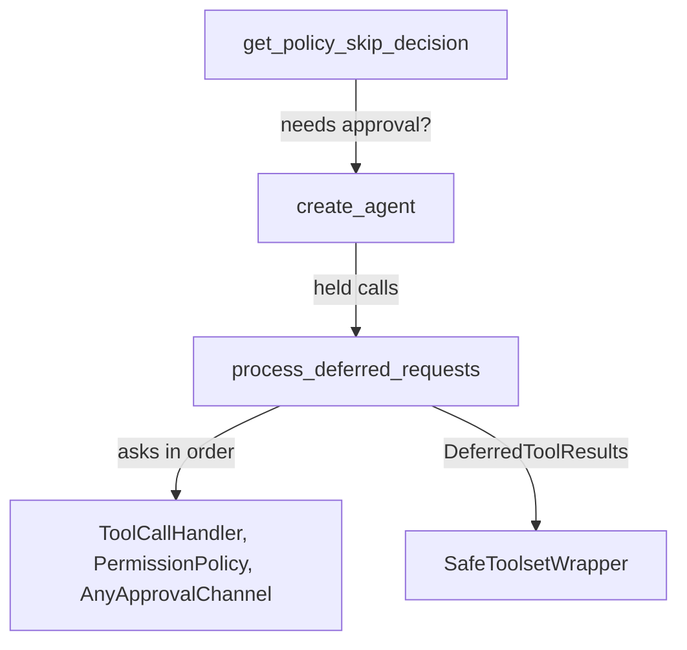
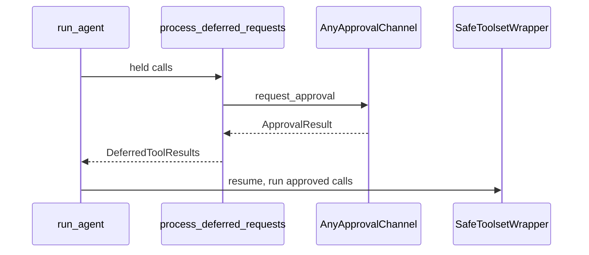

🔖 [Documentation Home](../../../README.md) > [Architecture](../README.md) > Tool Call & Approval

# Tool Call & Approval

> **Tier 3 · Peripheral flow** · Code: `src/zrb/llm/agent/run/deferred_calls.py` · Read first: [Tools](../2-extension-surface/tools.md)

Before the model's tool call runs, zrb decides whether it may run: allow it quietly, ask a person, or refuse. This page covers how that decision is made and who gets asked. The idea to take away: approval only lets a call *reach* the execution checkpoint. It is never the last check.

## Table of Contents

- [Design](#design)
  - [The problem](#the-problem)
  - [Principles](#principles)
  - [Invariants](#invariants)
- [Realization](#realization)
  - [The parts](#the-parts)
  - [How it runs](#how-it-runs)
  - [Variations](#variations)
  - [Change it here](#change-it-here)
- [See Also](#see-also)

## Design

### The problem

- **Many voices can say yes or no.** An admin's permission rules, a programmer's tool policies, the session's yolo toggle, hooks, and humans on several channels. They can disagree.
- **The same call arrives by many routes.** The main agent, a sub-agent, a background agent and the web runner must all get the same answer for the same call.
- **Sometimes nobody is there.** A non-interactive run that waits for a "y" on stdin hangs until it times out.
- **A person may edit the call.** The model wrote the original arguments, and it has to learn what actually ran.
- **Attention is expensive.** Asking about a call that is going to be refused anyway wastes the user's time.

### Principles

1. **Permission is an ordered list of rules, and the first match wins.** A rule names a tool, a capability or `*`, can narrow itself with a glob on an argument, and says `allow`, `ask` or `deny`. One ordered list is easy to read top to bottom and easy to test. → [ADR-0061](../../adr/adr-0061.md)
2. **One cascade decides every call that needs approval, on every route.** Each level either decides or passes the call to the next, in a fixed order. The main agent, sub-agents and the web runner all call the same function, so a rule cannot hold on one route and leak on another. → [ADR-0062](../../adr/adr-0062.md)
3. **A rule that says `ask` is a hard ask.** Nothing lower in the cascade (a tool policy's auto-approve, yolo) may approve it on the user's behalf. If no one can answer, the call is refused rather than left waiting or quietly run. → [ADR-0062](../../adr/adr-0062.md)
4. **A deny never prompts, and it is enforced again at the tool.** A call the rules deny skips the approval step entirely and is blocked at the execution checkpoint. So a deny holds whatever an earlier level decided. → [ADR-0061](../../adr/adr-0061.md)
5. **An edited call tells the model what ran.** When a person changes the arguments before approving, the result the model gets back carries a note listing the changed keys. Otherwise the model would read its own request next to a result made from different arguments. → [ADR-0085](../../adr/adr-0085.md)

### Invariants

| Must stay true | If it breaks | Pinned by |
| --- | --- | --- |
| Rules are checked in order; the first match decides | Reordering rules changes decisions with no error | `test/llm/permission/test_policy.py::test_first_match_wins` |
| A denied call never runs, even if an earlier level approved it | A tool runs against the user's policy | `test/llm/permission/test_state_and_gate.py::test_gate_blocks_denied_tool` |
| A call denied during approval reaches history as a denial, and does not run | The model believes a refused call happened, or it runs anyway | `test/llm/agent/run/test_runner_deferred_approval.py::test_run_agent_denied_tool_call_reaches_history_without_running` |
| An `ask` rule with an argument pattern still forces approval under yolo | Yolo runs the exact call the rule was written to stop | `test/llm/task/test_shared_getters.py::test_arg_pattern_ask_is_a_hard_ask_not_a_silent_fallthrough` |
| With no human, a hard ask is refused instead of waiting | Unattended runs hang on stdin until timeout | `test/llm/agent/run/test_deferred_calls_denials.py::test_noninteractive_other_ask_tool_is_denied` |
| A broken approval channel cannot answer for the user | A failing remote bot denies before the human at the terminal can reply | `test/llm/approval/test_approval_channel_multiplex.py::TestMultiplexApprovalChannel::test_multiplex_failing_channel_does_not_win_race` |
| An edited call's note reaches the model exactly once, even on error | The model reasons from arguments that never ran | `test/llm/agent/test_common_tool_overrides.py::test_call_tool_override_note_is_one_shot_and_reaches_error_results` |

## Realization

### The parts

| Part | Where | What it is responsible for |
| --- | --- | --- |
| `get_policy_skip_decision` | `src/zrb/llm/task/shared_getters.py` | Decides, per call, whether it needs approval at all. `allow` and `deny` skip it; `ask` requires it; no rule leaves it to yolo |
| `process_deferred_requests` | `src/zrb/llm/agent/run/deferred_calls.py` | Runs the cascade for each call that needs approval and builds the results |
| `rebuild_for_denials` | `src/zrb/llm/agent/run/deferred_calls.py` | Makes sure pydantic-ai does not execute anything from a batch that holds a denial |
| `is_always_auto_approve` | `src/zrb/llm/tool_call/always_approve.py` | Tools that *are* the user interaction, like `AskUserQuestion`, approve on every route |
| `ToolCallHandler` | `src/zrb/llm/tool_call/handler.py` | Runs the tool policies, and draws the CLI prompt when nothing else answers |
| Tool policies | `src/zrb/llm/tool_call/tool_policy/` | Argument-level checks: `auto_approve`, `bash_safe_command_policy`, the file validators |
| `PermissionPolicy`, `get_effective_policy` | `src/zrb/llm/permission/` | The rule list, and the one in force for this run (plan mode swaps in `PLAN_MODE_POLICY`) |
| `AnyApprovalChannel`, `ApprovalResult` | `src/zrb/llm/approval/` | Carries a question to a person and their answer back, including edited arguments |
| `resolve_context_dependencies` | `src/zrb/llm/agent/run/setup.py` | Picks the run's channel, and races the terminal alongside any channel you configure |
| `record_override`, `pop_override_note` | `src/zrb/llm/tool_call/override_registry.py` | Remembers an edit at approval time and attaches the note at execution time |
| `permission_gate` | `src/zrb/llm/agent/gates.py` | Blocks a denied call at the checkpoint, covered in [Tools](../2-extension-surface/tools.md) |

### How it runs

There are two decisions, made at different times.

**1. Does this call need approval?** When the agent is built, `create_agent` marks its toolsets with a predicate. For each call the model makes, the predicate asks the permission rules. `allow` runs the call straight away. `deny` also skips approval: the call goes on to `permission_gate`, which blocks it. `ask` requires approval. With no matching rule, yolo decides. A call that needs approval makes pydantic-ai stop and return `DeferredToolRequests`.

**2. What is the answer?** `process_deferred_requests` takes each held call through these steps. The first one to decide wins:

1. the `PreToolUse` hook, which may deny, allow, rewrite the arguments, or force a prompt;
2. always-approve tools;
3. tool policies, through `ToolCallHandler.check_policies`;
4. the permission rules, through `PermissionPolicy.decide`;
5. no human present (`get_interactive_mode` is false) and a hard ask: deny it, except `ExitPlanMode`, which is approved;
6. yolo, unless the call is a hard ask;
7. the `PermissionRequest` hook;
8. the approval channel, if one is bound;
9. the CLI prompt through `ToolCallHandler.handle`;
10. a hard ask still unanswered is denied.

An approved call then goes through `SafeToolsetWrapper.call_tool` like any other call, where the permission and sandbox checks run again. A denied call never gets there. Its denial text goes back to the model as the tool result.

### Variations

| Case | Where it is decided | What is different |
| --- | --- | --- |
| Yolo is exactly `True` | `create_agent` in `src/zrb/llm/agent/common.py` | No call is held, so the cascade never runs. `permission_gate` still blocks a deny |
| Plan mode | `get_effective_policy` | `PLAN_MODE_POLICY` replaces the configured rules; `ExitPlanMode` is a hard ask so the user sees the plan ([ADR-0063](../../adr/adr-0063.md)) |
| Non-interactive run | step 5 of the cascade | A hard ask is denied with a hint to re-run interactively |
| A remote channel is configured | `resolve_context_dependencies` | Wrapped with a `TerminalApprovalChannel` in a `MultiplexApprovalChannel`. The first real answer wins and the others are cancelled |
| No channel at all | step 9 of the cascade | `ToolCallHandler.handle` prompts in the terminal; response handlers registered on it can let the user edit the call |
| Sub-agent or background agent | the run's context, inherited | Same rules, yolo and channel as the parent. Prompts queue through `BufferedUI` to the parent's UI ([ADR-0070](../../adr/adr-0070.md)) |
| A tool asks to run outside the sandbox | `bash_safe_command_policy` and `auto_approve` | No tool policy auto-approves a call with `dangerously_skip_sandbox` set |

### Change it here

| To… | Open | Then run |
| --- | --- | --- |
| Change how rules match | `src/zrb/llm/permission/policy.py` | `test/llm/permission/test_policy.py` |
| Change which calls need approval | `src/zrb/llm/task/shared_getters.py` | `test/llm/task/test_shared_getters.py` |
| Change the cascade order or a step | `src/zrb/llm/agent/run/deferred_calls.py` | `test/llm/agent/run/` |
| Add or change a tool policy | `src/zrb/llm/tool_call/tool_policy/` | `test/llm/tool_call/` |
| Add an approval channel | `src/zrb/llm/approval/` | `test/llm/approval/` |
| Change the note for edited calls | `src/zrb/llm/tool_call/override_registry.py` | `test/llm/tool_call/test_override_registry.py` |
| Change the execution-time deny | `src/zrb/llm/agent/gates.py` | `test/llm/permission/test_state_and_gate.py` |

## See Also

- [Tools](../2-extension-surface/tools.md) — the execution checkpoint an approved call goes through
- [Sandbox Enforcement](sandbox-enforcement.md) — the limit on what an approved call can touch
- [Sub-agents](../2-extension-surface/sub-agents.md) — how a child inherits rules and routes prompts
- [Permission Policy](../../llm/permission-policy.md) — writing rules, the user-facing guide
- [Plan Mode](../../llm/plan-mode.md) — the read-only preset
- [Hooks](../../llm/hooks.md) — `PreToolUse` and `PermissionRequest`

🔖 [Documentation Home](../../../README.md) > [Architecture](../README.md) > Tool Call & Approval
