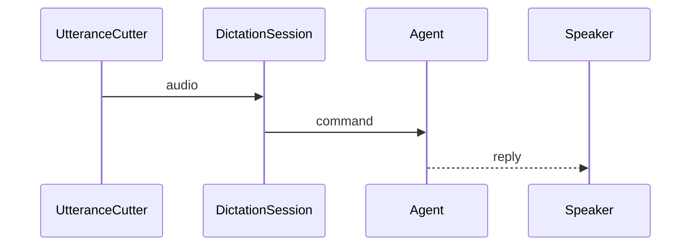

🔖 [Documentation Home](../../../README.md) > [Architecture](../README.md) > Voice on Pipecat

# Voice on Pipecat

> **Tier 3 · Peripheral flow** · Code: `src/zrb/llm/dictation/`, `src/zrb/llm/speech/` · Read first: [Dictation & Barge-in](dictation-barge-in.md)

zrb's voice moves off its hand-rolled path and onto Pipecat's pipeline, one stage at a time ([ADR-0106](../../adr/adr-0106.md)). This page is the plan: the shape the pipeline has when it is done, and the order the hand-rolled pieces come out. The idea to take away: capture stays zrb's, the pipeline owns turn management, and playback moves last because it is the least measured.

## Design

### Principles

1. **zrb keeps the microphone.** The pipeline never opens the device. zrb captures as it does today and pushes audio frames in, so `listen` stays the only thing that touches the sound card and a second audio client can never contend for it. → [ADR-0106](../../adr/adr-0106.md)
2. **A stage lands only when the tree is green with both paths.** Each stage is behind a flag until its replacement is proven, so a half-migrated voice is never the only voice. → [ADR-0106](../../adr/adr-0106.md)
3. **What the user hears is decided by the words, not by the transport.** The hold-first, decide-on-the-words shape survives the move: the new pipeline supplies better detection, not a different policy. → [ADR-0105](../../adr/adr-0105.md)
4. **Playback stays in-process and pausable.** Speech is played by zrb so it can be paused and stopped out of the microphone; a transport may not take that away. → [ADR-0103](../../adr/adr-0103.md)
5. **Features stay unknown to the UI.** The pipeline is installed through the same extension points as today, and config is still read when a session starts. → [ADR-0102](../../adr/adr-0102.md)

### Invariants

| Invariant | Pinned by |
| --- | --- |
| The microphone is opened by zrb and by nothing else | `test/llm/dictation/test_listen.py` |
| A stop said over zrb still cancels the turn, and is still sent nowhere | `test/llm/dictation/test_feature_barge_in.py` |
| A hold taken over zrb's voice is still given back when the words are not meant for it | `test/llm/dictation/test_feature_barge_in_pause.py` |
| A spoken yes or no still answers a pending approval rather than steering the turn | `test/llm/dictation/test_feature_barge_in.py` |
| Speech can still be paused and stopped mid-utterance | `test/llm/speech/test_player_in_process.py` |
| A streamed reply is still spoken sentence by sentence as it is written | `test/llm/speech/test_feature_stream.py` |
| A turn ends when the user is done, and a slow transcript does not stall it | **unpinned** — stage 3 has no test yet |

## Realization

### The parts

The framework names below are Pipecat's, not zrb's, and none of them is defined under `src/` yet — that is what the migration adds.

| Part | What it does | Replaces |
| --- | --- | --- |
| zrb capture | Keeps the microphone and cuts nothing; pushes an InputAudioRawFrame into the pipeline | nothing — stays zrb's |
| Input transport | A BaseInputTransport subclass whose `start` calls set_transport_ready, the call the base class omits; without it the pushed frames are never drained | the front of `listen` |
| Silero VAD | Decides speech against silence per 32 ms frame | `UtteranceCutter`'s loudness bars |
| Turn strategies | VADUserTurnStartStrategy and MinWordsUserTurnStartStrategy decide when a turn starts; the latter applies `min_words` only while zrb speaks, which is what guard 3 of [Dictation & Barge-in](dictation-barge-in.md) does by hand | the barge-in state machine's start logic |
| vosk STT | A custom STTService: Pipecat ships no vosk service, and this keeps the wake-word gate and per-word confidence | the vosk backend |
| zrb agent | pydantic-ai, unchanged | nothing |
| zrb speech | zrb's speech backends behind a TTS service | the speech backends |
| Output transport | A BaseOutputTransport subclass overriding write_audio_frame to play through `PcmUtterance` | `Speaker`'s playback loop |

Stage 1 has landed, in `src/zrb/llm/dictation/pipecat_input.py`:
`create_input_transport` is the subclass, `push_audio` hands one captured block
over, `create_audio_counter` is the sink stage 1 counts on, and `AudioPipeline`
(`start`, `push`, `close`) owns the pipeline and its worker task for as long as a
listening lasts.

It is off unless `ZRB_LLM_DICTATION_PIPECAT_ENABLED=on`, and nothing downstream
of the transport acts on the audio yet: what the flag proves is the transport,
not a new voice, and the dictation and speech paths are untouched either way.

Two tests hold it up. `test/llm/dictation/test_pipecat_input.py` covers the
transport: fifty blocks pushed from outside arrive at the sink in order and
intact, while the loop the pipeline was started on keeps ticking.
`test/llm/dictation/test_feature_pipecat.py` covers the hand-off: a session with
the flag on feeds the pipeline from the same capture and closes it when the
listening stops, and an install without the extra listens on and says so.

### Change it here

| Stage | What comes out | Order |
| --- | --- | --- |
| 1 | Input only, behind a flag: zrb pushes audio into a pipeline that ends at a sink. Output untouched, `Speaker` plays as now. Exit: the existing dictation and speech suites pass with the flag off, and a test pushes a known number of chunks and sees the same count reach the sink with it on. **Landed**: the flag is ZRB_LLM_DICTATION_PIPECAT_ENABLED, `listen` hands every captured block over through `on_captured`, and `AudioPipeline` owns the pipeline for the listening | First, because it can run beside what exists |
| 2 | `UtteranceCutter` and its loudness bars. VAD and the turn-start strategies take over; the wake-word gate stays. Exit: the pinned rows above still pass on the VAD path, and a test feeds a mid-sentence pause and gets the boundaries the cutter produced | Second, because it needs stage 1 |
| 3 | The silence-based end of a turn, replaced by a turn analyzer over the smart-turn model. Exit: a turn does not end at a mid-sentence pause, and a slow transcript still ends inside the latency budget | Third, because it needs VAD driving turn starts |
| 4 | Output, through a BaseOutputTransport subclass. **Unverified**: nothing yet shows a pipeline interruption reaches zrb's pause fast enough, so this stage has no exit criterion that can be met today | Last, because it is the least measured, and the one that must not break a pause |

Two things not to lose on the way: the guard rows above, and `spoken_log`, which records what zrb audibly said.

## See Also

- [Dictation & Barge-in](dictation-barge-in.md) — the flow this pipeline replaces and must keep
- [ADR-0106](../../adr/adr-0106.md) — the decision to build on Pipecat
- [ADR-0102](../../adr/adr-0102.md), [ADR-0103](../../adr/adr-0103.md), [ADR-0105](../../adr/adr-0105.md) — the clauses that survive and the ones that die
- [UI](../2-extension-surface/ui.md) — the extension points the pipeline installs through

🔖 [Documentation Home](../../../README.md) > [Architecture](../README.md) > Voice on Pipecat
