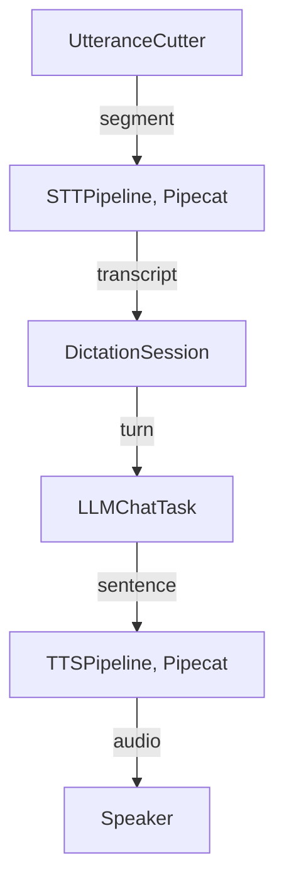

🔖 [Documentation Home](../../README.md) > [Architecture](../README.md) > Voice on Pipecat

# Voice on Pipecat

> **Tier 3 · Peripheral flow** · Code: `src/zrb/llm/voice/`, `src/zrb/llm/dictation/`, `src/zrb/llm/speech/` · Read first: [Dictation & Barge-in](dictation-barge-in.md)

zrb's local speech models run as Pipecat services ([ADR-0107](../../adr/adr-0107.md)): the speech-to-text and text-to-speech backends that load a model on this machine are Pipecat services behind a name, beside zrb's own backends for cloud APIs, `vosk` and system commands. Every backend sits behind the same `AnyDictationBackend` or `AnySpeechBackend` interface, so the rest of voice does not know which kind it has. This page is the boundary between Pipecat and zrb. The one idea to take away: **Pipecat runs the models, zrb decides the meaning.** Pipecat answers "what did this audio say" and "what does this sentence sound like"; zrb answers "what does that mean for this chat session".

## Table of Contents

- [Design](#design)
  - [The problem](#the-problem)
  - [Principles](#principles)
  - [Invariants](#invariants)
- [Realization](#realization)
  - [The parts](#the-parts)
  - [How it runs](#how-it-runs)
  - [What zrb keeps, and why](#what-zrb-keeps-and-why)
  - [Change it here](#change-it-here)
- [See Also](#see-also)

## Design

### The problem

- **Every model is a different integration.** Each speech model has its own loading, threading and audio format. Hand-rolling a backend per model is code zrb does not want to own.
- **A generic voice pipeline knows nothing about a chat session.** It cannot tell a stop word from a question, an approval from a new turn, or zrb's own voice from the user's.
- **Playback must stay controllable.** Speech is paused and stopped from the microphone, mid-sentence, so whatever plays it must stay in zrb's hands.
- **Models are slow to load and pipelines idle between utterances.** A pipeline that shuts itself down while the user is thinking fails every later utterance.

### Principles

1. **Pipecat owns the media, zrb owns the meaning.** A Pipecat service turns a finished segment into a transcript, or a sentence into audio. Where an utterance starts and ends, whether a transcript is a stop, an approval, a wake word or a turn, and the agent itself all stay zrb's. → [ADR-0107](../../adr/adr-0107.md)

2. **zrb keeps the microphone and the speaker.** Pipecat never opens a device: zrb captures, cuts the utterance and hands the segment over, and plays the audio a service returns through its own pausable player. → [ADR-0107](../../adr/adr-0107.md), [ADR-0103](../../adr/adr-0103.md)

3. **Services are chosen by name from a registry.** Built-in and code-registered services share one registry per direction; a project registration replaces a built-in of the same name, and the backend setting picks one. → [ADR-0090](../../adr/adr-0090.md)

4. **A pipeline's lifetime is zrb's, and idle is its normal state.** One pipeline is built per backend and kept for the session; it never times itself out, and zrb closes it at teardown on the loop that owns it. → [ADR-0107](../../adr/adr-0107.md)

5. **Features stay unknown to the UI.** Dictation and speech are installed through `LLMChatTask`'s extension points and configured when a session starts. → [ADR-0102](../../adr/adr-0102.md)

### Invariants

Each one fails quietly: the chat keeps working, but zrb answers itself, talks over the user, or stops hearing anyone.

| Must stay true | If it breaks | Pinned by |
| --- | --- | --- |
| A stop said over zrb cancels the turn and is sent nowhere | The user cannot interrupt, or the word "stop" becomes a message | `test/llm/dictation/test_feature_barge_in.py::test_a_lone_stop_word_cancels_the_turn_and_is_sent_nowhere` |
| Speech can be paused and resumed mid-utterance | Barge-in has to cut speech off instead of holding it | `test/llm/speech/test_player_in_process.py::test_pause_holds_a_pausable_utterance_and_resume_carries_on` |
| A streamed reply is spoken a sentence at a time | The user waits for the whole reply before hearing anything | `test/llm/speech/test_feature_stream.py::test_a_streamed_reply_is_spoken_a_sentence_at_a_time` |
| A project registration replaces a built-in service of the same name | A custom model is silently ignored | `test/llm/voice/test_registry.py::test_a_registration_replaces_a_built_in_of_the_same_name` |
| A worker that stopped on its own leaves the pipeline closed, so the next utterance builds a new one | Every utterance after the first failure fails too | `test/llm/dictation/test_pipecat_stt.py::test_a_worker_that_stopped_on_its_own_leaves_the_pipeline_closed` |
| A turn ends when the user is done, and a slow transcript does not stall it | Long pauses split one thought into two turns, or a turn never ends | **unpinned** |

## Realization

### The parts

| Part | Where | What it is responsible for |
| --- | --- | --- |
| `stt_registry`, `tts_registry` | `src/zrb/llm/voice/registry.py` | The named services in each direction, built-in and registered |
| `stt_manager`, `tts_manager` | `src/zrb/llm/voice/manager.py` | Building the service a name refers to, with its config |
| `STT_SERVICE_SPECS`, `TTS_SERVICE_SPECS` | `src/zrb/llm/voice/builtin.py` | The built-in service specs and the extras each needs |
| `AnyDictationBackend`, `AnySpeechBackend` | `src/zrb/llm/dictation/backend/`, `src/zrb/llm/speech/backend/` | The interface every backend implements, Pipecat-backed or zrb's own; each package's `builtin.py` maps a backend name to one |
| `UtteranceCutter` | `src/zrb/llm/dictation/listen.py` | Where an utterance begins and ends, and the loudness bars under ordinary speech and under zrb's voice |
| `STTPipeline` | `src/zrb/llm/dictation/pipecat_stt.py` | One long-lived Pipecat pipeline per STT backend: segment in, transcript out |
| `DictationSession` | `src/zrb/llm/dictation/feature.py` | The guards: stop, approval, denial, wake word, minimum word count |
| `TTSPipeline` | `src/zrb/llm/speech/pipecat_tts.py` | One long-lived Pipecat pipeline per TTS backend: sentence in, audio out |
| `Speaker`, `PcmUtterance` | `src/zrb/llm/speech/player.py`, `src/zrb/llm/speech/pcm_player.py` | In-process playback that can pause, resume and stop |

### How it runs

**Listening.** `listen` reads the microphone and `UtteranceCutter` decides when an utterance has ended. When `CFG.LLM_DICTATION_BACKEND` names a Pipecat service, the finished segment goes to that backend's `STTPipeline`, which pushes it through the service and waits for a `TranscriptionFrame`; the `vosk` backend transcribes in zrb itself. `DictationSession` then reads the words and decides what they are: a stop, an answer to a pending prompt, a wake word, too short to count, or a turn for the agent.

**Speaking.** The speech feature splits a streamed reply into sentences. When `CFG.LLM_SPEECH_BACKEND` selects a Pipecat service, each sentence goes to its `TTSPipeline` as a `TTSSpeakFrame`, and the service answers with `TTSAudioRawFrame`s; the other backends produce audio their own way. Either way zrb plays it through `Speaker`, so a barge-in can pause or stop it out of the microphone.

**Lifetime.** A service loads its model when it is built, so each pipeline is built once per backend and kept for the session. Between utterances it receives nothing, which is normal. Every worker zrb builds passes `idle_timeout_secs=None`, so Pipecat's idle monitor never cancels it, and zrb closes each pipeline at session teardown. A pipeline whose worker stopped anyway reports itself closed, and the backend builds a fresh one before the next utterance.

### What zrb keeps, and why

Each of these carries behaviour Pipecat has no notion of. Moving one into Pipecat is a product change, not a refactor.

| Kept | The behaviour it carries |
| --- | --- |
| `UtteranceCutter` | The echo-aware bar: the room under ordinary speech and zrb's own voice are measured separately, and speech is held on loudness before the words are known |
| `DictationSession`'s guards | A stop, an approval, a denial, a wake word, a minimum word count |
| `TriggerReply` and the trigger adapter | A transcript that answers the pending prompt instead of steering the turn |
| Push-to-talk's input path | A transcript that lands in the editable input box, unsent |
| vosk | Offline transcription with partials and per-word confidence; it stays zrb's own backend because Pipecat ships no vosk service |
| `Speaker` and `PcmUtterance` | Pause, resume, interrupt, an external-player fallback, and per-session isolation |

### Change it here

| To… | Open | Then run |
| --- | --- | --- |
| Add a Pipecat service, or change what an unset backend falls back to | `src/zrb/llm/voice/builtin.py`, `src/zrb/llm/voice/registry.py` | `test/llm/voice/` |
| Add a non-Pipecat backend | `src/zrb/llm/dictation/backend/builtin.py`, `src/zrb/llm/speech/backend/builtin.py` | `test/llm/dictation/backend/`, `test/llm/speech/backend/` |
| Change how a segment reaches an STT service | `src/zrb/llm/dictation/pipecat_stt.py` | `test/llm/dictation/test_pipecat_stt.py` |
| Change how a sentence's audio is made | `src/zrb/llm/speech/pipecat_tts.py` | `test/llm/speech/test_pipecat_tts.py` |
| Change utterance cutting or the loudness bars | `src/zrb/llm/dictation/listen.py` | `test/llm/dictation/test_listen.py`, `test/llm/dictation/test_listen_barge_in.py` |
| Change the transcript guards | `src/zrb/llm/dictation/feature.py`, `src/zrb/llm/dictation/words.py` | `test/llm/dictation/test_feature_barge_in.py` |
| Change playback or pausing | `src/zrb/llm/speech/player.py` | `test/llm/speech/test_player_in_process.py` |

## See Also

- [Dictation & Barge-in](dictation-barge-in.md) — what the guards decide, and how talking over zrb works
- [Voice & Camera](../../llm/voice-camera.md) — setting voice up, from the user's side
- [Programming the Voice](../../llm/programming-the-voice.md) — registering a custom service
- [UI](../2-extension-surface/ui.md) — the extension points voice installs through

🔖 [Documentation Home](../../README.md) > [Architecture](../README.md) > Voice on Pipecat
