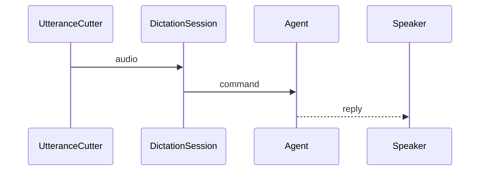

🔖 [Documentation Home](../../../README.md) > [Architecture](../README.md) > Voice on Pipecat

# Voice on Pipecat

> **Tier 3 · Peripheral flow** · Code: `src/zrb/llm/dictation/`, `src/zrb/llm/speech/` · Read first: [Dictation & Barge-in](dictation-barge-in.md)

zrb's voice moves off its hand-rolled path and onto Pipecat's pipeline, one stage at a time ([ADR-0107](../../adr/adr-0107.md)). This page is the plan and the boundary it may not cross. The idea to take away: **Pipecat owns the media pipeline, zrb owns the meaning.** Pipecat answers "what audio event is happening"; zrb answers "what does that mean for this chat session". A stage lands only while both answers stay the same.

## Table of Contents

- [Design](#design)
  - [The boundary](#the-boundary)
  - [Principles](#principles)
  - [Invariants](#invariants)
- [Realization](#realization)
  - [The parts](#the-parts)
  - [What zrb keeps, and why](#what-zrb-keeps-and-why)
  - [The stages](#the-stages)
  - [Regression gates](#regression-gates)
  - [Change it here](#change-it-here)
- [See Also](#see-also)

## Design

### The boundary

| Pipecat runs | zrb decides |
| --- | --- |
| The speech-to-text service a session listens through, and the text-to-speech service it speaks through | The microphone device, and the only code that opens it |
| A service's model: loading it, running it, releasing it | Where an utterance begins and ends, and the bar under the user's speech |
| The frames inside a service, and the order they travel in | Whether a transcript is meant for zrb at all: wake words, stop words, approvals, minimum-word guards |
| A worker and its pipeline, once zrb has built one | How long a pipeline lives, and pause, resume or stop, per chat session |
| Interruption inside one synthesis, when zrb asks for one | The pydantic-ai agent, the UI, and the prompt |

A conversation is one pass through both columns: the user speaks, zrb cuts the utterance and hands it to the service, the service answers with a transcript, and zrb decides whether those words are a turn, an answer to a prompt, a stop, or noise.

### Principles

1. **zrb keeps the microphone.** The pipeline never opens the device. zrb captures as it does today and pushes frames in, so `listen` stays the only thing that touches the sound card. → [ADR-0107](../../adr/adr-0107.md)
2. **Pipecat owns the media, zrb owns the meaning.** A media stage replaces audio work; it never absorbs a decision about what the user meant. → [ADR-0107](../../adr/adr-0107.md)
3. **A stage lands only when the tree is green with both paths.** Each stage is behind a flag until its replacement is proven, so a half-migrated voice is never the only voice. → [ADR-0107](../../adr/adr-0107.md)
4. **What the user hears is decided by the words, not by the transport.** The hold-first, decide-on-the-words shape survives the move. → [ADR-0105](../../adr/adr-0105.md)
5. **Playback stays in-process and pausable.** Speech is played by zrb so it can be paused and stopped out of the microphone; a transport may not take that away. → [ADR-0103](../../adr/adr-0103.md)
6. **Features stay unknown to the UI.** The pipeline is installed through the same extension points as today, and config is still read when a session starts. → [ADR-0102](../../adr/adr-0102.md)

### Invariants

Each one fails quietly: the chat keeps working, but zrb answers itself, talks over the user, or stops hearing anyone.

| Invariant | Pinned by |
| --- | --- |
| The microphone is opened by zrb and by nothing else | `test/llm/dictation/test_listen.py` |
| A stop said over zrb still cancels the turn, and is still sent nowhere | `test/llm/dictation/test_feature_barge_in.py` |
| A hold taken over zrb's voice is still given back when the words are not meant for it | `test/llm/dictation/test_feature_barge_in_pause.py` |
| A spoken yes or no still answers a pending approval rather than steering the turn | `test/llm/dictation/test_feature_barge_in.py` |
| Speech can still be paused and stopped mid-utterance | `test/llm/speech/test_player_in_process.py` |
| A streamed reply is still spoken sentence by sentence as it is written | `test/llm/speech/test_feature_stream.py` |
| A pipeline that fails, while it starts, while a block is handed to it, or while it is torn down, is closed and leaves the listening going | `test/llm/dictation/test_feature_pipecat.py` |
| Every captured block still reaches the pipeline's far end, with the detector in front of it | `test/llm/dictation/test_pipecat_input.py::test_a_pipeline_fed_silence_reports_no_speech_and_keeps_every_byte`, `::test_closing_hands_every_block_over_before_it_stops_the_worker` |
| The one thing the pipeline is turned on for — what it heard — is reported once, when the listening ends | `test/llm/dictation/test_feature_pipecat.py::test_what_the_pipeline_heard_is_reported_when_the_listening_ends` |
| A turn ends when the user is done, and a slow transcript does not stall it | **unpinned** — the semantic turn end has no test yet |

## Realization

### The parts

The framework names below are Pipecat's, not zrb's. The two services shipped; the rest is what the plan named, kept here with what became of it, so a reader can tell a decision from a hope.

| Part | What it does | Replaces |
| --- | --- | --- |
| zrb capture | Keeps the microphone, cuts the utterance, and hands that over | nothing — stays zrb's |
| STT service — **shipped** | The Pipecat service `ZRB_LLM_DICTATION_BACKEND` names (`whisper`, `moonshine`, `funasr`), handed a finished segment and answering with a `TranscriptionFrame` | the hand-rolled transcript backends |
| TTS service — **shipped** | The Pipecat service ZRB_LLM_SPEECH_BACKEND names (`kokoro`, `piper`, `pocket`), asked for a sentence's audio (`TTSSpeakFrame` → `TTSAudioRawFrame`), which zrb plays | the hand-rolled speech backends |
| Registry and managers — **shipped** | `stt_registry`/`tts_registry` and the managers that build a named service (ADR-0090) | the fixed name-to-backend lookup |
| `create_input_transport` | A `BaseInputTransport` subclass whose `start` calls `set_transport_ready`, the call the base class omits; without it the pushed frames are never drained. Stage 1's tap only — the shipped path uses no transport | nothing |
| `create_voice_activity_detector` | A `VADProcessor` over `SileroVADAnalyzer`, which tells speech from silence per 32 ms frame. The model ships inside Pipecat and runs offline. **Not in the decision path**: `UtteranceCutter` still cuts | nothing yet |
| Turn strategies | VAD-triggered and minimum-word turn starts, the second applying its threshold only while zrb speaks. **Not built** | nothing yet |
| vosk STT | A custom STT service: Pipecat ships none, and this keeps the wake-word gate and per-word confidence. **Not built** — vosk is still zrb's own backend | nothing |
| zrb agent | pydantic-ai, unchanged | nothing |
| Output transport | A Pipecat output-transport subclass overriding its audio write to play through `PcmUtterance`. **Not built** — zrb asks the TTS service for audio and plays it itself, so no transport is involved | nothing |

Stage 1 has landed, in `src/zrb/llm/dictation/pipecat_input.py`: `create_input_transport` is the subclass, `push_audio` hands one captured block over at the rate the pipeline is running at, `create_audio_counter` writes what reaches the far end into an `AudioTally`, and `AudioPipeline` (`start`, `push`, `close`, `get_speech_metrics`) owns the pipeline and its worker task for as long as a listening lasts. `push` only queues a block, so `close` reads the tally against what it pushed before it stops the worker: a teardown that stopped first would cut off a listening's last blocks, the trailing silence among them, and the count this stage is measured on would be short.

It is off unless the flag, ZRB_LLM_DICTATION_PIPECAT_ENABLED, is on. With it on, the capture is fed to `[transport, detector, metrics stage, counter]`: the detector decides speech against silence, `create_speech_metrics_stage` times what it reports into a `SpeechMetricsRecorder`, and the session says the total once when the listening ends.

The seconds reported are the detector's own interval — from the speech it confirmed to the silence it confirmed the end on — taken from the audio the frames carry rather than from the clock the pipeline runs on, so a burst worked through in milliseconds still reports the length it heard. It is what the detector heard, not what a transcript would call the words.

A segment the detector never closed is added when `close` ends the feed, after the drain, since a listening that stops mid-sentence would otherwise be reported as no time at all. Nothing in the pipeline decides anything zrb acts on — what the flag proves is the transport and the detector, and the dictation and speech paths are untouched either way.

Three suites hold it up, split by feature group. `test/llm/dictation/test_pipecat_input.py` covers the transport and the teardown: fifty blocks pushed from outside are all counted at the sink, byte for byte, while the loop the pipeline was started on keeps ticking; silence still arrives whole; a burst is caught up with before the worker is told to stop, so a listening's last blocks are analysed rather than cut off; a block carries the rate the pipeline is running at and not this module's default; and a start that fails, or a cancel the worker will not take, ends its task and raises nothing.

`test/llm/dictation/test_pipecat_metrics.py` covers what the detector heard: a speech frame pushed at the source reaches the metrics stage, which times the audio the frames carry, so a burst worked through in milliseconds still reports the length it heard; a listening that ended mid-sentence is reported with the audio it was heard over; and the recorder's arithmetic is pinned without a pipeline.

`test/llm/dictation/test_feature_pipecat.py` covers the hand-off: a session with the flag on feeds the pipeline from the same capture, reports what it heard when the listening stops, and closes it; an install without the extra listens on and says so; and a start, a hand-over or a close that fails is reported and given up on rather than ending hands-free.

### What zrb keeps, and why

These are the parts a "full" adoption must not remove, because each carries behavior Pipecat has no notion of. Dropping one is a product change, not a refactor.

| Kept | The behavior it carries |
| --- | --- |
| `DictationSession`'s guards | A stop, an approval, a denial, a wake word, a minimum word count, a transcriber's guess |
| `TriggerReply` and the trigger adapter | A transcript that answers the pending prompt instead of steering the turn |
| Push-to-talk's input path | A transcript that lands in the editable box, unsent |
| The wake-word gate | Stripping the wake word, arming the next utterance, and reading it beside the stop and approval rules |
| vosk as a custom STT service | Offline transcription, partials, and per-word confidence, which Pipecat's transcription frames do not carry |
| `Speaker` and `PcmUtterance` | Pause, resume, interrupt, external-player fallback, and per-session isolation |
| The pydantic-ai agent and the stream observer | Tools, history, permissions, hooks, and muting the rest of a reply that was talked over |
| The bounded capture backlog | Continuing to capture while a turn is answered, and dropping the oldest rather than splicing across a gap |

The echo-aware bar is the sharpest of these. zrb measures the room under ordinary speech and zrb's own voice over it separately, and holds speech on loudness before it knows the words. A generic detector supplies confidence and state transitions, not that distinction, so the bar stays zrb's.

### The stages

| Stage | What comes out | Order |
| --- | --- | --- |
| 1 | Input only, behind a flag. **Landed**: the flag is ZRB_LLM_DICTATION_PIPECAT_ENABLED, `listen` hands every captured block over through `on_captured` from a task of its own, `AudioPipeline` owns the pipeline for the listening, and the detector and metrics stage report what was heard | First, because it can run beside what exists |
| 2 | `UtteranceCutter` and its loudness bars, once the detector's boundaries are shown to match the cutter's on recorded audio. **Not taken** — the cutter still cuts, and the detector is not in the decision path | Second, because it needs stage 1 |
| 3 | The silence-based end of a turn, replaced by a semantic turn analyzer. **Not taken**, and it follows stage 2: there is no detector driving turn starts to build it on | Third, because it needs the detector driving turn starts |
| 4 | The STT backends behind STT services, vosk first. **Partly taken, and out of this order**: `whisper`, `moonshine` and `funasr` are Pipecat services behind a name, while vosk is still zrb's own backend. The services landed *before* stages 2 and 3 rather than after them | Fourth, because it is what the guards read |
| 5 | Output, through a Pipecat output-transport subclass over `PcmUtterance`. **Not taken**: zrb asks a TTS service for a sentence's audio and plays it itself, so there is no transport to interrupt | Last, because it is the least measured, and the one that must not break a pause |

What landed is therefore the services and not the stages. The order changed because the driven path needs nothing from the detector: zrb already knows where the utterance ended, because it cut it, so a service can be put behind that boundary without waiting for the detector to reproduce it. The detector's turn — stages 2 and 3 — is what would let zrb stop cutting, and it is still unbuilt.

One rule the plan did not have to state, because it only appears once a pipeline outlives an utterance: **a pipeline's lifetime is zrb's, and idle is its normal state.** A service loads its model in its constructor, so one pipeline is built per backend and kept for the session; between utterances it receives nothing, and only a transcript or a spoken frame tells Pipecat's worker the pipeline is still wanted. Left idle for five minutes it cancels itself, which took both pipelines down mid-session and failed every later utterance with "the Pipecat worker stopped". Every worker zrb builds therefore passes `idle_timeout_secs=None`, so the monitor is never started rather than merely muted, and zrb closes the pipeline at the session's teardown.

### Regression gates

No stage may replace the old path until these pass on both paths:

1. A stop over speech pauses immediately, cancels the turn, and is sent nowhere.
2. A cough, room conversation, or zrb echo pauses and then resumes speech.
3. A spoken approval or denial answers the pending prompt.
4. A wake word said alone arms the next utterance for its window.
5. A slow or failed transcription does not stop capture or leave speech paused.
6. vosk confidence drops hands-free noise but never push-to-talk text.
7. An interrupted reply is not spoken again when the turn ends.
8. Speech control in one chat session cannot reach another.
9. Push-to-talk inserts editable text rather than submitting a turn.
10. A failure while starting, feeding or tearing the pipeline down leaves the chat usable.

### Change it here

| To… | Open | Then run |
| --- | --- | --- |
| Change which service a session listens or speaks through, or what an unset voice falls back to | `src/zrb/llm/voice/builtin.py`, `src/zrb/llm/voice/registry.py` | `test/llm/voice/test_registry.py`, `test/llm/voice/test_builtin.py` |
| Change how a segment reaches an STT service, or what ends its transcription | `src/zrb/llm/dictation/pipecat_stt.py` | `test/llm/dictation/test_pipecat_stt.py` |
| Change how a sentence's audio is made, read or dropped | `src/zrb/llm/speech/pipecat_tts.py` | `test/llm/speech/test_pipecat_tts.py` |
| Change the tap, its detector, or what it measures | `src/zrb/llm/dictation/pipecat_input.py` | `test/llm/dictation/test_pipecat_input.py` |
| Change how a session feeds the tap or reports it | `src/zrb/llm/dictation/feature.py` | `test/llm/dictation/test_feature_pipecat.py` |
| Change utterance cutting, the bar over zrb's voice, or the bar under ordinary speech | `src/zrb/llm/dictation/listen.py` | `test/llm/dictation/test_listen_barge_in.py`, `test/llm/dictation/test_listen.py` |
| Change the transcript guards or command routing | `src/zrb/llm/dictation/feature.py`, `src/zrb/llm/dictation/words.py` | `test/llm/dictation/test_feature_barge_in.py` |
| Change playback or pausing | `src/zrb/llm/speech/player.py` | `test/llm/speech/test_player_in_process.py` |

## See Also

- [Dictation & Barge-in](dictation-barge-in.md) — the flow this pipeline replaces and must keep
- [ADR-0107](../../adr/adr-0107.md) — the decision to build on Pipecat, and the boundary
- [ADR-0102](../../adr/adr-0102.md), [ADR-0103](../../adr/adr-0103.md), [ADR-0105](../../adr/adr-0105.md) — the clauses that survive and the ones that die
- [UI](../2-extension-surface/ui.md) — the extension points the pipeline installs through

🔖 [Documentation Home](../../../README.md) > [Architecture](../README.md) > Voice on Pipecat
