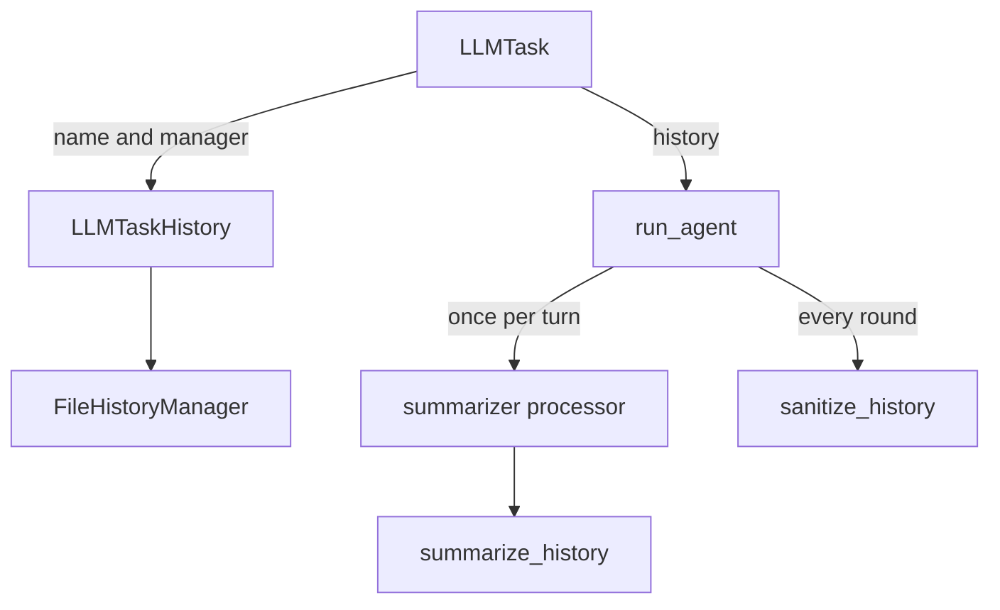
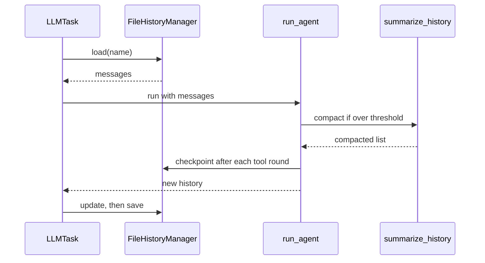

🔖 [Documentation Home](../../README.md) > [Architecture](README.md) > History & Compaction

# History & Compaction

> **Tier 3 · Peripheral flow** · Code: `src/zrb/llm/history_manager/` · Read first: [The LLM Turn](llm-turn.md)

History is what lets a conversation continue: the next turn, a resumed session, or a retry after a crash all start from the saved message list. This page covers how that list is loaded, shrunk when it outgrows the model's window, repaired before it is sent, and saved. The one idea to take away: the summary is not a side channel; it is a message inside the list, and that list is exactly what gets saved.

## Table of Contents

- [Design](#design)
  - [The problem](#the-problem)
  - [Principles](#principles)
  - [Invariants](#invariants)
- [Realization](#realization)
  - [The parts](#the-parts)
  - [How it runs](#how-it-runs)
  - [Variations](#variations)
  - [Change it here](#change-it-here)
- [See Also](#see-also)

## Design

### The problem

- **Conversations outgrow the context window.** Old messages must be shrunk, but the model still needs the decisions and the original goal they hold.
- **The list has structure a provider checks.** Every tool call needs its result, roles must alternate, and empty parts are rejected. Cutting the list in the wrong place, or saving a broken one, fails every later request.
- **A turn can die halfway.** A crash, an error or the user pressing Esc can stop a turn after tools already ran. If that work is not saved, the next turn repeats it blindly.
- **Writing the file is itself a risk.** A crash in the middle of a write must not destroy the whole conversation, and a second writer (another manager, an external edit) must not silently win over unsaved work.

### Principles

1. **The summary is part of the history, not beside it.** Compaction replaces the old part of the list with one restoration message, keeps the opening user goal and the recent tail word for word, and that new list is what gets saved. The next turn loads it like any other history. → [ADR-0041](../adr/adr-0041.md)

2. **Shrink the cheapest thing first, and fail open.** First, an oversized tool result is summarized on its own. Only when the whole conversation is still over the threshold is the old part condensed into a state snapshot. If summarizing fails, the history goes through unchanged rather than failing the turn. → [ADR-0041](../adr/adr-0041.md)

3. **Compact once per turn, before the first model call.** Between the rounds of one turn the list is carried forward as it is. Compacting again mid-turn could drop the message that holds an approved tool call. → [ADR-0040](../adr/adr-0040.md)

4. **Repair at the provider boundary, in a fixed order.** Right before each model call, and again on each result, the list passes one repair pipeline: fill empty content, drop orphaned tool calls, merge same-role neighbours. The order is data, not a sequence of statements, so reordering it is a visible edit. → [ADR-0040](../adr/adr-0040.md)

5. **Re-seed what compaction would lose.** The journal index is injected on a session's first turn and baked into every summary, so it survives compaction without any per-turn detection. → [ADR-0042](../adr/adr-0042.md)

### Invariants

| Must stay true | If it breaks | Pinned by |
| --- | --- | --- |
| A compaction split never separates a tool call from its result | The provider rejects the next request with an orphaned call or result | `test/llm/summarizer/history_processor/test_tool_pair_safety_pairs.py::test_is_split_safe_complete_pair` |
| The real opening user message survives every compaction round | The model loses the task's goal; a later round keeps an old summary instead | `test/llm/summarizer/history_processor/test_history_summarizer_preservation.py::test_summarize_history_second_round_preserves_the_true_first_user_message` |
| A summarizer that cannot be built leaves the history unchanged | A missing API key for the small model kills every turn | `test/llm/summarizer/history_processor/test_summarizer_resilience.py::test_processor_survives_unbuildable_summarizer` |
| Repair keeps a tool call whose approved result is pending | The approved call is deleted and its result has nothing to answer | `test/llm/agent/run/test_history_utils_strip_to_text.py::test_sanitize_history_allow_orphaned_tool_calls_keeps_pending_call` |
| A failed write leaves the conversation marked unsaved | The cache evicts the only copy of the turn | `test/llm/history_manager/test_file_history_manager_parts.py::test_save_handles_os_error` |
| An unsaved in-memory update wins over a newer file on load | An external write between update and save discards the turn | **unpinned** |
| A context-length failure saves the history without growing it | Every retry is longer than the last and fails the same way | `test/llm/task/test_history.py::test_skips_partial_summary_on_context_length` |

## Realization

### The parts

| Part | Where | What it is responsible for |
| --- | --- | --- |
| `LLMTaskHistory` | `src/zrb/llm/task/history.py` | Picks the manager and the conversation name; saves what a failed or cancelled turn did |
| `resolve_conversation_name` | `src/zrb/llm/task/shared_getters.py` | The configured name, or a fresh random one when it is blank |
| `FileHistoryManager` | `src/zrb/llm/history_manager/file_history_manager.py` | The default store: a small LRU cache, load-time cleanup, validated atomic JSON writes, backups and retention |
| `AnyHistoryManager` | `src/zrb/llm/history_manager/any_history_manager.py` | The protocol a custom store implements: `load`, `update`, `save`, `search` |
| `create_summarizer_history_processor` | `src/zrb/llm/summarizer/history_summarizer.py` | Builds the processor that runs both tiers: first per-message, then the whole conversation |
| `process_message_for_summarization` | `src/zrb/llm/summarizer/message_processor.py` | Tier one: shrinks one oversized tool result, or truncates it if summarizing fails |
| `summarize_history` | `src/zrb/llm/summarizer/history_summarizer.py` | Tier two: splits the list, summarizes the old part, rebuilds the list |
| `split_history` | `src/zrb/llm/summarizer/history_splitter.py` | Finds a cut that keeps tool pairs whole and prefers the start of a turn |
| `sanitize_history` | `src/zrb/llm/agent/run/history_utils.py` | The provider-boundary repair pipeline: a fixed tuple of steps, run in order |
| `PartialRunAccumulator` | `src/zrb/llm/agent/run/partial_run.py` | Records what a turn did as it streams, so a failed turn can be saved honestly |

### How it runs

**One turn.** `LLMTask` loads the history in a worker thread, hands it to `run_agent`, and saves what comes back:

**Loading.** `load` serves the cache while the file's modification time is unchanged, or while the entry has unsaved updates. Otherwise it reads the file, cleans broken parts, and validates it. A missing, empty or invalid file gives an empty list with a warning, so a bad file never blocks a turn.

**Compacting.** The processor runs inside `run_agent`, between the `PreCompact` and `PostCompact` hooks, and counts the system prompt against the threshold. Tier one runs on every turn. Tier two runs only when the list is over the message window or the token threshold. When only the message count is over, it is skipped if summarizing would free less than 30% of the token budget. `summarize_history` then:

1. splits the list with `split_history` into an old part and a kept tail;
2. summarizes the old part in chunks, consolidating the snapshots if there are many;
3. adds the journal index to the summary text;
4. returns the restoration message, then the first real user message, then the kept tail, with orphaned tool results dropped and same-role neighbours merged.

**Saving.** `save` serializes the list, validates it, writes a sibling `.tmp` file and renames it over the live one. The final save of a turn may also write a timestamped backup; mid-turn checkpoints pass `write_backup=False`.

### Variations

| Case | Where it is decided | What is different |
| --- | --- | --- |
| Mid-turn checkpoint | the stream handler in `src/zrb/llm/agent/run/runner.py` | Saved in the background whenever the list ends in a completed tool round; all checkpoints finish before the turn returns |
| The turn fails | `LLMTaskHistory.handle_run_error` | Closes dangling tool calls, appends an error note and a summary of the tools that ran |
| A context-length failure | `LLMTaskHistory.handle_run_error` | Saves the history as it was, with nothing appended |
| The user cancels | `LLMTaskHistory.save_cancelled_history` | Saves the live messages, closes dangling calls, adds an "interrupted" reply |
| `/compress` | `LLMTask`, before any agent is built | Runs `summarize_history` with `force=True`, even under the threshold |
| A `PreCompact` hook blocks | `run_agent` history preparation | Summarization is skipped; the emergency prune to the last message still runs if the list does not fit |
| A delegated sub-agent's transcript | `src/zrb/llm/util/subagent_session_naming.py` | Saved under `subagent/{agent}/` with no backup, and pruned by count — see [Sub-agents](sub-agents.md) |
| An old auto-named conversation | `FileHistoryManager` on its first save | Deleted once it is older than `LLM_HISTORY_RETENTION`; a name someone chose is never pruned |

### Change it here

| To… | Open | Then run |
| --- | --- | --- |
| Change naming or what a failed turn saves | `src/zrb/llm/task/history.py` | `test/llm/task/test_history.py` |
| Change caching, file layout, backups or retention | `src/zrb/llm/history_manager/file_history_manager.py` | `test/llm/history_manager/` |
| Change when or how history is summarized | `src/zrb/llm/summarizer/history_summarizer.py` | `test/llm/summarizer/` |
| Change where the list may be cut | `src/zrb/llm/summarizer/history_splitter.py` | `test/llm/summarizer/history_processor/` |
| Change the provider-boundary repair | `src/zrb/llm/agent/run/history_utils.py` | `test/llm/agent/run/` |
| Change what a partial run records | `src/zrb/llm/agent/run/partial_run.py` | `test/llm/agent/run/test_partial_run.py` |

## See Also

- [The LLM Turn](llm-turn.md) — the loop this history feeds
- [LLM History Sanitization](../technical-specs/llm-history-sanitization.md) — the provider quirks the repair pipeline handles
- [LLM Context](../technical-specs/llm-context.md) — how the context window is budgeted
- [Sub-agents](sub-agents.md) — where delegated transcripts go

🔖 [Documentation Home](../../README.md) > [Architecture](README.md) > History & Compaction
