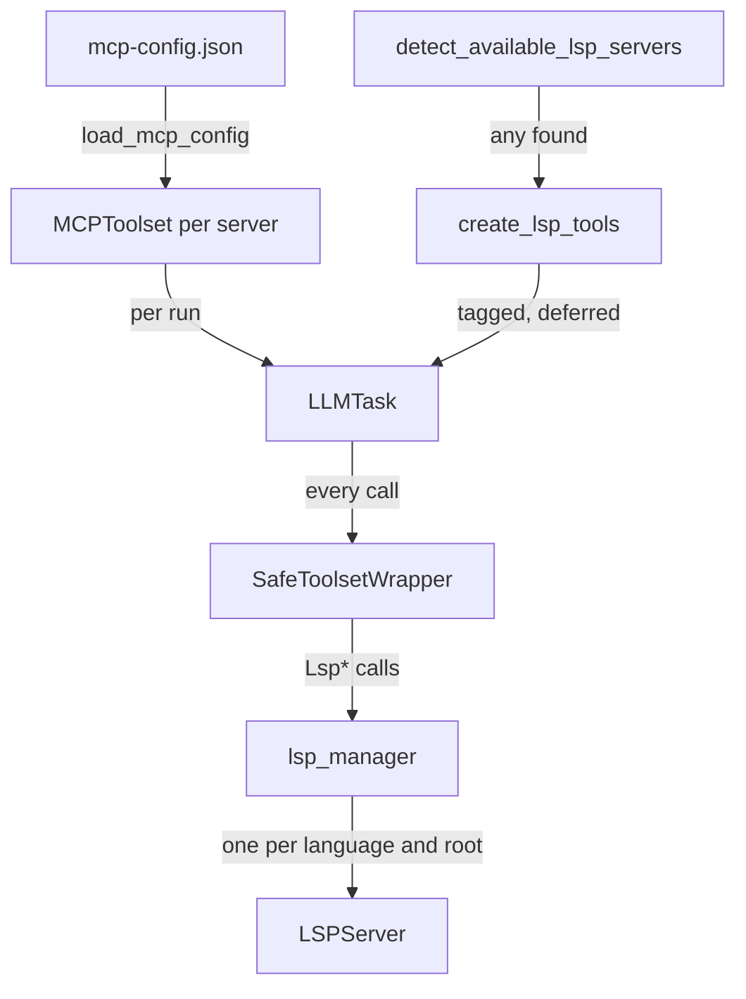
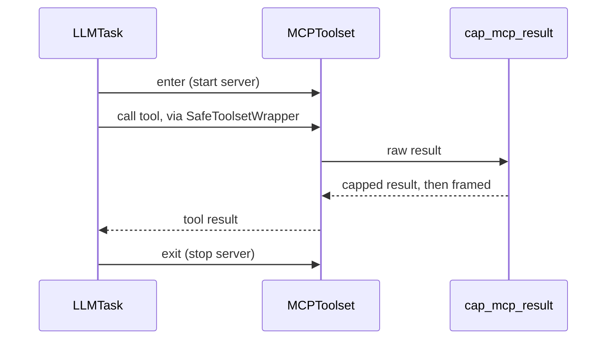
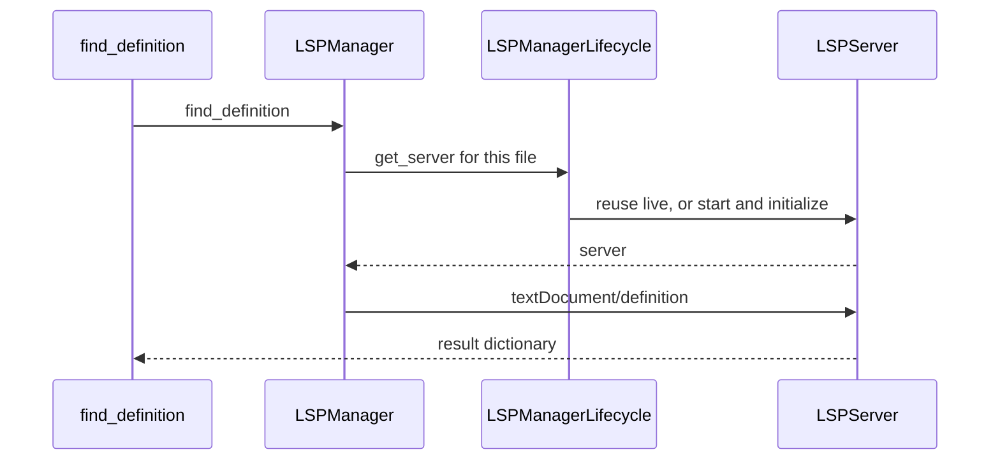

🔖 [Documentation Home](../../README.md) > [Architecture](README.md) > MCP & LSP Servers

# MCP & LSP Servers

> **Tier 3 · Peripheral flow** · Code: `src/zrb/llm/tool/mcp.py`, `src/zrb/llm/lsp/` · Read first: [Tools](tools.md)

Both protocols let the agent use an outside program as a tool. MCP brings in third-party tools: a GitHub server, a database server, anything in the MCP ecosystem. LSP brings in code intelligence from the language servers already on the machine: go to definition, find references, rename a symbol. The one idea to take away: MCP tools are someone else's code and are trusted least, while LSP tools are zrb's own thin wrappers and carry real capability tags.

## Table of Contents

- [Design](#design)
  - [The problem](#the-problem)
  - [Principles](#principles)
  - [Invariants](#invariants)
- [Realization](#realization)
  - [The parts](#the-parts)
  - [How it runs](#how-it-runs)
  - [Variations](#variations)
  - [Change it here](#change-it-here)
- [See Also](#see-also)

## Design

### The problem

- **Unknown code.** zrb cannot audit an MCP server. Its tools may write files, call the network, or return text crafted to give the model orders.
- **Unknown size.** An MCP server can return megabytes in one result. Unbounded, that result overflows the next request's token budget.
- **Tool count.** One MCP server may expose dozens of tools. Every visible tool schema costs tokens on every request.
- **Process lifetime.** Both protocols start external processes. A process that outlives its run, or survives zrb's exit, is a leak the user finds later.
- **Not every machine has a language server.** LSP tools that cannot work are pure prompt weight.

### Principles

1. **MCP servers are first-class tool sources.** zrb reads the Claude Desktop config format and wraps MCP tools in the same checkpoint as built-in tools, so hooks, permission rules and the sandbox all apply. → [ADR-0067](../adr/adr-0067.md)

2. **An unknown tool is trusted least.** zrb never guesses an MCP tool's capability from its name. It carries no tag, so it counts as `UNKNOWN`: denied in plan mode and write-checked by the sandbox. LSP wrappers are zrb's own and are tagged: `READ`, except rename, which is `EDIT`. → [ADR-0060](../adr/adr-0060.md)

3. **Third-party output is bounded, then framed as data.** Every MCP result is capped against one shared character budget, then marked "data, not instructions" before the model sees it. Images and other binary parts pass through untouched. → [ADR-0048](../adr/adr-0048.md)

4. **Pay only for tools the session can use.** LSP tools are registered only when a language server is installed. MCP toolsets and LSP tools are deferred: the model sees their names, and their schemas load only when it asks. → [ADR-0058](../adr/adr-0058.md)

### Invariants

| Must stay true | If it breaks | Pinned by |
| --- | --- | --- |
| An untagged tool resolves to `UNKNOWN` | An MCP tool gets trusted like a built-in read tool | `test/llm/permission/test_capability.py::test_untagged_is_unknown` |
| An MCP result is capped in aggregate, not per item | Many parts each under the cap add up to an overflow | `test/llm/tool/test_mcp.py::test_cap_mcp_result_bounds_a_list_in_aggregate` |
| An MCP text result carries the untrusted-data note | Injected instructions in a result read like orders | `test/llm/tool/test_mcp.py::test_frame_mcp_result_notes_a_string_result` |
| Toolset factories run once per run, and the entered toolsets are the ones the agent gets | MCP servers spawn twice per turn, and the agent holds toolsets that were never started | `test/llm/task/test_llm_task.py::TestLLMTaskExecution::test_llm_task_resolves_toolset_factories_once` |
| At most one live LSP server per language and project root; a dead one is replaced | Duplicate language-server processes, or queries sent to a dead one | `test/llm/lsp/test_manager_singleton.py::TestLspManagerLifecycle::test_get_server_lifecycle` |
| The exit backstop kills surviving LSP processes | Language servers outlive zrb | `test/llm/lsp/test_manager_singleton.py::TestLspManagerLifecycle::test_force_kill_all_sigkills_running_server` |
| `LspRenameSymbol` is tagged `EDIT` | Plan mode lets the agent rename across files | **unpinned** |

## Realization

### The parts

| Part | Where | What it is responsible for |
| --- | --- | --- |
| `load_mcp_config` | `src/zrb/llm/tool/mcp.py` | Finds `mcp-config.json` files, merges their `mcpServers`, expands `${VAR}`, builds one `MCPToolset` per server |
| `cap_mcp_result`, `frame_mcp_result` | `src/zrb/llm/tool/mcp.py` | Bound a result against `LLM_MAX_OUTPUT_CHARS`, then attach the untrusted-data note |
| `apply_common_tools` | `src/zrb/llm/common_tools.py` | Registers the per-run MCP toolset factory and, when a server is detected, the LSP tools |
| `LLMTask` | `src/zrb/llm/task/llm_task.py` | Resolves toolsets once per run, enters them, runs the turn, exits them |
| `LSPServerConfigRegistry` | `src/zrb/llm/lsp/configs.py` | Built-in and user-registered language-server configs; `detect_available_lsp_servers` caches the `PATH` scan |
| `create_lsp_tools` | `src/zrb/llm/lsp/tools.py` | The eight `Lsp*` wrapper functions, each a thin call into `lsp_manager` |
| `LSPManager`, `lsp_manager` | `src/zrb/llm/lsp/manager.py` | Process-wide singleton; the query surface the wrappers call; registers the `atexit` kill |
| `LSPManagerLifecycle` | `src/zrb/llm/lsp/manager_lifecycle.py` | Finds the project root, starts or reuses a server per language and root, shuts them all down |
| `LSPManagerQuery`, `LSPServerOperations` | `src/zrb/llm/lsp/manager_query.py`, `src/zrb/llm/lsp/server_operations.py` | Turn a symbol-based question into LSP requests and shape the answer |
| `LSPServer` | `src/zrb/llm/lsp/server.py` | One language-server subprocess: JSON-RPC over stdio, the `initialize` handshake, stop |

### How it runs

**MCP.** Each run calls the toolset factory, which calls `load_mcp_config` and marks each toolset deferred. `LLMTask` enters every toolset in one `AsyncExitStack`. Entering an `MCPToolset` is what starts a stdio server or opens the HTTP connection, and the MCP client does the handshake and tool discovery. When the turn returns, raises or is cancelled, the stack exits every toolset.

**LSP.** At first tool resolution, zrb checks `PATH` for known language servers. No server, no LSP tools. When the model calls one, the wrapper asks `lsp_manager`, which starts a server only if it needs one:

The chat task calls `lsp_manager.shutdown_all` when its session ends. The `atexit` handler `force_kill_all` catches anything left once the event loop is gone. A server that fails to start or initialize is stopped at once.

### Variations

| Case | Where it is decided | What is different |
| --- | --- | --- |
| Working directory under home | `load_mcp_config` | Every `mcp-config.json` from home down to cwd is merged; deeper files override by server name |
| Working directory outside home | `load_mcp_config` | Only the cwd's config file is read |
| A server entry with `command` / with `url` | `load_mcp_config` | A stdio subprocess / an HTTP or SSE connection |
| A bad config file or server entry | `load_mcp_config` | A warning is printed and that file or server is skipped; the rest still load |
| A language with several servers installed | `LLM_LSP_PREFERRED_SERVERS` | The preferred server is picked for matching files |
| A user's own language server | `LSPManager.register_lsp_server` | Merged into the config registry and clears the detection cache |
| A plain `LLMTask` (not chat) | `LSPManager` | No session-end shutdown; servers live until the process exits |

### Change it here

| To… | Open | Then run |
| --- | --- | --- |
| Change MCP config discovery or transports | `src/zrb/llm/tool/mcp.py` | `test/llm/tool/test_mcp.py` |
| Change MCP result capping or framing | `src/zrb/llm/tool/mcp.py` | `test/llm/tool/test_mcp.py` |
| Change how toolsets are entered and exited | `src/zrb/llm/task/llm_task.py` | `test/llm/task/test_llm_task.py` |
| Change when LSP tools register or how they are tagged | `src/zrb/llm/common_tools.py` | `test/llm/test_common_tools.py` |
| Change server detection or file matching | `src/zrb/llm/lsp/configs.py` | `test/llm/lsp/test_configs_detection.py` |
| Change server start, reuse or shutdown | `src/zrb/llm/lsp/manager_lifecycle.py`, `src/zrb/llm/lsp/server.py` | `test/llm/lsp/test_manager_singleton.py`, `test/llm/lsp/test_server_lifecycle.py` |
| Change a query or its answer shape | `src/zrb/llm/lsp/manager_query.py`, `src/zrb/llm/lsp/server_operations.py` | `test/llm/lsp/test_manager_query.py` |

## See Also

- [Tools](tools.md) — the registry and the checkpoint these tools join
- [Tool Call & Approval](tool-call-approval.md) — how an `UNKNOWN` tool is approved
- [Sandbox Enforcement](sandbox-enforcement.md) — the write check an untagged tool gets
- [MCP Support](../llm/mcp-support.md) — setting up MCP servers
- [LSP Support](../llm/lsp-support.md) — installing and choosing language servers

🔖 [Documentation Home](../../README.md) > [Architecture](README.md) > MCP & LSP Servers
