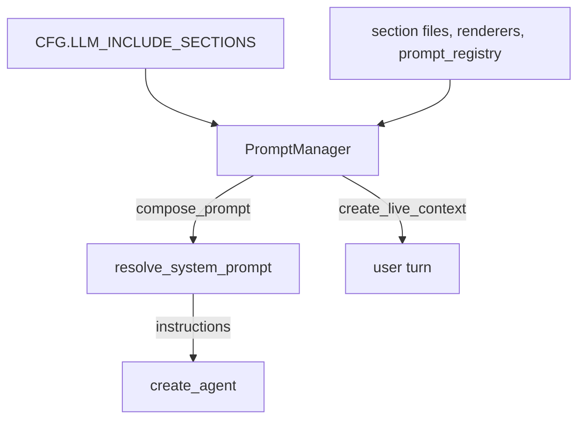
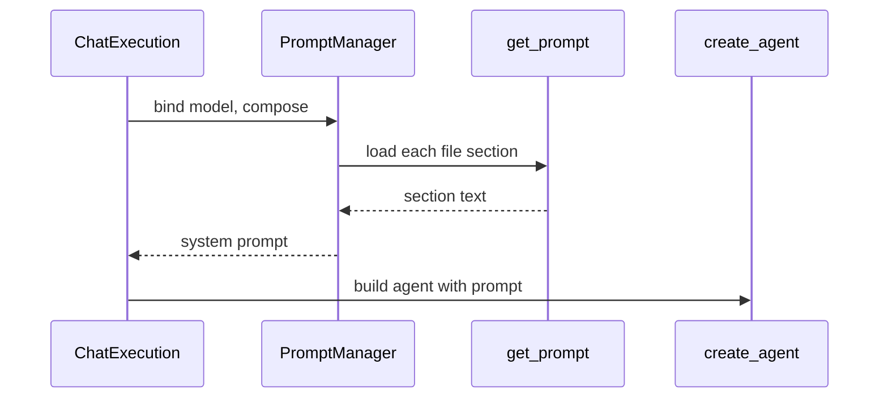

🔖 [Documentation Home](../../README.md) > [Architecture](README.md) > Prompts

# Prompts

> **Tier 2 · Extension surface** · Code: `src/zrb/llm/prompt/` · Read first: [The LLM Turn](llm-turn.md)

The system prompt tells the model who it is, how to work, and what machine and project it is working in. This page covers how zrb builds that prompt from a few markdown files and two pieces of code. The one idea to take away: the system prompt stays the same from turn to turn, and anything that changes each turn goes into the user's message instead.

## Table of Contents

- [Design](#design)
  - [The problem](#the-problem)
  - [Principles](#principles)
  - [Invariants](#invariants)
- [Realization](#realization)
  - [The parts](#the-parts)
  - [How it runs](#how-it-runs)
  - [Variations](#variations)
  - [Change it here](#change-it-here)
- [See Also](#see-also)

## Design

### The problem

The prompt is read by the model on every request, so small mistakes here cost on every turn:

- **Cost.** Providers cache the start of a request only when its bytes are identical to last time. One changing line near the top, like the time, stops the whole history from being cached.
- **Model size.** zrb runs on everything from a 3B local model to a frontier hosted one. A long rulebook drowns a small model; a terse one wastes a capable one.
- **Ownership.** Users, projects and deployments all want to change the wording, and each needs a clear place to do it without forking zrb.
- **Truth.** Facts about the machine and project (OS, tools, `AGENTS.md`) must match reality. Written as prose, they drift.

### Principles

1. **Seven fixed sections: rules in files, facts in code.** `persona`, `principle`, `workflow`, `example` and `profile` are markdown files. `system_context` and `project_context` are built in Python from the real environment. There is no registry of arbitrary sections, so the whole prompt can be read from five files and two functions. → [ADR-0044](../adr/adr-0044.md)

2. **The cached prefix stays byte-stable.** The system prompt carries only facts that hold for the whole session. Time, git state, todos, mode and the journal index go into a `<live-context>` block appended to the user's turn, so the system prompt and all earlier turns stay cacheable. → [ADR-0042](../adr/adr-0042.md)

3. **Only the profile section varies by model.** `LLM_PROFILE` picks one of three files, `profile.minimal.md`, `profile.standard.md` or `profile.capable.md`. The other sections are shared plain markdown with no conditional markers, so every model gets the same safety baseline. → [ADR-0049](../adr/adr-0049.md), [ADR-0046](../adr/adr-0046.md)

4. **A rule lives where it can be enforced.** Permissions and tools enforce actions; a tool's docstring explains that tool; skills carry domain method. The prompt keeps only general judgment. A new prompt rule must say why it cannot live lower down. → [ADR-0045](../adr/adr-0045.md)

5. **Resolve at compose time, and layer additions.** Section list, file overrides and extra prompts are read each time the prompt is composed, not when the manager is built. Extra prompts are deltas over a shared registry, so a later change to config or the registry still shows up. → [ADR-0090](../adr/adr-0090.md)

### Invariants

| Must stay true | If it breaks | Pinned by |
| --- | --- | --- |
| The default prompt carries all seven sections in the shipped order | The model silently loses part of its operating context | `test/llm/prompt/test_section_composition.py::test_default_prompt_uses_the_shipped_sections_in_order` |
| The system prompt contains no per-turn state | The prefix changes every turn and nothing is cached, not even history | `test/llm/prompt/test_system_context.py::TestSystemContext::test_system_context_excludes_volatile_state` |
| Live context is appended to the end of the user's turn | Volatile state ends up in the prefix, or loses its recency | `test/llm/agent/run/test_runner_history.py::test_run_agent_appends_live_context_to_user_turn` |
| The `profile` section follows the active profile | A capable model gets the default rulebook, with no error | `test/llm/prompt/test_manager.py::test_profile_section_uses_the_active_profile` |
| An unknown section name is skipped, not fatal | A config typo crashes every run | `test/llm/prompt/test_manager.py::test_unknown_section_names_are_ignored` |
| Extra prompts given as a callable are resolved on every compose | Values captured at build time go stale | `test/llm/prompt/test_registry.py::test_manager_resolves_callable_each_compose` |
| A sub-agent inherits no main-agent sections unless it asks | Every sub-agent silently takes on the main persona | `test/llm/agent/subagent/test_manager_building.py::test_sub_agent_manager_without_inherit_sections_skips_inheritance` |

## Realization

### The parts

| Part | Where | What it is responsible for |
| --- | --- | --- |
| `PromptManager` | `src/zrb/llm/prompt/manager.py` | Resolves the section list, chains the sections as middleware, appends extra prompts, and renders the live-context block |
| `get_prompt` | `src/zrb/llm/prompt/prompt.py` | Loads one file section through the override chain and fills its placeholders |
| Section files | `src/zrb/llm/prompt/markdown/` | The wording of the five file sections. Other files here serve summarizers, extractors and speech, not the main prompt |
| `active_profile` | `src/zrb/llm/prompt/profile.py` | Turns `LLM_PROFILE` (and the model, for `auto`) into a profile name |
| `system_context` | `src/zrb/llm/prompt/system_context.py` | Session-stable facts: OS, working directory, tools, model notes, sandbox |
| `create_project_context_prompt` | `src/zrb/llm/prompt/claude.py` | Lists project docs such as `AGENTS.md` found near the working directory |
| `build_skill_replacements` | `src/zrb/llm/prompt/claude.py` | Fills the skill catalogue placeholders inside `workflow` |
| `PromptRegistry`, `prompt_registry` | `src/zrb/llm/prompt/registry.py` | The shared default list of extra prompts, read from `CFG.LLM_PROMPT` lazily |
| `render_live_context` | `src/zrb/llm/prompt/live_context.py` | The per-turn lines (time, git, todos, mode) and the journal index |
| `resolve_system_prompt` | `src/zrb/llm/task/shared_getters.py` | Composes the prompt for one run |
| `create_agent` | `src/zrb/llm/agent/common.py` | Passes the finished string to `pydantic_ai.Agent` as `instructions` |

### How it runs

Each run composes the prompt fresh. The chat task first binds the current model to the manager, so a `/model` switch picks the right profile on the next turn.

Inside `compose_prompt`, the manager:

1. reads `active_sections`: the instance's `include_sections` if set, else `CFG.LLM_INCLUDE_SECTIONS`;
2. builds the placeholder values: the assistant name, and the skill catalogue from `build_skill_replacements`;
3. turns each section into a middleware: a file loader for the five file sections, a renderer for `system_context` and `project_context`, and a warning for an unknown name;
4. appends the extra prompts last, then runs the chain.

`get_default_prompt` looks for a file section in this order: a project or home override at `<dir>/.zrb/llm/prompt/<name>.md` (the relative path is `LLM_PROMPT_DIR`; the project walk and the home check follow `LLM_SEARCH_PROJECT` and `LLM_SEARCH_HOME`), then the `ZRB_LLM_PROMPT_<NAME>` environment variable, then `LLM_BASE_PROMPT_DIR`, then the packaged file. Only the packaged file is cached, so an edited override shows up on the next compose.

Separately, before each turn `LLMTask` asks the manager for the live-context block, and `run_agent` passes it to `append_live_context`, which adds it after the user's text.

### Variations

| Case | Where it is decided | What is different |
| --- | --- | --- |
| A deployment pins its own section list | `PromptManager(include_sections=...)` or `ZRB_LLM_INCLUDE_SECTIONS` | That list and order replace the default; omissions are the deployment's choice |
| `LLM_PROFILE=auto` | `resolve_profile` in `src/zrb/llm/prompt/profile.py` | The model id picks the profile by declared size; an id that declares nothing gets `standard` |
| The `minimal` profile | `active_profile`, read again at tool registration | Also drops the delegate tools — see [Tools](tools.md) |
| First turn, or after compaction | `LLMTask` and `summarize_history` | The journal index is added to live context, or baked into the summary |
| A sub-agent with `inherit_sections` | `src/zrb/llm/agent/subagent/building.py` | A temporary `PromptManager` composes only those sections, then the agent's own body is appended. Being single-turn, it folds live context (or, without `system_context`, just the journal index) into its system prompt |
| A custom per-turn fact | `PromptManager.add_live_context` | Rendered inside `<live-context>`, never in the system prompt |
| Plan mode or journal on/off | `src/zrb/llm/common_tools.py` | Changes which tools are registered; no prompt section switches on or off |

### Change it here

| To… | Open | Then run |
| --- | --- | --- |
| Change the wording of a section | `src/zrb/llm/prompt/markdown/` | `test/llm/prompt/test_prompt_mandates.py` |
| Change a profile adjustment | `src/zrb/llm/prompt/markdown/profile.capable.md` (and its two siblings) | `test/llm/prompt/test_profile.py` |
| Change how `auto` picks a profile | `src/zrb/llm/prompt/profile.py` | `test/llm/prompt/test_profile.py` |
| Change the default section order | `src/zrb/config/mixins/llm_prompt.py` | `test/llm/prompt/test_config_defaults.py` |
| Change override lookup | `src/zrb/llm/prompt/prompt.py` | `test/llm/prompt/test_default_prompt.py` |
| Change session facts | `src/zrb/llm/prompt/system_context.py` | `test/llm/prompt/test_system_context.py` |
| Change per-turn live context | `src/zrb/llm/prompt/live_context.py` | `test/llm/prompt/test_live_context.py` |
| Change extra-prompt layering | `src/zrb/llm/prompt/registry.py` | `test/llm/prompt/test_registry.py` |
| Change sub-agent inheritance | `src/zrb/llm/agent/subagent/building.py` | `test/llm/agent/subagent/test_manager_building.py` |

## See Also

- [The LLM Turn](llm-turn.md) — where the composed prompt enters the run
- [History & Compaction](history-and-compaction.md) — how the journal index survives summarization
- [Sub-agents](sub-agents.md) — inherited sections and a child's own prompt
- [Programming the Prompt](../llm/programming-the-prompt.md) — the user-facing guide to overriding and extending
- [LLM Configuration](../configuration/llm-config.md) — section, directory and profile settings

🔖 [Documentation Home](../../README.md) > [Architecture](README.md) > Prompts
