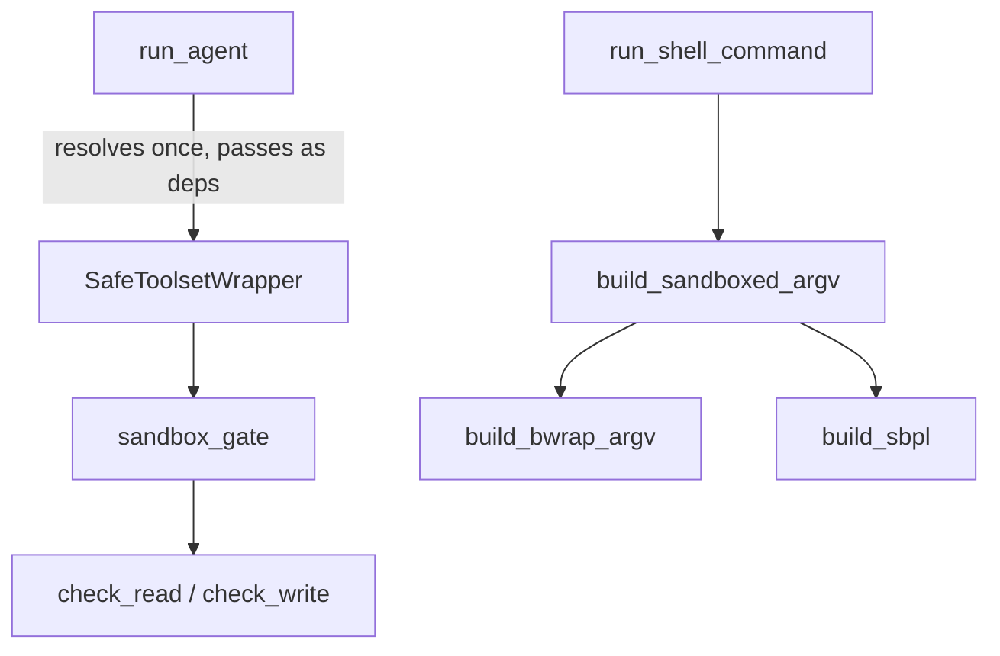
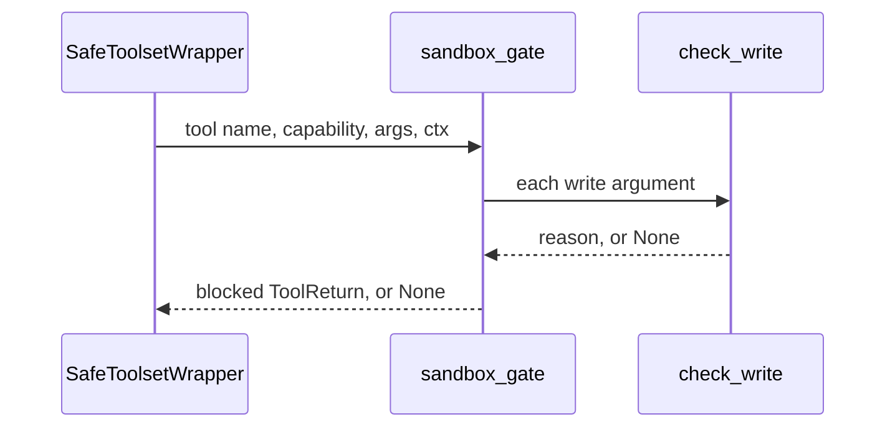
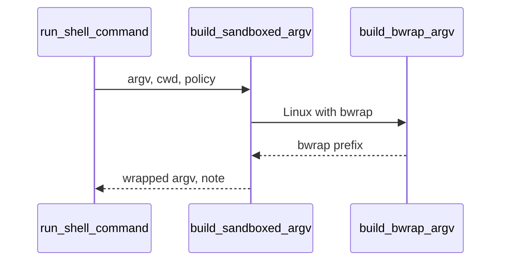

🔖 [Documentation Home](../../README.md) > [Architecture](README.md) > Sandbox Enforcement

# Sandbox Enforcement

> **Tier 3 · Peripheral flow** · Code: `src/zrb/llm/sandbox/` · Read first: [Tool Call & Approval](tool-call-approval.md)

The sandbox limits which files a tool call can touch, even after the call was approved. It is off by default. When it is on, an approved but prompt-injected command still cannot write outside the project or read `~/.ssh`-style secrets. The idea to take away: approval controls *intent*, the sandbox controls *reach*, and one policy drives two different enforcement layers.

## Table of Contents

- [Design](#design)
  - [The problem](#the-problem)
  - [Principles](#principles)
  - [Invariants](#invariants)
- [Realization](#realization)
  - [The parts](#the-parts)
  - [How it runs](#how-it-runs)
  - [Variations](#variations)
  - [Change it here](#change-it-here)
- [See Also](#see-also)

## Design

### The problem

- **Approval is not containment.** A call the user approved, or one auto-approved by a rule, can touch anything the user can.
- **The file tools cannot be jailed.** They run inside the agent process, which needs the network for the model and wide read access to explore the code.
- **A shell command is an opaque string.** Reading it does not tell you which files it will touch.
- **Every platform is different.** macOS and Linux have different mechanisms. Windows has none zrb can use.
- **Some tools were never audited.** MCP and third-party tools arrive without any statement of what they do.

### Principles

1. **Off by default, and limiting reach rather than intent.** With the sandbox off, every tool behaves exactly as if it did not exist. With it on, it does not ask anyone anything; it only narrows where an already-allowed call can write and what it can read. → [ADR-0065](../adr/adr-0065.md)
2. **One policy, two layers.** A path check guards the in-process file tools, and an OS wrapper guards every subprocess. Each covers what the other cannot reach, and both read the same policy value, so they cannot drift apart. → [ADR-0065](../adr/adr-0065.md)
3. **A tool that does not say what it does is checked as a writer.** An untagged tool's capability is unknown, so its path arguments get the write check. An MCP tool works, but it cannot write outside the boundary. → [ADR-0060](../adr/adr-0060.md)
4. **Never a silent passthrough.** Where no OS mechanism exists, the policy either runs the command with a visible warning or refuses it. The same policy never quietly means less on one machine. → [ADR-0065](../adr/adr-0065.md)
5. **A denial is a message the model can act on.** A blocked call returns text that says what was refused and carries a `[SYSTEM SUGGESTION]`, so the model can pick another path. It cannot widen the boundary itself. → [ADR-0057](../adr/adr-0057.md)

### Invariants

| Must stay true | If it breaks | Pinned by |
| --- | --- | --- |
| The sandbox is off unless the deployment turns it on | Every user's shell and file tools change behaviour on upgrade | `test/llm/sandbox/test_policy.py::test_default_policy_is_disabled` |
| An untagged tool's path arguments are write-checked | An MCP tool writes outside the writable roots | `test/llm/sandbox/test_gate.py::test_gate_write_checks_untagged_tools` |
| A write is judged by its real path, compared as a path rather than a string prefix | `/project-other` passes as `/project`, or a symlink walks out of the root | `test/llm/sandbox/test_fs_policy.py::test_is_within_rejects_sibling_prefix`, `test/llm/sandbox/test_fs_policy.py::test_symlink_escape_is_blocked` |
| A credential directory stays protected even inside a writable root | A secret can be overwritten or planted, like `authorized_keys` | `test/llm/sandbox/test_fs_policy.py::test_write_into_deny_read_root_blocked_even_if_writable`, `test/llm/sandbox/test_bwrap.py::test_masks_come_after_writable_binds` |
| A missing OS mechanism is never silent | A shell command runs uncontained and nobody knows | `test/llm/sandbox/test_os_sandbox.py::test_windows_warn_mode_is_not_silent` |
| An escape request is blocked when escape is disabled | The one setting that removes the escape hatch does nothing | `test/llm/sandbox/test_gate.py::test_gate_blocks_escape_when_disallowed` |
| A tool argument never moves the writable boundary | The model widens its own sandbox by choosing where to run | **unpinned** |

## Realization

### The parts

| Part | Where | What it is responsible for |
| --- | --- | --- |
| `SandboxPolicy` | `src/zrb/llm/sandbox/policy.py` | The frozen policy: on or off, writable paths, deny-read paths, OS mode, fallback, whether escape is allowed |
| `resolved_writable_roots`, `resolved_deny_read_roots` | `src/zrb/llm/sandbox/policy.py` | Turning the policy into real paths. Automatic roots are the working directory plus the temp directory; the temp directory is always writable |
| `get_effective_sandbox_policy` | `src/zrb/llm/sandbox/state.py` | The policy in force: the one bound for this run, else built from `CFG.LLM_SANDBOX_*` |
| `sandbox_gate` | `src/zrb/llm/agent/gates.py` | The Python layer: picks the path arguments of a call and checks them |
| `check_read`, `check_write`, `is_within` | `src/zrb/llm/sandbox/fs_policy.py` | Comparing a real path against the roots |
| `build_sandboxed_argv` | `src/zrb/llm/sandbox/os_sandbox.py` | The OS layer: prefixes a subprocess argv with the platform wrapper, or applies the fallback |
| `build_bwrap_argv` | `src/zrb/llm/sandbox/bwrap.py` | Linux bubblewrap arguments |
| `build_sbpl` | `src/zrb/llm/sandbox/seatbelt.py` | The macOS Seatbelt profile |

### How it runs

**Picking the policy.** `run_agent` takes the explicit `sandbox_policy` argument, else the parent run's, else the config. It binds the result for the run and also passes it to `agent.run` as `deps`. Nothing changes the sandbox policy during a run, so `sandbox_gate` reads it from `ctx.deps` rather than from ambient state.

**In-process file tools.** `SafeToolsetWrapper.call_tool` runs `sandbox_gate` right after `permission_gate`:

1. sandbox off: let the call through;
2. `dangerously_skip_sandbox` requested while escape is disabled: block;
3. an `EXECUTE` tool: no path check here, because the OS layer contains it;
4. every path-like argument (`path`, `file_path`, `src`, ...) must sit outside the deny-read roots;
5. for `EDIT` and untagged tools, every write argument, including `dst` and `worktree_path`, must also sit inside a writable root.

A blocked call never runs. The model gets a result starting with "Blocked by sandbox policy" plus a `[SYSTEM SUGGESTION]` naming the settings a user could change.

**Subprocesses.** `Shell` builds `[shell, flag, command]` and hands it to `build_sandboxed_argv`, which only ever adds a prefix in front:

Neither wrapper unshares the network or the process IDs, so the command runs in place and the shell tool's timeout and process tracking keep working.

### Variations

| Case | Where it is decided | What is different |
| --- | --- | --- |
| Linux with `bwrap` | `build_bwrap_argv` | Read-only root, then writable binds, then credential masks last so they win |
| macOS | `build_sbpl` | `sandbox-exec` with a last-match-wins profile. Set-uid binaries such as `ps` and `sudo` cannot run inside it |
| Windows, or Linux without `bwrap` | `build_sandboxed_argv` | The `fallback` setting: `warn` runs with a visible warning, `deny` refuses with `format_sandbox_denied_message` |
| `dangerously_skip_sandbox` | `build_sandboxed_argv`, `sandbox_gate` | Shell tools only. Runs unwrapped with a note in the output. No tool policy auto-approves it, but yolo or an `allow` rule will |
| Worktree tools | `src/zrb/llm/tool/worktree.py` | Pass their own `git` argv through the same wrapper, no shell string involved |
| Background shell | `src/zrb/llm/tool/shell_background.py` | Same wrapper as `Shell`, applied when the process starts |
| Sub-agent, or a live session resumed later | the run context; `AuthoritySnapshot` | A child inherits the parent's policy. A continuation that starts after the parent's run ended gets it passed explicitly ([ADR-0069](../adr/adr-0069.md)) |
| Oversized tool results | `src/zrb/llm/agent/spill.py` | The spill store checks its own directory with `check_read` and `check_write` |

### Change it here

| To… | Open | Then run |
| --- | --- | --- |
| Change the policy fields or defaults | `src/zrb/llm/sandbox/policy.py`, `src/zrb/config/mixins/llm_sandbox.py` | `test/llm/sandbox/test_policy.py` |
| Change which arguments are checked | `src/zrb/llm/agent/gates.py` | `test/llm/sandbox/test_gate.py` |
| Change the path comparison | `src/zrb/llm/sandbox/fs_policy.py` | `test/llm/sandbox/test_fs_policy.py` |
| Change platform dispatch or the fallback | `src/zrb/llm/sandbox/os_sandbox.py` | `test/llm/sandbox/test_os_sandbox.py` |
| Change the Linux or macOS wrapper | `src/zrb/llm/sandbox/bwrap.py`, `src/zrb/llm/sandbox/seatbelt.py` | `test/llm/sandbox/test_bwrap.py`, `test/llm/sandbox/test_seatbelt.py`, then `test/llm/sandbox/test_integration.py` on that platform |

## See Also

- [Tool Call & Approval](tool-call-approval.md) — the decision before a call reaches the sandbox
- [Tools](tools.md) — the execution checkpoint where `sandbox_gate` runs
- [Sandbox](../llm/sandbox.md) — configuring it, the user-facing guide
- [ADR-0101](../adr/adr-0101.md) — snapshots and rewind, the way to undo what an allowed call changed

🔖 [Documentation Home](../../README.md) > [Architecture](README.md) > Sandbox Enforcement
