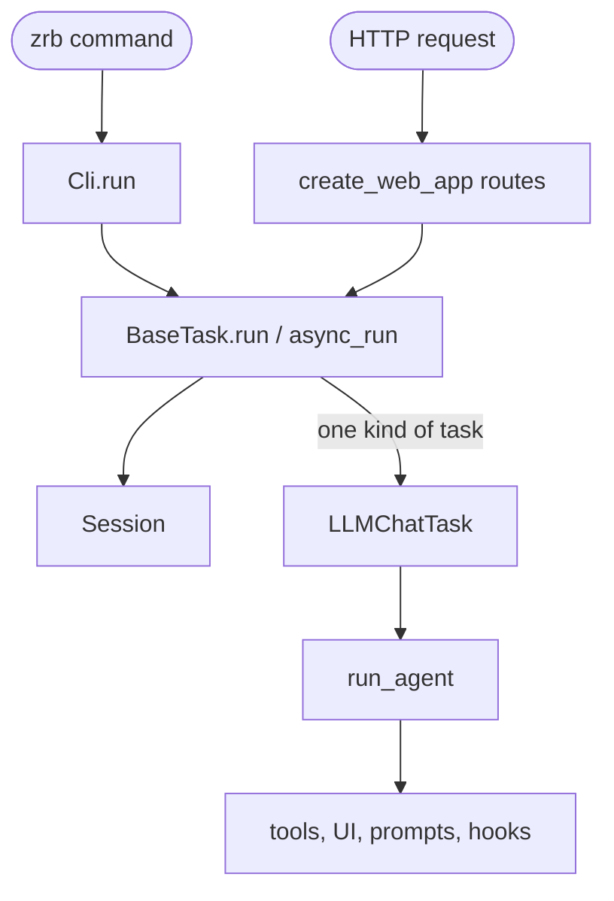

🔖 [Documentation Home](../../README.md) > [Architecture](README.md) > The System

# The System

> **Tier 0 · System** · Code: `src/zrb/` · Read first: this is the first page

Zrb runs tasks you write in Python, from a terminal or from a browser, and one of those tasks is a coding agent you can talk to. The one idea to take away: there is a single task engine, and everything else is a way to start a task or something a task can reach into.

## Table of Contents

- [Design](#design)
  - [The problem](#the-problem)
  - [Principles](#principles)
  - [Invariants](#invariants)
- [Realization](#realization)
  - [The parts](#the-parts)
  - [How it runs](#how-it-runs)
  - [Variations](#variations)
  - [Change it here](#change-it-here)
- [See Also](#see-also)

## Design

### The problem

- **Two very different workloads share one tool.** Deterministic pipelines (build, test, deploy) and an open-ended agent loop both have to feel native.
- **Work is mostly waiting** — on processes, services and LLM streams — and it nests deeply: runner, task, action, agent, tool, sub-agent.
- **The same automation must run from a shell and from a browser** without being written twice.
- **The agent acts on the real machine.** Whatever it reads, edits or runs must pass checks the user controls.
- **Startup time matters.** `zrb --help` must not pay for an LLM framework or a web server it will not use.

### Principles

1. **One task definition, several runners.** A task does not know who started it. The CLI and the web server both resolve a path in the same group tree and call the same run method, so they share one engine and one set of state objects. → [ADR-0028](../adr/adr-0028.md)

2. **Async all the way down.** The engine is built on `asyncio`, so independent tasks, streams and tool calls run concurrently and Ctrl+C unwinds through cancellation. → [ADR-0003](../adr/adr-0003.md)

3. **Three tiers of state.** A run has shared data (inputs, envs, XCom), a session (the graph and every task's status), and a per-task context. Each object has one owner and one lifetime. → [ADR-0018](../adr/adr-0018.md)

4. **Ambient state travels in context variables.** The current task context, UI, permission policy and the like are set once and read where needed, instead of being threaded through every signature. A sub-agent inherits them for free. → [ADR-0004](../adr/adr-0004.md)

5. **Heavy dependencies load only when used.** The agent framework, the web framework and other extras are imported lazily, and every deferred import states why. → [ADR-0033](../adr/adr-0033.md)

### Invariants

Each one fails silently if broken: the code keeps running and does the wrong thing.

| Must stay true | If it breaks | Pinned by |
| --- | --- | --- |
| A task reached by two paths at once runs once | A deploy or migration runs twice, concurrently | `test/task/base/test_execution_readiness.py::test_diamond_upstreams_run_readiness_task_once` |
| `import zrb` declares no pydantic model | Every command, even `--help`, pays for pydantic's schema machinery | `test/architecture/test_eager_pydantic_models.py::test_importing_zrb_declares_no_pydantic_model` |
| Every built-in task module is wired into the CLI | A shipped task never appears in `zrb` | `test/builtin/test_registration_completeness.py::test_every_task_module_on_disk_is_wired_into_the_cli` |
| Every built-in tool carries a known capability | It is treated as unknown: denied in plan mode, with no error | `test/llm/test_common_tools.py::test_every_registered_tool_carries_a_known_capability` |
| A denied tool call never reaches the tool | The agent acts against the user's policy | `test/llm/permission/test_state_and_gate.py::test_gate_blocks_denied_tool` |
| A network-exposed web server never starts without real credentials | Anyone on the network can run tasks and shell commands | `test/runner/test_cli_server_bind.py::test_start_server_refuses_insecure_bind` |
| `pydantic_ai.Agent` is built only by `create_agent` | A second agent path skips the tool wrapper, and with it the permission and sandbox checks | **unpinned** |

## Realization

### The parts

| Part | Where | What it is responsible for |
| --- | --- | --- |
| `serve_cli` | `src/zrb/__main__.py` | The `zrb` console script: loads every `zrb_init.py`, then hands `argv` to the CLI |
| `Cli` | `src/zrb/runner/cli.py` | The root group: resolves `argv` to a task or group and runs it |
| `create_web_app` | `src/zrb/runner/web_app.py` | The web runner: pages, the task-run API and the chat API |
| `BaseTask` | `src/zrb/task/base/` | The engine: graph walk, readiness, retries, fallbacks — see [Task Execution](task-execution.md) |
| `SharedContext`, `Session`, `Context` | `src/zrb/context/`, `src/zrb/session/` | The three tiers of state for one run |
| `LLMTask`, `LLMChatTask` | `src/zrb/llm/task/` | Tasks that build and drive an agent |
| `run_agent` | `src/zrb/llm/agent/run/runner.py` | One agent turn: model, tool calls, history — see [The LLM Turn](llm-turn.md) |
| `create_agent` | `src/zrb/llm/agent/common.py` | The only place a `pydantic_ai.Agent` is built, wrapping every tool call in the safety checks |
| `CFG` | `src/zrb/config/` | Every setting, read from the environment when used |

### How it runs

**From the shell.** `serve_cli` loads your `zrb_init.py` files, which register tasks on the `Cli` group tree. `Cli.run` splits `argv` into a path and options, finds the task, creates a `Session`, and calls `task.run`. If the path ends at a group, it prints the group's help instead.

**Inside the engine.** `run` starts an event loop, finds the root tasks the target depends on, and runs each chain. A task runs when every upstream is ready or skipped; its result goes into XCom under its name; then its downstreams get their turn. [Task Execution](task-execution.md) walks through it.

**When the task is the agent.** `zrb llm chat` is an `LLMChatTask`. For each message it runs an inner `LLMTask`, which builds an agent through `create_agent` and calls `run_agent`. The agent reaches the world only through tools, every tool call passes the permission and sandbox checks, and the UI, prompt and hooks are extension points around that loop. [The LLM Turn](llm-turn.md) walks through it.

**From the browser.** `zrb server start` is itself a task. It serves `create_web_app`, whose routes resolve a URL in the same group tree and call `async_run` on the task — see [Web Requests](web-requests.md).

### Variations

| Case | Where it is decided | What is different |
| --- | --- | --- |
| A task called from Python | `BaseTask.run` / `BaseTask.async_run` | No runner at all; a new `Session` is created when none is passed |
| A task started from the web | `serve_task_session_api` | Scheduled in the background; the request returns a session name at once |
| A one-shot LLM call inside a pipeline | `LLMTask` | Same agent loop with no interactive UI |
| A sub-agent | `src/zrb/llm/agent/subagent/` | A child agent run that inherits the parent's ambient state — see [Sub-agents](sub-agents.md) |
| Built-in tasks switched off | `CFG.ENABLE_BUILTIN_TASKS` | Only your own tasks appear under `zrb` |

### Change it here

Most changes land on one of the Tier 2 pages:

| To… | Open | Then run |
| --- | --- | --- |
| Add or change a tool — [Tools](tools.md) | `src/zrb/llm/tool/`, `src/zrb/llm/common_tools.py` | `test/llm/tool/` |
| Change what the terminal shows — [UI](ui.md) | `src/zrb/llm/ui/` | `test/llm/ui/` |
| Change the system prompt — [Prompts](prompts.md) | `src/zrb/llm/prompt/` | `test/llm/prompt/` |
| Add or change a hook — [Hooks](hooks.md) | `src/zrb/llm/hook/` | `test/llm/hook/` |
| Add a setting — [Config](config.md) | `src/zrb/config/mixins/` | `test/config/` |
| Change delegation — [Sub-agents](sub-agents.md) | `src/zrb/llm/agent/subagent/` | `test/llm/agent/subagent/` |

For anything else — the engine, the web, history, the sandbox — or when you start from a symptom, use the [Change Map](change-map.md).

## See Also

- [Task Execution](task-execution.md) — the deterministic runtime, end to end
- [The LLM Turn](llm-turn.md) — the agentic runtime, end to end
- [Change Map](change-map.md) — an intent or a symptom to the file that decides it
- [Context Propagation](../technical-specs/context-propagation.md) — the context-variable layers
- [Architecture, Philosophy & Conventions](../contributing/architecture.md) — the why behind the shape
- [Framework Conventions](../contributing/framework-conventions.md) — the enforced code rules (R1–R12)

🔖 [Documentation Home](../../README.md) > [Architecture](README.md) > The System
