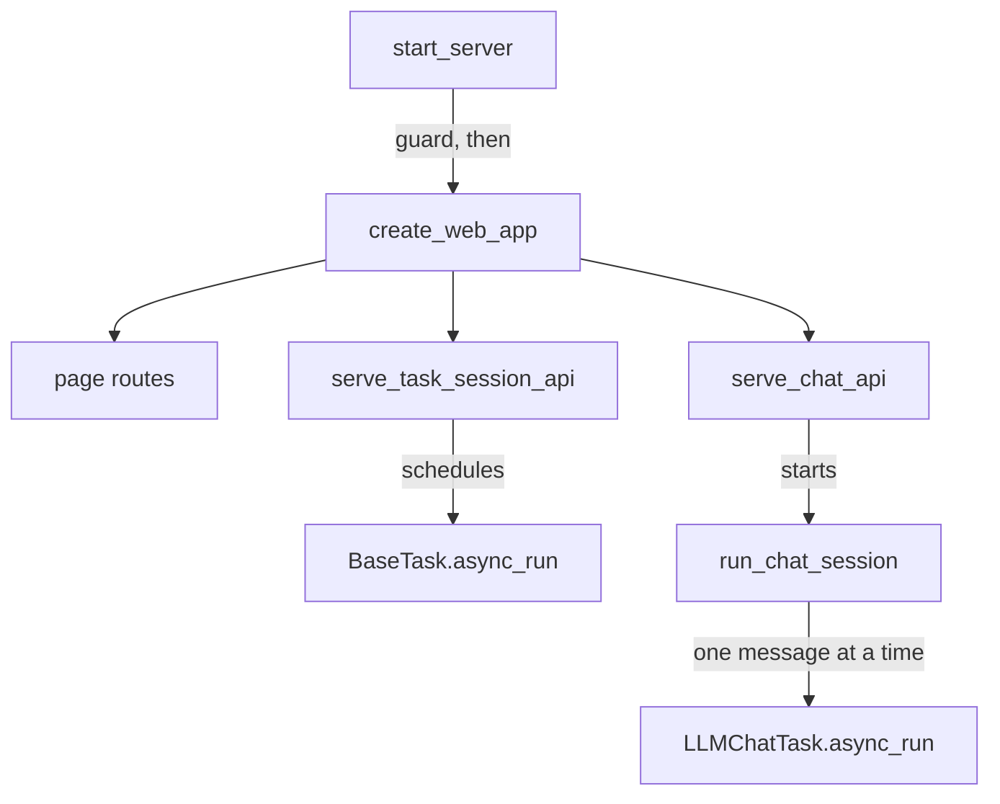
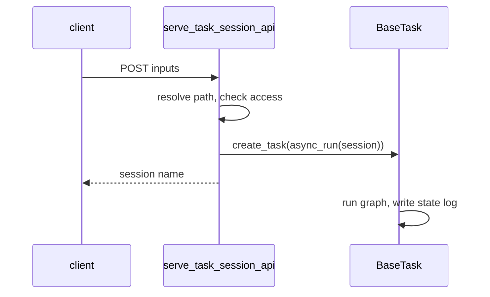
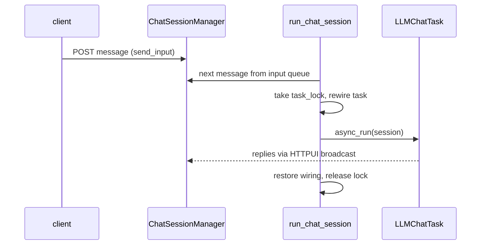

🔖 [Documentation Home](../../README.md) > [Architecture](README.md) > Web Requests

# Web Requests

> **Tier 3 · Peripheral flow** · Code: `src/zrb/runner/` · Read first: [Task Execution](task-execution.md)

`zrb server start` puts the same task tree you use on the command line behind a browser: a page per group and task, an API that starts a run, and a chat that streams the agent's replies. The one idea to take away: the web layer only admits requests and moves bytes; every run is an ordinary task run on the same engine.

## Table of Contents

- [Design](#design)
  - [The problem](#the-problem)
  - [Principles](#principles)
  - [Invariants](#invariants)
- [Realization](#realization)
  - [The parts](#the-parts)
  - [How it runs](#how-it-runs)
  - [Variations](#variations)
  - [Change it here](#change-it-here)
- [See Also](#see-also)

## Design

### The problem

- **A web server that runs tasks runs shell commands.** Anyone who can reach it can execute code, so an exposed server with weak credentials is a remote shell.
- **Runs outlive requests.** A deploy takes minutes and a dev server never ends; an HTTP request must not hold a connection open for that long.
- **Two runners can drift.** If the web had its own way of running a task, CLI and browser behavior would slowly stop matching.
- **Chat sessions share one agent.** Every browser tab talks to the same `llm chat` task, which holds one UI, one approval channel and one history manager at a time.
- **The CLI must stay fast.** Most invocations never start a server and should not load a web framework.

### Principles

1. **The web is another caller, not another engine.** A route resolves a URL to a task in the same group tree the CLI uses and calls the task's own `async_run`. The task, its session and its XCom are identical whichever runner started it. → [ADR-0028](../adr/adr-0028.md)

2. **Loopback by default; exposed means secured.** The server binds to `127.0.0.1` unless told otherwise. Any other bind refuses to start without authentication and real credentials, and there is no override flag. → [ADR-0087](../adr/adr-0087.md)

3. **The web stack loads only when the server starts.** FastAPI, Uvicorn and the route tree are imported inside the `start-server` task, so `zrb <anything else>` never pays for them. → [ADR-0029](../adr/adr-0029.md)

4. **One shared chat task, rewired per message.** A chat session does not get its own agent. For each message the runner takes a global lock, points the shared task at that session's UI, approval channel and history, runs, and restores the previous wiring. → [ADR-0083](../adr/adr-0083.md)

5. **Web chat runs non-interactively and renders in the browser.** Each message is one non-interactive turn; the raw markdown is streamed and the browser renders it, instead of the terminal's Unicode pipeline. → [ADR-0081](../adr/adr-0081.md)

### Invariants

| Must stay true | If it breaks | Pinned by |
| --- | --- | --- |
| A non-loopback bind without auth and real credentials never starts | Task execution is published to the network | `test/runner/test_cli_server_bind.py::test_start_server_refuses_insecure_bind` |
| A host that cannot be proven loopback-only counts as exposed | A hostname that resolves to a LAN address skips the check | `test/runner/test_cli_server_bind.py::test_start_server_treats_unprovable_hosts_as_exposed` |
| Starting a task session schedules the run, records it for shutdown, and returns | HTTP timeouts are tied to task lifetime, or runs outlive the server | `test/runner/web_route/test_task_session_api_route.py::test_create_new_task_session_api_success` |
| A session log is served only under the task that wrote it | Access to one task leaks every other task's results | `test/runner/web_route/test_task_session_api_route.py::test_get_task_session_api_read_foreign_session` |
| Every chat route checks access to the `llm chat` task | An unauthorized user reaches the agent and its shell tool | `test/runner/chat/test_chat_api.py::test_routes_forbid_user_without_task_access` |
| The shared chat task's wiring is restored after each message, even on cancel | One session's replies and approvals go to another session's browser | `test/runner/chat/test_chat_session_runner.py::test_cancel_mid_run_cancels_inflight_llm_task_and_restores_config` |
| Web chat messages run with `interactive` off | Every message replays full history and fires session-end hooks | `test/runner/chat/test_chat_session_runner.py::test_run_chat_session_success` |

## Realization

### The parts

| Part | Where | What it is responsible for |
| --- | --- | --- |
| `start_server` | `src/zrb/runner/cli.py` | The `server start` task: the bind guard, building the app, serving it with Uvicorn |
| `create_web_app` | `src/zrb/runner/web_app.py` | The FastAPI app, its lifespan, and registering every route factory |
| Route factories (`serve_*`) | `src/zrb/runner/web_route/` | Plain functions that register handlers on the app; there are no route classes |
| `get_user_from_request` | `src/zrb/runner/web_util/user.py` | The request's user, from a bearer token or cookie, or the default user when auth is off |
| `serve_task_session_api` | `src/zrb/runner/web_route/task_session_api_route.py` | Starting a run, and reading back its state log |
| `serve_chat_api` | `src/zrb/runner/chat/chat_api_route.py` | Chat sessions, messages, approvals, and the SSE stream |
| `ChatSessionManager` | `src/zrb/runner/chat/chat_session_manager.py` | One input and one output queue per session, plus the global `task_lock` |
| `run_chat_session` | `src/zrb/runner/chat/chat_session_runner.py` | The per-session loop that feeds queued messages to the shared chat task |
| `SSEStreamResponse` | `src/zrb/runner/chat/sse_stream.py` | Turning a session's output queue into server-sent events |

### How it runs

**Starting the server.** `start_server` imports Uvicorn and `create_web_app` lazily, then checks the bind. A loopback address or `localhost` passes at once. Anything else needs auth on, and a password and secret key that are not empty, not the shipped defaults, and long enough (12 and 32 characters). Failing that, it prints every problem at once and exits with code 1 before the app is built. The check reads the `WebAuthConfig` it was given, so a programmatic override is checked too.

**Pages.** `/ui/...` resolves the path with `extract_node` on the root group, checks access, and renders a Jinja template for the group or task. Rendering a task page builds a context to show its inputs; it does not run the task.

**Starting a task run.** The browser posts the form to `/api/v1/task-sessions/<path>`:

The run gets a fresh `Session` with a web-mode `SharedContext`. Its asyncio task goes into a list the app owns, and is removed when it finishes. The browser then polls `GET` on the same path plus the session name, which reads the state log the engine has been writing ([Task Execution](task-execution.md)). The response maps inputs back to their original names.

**Chat.** Opening `/api/v1/chat/sessions/<id>/streaming` creates the session if needed, gives it an `HTTPChatApprovalChannel`, starts `run_chat_session` as a background task, and returns an `SSEStreamResponse`. Messages arrive separately:

The browser reads replies from the output queue through the open SSE stream. A POST marked as an approval action is answered against the pending tool call instead of being queued. A timeout or error is broadcast to the browser and the loop waits for the next message, so one bad request does not end the session.

**Stopping.** On shutdown the app lifespan cancels every task run in its list, waits up to `WEB_SHUTDOWN_TIMEOUT`, then cancels all chat sessions.

### Variations

| Case | Where it is decided | What is different |
| --- | --- | --- |
| Auth disabled (loopback only) | `get_user_from_request` | Every request is a guest with super-admin rights |
| Auth enabled, no valid token or cookie | `get_user_from_request` | A guest that can reach only `guest_accessible_tasks` |
| Session ID names a delegated sub-agent | `resolve_llm_chat_task_for_session` | Resumed with that sub-agent's own `LLMChatTask`, never the main one; it still waits on the same global lock |
| `llm chat` not registered | `resolve_llm_chat_task_for_session` | An error is broadcast; chat routes have nothing to protect and pass through |
| A message posted while an approval is pending | `serve_chat_api` | Answers the approval (`y`/`n`/edited JSON) instead of entering the queue |
| GET with `list` as the session name | `serve_task_session_api` | Returns a page of logs between `from` and `to` (the last hour by default) |
| Path already names a session on POST | `serve_task_session_api` | 404: a POST only creates new sessions |

### Change it here

| To… | Open | Then run |
| --- | --- | --- |
| Change the bind guard or server startup | `src/zrb/runner/cli.py` | `test/runner/test_cli_server_bind.py` |
| Add a route or change app lifespan | `src/zrb/runner/web_app.py` | `test/runner/test_web.py` |
| Change a page | `src/zrb/runner/web_route/` | `test/runner/web_route/test_page_routes.py` |
| Change how task runs start or are read back | `src/zrb/runner/web_route/task_session_api_route.py` | `test/runner/web_route/test_task_session_api_route.py` |
| Change chat routes or approvals over HTTP | `src/zrb/runner/chat/chat_api_route.py` | `test/runner/chat/test_chat_api.py` |
| Change per-message wiring or the lock | `src/zrb/runner/chat/chat_session_runner.py` | `test/runner/chat/test_chat_session_runner.py` |

## See Also

- [Task Execution](task-execution.md) — the engine every web run calls into
- [Tool Call & Approval](tool-call-approval.md) — what the HTTP approval channel plugs into
- [Web UI](../advanced-topics/web-ui.md) — using and configuring the web UI
- [Custom LLM UI](../llm/llm-custom-ui.md) — writing a UI like `HTTPUI`
- [LLM Chat Lifecycle](../llm/llm-chat-lifecycle.md) — what one chat message does inside the task

🔖 [Documentation Home](../../README.md) > [Architecture](README.md) > Web Requests
