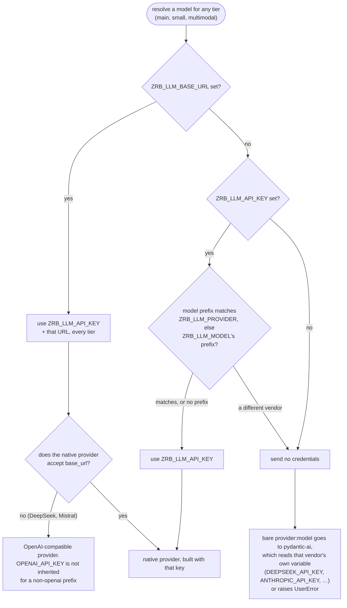
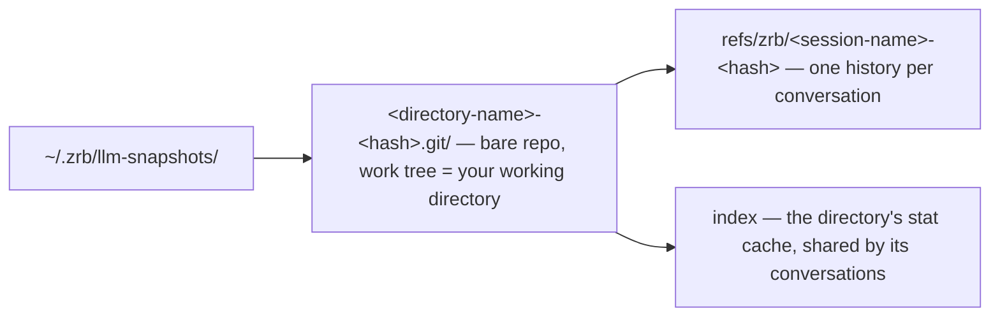
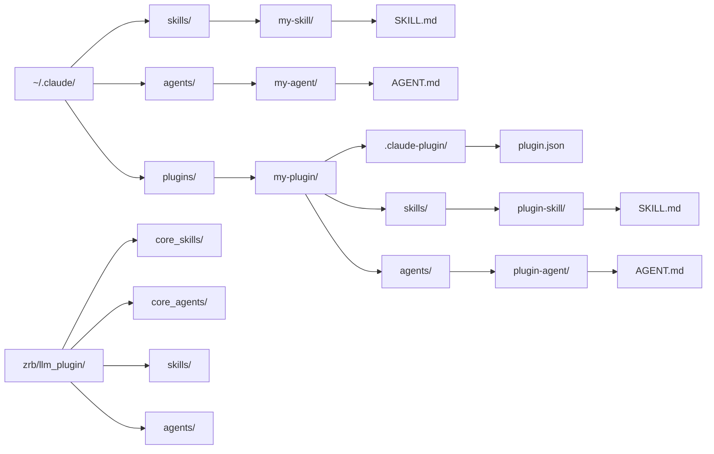

🔖 [Documentation Home](../../README.md) > [Configuration](./) > LLM & Rate Limiter

# LLM & Rate Limiter Configuration

Zrb talks to LLMs through `pydantic-ai`, so OpenAI, Anthropic, Google Vertex, Ollama, DeepSeek and more work out of the box. This page lists every environment variable for Zrb's AI features.

`Model`, `ModelSettings`, and the `capabilities` list accepted by `LLMTask`/`LLMChatTask` (see [Model, Model Settings & Capabilities](../task-types/llmchat-task.md#model-model-settings--capabilities)) are pydantic-ai's own types, passed through unchanged; [pydantic-ai's documentation](https://ai.pydantic.dev) is the source of truth for what each provider accepts. This page covers the zrb-side knobs on top: routing, credentials, rate limits, and the defaults zrb applies first.

---

## Table of Contents

- [Core LLM Routing](#1-core-llm-routing)
- [Rate Limiting & Token Budgets](#2-rate-limiting--token-budgets)
- [Summarization Thresholds](#3-summarization-thresholds)
- [System Prompts & Identity](#4-system-prompts--identity)
- [Journal & Context Storage](#5-journal--context-storage)
- [Rewind & Snapshots](#6-rewind--snapshots)
- [TUI Debugging](#7-tui-debugging)
- [Model Autocomplete](#8-model-autocomplete)
- [RAG Configuration](#9-rag-retrieval-augmented-generation-configuration)
- [Search Engine Configuration](#10-search-engine-configuration)
- [Hooks Configuration](#11-llm-hooks-configuration)
- [Skill & Agent Search Configuration](#12-skill--agent-search-configuration)
- [Timeout Configuration](#13-timeout-configuration)
- [Interval & Delay Configuration](#14-interval--delay-configuration)
- [Size & Limit Configuration](#15-size--limit-configuration)
- [Retry Configuration](#16-retry-configuration)
- [Slash Command Aliases](#17-slash-command-aliases)
- [Pagination Configuration](#18-pagination-configuration)
- [LSP Server Selection](#19-lsp-server-selection)
- [TUI Color Styles](#20-tui-color-styles)
- [Sandbox Configuration](#21-sandbox-configuration)
- [CLI Semantic Colors](#22-cli-semantic-colors)
- [Voice Dictation](#23-voice-dictation)

---

## 1. Core LLM Routing

| Variable | Description | Default |
|----------|-------------|---------|
| `ZRB_LLM_MODEL` | Primary LLM model (`provider:model-name`) | `openai:gpt-5.6-luna` (if unset) |
| `ZRB_LLM_SMALL_MODEL` | Faster model for background tasks | Falls back to `ZRB_LLM_MODEL` |
| `ZRB_LLM_MULTIMODAL_MODEL` | Model for multimodal tasks (image analysis) | `None` (no fallback) |
| `ZRB_LLM_API_KEY` | API key for your LLM provider | None |
| `ZRB_LLM_BASE_URL` | Custom endpoint URL | None |
| `ZRB_LLM_PROVIDER` | Explicit pydantic-ai provider name or object override — normally inferred from `ZRB_LLM_MODEL`'s `provider:` prefix, or from `ZRB_LLM_API_KEY`/`ZRB_LLM_BASE_URL` being set | None (inferred) |
| `ZRB_LLM_PERMISSIONS` | Tool permission ruleset. Empty keeps legacy yolo behavior. Accepts a shorthand (`allow`/`ask`/`deny`) or a comma-separated `key:action` list (e.g. `edit:deny,Shell:ask,*:allow`). First match wins. | (empty) |
| `ZRB_LLM_THINKING` | Cross-provider reasoning level: `minimal`/`low`/`medium`/`high`/`xhigh`, or `true`/`false` to toggle at the provider's default effort. Maps to pydantic-ai's unified `ModelSettings.thinking`. A provider-specific key in a task's `model_settings` (e.g. `openai_reasoning_effort`) wins over it. | (unset — provider default) |

Every agent also defaults to `openai_reasoning_summary="auto"` and `openai_prompt_cache_retention="24h"` (ignored by non-OpenAI providers); without a requested summary, OpenAI reasoning models return only an encrypted signature, no readable reasoning. Override these or add other keys (`openai_prompt_cache_key`, `openai_reasoning_effort`, …) via a task's `model_settings=` — caller keys always win.

### Which API Key Gets Used

- `ZRB_LLM_API_KEY` is a key **for one provider**: the one `ZRB_LLM_PROVIDER` names, else the `provider:` prefix on `ZRB_LLM_MODEL`. A model with a different prefix does not get it, so `ZRB_LLM_SMALL_MODEL=anthropic:…` beside `ZRB_LLM_MODEL=openai:…` falls back to `ANTHROPIC_API_KEY` instead of 401-ing on an OpenAI key.
- `ZRB_LLM_BASE_URL` overrides that scoping: one endpoint serves every tier (the LiteLLM / OpenRouter gateway case), so the key travels with the URL regardless of prefix.
- A **bare model name takes its vendor from `ZRB_LLM_PROVIDER`** and is then treated exactly like the prefixed form: `ZRB_LLM_PROVIDER=anthropic` + `ZRB_LLM_MODEL=claude-sonnet-4-5` behaves like `anthropic:claude-sonnet-4-5`. The tables below leave `ZRB_LLM_PROVIDER` unset, so the vendor comes from the prefix.



In the tables below, ✅ means set, — means unset, and *any* means the variable makes no difference to that row.

**`ZRB_LLM_MODEL` unset or `openai:`-prefixed.** No other vendor variable participates.

| `ZRB_LLM_API_KEY` | `ZRB_LLM_BASE_URL` | `OPENAI_API_KEY` | Endpoint | Key sent |
|---|---|---|---|---|
| — | — | — | — | ❌ `UserError: set OPENAI_API_KEY` |
| — | — | ✅ | `api.openai.com` | `OPENAI_API_KEY` |
| — | ✅ | — | your URL | `api-key-not-set` ⚠️ |
| — | ✅ | ✅ | your URL | `OPENAI_API_KEY` |
| ✅ | — | *any* | `api.openai.com` | `ZRB_LLM_API_KEY` |
| ✅ | ✅ | *any* | your URL | `ZRB_LLM_API_KEY` |

**`ZRB_LLM_MODEL=deepseek:deepseek-chat`**, standing in for any natively-supported non-OpenAI vendor.

| `ZRB_LLM_API_KEY` | `ZRB_LLM_BASE_URL` | `DEEPSEEK_API_KEY` | `OPENAI_API_KEY` | Endpoint | Key sent |
|---|---|---|---|---|---|
| — | — | — | *any* | — | ❌ `UserError: set DEEPSEEK_API_KEY` |
| — | — | ✅ | *any* | `api.deepseek.com` | `DEEPSEEK_API_KEY` |
| — | ✅ | *any* | *any* | your URL | `api-key-not-set` ⚠️ |
| ✅ | — | *any* | *any* | `api.deepseek.com` | `ZRB_LLM_API_KEY` |
| ✅ | ✅ | *any* | *any* | your URL | `ZRB_LLM_API_KEY` |

**Mixed vendors** — `ZRB_LLM_MODEL=openai:gpt-5` with `ZRB_LLM_SMALL_MODEL=deepseek:deepseek-chat`, resolving the *small* model. `ZRB_LLM_MULTIMODAL_MODEL` behaves identically.

| `ZRB_LLM_API_KEY` | `ZRB_LLM_BASE_URL` | `DEEPSEEK_API_KEY` | Endpoint | Key sent | Why |
|---|---|---|---|---|---|
| — | — | — | — | ❌ `UserError: set DEEPSEEK_API_KEY` | nothing to use |
| — | — | ✅ | `api.deepseek.com` | `DEEPSEEK_API_KEY` | vendor variable |
| — | ✅ | *any* | your URL | `api-key-not-set` ⚠️ | gateway, no key configured |
| ✅ | — | — | — | ❌ `UserError: set DEEPSEEK_API_KEY` | key withheld — it is an OpenAI key |
| ✅ | — | ✅ | `api.deepseek.com` | `DEEPSEEK_API_KEY` | key withheld, vendor variable fills in |
| ✅ | ✅ | *any* | your URL | `ZRB_LLM_API_KEY` | base URL disables withholding |

> ⚠️ **A base URL with no key anywhere sends an unauthenticated request** carrying the placeholder `api-key-not-set`. That is deliberate (local Ollama or LiteLLM often needs no key), but an endpoint that checks answers with a 401, not a configuration error.

> ⚠️ **A withheld key is not mentioned in the error.** Rows 4 and 5 above say "set `DEEPSEEK_API_KEY`" without noting `ZRB_LLM_API_KEY` was skipped as another provider's key. Set the second vendor's own variable, or set `ZRB_LLM_BASE_URL` if one endpoint serves both.

See [ADR-0094](../adr/adr-0094.md) for why credentials are scoped this way rather than injected everywhere.

### Supported Providers

pydantic-ai resolves any `provider:model` in `ZRB_LLM_MODEL`, so every provider it ships works without registration. OpenAI-protocol providers need no extra (`openai` is a core dependency); the rest need their vendor SDK.

**No extra needed** (OpenAI-compatible, or SDK-free):

| Provider | Model format | Credentials |
|----------|-------------|-------------|
| OpenAI | `openai:gpt-5` | `OPENAI_API_KEY` |
| Ollama | `ollama:llama3.1` | `OLLAMA_BASE_URL` (`OLLAMA_API_KEY` for Ollama Cloud) |
| DeepSeek | `deepseek:deepseek-reasoner` | `DEEPSEEK_API_KEY` |
| OpenRouter | `openrouter:anthropic/claude-opus-4.8` | `OPENROUTER_API_KEY` |
| Azure OpenAI | `azure:gpt-5` | `AZURE_OPENAI_API_KEY`, `AZURE_OPENAI_ENDPOINT` |
| Z.ai | `zai:glm-5` | `ZAI_API_KEY` |
| Moonshot AI | `moonshotai:kimi-k2-thinking` | `MOONSHOTAI_API_KEY` |
| Alibaba | `alibaba:qwen-max` | `ALIBABA_API_KEY` or `DASHSCOPE_API_KEY` |
| Cerebras | `cerebras:llama3.1-8b` | `CEREBRAS_API_KEY` |
| Together | `together:meta-llama/Llama-3-70b` | `TOGETHER_API_KEY` |
| Fireworks | `fireworks:accounts/fireworks/models/…` | `FIREWORKS_API_KEY` |
| Nebius | `nebius:…` | `NEBIUS_API_KEY` |
| OVHcloud | `ovhcloud:…` | `OVHCLOUD_API_KEY` |
| SambaNova | `sambanova:…` | `SAMBANOVA_API_KEY` |
| Snowflake Cortex | `snowflake:…` | `SNOWFLAKE_ACCOUNT`, `SNOWFLAKE_TOKEN` |
| Heroku | `heroku:…` | `HEROKU_INFERENCE_KEY` |
| Vercel AI Gateway | `vercel:…` | `VERCEL_AI_GATEWAY_API_KEY` or `VERCEL_OIDC_TOKEN` |
| LiteLLM | `litellm:…` | per your LiteLLM config |

**Extra required** (vendor SDK):

| Provider | Model format | Extra (pipx) | Credentials |
|----------|-------------|--------------|-------------|
| Anthropic | `anthropic:claude-opus-4-8` | `zrb[anthropic]` | `ANTHROPIC_API_KEY` |
| Google (Gemini API) | `google:gemini-2.5-pro` | `zrb[google]` | `GOOGLE_API_KEY` or `GEMINI_API_KEY` |
| Google Vertex | `google-cloud:gemini-2.5-pro` | `zrb[google,vertexai]` | `GOOGLE_APPLICATION_CREDENTIALS`, `GOOGLE_CLOUD_PROJECT` |
| Groq | `groq:llama3-8b-8192` | `zrb[groq]` | `GROQ_API_KEY` |
| Mistral | `mistral:mistral-large-latest` | `zrb[mistral]` | `MISTRAL_API_KEY` |
| xAI | `xai:grok-4` | `zrb[xai]` | `XAI_API_KEY` |
| AWS Bedrock | `bedrock:anthropic.claude-…` | `zrb[bedrock]` | standard AWS credentials |
| Bedrock Mantle | `bedrock-mantle:…` | `zrb[bedrock]` | `AWS_BEARER_TOKEN_BEDROCK`, `AWS_REGION` |
| Cohere | `cohere:command-r-plus` | `zrb[cohere]` | `CO_API_KEY` |
| Hugging Face | `huggingface:…` | `zrb[huggingface]` | `HF_TOKEN` |

> 💡 **Google Vertex** (unlike the plain Gemini API) also needs the `vertexai` extra (`google-auth`, `pyasn1`) for auth: `pipx install "zrb[google,vertexai]"`.
>
> 💡 **Any other OpenAI-compatible endpoint** (self-hosted vLLM, LM Studio, a company gateway) works via `ZRB_LLM_BASE_URL` + `ZRB_LLM_API_KEY` and a bare model name (no `provider:` prefix).
>
> 💡 **Adding an extra to a pipx install:** `pipx inject zrb "zrb[anthropic]"` instead of reinstalling.

### Python API: Model Getter & Renderer

For model tiering, A/B routing, or custom provider wrapping, `LLMTask`/`LLMChatTask` expose two callable hooks, applied in order to the task's model just before it reaches the agent:

| Property | Receives | Returns | Purpose |
|----------|----------|---------|---------|
| `model_getter` | Base model (`str \| Model`) | Active model | Decide which model to actually use per request (e.g., tier switching, A/B testing) |
| `model_renderer` | Active model | Final pydantic-ai model | Wrap the model into a pydantic-ai `Model` object or translate tier names to real model strings |

They affect only the task they are set on:

```python
from zrb import LLMChatTask

# Example: translate a logical tier name to the real configured model
def my_renderer(model):
    tier_map = {
        "my:model-pro":   "openai:gpt-4o",
        "my:model-flash": "openai:gpt-4o-mini",
    }
    return tier_map.get(model, model)

task = LLMChatTask(
    name="chat",
    model_getter=lambda m: "my:model-pro",
    model_renderer=my_renderer,
)
```

#### Global fallback: `model_resolver.model_getter` / `model_renderer`

Sub-agent delegation (`DelegateToAgent`), the summarizer, and other internal agents have no task to hook — they resolve `CFG.LLM_*` via `zrb.llm.config.model_resolver.resolve_configured_model()` (and its `_small`/`_multimodal` siblings). To reach them too, set the pair once on the `model_resolver` singleton:

```python
from zrb.llm.config.model_resolver import model_resolver

model_resolver.model_getter = my_model_getter
model_resolver.model_renderer = my_renderer
```

It applies inside `resolve_configured_model()`/`resolve_configured_small_model()`/`resolve_configured_multimodal_model()`, covering the main chat task, every `LLMTask`/`LLMChatTask` without its own model, and sub-agent delegation. A task's own `model_getter`/`model_renderer` still runs after the global pair for that task; set only the global pair unless a task needs to override it.

---

## 2. Rate Limiting & Token Budgets

Rate limits and token budgets guard against runaway loops, cost, and provider limits.

| Variable | Description | Default |
|----------|-------------|---------|
| `ZRB_LLM_MAX_REQUEST_PER_MINUTE` | Max API requests per minute | `60` |
| `ZRB_LLM_MAX_REQUEST_PER_RUN` | Max model requests in one agent run before it halts — the backstop for a run that stops converging. `0` disables. | `300` |
| `ZRB_LLM_MAX_TOKEN_PER_MINUTE` | Max tokens processed per minute | `128000` |
| `ZRB_LLM_MAX_TOKEN_PER_REQUEST` | Hard context window limit. The effective per-request budget is the **lower** of this and the model's known context window (`gpt-4o` 128k, `gpt-4.1` 1M, Claude 3/4 200k, Gemini 1.5/2/3 1M); models zrb doesn't recognise keep this cap. | `128000` |
| `ZRB_LLM_THROTTLE_SLEEP` | Seconds to pause when rate-limited | `1.0` |
| `ZRB_ENABLE_TIKTOKEN` | Use tiktoken for accurate counting | `off` (false) |
| `ZRB_TIKTOKEN_ENCODING` | Tiktoken encoding scheme | `cl100k_base` |

---

## 3. Summarization Thresholds

Zrb summarizes in the background when history or a single message grows too large.

| Variable | Description | Default |
|----------|-------------|---------|
| `ZRB_LLM_CONVERSATIONAL_SUMMARIZATION_TOKEN_THRESHOLD` | Token count triggering full history summarization | 60% of `MAX_TOKEN_PER_REQUEST` |
| `ZRB_LLM_MESSAGE_SUMMARIZATION_TOKEN_THRESHOLD` | Token count triggering individual message summarization | 50% of conversational threshold |
| `ZRB_LLM_HISTORY_SUMMARIZATION_WINDOW` | Recent messages to keep verbatim | `100` |

The same mechanism keeps one large repo or file read from blowing the context window; each threshold is clamped to a fraction of `MAX_TOKEN_PER_REQUEST`:

| Variable | Description | Default |
|----------|-------------|---------|
| `ZRB_LLM_REPO_ANALYSIS_EXTRACTION_TOKEN_THRESHOLD` | Token count above which repo-analysis content is extracted in chunks | 40% of `MAX_TOKEN_PER_REQUEST` |
| `ZRB_LLM_REPO_ANALYSIS_SUMMARIZATION_TOKEN_THRESHOLD` | Token count triggering summarization of repo-analysis results | 40% of `MAX_TOKEN_PER_REQUEST` |
| `ZRB_LLM_FILE_ANALYSIS_TOKEN_THRESHOLD` | Token count above which a single file's analysis is summarized | 40% of `MAX_TOKEN_PER_REQUEST` |

---

## 4. System Prompts & Identity

### Identity Variables

| Variable | Description | Default |
|----------|-------------|---------|
| `ZRB_LLM_ASSISTANT_NAME` | Display name for AI assistant | `Zrb` |
| `ZRB_LLM_ASSISTANT_JARGON` | Tagline or motto | Root group description |
| `ZRB_LLM_ASSISTANT_ASCII_ART` | ASCII banner art name | `default` (built-in) |
| `ZRB_ASCII_ART_DIR` | Directory for custom ASCII art files | `.zrb/ascii-art` |

### Prompt Customization Hierarchy

First found wins:

| Priority | Location | Description |
|----------|----------|-------------|
| 1 (highest) | `ZRB_LLM_PROMPT_DIR` | Local directory override |
| 2 | `ZRB_LLM_PROMPT_<NAME>` | Environment variable |
| 3 | `ZRB_LLM_BASE_PROMPT_DIR` | Shared/org directory |
| 4 (lowest) | Package default | Built-in prompts |

### Overridable Prompts

- `persona`
- `principle`
- `workflow`
- `example`
- `profile` (always resolves as `profile.{name}.md`; see [Prompt Profile](#prompt-profile-matching-the-prompt-to-the-model))
- `conversational_summarizer`
- `message_summarizer`
- `file_extractor`
- `repo_extractor`
- `repo_summarizer`
- `web_summarizer`

### Prompt Component Configuration

The system prompt is an **ordered list of sections** read from `ZRB_LLM_INCLUDE_SECTIONS` (comma-separated). Remove a name to drop a section; rewrite the list to reorder.

| Variable | Description | Default |
|----------|-------------|---------|
| `ZRB_LLM_INCLUDE_SECTIONS` | Comma-separated, order-sensitive list of sections to include | `persona,principle,workflow,example,profile,system_context,project_context` |
| `ZRB_LLM_PROMPT` | Comma-separated extra prompts appended after every built-in section — the env twin of `prompt_registry` (ADR-0091). Empty means none. Content that won't fit a comma value (callables, structured middleware) belongs in `zrb_init.py` via `prompt_registry`. See [LLM Component Collections](./llm-collections.md). | (empty) |

Recognised section names:

| Section | Purpose |
|---------|---------|
| `persona` | AI identity + response style |
| `principle` | The operating principle underlying the rules |
| `workflow` | The whole rulebook: priority order, turn sequence, skill activation, working loop, verify gate, tool usage, recovery |
| `example` | Answer-scale and stance demonstrations |
| `profile` | Model-class calibration (autonomy register) — resolved as `profile.{name}.md` |
| `system_context` | Stable runtime facts (OS / CWD / model / detected tools) |
| `project_context` | Project docs (`AGENTS.md`, `CLAUDE.md`, `README.md`, …) |

Three things are **not** sections:

- **The skill catalogue** (core skills, available skills, active-skill contents) is part of `workflow`, via the `{CORE_SKILLS}`/`{AVAILABLE_SKILLS}`/`{PREACTIVATED_SKILLS}` placeholders. Each list is capped by `LLM_MAX_SKILLS_IN_CATALOG`, with overflow pointing to the `SearchSkill` tool.
- **Per-tool rules** live in each tool's docstring, shipped with its schema on every request (ADR-0045).
- **Volatile per-turn state** (time, git status, todos, worktree, interactivity) is injected into the latest user turn as a `<live-context>` block, so the cached system prompt stays byte-stable.

Examples:

```bash
# Strip demonstrations and project context (e.g. for benchmark runners).
export ZRB_LLM_INCLUDE_SECTIONS="persona,workflow,system_context"

# Personality-only: just persona.
export ZRB_LLM_INCLUDE_SECTIONS="persona"
```

To toggle a section programmatically, mutate `CFG.LLM_INCLUDE_SECTIONS` (a `list[str]`).

The section set is fixed: an unknown (e.g. misspelled) name logs a warning at compose time and is skipped. For extra content, see [Programmatic Prompt Customization](#programmatic-prompt-customization).

### Prompt Profile (matching the prompt to the model)

`ZRB_LLM_PROFILE` picks `minimal`, `standard`, or `capable`, which sets the `profile` section and, for `minimal` only, drops the delegate (sub-agent) tools (ADR-0049).

| Variable | Description | Default |
|----------|-------------|---------|
| `ZRB_LLM_PROFILE` | Prompt profile: `minimal`, `standard`, `capable`, or `auto` | `auto` |

| Profile | `profile` section | Delegate tools |
|---------|-------------------|----------------|
| `minimal` | `profile.minimal.md` — concise, one clear next action | not registered |
| `standard` | `profile.standard.md` — balance autonomy with clear communication | registered |
| `capable` | `profile.capable.md` — strong ownership of substantial work | registered |

A profile changes only the `profile` section — not `persona` / `principle` / `workflow` / `example` or any other tool. `minimal` targets very small models (~3B), which cannot use delegation well, so the delegate tools would be pure token cost (ADR-0058).

`auto` derives the profile from the model id. It never guesses from a family name (`deepseek`, `qwen`, `llama` each span tiny→frontier); it reads a **stated size**:

| Profile | `auto` selects it when |
|---------|------------------------|
| `minimal` | a stated count of 4B or less — `qwen2.5:3b`, `deepseek-r1:1.5b`, `qwen2.5:0.5b`; or a small-tier label served locally — `ollama:phi4-mini`, `lmstudio:gemma-tiny` |
| `standard` | a stated count above 4B and up to 14B — `qwen3-12b`, `llama-3-8b`; or an id that declares nothing |
| `capable` | a stated count above 14B — `llama-3-70b`, `llama-3.1-405b` |

- The count is a **number**: `1.5b` is 1.5B, not 5B.
- With two counts the first wins, so an MoE id reads as its total parameters (`qwen3-30b-a3b` → 30B → `capable`).
- A count outranks a label: `some-mini-32b` stays `capable`.
- A label **alone** never selects `minimal` — `nano`/`tiny` also name hosted models (`gpt-5-nano`) far stronger than a local 3B. It does with a **local provider prefix** (`ollama:`, `lmstudio:`, `llamacpp:`, `localai:`), e.g. `ollama:phi4-mini` (3.8B on a laptop). Ollama's hosted `:cloud` suffix is excluded, so `ollama:kimi-k2.6:cloud` stays `standard`.

Force a profile globally:

```bash
export ZRB_LLM_PROFILE=minimal
```

An explicit name never changes with the model; only `auto` does. An unrecognized value falls back to `standard` rather than breaking prompt construction.

### Programmatic Prompt Customization

Each task exposes its `PromptManager` as `task.prompt_manager`. The same API exists at registry scope: `prompt_registry.set_prompts` / `append_prompt` in `zrb_init.py` changes the default **every** task starts from (`PromptManager(prompts=None)` defers there); a task's `prompts=` argument or mutation overrides just that task. Each layer's append/remove ops stack on the one below — see [LLM Component Collections](./llm-collections.md). For a guided tour, see [Programming the Prompt](../llm/programming-the-prompt.md).

**1. Append custom instructions** — `append_prompt()` emits content **after** all built-in sections. It takes a static string, a `Callable[[AnyContext], str]`, or a *full middleware* `Callable[[ctx, current_prompt, next], str]` that can rewrite the whole assembled prompt (detected by arity — 3+ parameters):

```python
from zrb import LLMChatTask

task = LLMChatTask(name="chat")

# Static text
task.prompt_manager.append_prompt("Always answer in British English.")

# Dynamic text — receives the active context
import datetime
def date_note(ctx) -> str:
    return f"Today's date is {datetime.date.today():%Y-%m-%d}."
task.prompt_manager.append_prompt(date_note)

# Full middleware — `current_prompt` is everything assembled so far
def strip_blank_lines(ctx, current_prompt, nxt):
    cleaned = "\n".join(line for line in current_prompt.splitlines() if line.strip())
    return nxt(ctx, cleaned)
task.prompt_manager.append_prompt(strip_blank_lines)
```

**2. Live per-turn context** — `add_live_context(name, provider)` registers a `Callable[[AnyContext], str]` whose non-empty output joins the `<live-context>` block in the latest user turn — for content that must reflect live state (time, git status, deploy target). Return `""` to emit nothing:

```python
task.prompt_manager.add_live_context(
    "deploy_target",
    lambda ctx: f"Deploy target: {resolve_target()}",
)
```

A provider that throws is logged and skipped. Re-registering a *name* replaces its provider; `remove_live_context(name)` drops one, `get_live_contexts()` returns `(name, provider)` pairs in registration order, and `set_live_contexts(pairs)` replaces the list.

**3. Override a built-in prompt file** — place a same-named file higher on the [lookup path](#prompt-customization-hierarchy); e.g. `persona.md` in `ZRB_LLM_PROMPT_DIR` replaces the packaged persona. The names are under [Overridable Prompts](#overridable-prompts). A *new* name in `include_sections` resolves to nothing (ADR-0044).

### Telling the LLM about a custom tool

A tool's usage guidance belongs in its **docstring**, which pydantic-ai ships with its schema on every request (ADR-0045). Cross-cutting policy goes through `append_prompt()`. Rarely-needed tools can use `Tool(fn, defer_loading=True)` so their schema loads only once the model searches for them. Worked example: [Telling the LLM how to use a tool](../llm/extending-the-llm.md#telling-the-llm-how-to-use-a-tool).

### Restricting the toolbox (`ZRB_LLM_TOOLS`)

`ZRB_LLM_TOOLS` is the env twin of `tool_registry` (ADR-0091): a **name allowlist** of static tools. Empty (default) means all built-in + registered tools.

```bash
export ZRB_LLM_TOOLS="Shell,Read,Write,Grep,Glob,TodoWrite"
```

Names are the PascalCase tool names (the `Tool` column in [Built-in LLM Tools](../llm/extending-the-llm.md#built-in-llm-tools)). Per-run factory and toolset tools have no static name, so they are not filtered. To add or drop individual tools, use `tool_registry` in `zrb_init.py`; see [LLM Component Collections](./llm-collections.md).

---

## 5. Journal & Context Storage

| Variable | Description | Default |
|----------|-------------|---------|
| `ZRB_LLM_JOURNAL_ENABLED` | Master switch. `false` unregisters the journal tools (`SearchJournal`, `LogActivity`, `WriteJournalNote`) and the `<journal-index>` injection; with no journal prompt section, the model never learns a journal exists (ADR-0055). Clearing `ZRB_LLM_JOURNAL_DIR` does not disable it — that falls back to the default path | `on` |
| `ZRB_LLM_JOURNAL_DIR` | Long-term notes directory | `~/.zrb/llm-notes/` |
| `ZRB_LLM_JOURNAL_INDEX_FILE` | Main index file name | `index.md` |
| `ZRB_LLM_JOURNAL_INDEX_MAX_CHARS` | Max characters of the index injected into context. Overflow is dropped from the **end** on a line boundary, so write the index most-durable-first. `0` suppresses the injection; a negative value injects it uncapped | `2500` |
| `ZRB_LLM_JOURNAL_HUD_MAX_ENTRIES_PER_SECTION` | Max `hud_line` entries per root-index HUD section (User, Preferences, Active Constraints); oldest evicted first. `<= 0` disables the cap | `20` |
| `ZRB_LLM_JOURNAL_AUTO_SEARCH_ENABLED` | On a session's first turn, run one `SearchJournal` against the opening message and fold hits into `<journal-index>` under an unverified "Possibly Related" section. Costs one search subprocess per session | `on` |
| `ZRB_LLM_JOURNAL_AUTO_SEARCH_MAX_HITS` | Max `SearchJournal` hits folded into the first-turn auto-search | `3` |
| `ZRB_LLM_JOURNAL_GIT_ENABLED` | Git-back the journal directory: `git init` on first use, commit after every `LogActivity`/`WriteJournalNote`/`DeleteJournalNote`. Gives unbounded, diffable history, so a human can recover a delete or bad overwrite (the in-file History block keeps only 3 revisions). Best-effort: a missing `git` or failed commit only skips the commit | `on` |
| `ZRB_LLM_SELF_REVIEW_ENABLED` | Built-in self-review Stop hook (ADR-0100). On a turn that changed files, a fresh-context reviewer reads the working directory's diff since the turn started (every repository under it, nested ones and worktrees included; shell edits and mid-turn commits included; earlier uncommitted work excluded) plus read-only surrounding code. A `Request changes` verdict extends the turn so the agent fixes the findings. Snapshots go to a private temporary git store, never your `.git/objects`. Costs two snapshots per turn (start and Stop) and one reviewer run per turn that changed files | `off` |
| `ZRB_LLM_SELF_REVIEW_MAX_ROUNDS` | Consecutive blocking reviews in one turn before it ends anyway; a non-blocking review resets the count | `2` |
| `ZRB_LLM_SELF_REVIEW_MODEL` | Reviewer model. Empty uses the run's model; a different model shares fewer blind spots | (empty) |
| `ZRB_LLM_SELF_REVIEW_TIMEOUT` | Seconds per review. On timeout the reviewer (and its model request) is cancelled and the turn ends unreviewed | `240` |
| `ZRB_LLM_SELF_REVIEW_MAX_TRACKED_TURNS` | Turns whose blocking-review count is kept at once; a turn that ends mid-continuation never clears its own, so the oldest past this are dropped | `64` |
| `ZRB_LLM_HISTORY_DIR` | Conversation history directory | `~/.zrb/llm-history/` |
| `ZRB_LLM_HISTORY_RETENTION` | How long an auto-named conversation (like `bold-arch-1234`) is kept after its last save, backups included (`30d`, `2w`, …; `0` = keep all). A conversation you named — with `/save` or your own session name — is never pruned. Pruned on the first save of each session | `30d` |
| `ZRB_LLM_HISTORY_BACKUP_RETAIN` | Number of timestamped history backups to keep per conversation (`-1` = keep all, `0` = disable) | `3` |
| `ZRB_LLM_SUBAGENT_HISTORY_RETAIN` | Max sub-agent transcripts kept across all agent types (`-1` = keep all); oldest pruned on each new delegation. Transcripts live under `ZRB_LLM_HISTORY_DIR/subagent/<agent-type>/` | `50` |

---

## 6. Rewind & Snapshots

Before each AI turn, Zrb snapshots your working directory so `/rewind` can restore any earlier state mid-session.

**How it works:**

1. Each snapshot is a commit in a private git repository (`<ZRB_LLM_SNAPSHOT_DIR>/<directory-name>-<hash>.git`) whose work tree is your directory. Nothing is copied; no repository's own history, index or objects are touched. The first snapshot of a session runs in the background.
2. Each git repository under the directory lists its files by its own `.gitignore` — nested clones, submodules, every repository in a folder of repositories, and a repository its parent ignores included. Files outside any repository (and a working directory its repository ignores, such as a scratch folder) are taken as they are, except common cache directories (`node_modules/`, `.venv/`, `__pycache__/`, …).
3. Conversations in a directory share its repository, so unchanged files are stored once; each keeps its own history (`refs/zrb/<conversation-name>-<hash>`). `/load` switches rewind to the loaded conversation's history; `/save` copies the current history to the new name along with the chat.
4. `/rewind` lists the current conversation's snapshots; `/rewind <n>` or `/rewind <sha>` restores both the filesystem and conversation history.

**Limits and guarantees:**

- Files a repository's `.gitignore` excludes (even ones excluded only after a snapshot) are neither snapshotted nor restored — an edit to a gitignored `.env` is not rewound. A `.gitignore` outside any repository has no effect, as in git.
- Outside every repository, a directory may hold at most 5,000 files or 200 MB (`ZRB_LLM_SNAPSHOT_LOOSE_MAX_FILES`, `ZRB_LLM_SNAPSHOT_LOOSE_MAX_MB`). Past that (e.g. a chat started in `~`), or when `ZRB_LLM_SNAPSHOT_DIR` is the working directory itself, rewind turns off for the session and says why at startup and on `/rewind`.
- Rewind restores files, nested repositories' included, but never moves a repository's `HEAD` or branches, and leaves a repository created since the snapshot (a worktree or clone) alone.
- It removes a file only if the snapshot would have held it (never one that was ignored or unreadable then), and never overwrites a file it cannot read now.
- If a file cannot be written (held open, or read-only folder), the rest are still restored, `/rewind` names what was left behind, and re-running the same `/rewind` finishes the job.
- A file larger than 50 MB (`ZRB_LLM_SNAPSHOT_FILE_MAX_MB`) is left out, as if ignored: rewind neither restores nor removes it.
- Without git on `PATH`, rewind is off; startup says nothing, `/rewind` says why.
- A conversation's rewind history is dropped once its newest snapshot is older than `ZRB_LLM_SNAPSHOT_RETENTION` (never the current conversation's), and `git gc --auto` then packs the repository and prunes what no history holds.

| Variable | Description | Default |
|----------|-------------|---------|
| `ZRB_LLM_ENABLE_REWIND` | Enable filesystem snapshots and `/rewind` command | `on` |
| `ZRB_LLM_SNAPSHOT_DIR` | Directory holding one snapshot git repository per working directory. Must not be the working directory itself | `~/.zrb/llm-snapshots/` |
| `ZRB_LLM_SNAPSHOT_FILE_MAX_MB` | A file larger than this is left out of every snapshot (rewind's and self-review's), as if ignored | `50` |
| `ZRB_LLM_SNAPSHOT_LOOSE_MAX_FILES` | Most files taken from outside every git repository; past it, rewind is off for the session | `5000` |
| `ZRB_LLM_SNAPSHOT_LOOSE_MAX_MB` | Most MB taken from outside every git repository; past it, the same | `200` |
| `ZRB_LLM_SNAPSHOT_COMMAND_TIMEOUT` | Seconds one snapshot git command may take before it is killed | `30` |
| `ZRB_LLM_SNAPSHOT_OPERATION_TIMEOUT` | Seconds one rewind snapshot or restore may take as a whole, once it holds the store; running out turns rewind off for the session | `120` |
| `ZRB_LLM_SNAPSHOT_LOCK_TIMEOUT` | Seconds a rewind operation waits for another session's operation on the same directory before that one operation fails | `60` |
| `ZRB_LLM_SNAPSHOT_RETENTION` | How long a conversation's rewind history is kept after its newest snapshot (`30d`, `2w`, …; `0` = keep all). Checked when a session starts in the same directory | `30d` |

### Python API

```python
from zrb import LLMChatTask

task = LLMChatTask(
    name="chat",
    enable_rewind=True,           # None → falls back to ZRB_LLM_ENABLE_REWIND
    snapshot_dir="/tmp/my-snaps", # None → falls back to ZRB_LLM_SNAPSHOT_DIR
)
```

### `/rewind` commands

| Input | Effect |
|-------|--------|
| `/rewind` | List the current conversation's snapshots (newest first) with index, short SHA, timestamp, and user message |
| `/rewind <n>` | Restore snapshot number `n` from the list (1-based) |
| `/rewind <sha>` | Restore by full or partial SHA |

Restoring rewinds **both** files and conversation history, so the AI's context matches the restored files.

### Snapshot store layout



---

## 7. TUI Debugging

| Variable | Description | Default |
|----------|-------------|---------|
| `ZRB_LLM_SHOW_TOOL_CALL_DETAIL` | Print tool arguments before execution | `off` |
| `ZRB_LLM_SHOW_TOOL_CALL_RESULT` | Print raw tool return values | `off` |

---

## 8. Model Autocomplete

Which sources feed `/model` autocomplete in LLM chat:

| Variable | Description | Default |
|----------|-------------|---------|
| `ZRB_LLM_SHOW_OLLAMA_MODELS` | Include Ollama models in autocomplete | `on` |
| `ZRB_LLM_SHOW_PYDANTIC_AI_MODELS` | Include pydantic-ai KnownModelName models in autocomplete | `on` |

### Python API

```python
from zrb import LLMChatTask
from zrb.llm.ui.ui_config import UIConfig

task = LLMChatTask(
    name="chat",
    # Unset fields fall back to ZRB_LLM_SHOW_OLLAMA_MODELS / ZRB_LLM_SHOW_PYDANTIC_AI_MODELS.
    ui_config=UIConfig(show_ollama_models=False, show_pydantic_ai_models=False),
)
```

### Use Cases

- **Disable Ollama models** when Ollama is not installed or not running, to avoid connection errors during autocomplete
- **Disable pydantic-ai models** to show only custom model names configured via `custom_model_names` parameter

---

## 9. RAG (Retrieval-Augmented Generation) Configuration

For RAG with vector databases such as ChromaDB.

| Variable | Description | Default |
|----------|-------------|---------|
| `ZRB_RAG_EMBEDDING_API_KEY` | API key for embedding service | None |
| `ZRB_RAG_EMBEDDING_BASE_URL` | Embedding API URL | None |
| `ZRB_RAG_EMBEDDING_MODEL` | Embedding model | `text-embedding-ada-002` |
| `ZRB_RAG_CHUNK_SIZE` | Text chunk size | `1024` |
| `ZRB_RAG_OVERLAP` | Chunk overlap size | `128` |
| `ZRB_RAG_MAX_RESULT_COUNT` | Max search results | `5` |

---

## 10. Search Engine Configuration

Which internet search engine the LLM tools use.

| Variable | Description | Default |
|----------|-------------|---------|
| `ZRB_SEARCH_INTERNET_METHOD` | Search engine (`google_rss`, `serpapi`, `brave`, `searxng`) | `google_rss` |

### Google News RSS (Default)

Free; reads the Google News RSS feed. No API key, Docker, or configuration needed.

### SerpAPI (Google)

| Variable | Description | Default |
|----------|-------------|---------|
| `SERPAPI_KEY` | API key | (required) |
| `SERPAPI_LANG` | Language | `en` |
| `SERPAPI_SAFE` | Safe search | `off` |

### Brave Search

| Variable | Description | Default |
|----------|-------------|---------|
| `BRAVE_API_KEY` | API key | (required) |
| `BRAVE_API_LANG` | Language | `en` |
| `BRAVE_API_SAFE` | Safe search | `off` |

### SearXNG (Self-hosted)

| Variable | Description | Default |
|----------|-------------|---------|
| `ZRB_SEARXNG_PORT` | Port | `8080` |
| `ZRB_SEARXNG_BASE_URL` | Base URL | `http://localhost:8080` |
| `ZRB_SEARXNG_LANG` | Language | `en-US` |
| `ZRB_SEARXNG_SAFE` | Safe search | `0` |

---

## 11. LLM Hooks Configuration

| Variable | Description | Default |
|----------|-------------|---------|
| `ZRB_HOOKS_ENABLED` | Enable the hook system globally; set `off` to disable all hooks (none load or fire) | `on` |
| `ZRB_HOOKS_DIRS` | Additional hook directories (colon-separated; semicolon on Windows) | (empty) |
| `ZRB_HOOKS_TIMEOUT` | Default timeout for hook execution (ms) | `30000` |
| `ZRB_HOOKS_EXIT_TIMEOUT` | How long the chat TUI waits, as it exits, for hooks still running (ms) | `10000` |
| `ZRB_LLM_HOOKS` | Name allowlist for the hooks zrb dispatches — the env twin of `hook_registry` (ADR-0091). Empty means all registered hooks; non-empty restricts dispatch to the named hooks (e.g. `journal-compliance-judge`). Finer edits (a hook with a matcher, command config) live in `zrb_init.py` via `hook_registry`. See [LLM Component Collections](./llm-collections.md). | (empty) |

---

## 12. Skill & Agent Search Configuration

Where Zrb looks for skills and agents, and whether built-in ones load.

| Variable | Description | Default |
|----------|-------------|---------|
| `ZRB_LLM_SEARCH_PROJECT` | Search project dirs (filesystem root → cwd) for config dir names | `on` |
| `ZRB_LLM_SEARCH_HOME` | Search home directory (`~/.claude/`, `~/.zrb/`) | `on` |
| `ZRB_LLM_ENABLE_BUILTIN_SKILLS` | Load the built-in utility skills (`llm_plugin/skills`). Core skills (`core_skills/`) are always on; user/project/plugin skills are unaffected | `on` |
| `ZRB_LLM_ENABLE_BUILTIN_AGENTS` | Load optional built-in sub-agents (`llm_plugin/agents`). Core agents (`core_agents/`) are always on; user/project/plugin agents are unaffected | `on` |
| `ZRB_LLM_SKILLS` | Name allowlist for the visible skill catalogue — the env twin of `skill_registry` (ADR-0091). Empty means all discovered + built-in skills; non-empty keeps only the named ones (`LLM_ENABLE_BUILTIN_SKILLS` still gates built-ins independently). See [LLM Component Collections](./llm-collections.md). | (empty) |
| `ZRB_LLM_AGENTS` | Name allowlist for the sub-agent roster — the env twin of `sub_agent_registry` (ADR-0091). Empty means all discovered + built-in agents; non-empty keeps only the named ones. See [LLM Component Collections](./llm-collections.md). | (empty) |
| `ZRB_LLM_CONFIG_DIR_NAMES` | Config subdirectory names to look for in each dir (colon-separated; semicolon on Windows) | `.claude:.zrb` |
| `ZRB_LLM_BASE_SEARCH_DIRS` | Explicit base dirs containing `skills/`, `agents/`, `plugins/` | (empty) |
| `ZRB_LLM_EXTRA_SKILL_DIRS` | Additional direct skill directories | (empty) |
| `ZRB_LLM_EXTRA_AGENT_DIRS` | Additional direct agent directories | (empty) |
| `ZRB_LLM_PLUGIN_DIRS` | Additional plugin directories | (empty) |

### Search Priority

Zrb searches for skills/agents in this order (highest to lowest priority):

1. **User Home** - `~/.claude/`, `~/.zrb/` + plugins within
2. **Project Traversal** - Filesystem root → cwd for each config dir name + plugins within
3. **Configured Plugins** - Directories in `ZRB_LLM_PLUGIN_DIRS`
4. **Base Search Dirs** - Directories in `ZRB_LLM_BASE_SEARCH_DIRS` + plugins within
5. **Extra Direct Dirs** - `ZRB_LLM_EXTRA_SKILL_DIRS`, `ZRB_LLM_EXTRA_AGENT_DIRS`
6. **Core Builtins** - `core_skills/` and `core_agents/` (always included)
7. **Optional Builtins** - `skills/` and `agents/` (controlled by their built-in toggles)

### Directory Structure



---

## 13. Timeout Configuration

Values are in **milliseconds** unless the row says otherwise.

| Variable | Description | Default |
|----------|-------------|---------|
| `ZRB_LLM_SSE_KEEPALIVE_TIMEOUT` | How long to wait before sending an SSE keepalive ping (ms) | `60000` |
| `ZRB_WEB_SHUTDOWN_TIMEOUT` | Graceful web server shutdown timeout (ms) | `10000` |
| `ZRB_LLM_REQUEST_TIMEOUT` | Deadline for one model request, for every agent (main, sub-agent, programmatic). Catches a provider that accepts the connection then stops sending, which no retry detects. `0` disables. (ms) | `300000` |
| `ZRB_LLM_INPUT_QUEUE_TIMEOUT` | Polling interval for the chat input queue (ms) | `500` |
| `ZRB_LLM_SHELL_KILL_WAIT_TIMEOUT` | Time to wait for a shell process to exit after SIGTERM before SIGKILL (ms) | `5000` |
| `ZRB_LLM_BACKGROUND_WAIT_MAX` | Max time a single `GetDelegationResult`/`MonitorProcess` `wait=` call may block before returning "still running" (**seconds**, not ms) | `300` |
| `ZRB_LLM_WEB_PAGE_TIMEOUT` | Playwright page load timeout (ms) | `30000` |
| `ZRB_LLM_WEB_HTTP_TIMEOUT` | HTTP request timeout for web tools and search (ms) | `30000` |
| `ZRB_LLM_MODEL_FETCH_TIMEOUT` | Timeout for fetching Ollama model list (ms) | `5000` |
| `ZRB_CMD_CLEANUP_TIMEOUT` | Time to wait for a process to exit after interrupt before killing (ms) | `2000` |
| `ZRB_LLM_GIT_CMD_TIMEOUT` | Timeout for the git commands that build live/system context — branch, status, log, and the is-a-git-dir probe (ms). Does not apply to agent-invoked git work (snapshots, worktrees). | `5000` |

---

## 14. Interval & Delay Configuration

All interval and delay values are in **milliseconds**.

| Variable | Description | Default |
|----------|-------------|---------|
| `ZRB_LLM_UI_STATUS_INTERVAL` | Polling interval for the TUI status loop (ms) | `1000` |
| `ZRB_LLM_UI_LONG_STATUS_INTERVAL` | Interval for updating slow-changing info (CWD, git branch) in TUI (ms) | `60000` |
| `ZRB_LLM_UI_REFRESH_INTERVAL` | Prompt-toolkit application refresh rate (ms) | `500` |
| `ZRB_LLM_UI_FLUSH_INTERVAL` | How often buffered output is flushed to event-driven UIs (ms) | `500` |
| `ZRB_LLM_UI_PASTE_MERGE_WINDOW` | Merge messages submitted within this many ms of the previous one into one — so a multi-line paste in a terminal without bracketed paste does not become one LLM turn per line. `0` disables. | `100` |
| `ZRB_SCHEDULER_TICK_INTERVAL` | How often the Scheduler task checks its cron pattern (ms) | `60000` |
| `ZRB_HTTP_CHECK_INTERVAL` | Default polling interval for `HttpCheck` tasks (ms) | `5000` |
| `ZRB_TCP_CHECK_INTERVAL` | Default polling interval for `TcpCheck` tasks (ms) | `5000` |
| `ZRB_TASK_READINESS_DELAY` | Initial delay before starting readiness checks (ms) | `500` |

---

## 15. Size & Limit Configuration

| Variable | Description | Default |
|----------|-------------|---------|
| `ZRB_LLM_MAX_COMPLETION_FILES` | Maximum files scanned for path autocompletion | `5000` |
| `ZRB_LLM_MAX_OUTPUT_CHARS` | Maximum characters returned by shell command and file read tools | `100000` |
| `ZRB_LLM_MAX_CONSOLE_OUTPUT_CHARS` | Max characters of a shell command's output mirrored to the console (separate from `ZRB_LLM_MAX_OUTPUT_CHARS`, which caps what the model sees). Output past the cap is still captured and reaches the model. | `1000000` |
| `ZRB_LLM_MAX_TOOL_RESULT_CHARS` | Model-facing tool-result threshold (characters). With `ZRB_LLM_ENABLE_TOOL_SPILL=on`, larger results are spilled losslessly to a private local store and replaced by a preview and a `ReadToolResult` handle; otherwise they are flagged `oversized` in app-only metadata and passed through. `0` disables both. | `100000` |
| `ZRB_LLM_ENABLE_TOOL_SPILL` | Enables lossless spill above `ZRB_LLM_MAX_TOOL_RESULT_CHARS`. The payload is stored under the system temp directory; `ReadToolResult` pages it or filters by literal substring. | `off` |
| `ZRB_LLM_HISTORY_MAX_DISPLAY_CHARS` | Maximum characters shown by the `/history` command | `5000` |
| `ZRB_LLM_HISTORY_TRUNCATE_LENGTH` | Maximum chars per field when formatting history entries | `100` |
| `ZRB_LLM_MAX_IMAGE_DIMENSION` | Longest-edge cap (pixels) for attached images before sending to LLM | `1568` |
| `ZRB_LLM_IMAGE_JPEG_QUALITY` | JPEG quality (1-95) for re-encoding photos; PNGs are unaffected | `85` |
| `ZRB_LLM_MAX_ATTACHMENT_BYTES` | Maximum file size (bytes) accepted by `/attach` and the other attachment paths (web chat upload, chat-telegram example) — checked before the file is read. `0` or negative disables the cap. | `20000000` |
| `ZRB_CMD_BUFFER_LIMIT` | Asyncio subprocess read-buffer limit in bytes | `102400` |
| `ZRB_LLM_UI_MAX_BUFFER_SIZE` | Maximum buffered output chars before a forced flush (event-driven UIs) | `2000` |
| `ZRB_LLM_MAX_SKILLS_IN_CATALOG` | Skills listed in the prompt's skill catalogue before truncating with a pointer to `SearchSkill` (which always reaches the rest) — a token-economy cap. `0` or negative lists all. | `10` |
| `ZRB_LLM_MAX_AGENTS_IN_ROSTER` | Sub-agents listed in the delegation tools' AVAILABLE AGENTS roster before truncating with a pointer to `SearchAgent` (which always reaches the rest) — a token-economy cap. `0` or negative lists all. | `10` |
| `ZRB_LLM_MAX_PARALLEL_DELEGATIONS` | Max sub-agent tasks one `DelegateToAgent` fan-out (`tasks=[...]`) runs at once. Each is its own LLM run on the shared rate limiter (and, with `isolate_worktree`, its own git worktree). Paces concurrency, not total: a 50-task call still runs all 50, at most N in flight. `0` or negative disables. | `10` |

> 💡 `ZRB_LLM_MAX_IMAGE_DIMENSION` and `ZRB_LLM_IMAGE_JPEG_QUALITY` also apply to `/photo` captures (see § 17), which are downscaled and re-encoded like pasted or attached images.

---

## 16. Retry Configuration

| Variable | Description | Default |
|----------|-------------|---------|
| `ZRB_LLM_MAX_CONTEXT_RETRIES` | Maximum retries when the LLM returns a context-window error | `5` |
| `ZRB_LLM_TOOL_MAX_RETRIES` | Maximum retries for individual tool calls | `3` |
| `ZRB_LLM_MCP_MAX_RETRIES` | Maximum retries when connecting to MCP servers | `3` |
| `ZRB_LLM_API_MAX_RETRIES` | Total retry attempts for transient provider errors (429, 5xx). `1` disables retrying. Works for all providers. | `3` |
| `ZRB_LLM_API_MAX_WAIT` | Maximum seconds to wait between retries. Honors the `Retry-After` response header when present. | `60` |

---

## 17. Slash Command Aliases

Customize the tokens that trigger built-in UI commands. Each value is a **comma-separated alias list** that *replaces* the defaults — list every alias you want to keep. Tokens need not start with `/` (`!` and `>` are defaults).

| Variable | Description | Default |
|----------|-------------|---------|
| `ZRB_LLM_UI_COMMAND_ATTACH` | `<cmd> <path>` — attach a file to the conversation | `/attach` |
| `ZRB_LLM_UI_COMMAND_BTW` | `<cmd> <question>` — ask a side question that is **not** saved to history; works while the LLM is still thinking | `/btw` |
| `ZRB_LLM_UI_COMMAND_COPY` | Copy the **full transcript** to the clipboard | `/copy` |
| `ZRB_LLM_UI_COMMAND_EXEC` | Run a shell command directly from the prompt | `!, /exec` |
| `ZRB_LLM_UI_COMMAND_EXIT` | Leave the chat session | `/q, :q, /bye, /quit, /exit` |
| `ZRB_LLM_UI_COMMAND_INFO` | Show session info and the command list | `/info, /help` |
| `ZRB_LLM_UI_COMMAND_LOAD` | Resume a saved conversation | `/load, /resume` |
| `ZRB_LLM_UI_COMMAND_PHOTO` | `<cmd> [device]` — capture a photo from the camera and attach it to the conversation (device is optional; auto-detected per platform) | `/photo, /p` |
| `ZRB_LLM_UI_COMMAND_PLAN_TOGGLE` | Toggle Plan Mode | `/plan` |
| `ZRB_LLM_UI_COMMAND_REDIRECT_OUTPUT` | Bare: copy the **last response** to the clipboard. `<cmd> <path>`: write that response to a file | `>, /redirect` |
| `ZRB_LLM_UI_COMMAND_REWIND` | Rewind to a previous turn | `/rewind` |
| `ZRB_LLM_UI_COMMAND_SAVE` | Save the current conversation | `/save` |
| `ZRB_LLM_UI_COMMAND_SET_MODEL` | Switch the model mid-session | `/model` |
| `ZRB_LLM_UI_COMMAND_SUMMARIZE` | Compact the conversation history | `/compress, /compact` |
| `ZRB_LLM_UI_COMMAND_VOICE` | Toggle voice input | `/voice, /v` |
| `ZRB_LLM_UI_COMMAND_YOLO_TOGGLE` | Toggle auto-approval of tool calls | `/yolo` |

> ⚠️ **Don't guess the variable from the command.** Several differ: `/yolo` → `YOLO_TOGGLE`, `/plan` → `PLAN_TOGGLE`, `/model` → `SET_MODEL`, `/compress` → `SUMMARIZE`, `>` → `REDIRECT_OUTPUT`. A wrong name is silently ignored.

---

## 18. Pagination Configuration

| Variable | Description | Default |
|----------|-------------|---------|
| `ZRB_WEB_SESSION_PAGE_SIZE` | Default page size for chat session listings | `20` |
| `ZRB_WEB_API_PAGE_SIZE` | Default page size for generic API list endpoints | `20` |
| `ZRB_WEB_TASK_SESSION_PAGE_SIZE` | Default page size for task session listings | `10` |

---

## 19. LSP Server Selection

LSP-backed tools (`AnalyzeCode`, the `Lsp*` tools) pick a server per file: your preference first, then the first *installed* server (command on `PATH`) matching the file's extension.

| Variable | Description | Default |
|----------|-------------|---------|
| `ZRB_LLM_LSP_PREFERRED_SERVERS` | Ordered, comma-separated LSP server names the agent prefers when multiple installed servers match a file (e.g. `pyright,gopls`). Names not matching a file are skipped, so one flat list can cover several languages. | (empty) |

```bash
export ZRB_LLM_LSP_PREFERRED_SERVERS="pyright,gopls"
```

```python
from zrb import CFG
CFG.LLM_LSP_PREFERRED_SERVERS = ["pyright", "gopls"]
```

Empty (default) uses installation/registry order. See [LSP Support](../llm/lsp-support.md) for the full rules and a per-call override.

---

## 20. TUI Color Styles

Colors for the `zrb llm chat` terminal UI. Each value is a [prompt_toolkit style string](https://python-prompt-toolkit.readthedocs.io/en/master/pages/advanced_topics/styling.html) — a hex color (`#ffcc00`), an ANSI name (`ansigreen`, `ansiyellow`), and/or attributes like `bold`. The special value `noinherit` resets to terminal defaults.

| Variable | Styles | Default |
|----------|--------|---------|
| `ZRB_LLM_UI_STYLE_TITLE_BAR` | Top title bar foreground | `#ffffff` |
| `ZRB_LLM_UI_STYLE_TITLE_BAR_BG` | Top title bar background | `ansipurple` |
| `ZRB_LLM_UI_STYLE_INFO_BAR` | Info/header bar | `#ffffff` |
| `ZRB_LLM_UI_STYLE_FRAME` | Frame borders | `#888888` |
| `ZRB_LLM_UI_STYLE_FRAME_LABEL` | Frame labels | `#ffff00` |
| `ZRB_LLM_UI_STYLE_INPUT_FRAME` | Input box border | `#888888` |
| `ZRB_LLM_UI_STYLE_THINKING` | "Thinking…" indicator | `ansigreen` |
| `ZRB_LLM_UI_STYLE_CONFIRMATION` | Tool-confirmation prompt | `ansiyellow` |
| `ZRB_LLM_UI_STYLE_FAINT` | De-emphasized text | `#888888` |
| `ZRB_LLM_UI_STYLE_OUTPUT_FIELD` | Output area text | `#eeeeee` |
| `ZRB_LLM_UI_STYLE_INPUT_FIELD` | Input area text | `#eeeeee` |
| `ZRB_LLM_UI_STYLE_TEXT` | General body text | `#eeeeee` |
| `ZRB_LLM_UI_STYLE_STATUS` | Status bar text | `ansiwhite` |
| `ZRB_LLM_UI_STYLE_BOTTOM_TOOLBAR` | Bottom toolbar | `noinherit` |

### Markdown Rendering

These are [Rich](https://rich.readthedocs.io/en/stable/style.html) style strings (`bold magenta`, `italic bright_cyan underline`) for the markdown renderer, not prompt_toolkit styles.

| Variable | Styles | Default |
|----------|--------|---------|
| `ZRB_LLM_UI_STYLE_MARKDOWN_H1` | Top-level headings | `bold magenta` |
| `ZRB_LLM_UI_STYLE_MARKDOWN_CODE` | Inline code spans | `bold white` |
| `ZRB_LLM_UI_STYLE_MARKDOWN_LINK` | Link text | `bold bright_cyan underline` |
| `ZRB_LLM_UI_STYLE_MARKDOWN_LINK_URL` | Link target URL | `italic bright_cyan underline` |

These two toggle content conversion rather than color:

| Variable | Description | Default |
|----------|-------------|---------|
| `ZRB_LLM_UI_ENABLE_MARKDOWN_MATH` | Convert LaTeX math (`$...$` / `$$...$$`, and a fenced ` ```latex `/` ```tex ` block) to Unicode. Falls back to the raw LaTeX source wherever it can't be converted. | `on` |
| `ZRB_LLM_UI_ENABLE_MARKDOWN_MERMAID` | Render fenced ` ```mermaid `/` ```mmd ` blocks as Unicode diagram art. Falls back to the raw fence if it can't be parsed. | `on` |

### Choice Widget (AskUserQuestion panel)

| Variable | Styles | Default |
|----------|--------|---------|
| `ZRB_LLM_UI_STYLE_CHOICE_BG` | Panel background | `#1f1f1f` |
| `ZRB_LLM_UI_STYLE_CHOICE_SELECTED_BG` | Selected row highlight | `#264f78` |

### Mode Badge (status-bar Shift+Tab cycle indicator)

| Variable | Styles | Default |
|----------|--------|---------|
| `ZRB_LLM_UI_STYLE_MODE_NORMAL` | `normal` mode badge | `fg:ansigreen` |
| `ZRB_LLM_UI_STYLE_MODE_ACCEPT_EDITS` | `accept-edits` mode badge | `fg:ansiyellow bold` |
| `ZRB_LLM_UI_STYLE_MODE_PLAN` | `plan` mode badge | `fg:ansiblue bold` |
| `ZRB_LLM_UI_STYLE_MODE_YOLO` | `yolo` mode badge | `fg:ansired bold` |
| `ZRB_LLM_UI_STYLE_MODE_CUSTOM` | `custom-yolo` mode badge | `fg:ansiyellow bold` |

### Info-bar indicators

| Variable | Styles | Default |
|----------|--------|---------|
| `ZRB_LLM_UI_STYLE_INFO_YOLO_ON` | Yolo = fully on | `ansired` |
| `ZRB_LLM_UI_STYLE_INFO_YOLO_PARTIAL` | Yolo = tool subset active | `ansiyellow` |
| `ZRB_LLM_UI_STYLE_INFO_YOLO_OFF` | Yolo = off | `ansigreen` |
| `ZRB_LLM_UI_STYLE_INFO_PLAN_ON` | Plan mode = on | `ansiblue` |
| `ZRB_LLM_UI_STYLE_INFO_PLAN_OFF` | Plan mode = off | `ansigreen` |

> Assistant identity (`ZRB_LLM_ASSISTANT_NAME`, `ZRB_LLM_ASSISTANT_ASCII_ART`, `ZRB_LLM_ASSISTANT_JARGON`) is covered in [System Prompts & Identity](#4-system-prompts--identity).

### Themes (`ZRB_THEME`)

`ZRB_THEME` selects a whole palette at once: every style knob here takes its **default** from the active theme, and an individual `ZRB_*` export still wins.

| Variable | Description | Default |
|----------|-------------|---------|
| `ZRB_THEME` | Named palette supplying the defaults for every `LLM_UI_STYLE_*` / `CLI_COLOR_*` / `CLI_STYLE_*` knob | `dark` |

Built-ins: `dark` (the historical defaults) and `light` (dark-on-light). An unknown name logs a warning and falls back to `dark`.

Register your own in `zrb_init.py`; it layers over `dark`, so list only the knobs you change:

```python
from zrb.config.theme import register_theme

register_theme("solarized", {
    "CLI_COLOR_INFO": "#268bd2",
    "LLM_UI_STYLE_TEXT": "#657b83",
})
# then: export ZRB_THEME=solarized
```

See `examples/themes/monokai/` for a complete worked example.

### Theme Examples

`examples/themes/` also ships shell scripts that export curated palettes. Source one in your shell rc:

```bash
# ~/.zshrc or ~/.bashrc
source /path/to/zrb/examples/themes/zrb-theme-dark.sh
```

Available themes:

| File | Description |
|------|-------------|
| `zrb-theme-dark.sh` | Dark background (default — matches built-in defaults) |
| `zrb-theme-light.sh` | Light background (dark text on light panels) |
| `zrb-theme-high-contrast.sh` | Maximum contrast (pure black/white, bold throughout) |

Each also defines a function (`zrb_theme_dark`, `zrb_theme_light`, `zrb_theme_high_contrast`) for switching mid-session:

```bash
zrb_theme_light    # switch to light theme
zrb llm chat       # start a new session with the light theme
```

To make your own, copy one and adjust the `ZRB_LLM_UI_STYLE_*` values; they apply from the next `zrb llm chat` session.

---

## 21. Sandbox Configuration

Opt-in filesystem containment for LLM tool calls — see [Sandbox](../llm/sandbox.md) for the full model (two enforcement layers, platform matrix, escape hatch).

| Variable | Description | Default |
|----------|-------------|---------|
| `ZRB_LLM_SANDBOX_ENABLED` | Master switch for the sandbox (Python FS gate + OS shell wrapper). | `off` |
| `ZRB_LLM_SANDBOX_OS_SHELL` | `auto` wraps shell commands with `sandbox-exec` (macOS) / `bwrap` (Linux); `off` keeps only the Python FS gate. | `auto` |
| `ZRB_LLM_SANDBOX_WRITABLE_PATHS` | Colon-separated (semicolon on Windows) writable roots. Empty = automatic (cwd + system temp dir). | (empty) |
| `ZRB_LLM_SANDBOX_DENY_READ_PATHS` | Colon-separated (semicolon on Windows) never-read paths (credential stores). Setting it replaces the built-in default list. | built-in list |
| `ZRB_LLM_SANDBOX_FALLBACK` | `warn` runs unsandboxed with a visible warning when no OS mechanism exists (Windows, Linux without bwrap); `deny` refuses. | `warn` |
| `ZRB_LLM_SANDBOX_ALLOW_ESCAPE` | Whether the `dangerously_skip_sandbox` tool argument is honored. Set `false` for CI / non-interactive deployments. | `on` |

---

## 22. CLI Semantic Colors

ANSI colors for plain terminal output (outside the TUI). Each `_COLOR_*` value is a color name (`black`, `red`, `green`, `yellow`, `blue`, `magenta`, `cyan`, `white`, or their `bright_*` variants). Each `_STYLE_*` value is a style name (`bold`, `faint`, `italic`, `underline`, `blink_slow`, `blink_fast`, `reversed`, `hide`, `crossed_out`). Leave a variable unset (or set to `""`) to suppress that attribute.

| Variable | Description | Default |
|----------|-------------|---------|
| `ZRB_CLI_COLOR_MUTED` | Foreground color for de-emphasized output | _(none)_ |
| `ZRB_CLI_STYLE_MUTED` | Style for de-emphasized output | `faint` |
| `ZRB_CLI_COLOR_WARNING` | Foreground color for warning messages | `yellow` |
| `ZRB_CLI_STYLE_WARNING` | Style for warning messages | `bold` |
| `ZRB_CLI_COLOR_ERROR` | Foreground color for error messages | `red` |
| `ZRB_CLI_STYLE_ERROR` | Style for error messages | `bold` |
| `ZRB_CLI_COLOR_SUCCESS` | Foreground color for success messages | `green` |
| `ZRB_CLI_STYLE_SUCCESS` | Style for success messages | _(none)_ |
| `ZRB_CLI_COLOR_HIGHLIGHT` | Foreground color for highlighted text (session names, commands) | `yellow` |
| `ZRB_CLI_STYLE_HIGHLIGHT` | Style for highlighted text | `bold` |
| `ZRB_CLI_COLOR_INFO` | Foreground color for informational messages | `cyan` |
| `ZRB_CLI_STYLE_INFO` | Style for informational messages | _(none)_ |
| `ZRB_CLI_COLOR_TODO_PROJECT` | Color for todo project tags (`+project`) | `yellow` |
| `ZRB_CLI_COLOR_TODO_CONTEXT` | Color for todo context tags (`@context`) | `cyan` |
| `ZRB_CLI_COLOR_TODO_KEYVAL` | Color for todo key:value pairs | `magenta` |

> These affect `stylize_warning`, `stylize_error`, `stylize_muted` (alias: `stylize_faint`/`stylize_log`), `stylize_highlight`, `stylize_info`, `stylize_success`, and the `stylize_todo_*` helpers. Physical helpers (`stylize_yellow`, `stylize_red`, etc.) are unaffected — they always produce their named color.

---

## 23. Voice Dictation

Push-to-talk voice input in the chat TUI, toggled by `/voice`. It auto-enables when `vosk` is installed and `ZRB_LLM_VOICE_ENABLED` is unset; an explicit value always wins (`on` enables any backend, `off` disables even with vosk). Audio dependencies (sounddevice, numpy) load lazily, costing nothing at startup.

| Variable | Description | Default |
|----------|-------------|---------|
| `ZRB_LLM_VOICE_ENABLED` | Master switch for voice dictation. Requires sounddevice + an STT backend. Unset + `vosk` installed = on. | `off` |
| `ZRB_LLM_VOICE_MODE` | Speech-to-text backend: `vosk` (offline, cross-platform), `openai` (Whisper API), `google` (Gemini STT), or `multimodal` (uses `ZRB_LLM_MULTIMODAL_MODEL` — slower/more expensive) | `vosk` |
| `ZRB_LLM_VOICE_PUSH_TO_TALK_KEY` | prompt_toolkit key name for push-to-talk (e.g. `space`, `c-t` for Ctrl+T) | `space` |

### Backend-Specific Settings

Each backend uses only its own variables:

| Backend | Variable | Description | Default |
|---------|----------|-------------|---------|
| `openai` | `ZRB_LLM_VOICE_OPENAI_MODEL` | Whisper API model name | `whisper-1` |
| `google` | `ZRB_LLM_VOICE_GOOGLE_MODEL` | Gemini STT model name | `gemini-2.5-flash` |
| `vosk` | `ZRB_LLM_VOICE_VOSK_MODEL_NAME` | Model directory name (without `.zip`). Downloaded from `<VOSK_MODEL_URL>/<name>.zip` | `vosk-model-small-en-us-0.15` |
| `vosk` | `ZRB_LLM_VOICE_VOSK_MODEL_URL` | Base URL for downloading the Vosk model zip (extracted to `~/.cache/vosk/`) | `https://alphacephei.com/vosk/models` |

```bash
# Offline voice dictation with Vosk: nothing to configure — with vosk
# installed, /voice just works (auto-enabled).

# Or use OpenAI Whisper (explicit opt-in required)
export ZRB_LLM_VOICE_ENABLED=on
export ZRB_LLM_VOICE_MODE=openai
export ZRB_LLM_VOICE_OPENAI_MODEL=whisper-1
```

---
