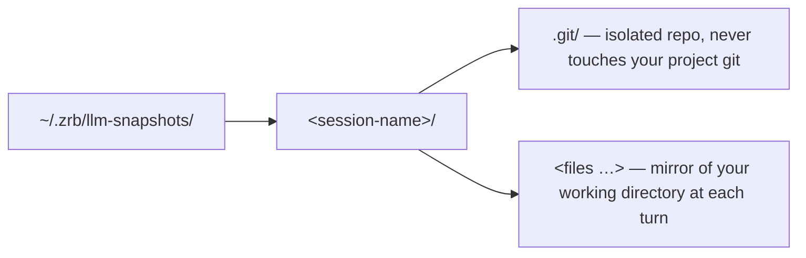
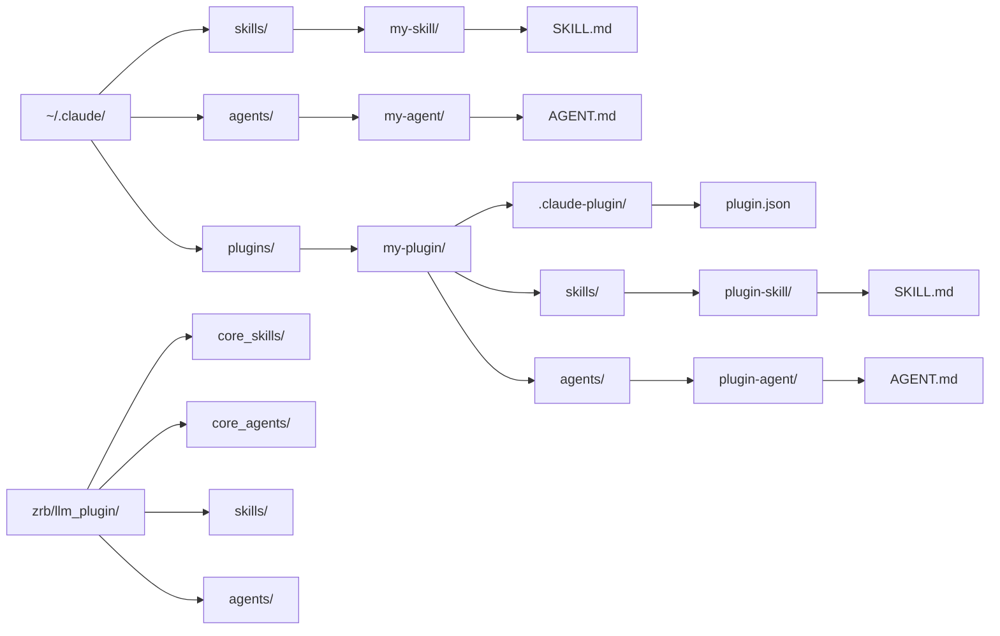

🔖 [Documentation Home](../../README.md) > [Configuration](./) > LLM & Rate Limiter

# LLM & Rate Limiter Configuration

Zrb uses `pydantic-ai` to interface with a wide array of Large Language Models, granting out-of-the-box compatibility with OpenAI, Anthropic, Google Vertex, Ollama, DeepSeek, and more. This document provides an exhaustive list of environment variables to configure Zrb's AI features.

`Model`, `ModelSettings`, and the pydantic-ai `capabilities` list accepted by `LLMTask`/`LLMChatTask` (see [Model, Model Settings & Capabilities](../task-types/llmchat-task.md#model-model-settings--capabilities)) are pydantic-ai's own types, passed through unchanged — for what each provider's `Model`/`ModelSettings` actually accept, [pydantic-ai's documentation](https://ai.pydantic.dev) is the source of truth. This page covers the zrb-side knobs layered on top: routing, credentials, rate limits, and the defaults zrb applies before handing settings to pydantic-ai.

---

## Table of Contents

- [Core LLM Routing](#1-core-llm-routing)
- [Rate Limiting & Token Budgets](#2-rate-limiting--token-budgets)
- [Summarization Thresholds](#3-summarization-thresholds)
- [System Prompts & Identity](#4-system-prompts--identity)
- [Journal & Context Storage](#5-journal--context-storage)
- [Rewind & Snapshots](#6-rewind--snapshots)
- [TUI Debugging](#7-tui-debugging)
- [Model Autocomplete](#8-model-autocomplete)
- [RAG Configuration](#9-rag-retrieval-augmented-generation-configuration)
- [Search Engine Configuration](#10-search-engine-configuration)
- [Hooks Configuration](#11-llm-hooks-configuration)
- [Skill & Agent Search Configuration](#12-skill--agent-search-configuration)
- [Timeout Configuration](#13-timeout-configuration)
- [Interval & Delay Configuration](#14-interval--delay-configuration)
- [Size & Limit Configuration](#15-size--limit-configuration)
- [Retry Configuration](#16-retry-configuration)
- [Slash Command Aliases](#17-slash-command-aliases)
- [Pagination Configuration](#18-pagination-configuration)
- [LSP Server Selection](#19-lsp-server-selection)
- [TUI Color Styles](#20-tui-color-styles)
- [Sandbox Configuration](#21-sandbox-configuration)
- [CLI Semantic Colors](#22-cli-semantic-colors)
- [Voice Dictation](#23-voice-dictation)

---

## 1. Core LLM Routing

These variables define which LLM Zrb uses for its primary reasoning and how it connects to the provider.

| Variable | Description | Default |
|----------|-------------|---------|
| `ZRB_LLM_MODEL` | Primary LLM model (`provider:model-name`) | `openai-chat:gpt-4o` (if unset) |
| `ZRB_LLM_SMALL_MODEL` | Faster model for background tasks | Falls back to `ZRB_LLM_MODEL` |
| `ZRB_LLM_MULTIMODAL_MODEL` | Model for multimodal tasks (image analysis) | `None` (no fallback) |
| `ZRB_LLM_API_KEY` | API key for your LLM provider | None |
| `ZRB_LLM_BASE_URL` | Custom endpoint URL | None |
| `ZRB_LLM_PERMISSIONS` | Tool permission ruleset. Empty keeps legacy yolo behavior. Accepts a shorthand (`allow`/`ask`/`deny`) or a comma-separated `key:action` list (e.g. `edit:deny,Shell:ask,*:allow`). First match wins. | (empty) |
| `ZRB_LLM_THINKING` | Cross-provider reasoning/thinking level — `minimal`/`low`/`medium`/`high`/`xhigh` for a specific effort, or `true`/`false` to enable/disable at the provider's default effort. Maps to pydantic-ai's unified `ModelSettings.thinking`, so it applies across OpenAI/Anthropic/Google/etc. without a per-provider setting. A provider-specific setting passed via a task's own `model_settings` (e.g. `openai_reasoning_effort`) still wins over this. | (unset — provider default) |

Every agent also gets `openai_reasoning_summary="auto"` and `openai_prompt_cache_retention="24h"` by default (silently ignored by non-OpenAI providers) — without a requested summary, OpenAI's reasoning models return only an opaque encrypted signature, no readable reasoning text at all. Override either, or add other OpenAI-specific settings (`openai_prompt_cache_key`, `openai_reasoning_effort`, …), via a task's own `model_settings=` — caller-supplied keys always win over these defaults.

### Supported Providers

Anything `ZRB_LLM_MODEL` names as `provider:model` is resolved by pydantic-ai, so every provider it ships works in zrb without registration. Providers that speak the OpenAI wire protocol need no extra at all — `openai` is a core zrb dependency. The rest bring their own vendor SDK.

**No extra needed** (OpenAI-compatible, or SDK-free):

| Provider | Model format | Credentials |
|----------|-------------|-------------|
| OpenAI | `openai:gpt-5` | `OPENAI_API_KEY` |
| Ollama | `ollama:llama3.1` | `OLLAMA_BASE_URL` (`OLLAMA_API_KEY` for Ollama Cloud) |
| DeepSeek | `deepseek:deepseek-reasoner` | `DEEPSEEK_API_KEY` |
| OpenRouter | `openrouter:anthropic/claude-opus-4.8` | `OPENROUTER_API_KEY` |
| Azure OpenAI | `azure:gpt-5` | `AZURE_OPENAI_API_KEY`, `AZURE_OPENAI_ENDPOINT` |
| Z.ai | `zai:glm-5` | `ZAI_API_KEY` |
| Moonshot AI | `moonshotai:kimi-k2-thinking` | `MOONSHOTAI_API_KEY` |
| Alibaba | `alibaba:qwen-max` | `ALIBABA_API_KEY` or `DASHSCOPE_API_KEY` |
| Cerebras | `cerebras:llama3.1-8b` | `CEREBRAS_API_KEY` |
| Together | `together:meta-llama/Llama-3-70b` | `TOGETHER_API_KEY` |
| Fireworks | `fireworks:accounts/fireworks/models/…` | `FIREWORKS_API_KEY` |
| Nebius | `nebius:…` | `NEBIUS_API_KEY` |
| OVHcloud | `ovhcloud:…` | `OVHCLOUD_API_KEY` |
| SambaNova | `sambanova:…` | `SAMBANOVA_API_KEY` |
| Snowflake Cortex | `snowflake:…` | `SNOWFLAKE_ACCOUNT`, `SNOWFLAKE_TOKEN` |
| Heroku | `heroku:…` | `HEROKU_INFERENCE_KEY` |
| Vercel AI Gateway | `vercel:…` | `VERCEL_AI_GATEWAY_API_KEY` or `VERCEL_OIDC_TOKEN` |
| LiteLLM | `litellm:…` | per your LiteLLM config |

**Extra required** (vendor SDK):

| Provider | Model format | Extra (pipx) | Credentials |
|----------|-------------|--------------|-------------|
| Anthropic | `anthropic:claude-opus-4-8` | `zrb[anthropic]` | `ANTHROPIC_API_KEY` |
| Google (Gemini API) | `google:gemini-2.5-pro` | `zrb[google]` | `GOOGLE_API_KEY` or `GEMINI_API_KEY` |
| Google Vertex | `google-cloud:gemini-2.5-pro` | `zrb[google,vertexai]` | `GOOGLE_APPLICATION_CREDENTIALS`, `GOOGLE_CLOUD_PROJECT` |
| Groq | `groq:llama3-8b-8192` | `zrb[groq]` | `GROQ_API_KEY` |
| Mistral | `mistral:mistral-large-latest` | `zrb[mistral]` | `MISTRAL_API_KEY` |
| xAI | `xai:grok-4` | `zrb[xai]` | `XAI_API_KEY` |
| AWS Bedrock | `bedrock:anthropic.claude-…` | `zrb[bedrock]` | standard AWS credentials |
| Bedrock Mantle | `bedrock-mantle:…` | `zrb[bedrock]` | `AWS_BEARER_TOKEN_BEDROCK`, `AWS_REGION` |
| Cohere | `cohere:command-r-plus` | `zrb[cohere]` | `CO_API_KEY` |
| Hugging Face | `huggingface:…` | `zrb[huggingface]` | `HF_TOKEN` |

> 💡 **Google Vertex auth extra:** Vertex AI (as opposed to the plain Gemini API) additionally needs the `vertexai` extra (`google-auth`, `pyasn1`) for its authentication flow — `pipx install "zrb[google,vertexai]"`.

> 💡 **Any OpenAI-compatible endpoint** that is not in the list works through `ZRB_LLM_BASE_URL` + `ZRB_LLM_API_KEY` with a bare model name (no `provider:` prefix) — that is the path a self-hosted vLLM, LM Studio, or company gateway takes.

> 💡 **Add extras after install:** If zrb is already installed via pipx, use `pipx inject zrb "zrb[anthropic]"` (or whichever extra you need) instead of reinstalling.

### Python API: Model Getter & Renderer

For advanced scenarios — model tiering, A/B routing, or custom provider wrapping — `LLMConfig` exposes two callable hooks that are applied throughout the entire model pipeline:

| Property | Receives | Returns | Purpose |
|----------|----------|---------|---------|
| `model_getter` | Base model (`str \| Model`) | Active model | Decide which model to actually use per request (e.g., tier switching, A/B testing) |
| `model_renderer` | Active model | Final pydantic-ai model | Wrap the model into a pydantic-ai `Model` object or translate tier names to real model strings |

`resolve_model(base_model=None)` applies both in sequence and is used internally throughout all agent creation paths.

```python
from zrb.llm.config.config import llm_config

# Example: translate a logical tier name to the real configured model
def my_renderer(model):
    tier_map = {
        "my:model-pro":   "openai:gpt-4o",
        "my:model-flash": "openai:gpt-4o-mini",
    }
    return tier_map.get(model, model)

llm_config.model_renderer = my_renderer
```

Setting hooks on `llm_config` applies them **globally** to every agent Zrb creates, including:

- The main `LLMTask` / `LLMChatTask` agent (when no task-level hooks override them)
- Background summarizer agents (conversational history compressor, per-message compressor)
- Sub-agent tools: web-page summarizer (`open_web_page`), code analyzer (`analyze_code`), file extractor
- Sub-agent manager agents

Task-level `model_getter` / `model_renderer` (set directly on an `LLMTask` or `LLMChatTask`) take **precedence** over the config-level defaults.

```python
from zrb import LLMChatTask
from zrb.llm.config.config import llm_config

# Config-level: affects all agents (including sub-agents)
llm_config.model_getter = lambda m: "openai:gpt-4o-mini"

# Task-level: overrides only this task's main agent; sub-agents still use config-level
task = LLMChatTask(
    name="chat",
    model_getter=lambda m: "openai:gpt-4o",  # overrides config for this task only
)
```

---

## 2. Rate Limiting & Token Budgets

To prevent runaway AI loops, manage API costs, and stay within provider limits, Zrb enforces strict, configurable rate limits and token budgets.

| Variable | Description | Default |
|----------|-------------|---------|
| `ZRB_LLM_MAX_REQUEST_PER_MINUTE` | Max API requests per minute | `60` |
| `ZRB_LLM_MAX_REQUEST_PER_RUN` | Max model requests in one agent run before it halts — the backstop for a run that stops converging. `0` disables. | `300` |
| `ZRB_LLM_MAX_TOKEN_PER_MINUTE` | Max tokens processed per minute | `128000` |
| `ZRB_LLM_MAX_TOKEN_PER_REQUEST` | Hard context window limit. The effective per-request budget is the **lower** of this and the model's known context window (`gpt-4o` 128k, `gpt-4.1` 1M, Claude 3/4 200k, Gemini 1.5/2/3 1M); models zrb doesn't recognise keep this cap. | `128000` |
| `ZRB_LLM_THROTTLE_SLEEP` | Seconds to pause when rate-limited | `1.0` |
| `ZRB_ENABLE_TIKTOKEN` | Use tiktoken for accurate counting | `off` (false) |
| `ZRB_TIKTOKEN_ENCODING` | Tiktoken encoding scheme | `cl100k_base` |

---

## 3. Summarization Thresholds

Zrb automatically triggers background summarization agents when conversation history or individual message sizes grow too large.

| Variable | Description | Default |
|----------|-------------|---------|
| `ZRB_LLM_CONVERSATIONAL_SUMMARIZATION_TOKEN_THRESHOLD` | Token count triggering full history summarization | 60% of `MAX_TOKEN_PER_REQUEST` |
| `ZRB_LLM_MESSAGE_SUMMARIZATION_TOKEN_THRESHOLD` | Token count triggering individual message summarization | 50% of conversational threshold |
| `ZRB_LLM_HISTORY_SUMMARIZATION_WINDOW` | Recent messages to keep verbatim | `100` |

The same mechanism guards repository- and file-analysis tools so a single large read can't blow the context window. Each is clamped to a fraction of `MAX_TOKEN_PER_REQUEST`:

| Variable | Description | Default |
|----------|-------------|---------|
| `ZRB_LLM_REPO_ANALYSIS_EXTRACTION_TOKEN_THRESHOLD` | Token count above which repo-analysis content is extracted in chunks | 40% of `MAX_TOKEN_PER_REQUEST` |
| `ZRB_LLM_REPO_ANALYSIS_SUMMARIZATION_TOKEN_THRESHOLD` | Token count triggering summarization of repo-analysis results | 40% of `MAX_TOKEN_PER_REQUEST` |
| `ZRB_LLM_FILE_ANALYSIS_TOKEN_THRESHOLD` | Token count above which a single file's analysis is summarized | 40% of `MAX_TOKEN_PER_REQUEST` |

---

## 4. System Prompts & Identity

You can heavily customize the LLM's behavior and identity by overriding its system prompts.

### Identity Variables

| Variable | Description | Default |
|----------|-------------|---------|
| `ZRB_LLM_ASSISTANT_NAME` | Display name for AI assistant | `Zrb` |
| `ZRB_LLM_ASSISTANT_JARGON` | Tagline or motto | Root group description |
| `ZRB_LLM_ASSISTANT_ASCII_ART` | ASCII banner art name | `default` (built-in) |
| `ZRB_ASCII_ART_DIR` | Directory for custom ASCII art files | `.zrb/ascii-art` |

### Prompt Customization Hierarchy

Zrb loads prompts with a multi-level override system (first found wins):

| Priority | Location | Description |
|----------|----------|-------------|
| 1 (highest) | `ZRB_LLM_PROMPT_DIR` | Local directory override |
| 2 | `ZRB_LLM_PROMPT_<NAME>` | Environment variable |
| 3 | `ZRB_LLM_BASE_PROMPT_DIR` | Shared/org directory |
| 4 (lowest) | Package default | Built-in prompts |

### Overridable Prompts

- `persona`
- `principle`
- `workflow`
- `example`
- `profile` (always resolves as `profile.{name}.md`; see [Prompt Profile](#prompt-profile-matching-the-prompt-to-the-model))
- `conversational_summarizer`
- `message_summarizer`
- `file_extractor`
- `repo_extractor`
- `repo_summarizer`
- `web_summarizer`

### Prompt Component Configuration

The system prompt is assembled from an **ordered list of sections**. The list is read from `ZRB_LLM_INCLUDE_SECTIONS` (comma-separated). Order in the list controls the order each section appears in the prompt — drop a section by removing its name; reorder by rewriting the list.

| Variable | Description | Default |
|----------|-------------|---------|
| `ZRB_LLM_INCLUDE_SECTIONS` | Comma-separated, order-sensitive list of sections to include | `persona,principle,workflow,example,profile,system_context,project_context` |
| `ZRB_LLM_PROMPT` | Comma-separated extra prompts appended after every built-in section — the env twin of `prompt_registry` (ADR-0091). Empty means none. Content that won't fit a comma value (callables, structured middleware) belongs in `zrb_init.py` via `prompt_registry`. See [LLM Component Collections](./llm-collections.md). | (empty) |

Recognised section names:

| Section | Purpose |
|---------|---------|
| `persona` | AI identity + response style |
| `principle` | The operating principle underlying the rules |
| `workflow` | The whole rulebook: priority order, turn sequence, skill activation, working loop, verify gate, tool usage, recovery |
| `example` | Answer-scale and stance demonstrations |
| `profile` | Model-class calibration (autonomy register) — resolved as `profile.{name}.md` |
| `system_context` | Stable runtime facts (OS / CWD / model / detected tools) |
| `project_context` | Project docs (`AGENTS.md`, `CLAUDE.md`, `README.md`, …) |

> The skill catalogue (core skills, other available skills, and active-skill contents) is part of the `workflow` section, injected via `{CORE_SKILLS}`/`{AVAILABLE_SKILLS}`/`{PREACTIVATED_SKILLS}` placeholders — it is not a separate section. Each list is capped by `LLM_MAX_SKILLS_IN_CATALOG`; an overflow is truncated with a pointer to the `SearchSkill` tool, which finds any skill on demand.
>
> Per-tool rules are not a section either: they live in each tool's docstring, which ships with the tool schema on every request (ADR-0045).

> Volatile per-turn state (time, git status, todos, worktree, interactivity) is **not** a section — it is injected into the latest user turn as a `<live-context>` block so the cached system prompt stays byte-stable.

Examples:

```bash
# Strip demonstrations and project context (e.g. for benchmark runners).
export ZRB_LLM_INCLUDE_SECTIONS="persona,workflow,system_context"

# Personality-only: just persona.
export ZRB_LLM_INCLUDE_SECTIONS="persona"
```

To toggle a single section programmatically, mutate `CFG.LLM_INCLUDE_SECTIONS` directly (it is a `list[str]`).

These are the **built-in** sections. A name that is not one of them resolves to nothing: a warning is logged at compose time, and the section is skipped — so a misspelled name is diagnosable rather than silently dropped. There are no user-defined system-prompt sections; for extra content see [Programmatic Prompt Customization](#programmatic-prompt-customization) below.

### Prompt Profile (matching the prompt to the model)

`ZRB_LLM_INCLUDE_SECTIONS` controls *which* sections appear. `ZRB_LLM_PROFILE` selects one of three profiles — `minimal`, `standard`, or `capable` — that adjust the final `profile` section, and for `minimal` only, drop the delegate (sub-agent) tools (ADR-0049).

| Variable | Description | Default |
|----------|-------------|---------|
| `ZRB_LLM_PROFILE` | Prompt profile: `minimal`, `standard`, `capable`, or `auto` | `standard` |

| Profile | `profile` section | Delegate tools |
|---------|-------------------|----------------|
| `minimal` | `profile.minimal.md` — concise, one clear next action | not registered |
| `standard` | `profile.standard.md` — balance autonomy with clear communication | registered |
| `capable` | `profile.capable.md` — strong ownership of substantial work | registered |

A profile selects exactly one file, `profile.{name}.md`, composed as the `profile` section. It does **not** change the `persona` / `principle` / `workflow` / `example` sections (they ship the same wording for every profile) or any other tool. `minimal` is for very small models (~3B): delegating to a sub-agent is a second-order capability such a model cannot use well and is pure token cost otherwise (ADR-0058), so the built-in chat task registers the delegate tools only outside `minimal`.

`auto` — the value that delegates the choice to the model id — never guesses from a family name (`deepseek`, `qwen`, `llama` each span tiny→frontier). It reads a **stated size**:

| Profile | `auto` selects it when |
|---------|------------------------|
| `minimal` | a stated count of 4B or less — `qwen2.5:3b`, `deepseek-r1:1.5b`, `qwen2.5:0.5b`; or a small-tier label served locally — `ollama:phi4-mini`, `lmstudio:gemma-tiny` |
| `standard` | a stated count above 4B and up to 14B — `qwen3-12b`, `llama-3-8b`; or an id that declares nothing |
| `capable` | a stated count above 14B — `llama-3-70b`, `llama-3.1-405b` |

The count is read as a **number**, so a fractional size means what it says: `1.5b` is 1.5B, not 5B. Where an id states two counts the first wins, which is how an MoE id reads as its total rather than its active parameters (`qwen3-30b-a3b` → 30B → `capable`). A stated count also outranks a label, so `some-mini-32b` stays `capable`.

A label **alone** never selects `minimal`, because `nano`/`tiny` sit on models (`gpt-5-nano`) far more capable than a 3B local one. A label plus a **local provider prefix** does: `ollama:`, `lmstudio:`, `llamacpp:` and `localai:` say who is serving the model, and `ollama:phi4-mini` is 3.8B of weights on a laptop where `openai:gpt-5-nano` is the entry tier of a hosted family. Ollama's own hosted tier is excluded by its `:cloud` suffix, so `ollama:kimi-k2.6:cloud` stays `standard`.

Force a profile globally:

```bash
export ZRB_LLM_PROFILE=minimal
```

An explicit name is **stable**: it never changes with the model. Only `auto` follows the model, so a model swap cannot silently change behavior in a configuration that names a profile. An unrecognized `ZRB_LLM_PROFILE` value falls through to the default (`standard`), keeping a stale environment value from breaking prompt construction.

### Programmatic Prompt Customization

Beyond editing prompt files and env vars, each task exposes its `PromptManager` via the public `task.prompt_manager` property. It offers three programmatic ways to shape the system prompt, in increasing power. The same API exists at registry scope: `prompt_registry.set_prompts` / `append_prompt` from `zrb_init.py` changes the **default every** task starts from (`PromptManager(prompts=None)` defers there), and a task-level `prompts=` argument or mutation overrides just that host — see [LLM Component Collections](./llm-collections.md) for the resolution order.

**1. Append custom instructions** — `append_prompt()` adds content that is emitted **after** all built-in sections. Accepts a static string, a `Callable[[AnyContext], str]` for runtime-dynamic text, or a *full middleware* `Callable[[ctx, current_prompt, next], str]` that can rewrite the entire assembled prompt before passing it on (middleware is detected by arity — 3+ parameters):

```python
from zrb import LLMChatTask

task = LLMChatTask(name="chat")

# Static text
task.prompt_manager.append_prompt("Always answer in British English.")

# Dynamic text — receives the active context
import datetime
def date_note(ctx) -> str:
    return f"Today's date is {datetime.date.today():%Y-%m-%d}."
task.prompt_manager.append_prompt(date_note)

# Full middleware — `current_prompt` is everything assembled so far
def strip_blank_lines(ctx, current_prompt, nxt):
    cleaned = "\n".join(line for line in current_prompt.splitlines() if line.strip())
    return nxt(ctx, cleaned)
task.prompt_manager.append_prompt(strip_blank_lines)
```

**2. Live per-turn context** — `add_live_context(name, provider)` registers a `Callable[[AnyContext], str]` whose non-empty output is appended to the `<live-context>` block injected into the latest user turn. Use it for always-on content that must reflect live state (time, git status, deploy target). Return `""` to emit nothing:

```python
task.prompt_manager.add_live_context(
    "deploy_target",
    lambda ctx: f"Deploy target: {resolve_target()}",
)
```

A live-context provider is an extension point, so it must never take the prompt down with it: a provider that throws is logged and skipped.

**3. Override a built-in prompt file** — wording ships as files, so the no-Python way to change it is to place a same-named file higher on the lookup path (project dir → `ZRB_LLM_PROMPT_<NAME>` → base dir → package; the overridable names are listed under [Overridable Prompts](#overridable-prompts)). For example, put `persona.md` in the directory `ZRB_LLM_PROMPT_DIR` points to and it replaces the packaged persona wording. A *new* name in `include_sections` does not resolve to a file — the built-in section set is fixed, and an unknown name is warned and skipped (ADR-0044).

### Telling the LLM about a custom tool

What a tool does, what its arguments mean, and which tool to reach for instead all live in the tool's own **docstring** — pydantic-ai serializes it with the JSON schema on every request, so the model reads it next to the arguments it is filling in (ADR-0045):

```python
from zrb import LLMChatTask

def check_stock(warehouse_id: str, sku: str) -> dict:
    """Look up on-hand stock for one SKU in one warehouse.

    Always pass warehouse_id — a lookup without it scans every site and times
    out. An empty result means no stock on hand, not an error.
    """
    ...

task = LLMChatTask(name="chat")
task.append_tool(check_stock)
```

Note this relocates token cost rather than removing it: a docstring ships every turn, exactly as the guidance section did. The lever on prompt weight is the **number** of registered tools — use `Tool(fn, defer_loading=True)` for tools that are rarely needed, so their schema only materializes once the model searches for them.

For cross-cutting policy that is not about any one tool, append it to the prompt instead (it lands after the built-in sections, before the user's first message):

```python
task.prompt_manager.append_prompt(
    "## Inventory rules\n- Never quote stock without a warehouse."
)
```

### Restricting the toolbox (`ZRB_LLM_TOOLS`)

`ZRB_LLM_TOOLS` is the env twin of `tool_registry` (ADR-0091): a **name allowlist** of static tools the agents may call. Empty (the default) means all built-in + registered tools; non-empty keeps only the named ones.

```bash
export ZRB_LLM_TOOLS="Shell,Read,Write,Grep,Glob,TodoWrite"
```

The names are the registered PascalCase tool names (the `Tool` column in [Built-in LLM Tools](../advanced-topics/extending-the-llm.md#built-in-llm-tools)). Per-run factory and toolset tools are not name-known statically, so the allowlist governs the static set only. Finer edits — add a custom tool, drop a shipped one — belong in `zrb_init.py` via `tool_registry`; see [LLM Component Collections](./llm-collections.md).

---

## 5. Journal & Context Storage

| Variable | Description | Default |
|----------|-------------|---------|
| `ZRB_LLM_JOURNAL_ENABLED` | Master switch for the journal. `false` unregisters the three journal tools (`SearchJournal`, `LogActivity`, `WriteJournalNote`) and suppresses the `<journal-index>` injection. Those tools are the whole interface — there is no journal prompt section — so the model is never told a journal exists (ADR-0055). Note `ZRB_LLM_JOURNAL_DIR` has no "off" value: clearing it falls back to the default path rather than disabling anything | `on` |
| `ZRB_LLM_JOURNAL_DIR` | Long-term notes directory | `~/.zrb/llm-notes/` |
| `ZRB_LLM_JOURNAL_INDEX_FILE` | Main index file name | `index.md` |
| `ZRB_LLM_JOURNAL_INDEX_MAX_CHARS` | Max characters of the index injected into context. Overflow is dropped from the **end** on a line boundary, so write the index most-durable-first. `0` suppresses the injection; a negative value injects it uncapped | `2500` |
| `ZRB_LLM_JOURNAL_HUD_MAX_ENTRIES_PER_SECTION` | Max `hud_line` entries kept per root-index HUD section (User, Preferences, Active Constraints); oldest evicted first so a stale preference doesn't sit in the always-injected index forever. `<= 0` disables the cap | `20` |
| `ZRB_LLM_JOURNAL_AUTO_SEARCH_ENABLED` | Run one `SearchJournal` against the opening message on a session's first turn, folding any hits into the injected `<journal-index>` block under a separate, unverified "Possibly Related" section. Costs one extra search subprocess, once per session | `on` |
| `ZRB_LLM_JOURNAL_AUTO_SEARCH_MAX_HITS` | Max `SearchJournal` hits folded into the first-turn auto-search | `3` |
| `ZRB_LLM_JOURNAL_GIT_ENABLED` | Git-back the journal directory: `git init` on first use, and commit after every `LogActivity`/`WriteJournalNote`/`DeleteJournalNote` call. Gives the journal unbounded, diffable history and makes a delete or bad overwrite recoverable by a human outside the tools (the in-file History block only keeps the last 3 revisions). Best-effort — a missing `git` binary or a failed commit never breaks journaling, it just forgoes the commit | `on` |
| `ZRB_LLM_HISTORY_DIR` | Conversation history directory | `~/.zrb/llm-history/` |
| `ZRB_LLM_HISTORY_BACKUP_RETAIN` | Number of timestamped history backups to keep per conversation (`-1` = keep all, `0` = disable) | `3` |
| `ZRB_LLM_SUBAGENT_HISTORY_RETAIN` | Max persisted delegated sub-agent sessions kept on disk across all agent types (`-1` = keep every one); the oldest are pruned on each new delegation. Every delegation writes a transcript under `ZRB_LLM_HISTORY_DIR/subagent/<agent-type>/` | `50` |

---

## 6. Rewind & Snapshots

Zrb can take a full filesystem snapshot before each AI turn, letting you restore any previous state mid-session with `/rewind`.

**How it works:**

1. Before each AI response, Zrb copies your working directory into an isolated shadow git repository (`<ZRB_LLM_SNAPSHOT_DIR>/<session-name>/`).
2. Each snapshot is a git commit in that shadow repo — completely separate from your project's own git history.
3. `/rewind` lists all snapshots; `/rewind <n>` or `/rewind <sha>` restores both the filesystem and conversation history to the selected point.

> **Note:** Rewind is off by default. Enable it only for sessions where you want undo capability — snapshotting a large working directory (e.g., one containing `node_modules/`) will be slow.

| Variable | Description | Default |
|----------|-------------|---------|
| `ZRB_LLM_ENABLE_REWIND` | Enable filesystem snapshots and `/rewind` command | `off` |
| `ZRB_LLM_SNAPSHOT_DIR` | Directory to store shadow git repos for each session | `~/.zrb/llm-snapshots/` |

### Python API

```python
from zrb import LLMChatTask

task = LLMChatTask(
    name="chat",
    enable_rewind=True,           # None → falls back to ZRB_LLM_ENABLE_REWIND
    snapshot_dir="/tmp/my-snaps", # None → falls back to ZRB_LLM_SNAPSHOT_DIR
)
```

### `/rewind` commands

| Input | Effect |
|-------|--------|
| `/rewind` | List all snapshots (newest first) with index, short SHA, timestamp, and user message |
| `/rewind <n>` | Restore snapshot number `n` from the list (1-based) |
| `/rewind <sha>` | Restore by full or partial SHA |

Restore rewinds **both** the working directory files **and** the conversation history to the state captured at that snapshot, so the AI's context stays consistent with the restored files.

### Shadow repo layout



---

## 7. TUI Debugging

| Variable | Description | Default |
|----------|-------------|---------|
| `ZRB_LLM_SHOW_TOOL_CALL_DETAIL` | Print tool arguments before execution | `off` |
| `ZRB_LLM_SHOW_TOOL_CALL_RESULT` | Print raw tool return values | `off` |

---

## 8. Model Autocomplete

When using the `/model` command in LLM chat, Zrb provides autocomplete suggestions from different model sources. These variables control which sources appear in the suggestions.

| Variable | Description | Default |
|----------|-------------|---------|
| `ZRB_LLM_SHOW_OLLAMA_MODELS` | Include Ollama models in autocomplete | `on` |
| `ZRB_LLM_SHOW_PYDANTIC_AI_MODELS` | Include pydantic-ai KnownModelName models in autocomplete | `on` |

### Python API

```python
from zrb import LLMChatTask

task = LLMChatTask(
    name="chat",
    show_ollama_models=False,        # None → falls back to ZRB_LLM_SHOW_OLLAMA_MODELS
    show_pydantic_ai_models=False,    # None → falls back to ZRB_LLM_SHOW_PYDANTIC_AI_MODELS
)
```

### Use Cases

- **Disable Ollama models** when Ollama is not installed or not running, to avoid connection errors during autocomplete
- **Disable pydantic-ai models** to show only custom model names configured via `custom_model_names` parameter

---

## 9. RAG (Retrieval-Augmented Generation) Configuration

For advanced RAG capabilities with vector databases like ChromaDB.

| Variable | Description | Default |
|----------|-------------|---------|
| `ZRB_RAG_EMBEDDING_API_KEY` | API key for embedding service | None |
| `ZRB_RAG_EMBEDDING_BASE_URL` | Embedding API URL | None |
| `ZRB_RAG_EMBEDDING_MODEL` | Embedding model | `text-embedding-ada-002` |
| `ZRB_RAG_CHUNK_SIZE` | Text chunk size | `1024` |
| `ZRB_RAG_OVERLAP` | Chunk overlap size | `128` |
| `ZRB_RAG_MAX_RESULT_COUNT` | Max search results | `5` |

---

## 10. Search Engine Configuration

These variables control which internet search engine Zrb's LLM tools use.

| Variable | Description | Default |
|----------|-------------|---------|
| `ZRB_SEARCH_INTERNET_METHOD` | Search engine (`google_rss`, `serpapi`, `brave`, `searxng`) | `google_rss` |

### Google News RSS (Default)

Free, no API key, no Docker required. Fetches results from Google News RSS feed. No additional configuration needed.

### SerpAPI (Google)

| Variable | Description | Default |
|----------|-------------|---------|
| `SERPAPI_KEY` | API key | (required) |
| `SERPAPI_LANG` | Language | `en` |
| `SERPAPI_SAFE` | Safe search | `off` |

### Brave Search

| Variable | Description | Default |
|----------|-------------|---------|
| `BRAVE_API_KEY` | API key | (required) |
| `BRAVE_API_LANG` | Language | `en` |
| `BRAVE_API_SAFE` | Safe search | `off` |

### SearXNG (Self-hosted)

| Variable | Description | Default |
|----------|-------------|---------|
| `ZRB_SEARXNG_PORT` | Port | `8080` |
| `ZRB_SEARXNG_BASE_URL` | Base URL | `http://localhost:8080` |
| `ZRB_SEARXNG_LANG` | Language | `en-US` |
| `ZRB_SEARXNG_SAFE` | Safe search | `0` |

---

## 11. LLM Hooks Configuration

| Variable | Description | Default |
|----------|-------------|---------|
| `ZRB_HOOKS_ENABLED` | Enable the hook system globally; set `off` to disable all hooks (none load or fire) | `on` |
| `ZRB_HOOKS_DIRS` | Additional hook directories (colon-separated) | (empty) |
| `ZRB_HOOKS_TIMEOUT` | Default timeout for hook execution (ms) | `30000` |
| `ZRB_LLM_HOOKS` | Name allowlist for the hooks zrb dispatches — the env twin of `hook_registry` (ADR-0091). Empty means all registered hooks; non-empty restricts dispatch to the named hooks (e.g. `journal-compliance-judge`). Finer edits (a hook with a matcher, command config) live in `zrb_init.py` via `hook_registry`. See [LLM Component Collections](./llm-collections.md). | (empty) |

---

## 12. Skill & Agent Search Configuration

These variables control where Zrb searches for skills and agents, and whether the built-in ones are loaded.

| Variable | Description | Default |
|----------|-------------|---------|
| `ZRB_LLM_SEARCH_PROJECT` | Search project dirs (filesystem root → cwd) for config dir names | `on` |
| `ZRB_LLM_SEARCH_HOME` | Search home directory (`~/.claude/`, `~/.zrb/`) | `on` |
| `ZRB_LLM_ENABLE_BUILTIN_SKILLS` | Load the built-in utility skills (`llm_plugin/skills`). Core skills (`core_skills/`) are always on; user/project/plugin skills are unaffected | `on` |
| `ZRB_LLM_ENABLE_BUILTIN_AGENTS` | Load optional built-in sub-agents (`llm_plugin/agents`). Core agents (`core_agents/`) are always on; user/project/plugin agents are unaffected | `on` |
| `ZRB_LLM_SKILLS` | Name allowlist for the visible skill catalogue — the env twin of `skill_registry` (ADR-0091). Empty means all discovered + built-in skills; non-empty keeps only the named ones (`LLM_ENABLE_BUILTIN_SKILLS` still gates built-ins independently). See [LLM Component Collections](./llm-collections.md). | (empty) |
| `ZRB_LLM_AGENTS` | Name allowlist for the sub-agent roster — the env twin of `sub_agent_registry` (ADR-0091). Empty means all discovered + built-in agents; non-empty keeps only the named ones. See [LLM Component Collections](./llm-collections.md). | (empty) |
| `ZRB_LLM_CONFIG_DIR_NAMES` | Config subdirectory names to look for in each dir (colon-separated) | `.claude:.zrb` |
| `ZRB_LLM_BASE_SEARCH_DIRS` | Explicit base dirs containing `skills/`, `agents/`, `plugins/` | (empty) |
| `ZRB_LLM_EXTRA_SKILL_DIRS` | Additional direct skill directories | (empty) |
| `ZRB_LLM_EXTRA_AGENT_DIRS` | Additional direct agent directories | (empty) |
| `ZRB_LLM_PLUGIN_DIRS` | Additional plugin directories | (empty) |

### Search Priority

Zrb searches for skills/agents in this order (highest to lowest priority):

1. **User Home** - `~/.claude/`, `~/.zrb/` + plugins within
2. **Project Traversal** - Filesystem root → cwd for each config dir name + plugins within
3. **Configured Plugins** - Directories in `ZRB_LLM_PLUGIN_DIRS`
4. **Base Search Dirs** - Directories in `ZRB_LLM_BASE_SEARCH_DIRS` + plugins within
5. **Extra Direct Dirs** - `ZRB_LLM_EXTRA_SKILL_DIRS`, `ZRB_LLM_EXTRA_AGENT_DIRS`
6. **Core Builtins** - `core_skills/` and `core_agents/` (always included)
7. **Optional Builtins** - `skills/` and `agents/` (controlled by their built-in toggles)

### Directory Structure



---

## 13. Timeout Configuration

All timeout values are in **milliseconds** unless the row says otherwise. Divide by 1000 to convert to seconds.

| Variable | Description | Default |
|----------|-------------|---------|
| `ZRB_LLM_SSE_KEEPALIVE_TIMEOUT` | How long to wait before sending an SSE keepalive ping (ms) | `60000` |
| `ZRB_WEB_SHUTDOWN_TIMEOUT` | Graceful web server shutdown timeout (ms) | `10000` |
| `ZRB_LLM_REQUEST_TIMEOUT` | Deadline for a single model request, applied to every agent (main, sub-agent, programmatic). Guards against a provider that accepts the connection and then stops sending, which no retry can detect. `0` disables. (ms) | `300000` |
| `ZRB_LLM_INPUT_QUEUE_TIMEOUT` | Polling interval for the chat input queue (ms) | `500` |
| `ZRB_LLM_SHELL_KILL_WAIT_TIMEOUT` | Time to wait for a shell process to exit after SIGTERM before SIGKILL (ms) | `5000` |
| `ZRB_LLM_BACKGROUND_WAIT_MAX` | Max time a single `GetDelegationResult`/`MonitorProcess` `wait=` call may block before returning "still running" (**seconds**, not ms) | `300` |
| `ZRB_LLM_WEB_PAGE_TIMEOUT` | Playwright page load timeout (ms) | `30000` |
| `ZRB_LLM_WEB_HTTP_TIMEOUT` | HTTP request timeout for web tools and search (ms) | `30000` |
| `ZRB_LLM_MODEL_FETCH_TIMEOUT` | Timeout for fetching Ollama model list (ms) | `5000` |
| `ZRB_CMD_CLEANUP_TIMEOUT` | Time to wait for a process to exit after interrupt before killing (ms) | `2000` |
| `ZRB_LLM_GIT_CMD_TIMEOUT` | Timeout for the git commands that build live/system context — branch, status, log, and the is-a-git-dir probe (ms). Does not apply to agent-invoked git work (snapshots, worktrees). | `5000` |

---

## 14. Interval & Delay Configuration

All interval and delay values are in **milliseconds**.

| Variable | Description | Default |
|----------|-------------|---------|
| `ZRB_LLM_UI_STATUS_INTERVAL` | Polling interval for the TUI status loop (ms) | `1000` |
| `ZRB_LLM_UI_LONG_STATUS_INTERVAL` | Interval for updating slow-changing info (CWD, git branch) in TUI (ms) | `60000` |
| `ZRB_LLM_UI_REFRESH_INTERVAL` | Prompt-toolkit application refresh rate (ms) | `500` |
| `ZRB_LLM_UI_FLUSH_INTERVAL` | How often buffered output is flushed to event-driven UIs (ms) | `500` |
| `ZRB_SCHEDULER_TICK_INTERVAL` | How often the Scheduler task checks its cron pattern (ms) | `60000` |
| `ZRB_HTTP_CHECK_INTERVAL` | Default polling interval for `HttpCheck` tasks (ms) | `5000` |
| `ZRB_TCP_CHECK_INTERVAL` | Default polling interval for `TcpCheck` tasks (ms) | `5000` |
| `ZRB_TASK_READINESS_DELAY` | Initial delay before starting readiness checks (ms) | `500` |

---

## 15. Size & Limit Configuration

| Variable | Description | Default |
|----------|-------------|---------|
| `ZRB_LLM_MAX_COMPLETION_FILES` | Maximum files scanned for path autocompletion | `5000` |
| `ZRB_LLM_MAX_OUTPUT_CHARS` | Maximum characters returned by shell command and file read tools | `100000` |
| `ZRB_LLM_MAX_CONSOLE_OUTPUT_CHARS` | Cap (characters) on how much of a shell command's output is mirrored to the console. Separate from `ZRB_LLM_MAX_OUTPUT_CHARS`, which caps what the model sees: a human watching a build wants far more scrollback than the model needs, but neither wants a runaway command echoed line by line. Beyond the cap the output is still captured and still reaches the model. | `1000000` |
| `ZRB_LLM_MAX_TOOL_RESULT_CHARS` | Global model-facing tool-result threshold in characters. With `ZRB_LLM_ENABLE_TOOL_SPILL=on`, results above it are losslessly spilled to a private local store and replaced by a preview and `ReadToolResult` handle; otherwise they are flagged `oversized` in app-only metadata and passed through. `0` disables both behaviors. | `100000` |
| `ZRB_LLM_ENABLE_TOOL_SPILL` | Enables lossless spill for tool results above `ZRB_LLM_MAX_TOOL_RESULT_CHARS`. The full payload is stored under the system temp directory and can be paged or literal-substring-filtered through `ReadToolResult`; off by default. | `off` |
| `ZRB_LLM_HISTORY_MAX_DISPLAY_CHARS` | Maximum characters shown by the `/history` command | `5000` |
| `ZRB_LLM_HISTORY_TRUNCATE_LENGTH` | Maximum chars per field when formatting history entries | `100` |
| `ZRB_LLM_MAX_IMAGE_DIMENSION` | Longest-edge cap (pixels) for attached images before sending to LLM | `1568` |
| `ZRB_LLM_IMAGE_JPEG_QUALITY` | JPEG quality (1-95) for re-encoding photos; PNGs are unaffected | `85` |
| `ZRB_LLM_MAX_ATTACHMENT_BYTES` | Maximum file size (bytes) accepted by `/attach` and the other attachment paths (web chat upload, chat-telegram example) — checked before the file is read. `0` or negative disables the cap. | `20000000` |
| `ZRB_CMD_BUFFER_LIMIT` | Asyncio subprocess read-buffer limit in bytes | `102400` |
| `ZRB_LLM_UI_MAX_BUFFER_SIZE` | Maximum buffered output chars before a forced flush (event-driven UIs) | `2000` |
| `ZRB_LLM_MAX_SKILLS_IN_CATALOG` | How many model-invocable skills the prompt's skill catalogue lists before truncating with a pointer to `SearchSkill`. The full catalogue is always reachable on demand via `SearchSkill`, so this is a token-economy cap, not a hard limit. `0` or a negative value disables the cap, listing the whole catalogue. | `10` |
| `ZRB_LLM_MAX_AGENTS_IN_ROSTER` | How many sub-agents the delegation tools' AVAILABLE AGENTS roster lists before truncating with a pointer to `SearchAgent`. The full roster is always reachable on demand via `SearchAgent`, so this is a token-economy cap, not a hard limit. `0` or a negative value disables the cap, listing the whole roster. | `10` |
| `ZRB_LLM_MAX_PARALLEL_DELEGATIONS` | Maximum sub-agent tasks `DelegateToAgent`'s fan-out (`tasks=[...]`) runs concurrently in one call. Each concurrent task is its own LLM run against the shared rate limiter and, if `isolate_worktree` is set, its own git worktree — unbounded fan-out lets one call multiply both unboundedly. This paces *concurrency*, not the total count: a 50-task call still runs all 50, throttled to at most N in flight. `0` or a negative value disables the cap. | `10` |

> 💡 `ZRB_LLM_MAX_IMAGE_DIMENSION` and `ZRB_LLM_IMAGE_JPEG_QUALITY` also govern photos captured with `/photo` (see § 17) — a camera photo goes through the same downscale-and-re-encode step as a pasted or attached image before it reaches the model.

---

## 16. Retry Configuration

| Variable | Description | Default |
|----------|-------------|---------|
| `ZRB_LLM_MAX_CONTEXT_RETRIES` | Maximum retries when the LLM returns a context-window error | `5` |
| `ZRB_LLM_TOOL_MAX_RETRIES` | Maximum retries for individual tool calls | `3` |
| `ZRB_LLM_MCP_MAX_RETRIES` | Maximum retries when connecting to MCP servers | `3` |
| `ZRB_LLM_API_MAX_RETRIES` | Total retry attempts for transient provider errors (429, 5xx). `1` disables retrying. Works for all providers. | `3` |
| `ZRB_LLM_API_MAX_WAIT` | Maximum seconds to wait between retries. Honors the `Retry-After` response header when present. | `60` |

---

## 17. Slash Command Aliases

These variables let you customize the slash tokens that trigger built-in UI commands.

Each value is a **comma-separated list of alias tokens**, and setting one *replaces* the defaults rather than adding to them — list every alias you want to keep. Tokens need not start with `/`: `!` and `>` are the defaults for two of them.

| Variable | Description | Default |
|----------|-------------|---------|
| `ZRB_LLM_UI_COMMAND_ATTACH` | `<cmd> <path>` — attach a file to the conversation | `/attach` |
| `ZRB_LLM_UI_COMMAND_BTW` | `<cmd> <question>` — ask a side question that is **not** saved to history; works while the LLM is still thinking | `/btw` |
| `ZRB_LLM_UI_COMMAND_COPY` | Copy the **full transcript** to the clipboard | `/copy` |
| `ZRB_LLM_UI_COMMAND_EXEC` | Run a shell command directly from the prompt | `!, /exec` |
| `ZRB_LLM_UI_COMMAND_EXIT` | Leave the chat session | `/q, :q, /bye, /quit, /exit` |
| `ZRB_LLM_UI_COMMAND_INFO` | Show session info and the command list | `/info, /help` |
| `ZRB_LLM_UI_COMMAND_LOAD` | Resume a saved conversation | `/load, /resume` |
| `ZRB_LLM_UI_COMMAND_PHOTO` | `<cmd> [device]` — capture a photo from the camera and attach it to the conversation (device is optional; auto-detected per platform) | `/photo` |
| `ZRB_LLM_UI_COMMAND_PLAN_TOGGLE` | Toggle Plan Mode | `/plan` |
| `ZRB_LLM_UI_COMMAND_REDIRECT_OUTPUT` | Bare: copy the **last response** to the clipboard. `<cmd> <path>`: write that response to a file | `>, /redirect` |
| `ZRB_LLM_UI_COMMAND_REWIND` | Rewind to a previous turn | `/rewind` |
| `ZRB_LLM_UI_COMMAND_SAVE` | Save the current conversation | `/save` |
| `ZRB_LLM_UI_COMMAND_SET_MODEL` | Switch the model mid-session | `/model` |
| `ZRB_LLM_UI_COMMAND_SUMMARIZE` | Compact the conversation history | `/compress, /compact` |
| `ZRB_LLM_UI_COMMAND_VOICE` | Toggle voice input | `/voice, /v` |
| `ZRB_LLM_UI_COMMAND_YOLO_TOGGLE` | Toggle auto-approval of tool calls | `/yolo` |

> ⚠️ **The variable name is not derivable from the command.** Several differ from the token they bind: `/yolo` → `YOLO_TOGGLE`, `/plan` → `PLAN_TOGGLE`, `/model` → `SET_MODEL`, `/compress` → `SUMMARIZE`, `>` → `REDIRECT_OUTPUT`. Use the names in the table rather than uppercasing the slash token — a guessed name is simply an unread environment variable, with no error to tell you.

---

## 18. Pagination Configuration

| Variable | Description | Default |
|----------|-------------|---------|
| `ZRB_WEB_SESSION_PAGE_SIZE` | Default page size for chat session listings | `20` |
| `ZRB_WEB_API_PAGE_SIZE` | Default page size for generic API list endpoints | `20` |
| `ZRB_WEB_TASK_SESSION_PAGE_SIZE` | Default page size for task session listings | `10` |

---

## 19. LSP Server Selection

The LSP-backed code tools (`AnalyzeCode`, the `Lsp*` tools) auto-pick a language server for each file: your configured preference first, then the first *installed* server (command on `PATH`) whose config matches the file's extension.

| Variable | Description | Default |
|----------|-------------|---------|
| `ZRB_LLM_LSP_PREFERRED_SERVERS` | Ordered, comma-separated LSP server names the agent prefers when multiple installed servers match a file (e.g. `pyright,gopls`). Names not matching a file are skipped, so one flat list can cover several languages. | (empty) |

```bash
export ZRB_LLM_LSP_PREFERRED_SERVERS="pyright,gopls"
```

```python
from zrb import CFG
CFG.LLM_LSP_PREFERRED_SERVERS = ["pyright", "gopls"]
```

Empty (default) keeps the previous installation/registry-order behavior. See [LSP Support](../advanced-topics/lsp-support.md) for the full selection rules and a per-call programmatic override.

---

## 20. TUI Color Styles

These variables override the colors used by the interactive `zrb llm chat` terminal UI. Each value is a [prompt_toolkit style string](https://python-prompt-toolkit.readthedocs.io/en/master/pages/advanced_topics/styling.html) — a hex color (`#ffcc00`), an ANSI name (`ansigreen`, `ansiyellow`), and/or attributes like `bold`. The special value `noinherit` resets to terminal defaults.

| Variable | Styles | Default |
|----------|--------|---------|
| `ZRB_LLM_UI_STYLE_TITLE_BAR` | Top title bar foreground | `#ffffff` |
| `ZRB_LLM_UI_STYLE_TITLE_BAR_BG` | Top title bar background | `ansipurple` |
| `ZRB_LLM_UI_STYLE_INFO_BAR` | Info/header bar | `#ffffff` |
| `ZRB_LLM_UI_STYLE_FRAME` | Frame borders | `#888888` |
| `ZRB_LLM_UI_STYLE_FRAME_LABEL` | Frame labels | `#ffff00` |
| `ZRB_LLM_UI_STYLE_INPUT_FRAME` | Input box border | `#888888` |
| `ZRB_LLM_UI_STYLE_THINKING` | "Thinking…" indicator | `ansigreen` |
| `ZRB_LLM_UI_STYLE_CONFIRMATION` | Tool-confirmation prompt | `ansiyellow` |
| `ZRB_LLM_UI_STYLE_FAINT` | De-emphasized text | `#888888` |
| `ZRB_LLM_UI_STYLE_OUTPUT_FIELD` | Output area text | `#eeeeee` |
| `ZRB_LLM_UI_STYLE_INPUT_FIELD` | Input area text | `#eeeeee` |
| `ZRB_LLM_UI_STYLE_TEXT` | General body text | `#eeeeee` |
| `ZRB_LLM_UI_STYLE_STATUS` | Status bar text | `ansiwhite` |
| `ZRB_LLM_UI_STYLE_BOTTOM_TOOLBAR` | Bottom toolbar | `noinherit` |

### Markdown Rendering

Unlike the knobs above, these are [Rich](https://rich.readthedocs.io/en/stable/style.html) style strings (`bold magenta`, `italic bright_cyan underline`) — they style the markdown renderer, not the prompt_toolkit widgets.

| Variable | Styles | Default |
|----------|--------|---------|
| `ZRB_LLM_UI_STYLE_MARKDOWN_H1` | Top-level headings | `bold magenta` |
| `ZRB_LLM_UI_STYLE_MARKDOWN_CODE` | Inline code spans | `bold white` |
| `ZRB_LLM_UI_STYLE_MARKDOWN_LINK` | Link text | `bold bright_cyan underline` |
| `ZRB_LLM_UI_STYLE_MARKDOWN_LINK_URL` | Link target URL | `italic bright_cyan underline` |

These two toggle content conversion rather than color:

| Variable | Description | Default |
|----------|-------------|---------|
| `ZRB_LLM_UI_ENABLE_MARKDOWN_MATH` | Convert LaTeX math (`$...$` / `$$...$$`, and a fenced ` ```latex `/` ```tex ` block) to Unicode. Falls back to the raw LaTeX source wherever it can't be converted. | `on` |
| `ZRB_LLM_UI_ENABLE_MARKDOWN_MERMAID` | Render fenced ` ```mermaid `/` ```mmd ` blocks as Unicode diagram art. Falls back to the raw fence if it can't be parsed. | `on` |

### Choice Widget (AskUserQuestion panel)

| Variable | Styles | Default |
|----------|--------|---------|
| `ZRB_LLM_UI_STYLE_CHOICE_BG` | Panel background | `#1f1f1f` |
| `ZRB_LLM_UI_STYLE_CHOICE_SELECTED_BG` | Selected row highlight | `#264f78` |

### Mode Badge (status-bar Shift+Tab cycle indicator)

| Variable | Styles | Default |
|----------|--------|---------|
| `ZRB_LLM_UI_STYLE_MODE_NORMAL` | `normal` mode badge | `fg:ansigreen` |
| `ZRB_LLM_UI_STYLE_MODE_ACCEPT_EDITS` | `accept-edits` mode badge | `fg:ansiyellow bold` |
| `ZRB_LLM_UI_STYLE_MODE_PLAN` | `plan` mode badge | `fg:ansiblue bold` |
| `ZRB_LLM_UI_STYLE_MODE_YOLO` | `yolo` mode badge | `fg:ansired bold` |
| `ZRB_LLM_UI_STYLE_MODE_CUSTOM` | `custom-yolo` mode badge | `fg:ansiyellow bold` |

### Info-bar indicators

| Variable | Styles | Default |
|----------|--------|---------|
| `ZRB_LLM_UI_STYLE_INFO_YOLO_ON` | Yolo = fully on | `ansired` |
| `ZRB_LLM_UI_STYLE_INFO_YOLO_PARTIAL` | Yolo = tool subset active | `ansiyellow` |
| `ZRB_LLM_UI_STYLE_INFO_YOLO_OFF` | Yolo = off | `ansigreen` |
| `ZRB_LLM_UI_STYLE_INFO_PLAN_ON` | Plan mode = on | `ansiblue` |
| `ZRB_LLM_UI_STYLE_INFO_PLAN_OFF` | Plan mode = off | `ansigreen` |

> Assistant identity (`ZRB_LLM_ASSISTANT_NAME`, `ZRB_LLM_ASSISTANT_ASCII_ART`, `ZRB_LLM_ASSISTANT_JARGON`) is covered in [System Prompts & Identity](#4-system-prompts--identity).

### Themes (`ZRB_THEME`)

Rather than exporting the knobs above one by one, `ZRB_THEME` selects a whole palette at once. Every style knob in this section resolves its **default** from the active theme, so a theme sets all of them and any individual `ZRB_*` export still wins over it.

| Variable | Description | Default |
|----------|-------------|---------|
| `ZRB_THEME` | Named palette supplying the defaults for every `LLM_UI_STYLE_*` / `CLI_COLOR_*` / `CLI_STYLE_*` knob | `dark` |

Built-in values are `dark` (reproduces the historical hardcoded defaults, so a default install is visually unchanged) and `light` (dark-on-light, avoiding pale foregrounds on white). An unknown name logs a warning and falls back to `dark`.

Register your own from `zrb_init.py` — a theme is layered on top of `dark`, so a partial palette only needs the knobs it changes:

```python
from zrb.config.theme import register_theme

register_theme("solarized", {
    "CLI_COLOR_INFO": "#268bd2",
    "LLM_UI_STYLE_TEXT": "#657b83",
})
# then: export ZRB_THEME=solarized
```

See `examples/themes/monokai/` for a complete worked example.

### Theme Examples

Example shell scripts are provided in `examples/themes/` to quickly switch between curated color palettes. Source one in your shell rc to apply it:

```bash
# ~/.zshrc or ~/.bashrc
source /path/to/zrb/examples/themes/zrb-theme-dark.sh
```

Available themes:

| File | Description |
|------|-------------|
| `zrb-theme-dark.sh` | Dark background (default — matches built-in defaults) |
| `zrb-theme-light.sh` | Light background (dark text on light panels) |
| `zrb-theme-high-contrast.sh` | Maximum contrast (pure black/white, bold throughout) |

Each file defines a shell function (`zrb_theme_dark`, `zrb_theme_light`, `zrb_theme_high_contrast`) so you can switch themes mid-session:

```bash
zrb_theme_light    # switch to light theme
zrb llm chat       # start a new session with the light theme
```

To create your own theme, copy one of the example files and adjust the `ZRB_LLM_UI_STYLE_*` values. The variables take effect on the next `zrb llm chat` session — no restart needed.

---

## 21. Sandbox Configuration

Opt-in filesystem containment for LLM tool calls — see [Sandbox](../advanced-topics/sandbox.md) for the full model (two enforcement layers, platform matrix, escape hatch).

| Variable | Description | Default |
|----------|-------------|---------|
| `ZRB_LLM_SANDBOX_ENABLED` | Master switch for the sandbox (Python FS gate + OS shell wrapper). | `off` |
| `ZRB_LLM_SANDBOX_OS_SHELL` | `auto` wraps shell commands with `sandbox-exec` (macOS) / `bwrap` (Linux); `off` keeps only the Python FS gate. | `auto` |
| `ZRB_LLM_SANDBOX_WRITABLE_PATHS` | Colon-separated writable roots. Empty = automatic (cwd + system temp dir). | (empty) |
| `ZRB_LLM_SANDBOX_DENY_READ_PATHS` | Colon-separated never-read paths (credential stores). Setting it replaces the built-in default list. | built-in list |
| `ZRB_LLM_SANDBOX_FALLBACK` | `warn` runs unsandboxed with a visible warning when no OS mechanism exists (Windows, Linux without bwrap); `deny` refuses. | `warn` |
| `ZRB_LLM_SANDBOX_ALLOW_ESCAPE` | Whether the `dangerously_skip_sandbox` tool argument is honored. Set `false` for CI / non-interactive deployments. | `on` |

---

## 22. CLI Semantic Colors

These variables override the ANSI colors used for plain terminal output (outside the TUI). Each `_COLOR_*` value is a color name (`black`, `red`, `green`, `yellow`, `blue`, `magenta`, `cyan`, `white`, or their `bright_*` variants). Each `_STYLE_*` value is a style name (`bold`, `faint`, `italic`, `underline`, `blink_slow`, `blink_fast`, `reversed`, `hide`, `crossed_out`). Leave a variable unset (or set to `""`) to suppress that attribute.

| Variable | Description | Default |
|----------|-------------|---------|
| `ZRB_CLI_COLOR_MUTED` | Foreground color for de-emphasized output | _(none)_ |
| `ZRB_CLI_STYLE_MUTED` | Style for de-emphasized output | `faint` |
| `ZRB_CLI_COLOR_WARNING` | Foreground color for warning messages | `yellow` |
| `ZRB_CLI_STYLE_WARNING` | Style for warning messages | `bold` |
| `ZRB_CLI_COLOR_ERROR` | Foreground color for error messages | `red` |
| `ZRB_CLI_STYLE_ERROR` | Style for error messages | `bold` |
| `ZRB_CLI_COLOR_SUCCESS` | Foreground color for success messages | `green` |
| `ZRB_CLI_STYLE_SUCCESS` | Style for success messages | _(none)_ |
| `ZRB_CLI_COLOR_HIGHLIGHT` | Foreground color for highlighted text (session names, commands) | `yellow` |
| `ZRB_CLI_STYLE_HIGHLIGHT` | Style for highlighted text | `bold` |
| `ZRB_CLI_COLOR_INFO` | Foreground color for informational messages | `cyan` |
| `ZRB_CLI_STYLE_INFO` | Style for informational messages | _(none)_ |
| `ZRB_CLI_COLOR_TODO_PROJECT` | Color for todo project tags (`+project`) | `yellow` |
| `ZRB_CLI_COLOR_TODO_CONTEXT` | Color for todo context tags (`@context`) | `cyan` |
| `ZRB_CLI_COLOR_TODO_KEYVAL` | Color for todo key:value pairs | `magenta` |

> These affect `stylize_warning`, `stylize_error`, `stylize_muted` (alias: `stylize_faint`/`stylize_log`), `stylize_highlight`, `stylize_info`, `stylize_success`, and the `stylize_todo_*` helpers. Physical helpers (`stylize_yellow`, `stylize_red`, etc.) are unaffected — they always produce their named color.

---

## 23. Voice Dictation

Push-to-talk voice input in the chat TUI, toggled by the `/voice` command. Voice is enabled automatically when `vosk` is installed and `ZRB_LLM_VOICE_ENABLED` is left unset; an explicit `ZRB_LLM_VOICE_ENABLED` value always wins (`on` enables any backend, `off` disables even with vosk installed). Audio dependencies (sounddevice, numpy) are lazy-loaded — no cost at startup.

| Variable | Description | Default |
|----------|-------------|---------|
| `ZRB_LLM_VOICE_ENABLED` | Master switch for voice dictation in `zrb llm chat`. Requires sounddevice + an STT backend. When unset and `vosk` is installed, voice is enabled automatically. | `off` |
| `ZRB_LLM_VOICE_MODE` | Speech-to-text backend: `vosk` (offline, cross-platform), `openai` (Whisper API), `google` (Gemini STT), or `multimodal` (uses `ZRB_LLM_MULTIMODAL_MODEL` — slower/more expensive) | `vosk` |
| `ZRB_LLM_VOICE_PUSH_TO_TALK_KEY` | prompt_toolkit key name for push-to-talk (e.g. `space`, `c-t` for Ctrl+T) | `space` |

### Backend-Specific Settings

Each backend uses only its own variables:

| Backend | Variable | Description | Default |
|---------|----------|-------------|---------|
| `openai` | `ZRB_LLM_VOICE_OPENAI_MODEL` | Whisper API model name | `whisper-1` |
| `google` | `ZRB_LLM_VOICE_GOOGLE_MODEL` | Gemini STT model name | `gemini-2.5-flash` |
| `vosk` | `ZRB_LLM_VOICE_VOSK_MODEL_NAME` | Model directory name (without `.zip`). Downloaded from `<VOSK_MODEL_URL>/<name>.zip` | `vosk-model-small-en-us-0.15` |
| `vosk` | `ZRB_LLM_VOICE_VOSK_MODEL_URL` | Base URL for downloading the Vosk model zip (extracted to `~/.cache/vosk/`) | `https://alphacephei.com/vosk/models` |

```bash
# Offline voice dictation with Vosk: nothing to configure — with vosk
# installed, /voice just works (auto-enabled).

# Or use OpenAI Whisper (explicit opt-in required)
export ZRB_LLM_VOICE_ENABLED=on
export ZRB_LLM_VOICE_MODE=openai
export ZRB_LLM_VOICE_OPENAI_MODEL=whisper-1
```

---
