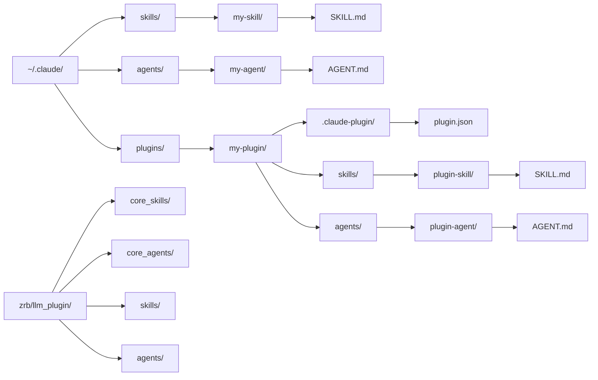

🔖 [Documentation Home](../README.md) > [Configuration](./) > LLM & Rate Limiter

# LLM & Rate Limiter Configuration

Zrb talks to LLMs through `pydantic-ai`, so OpenAI, Anthropic, Google Vertex, Ollama, DeepSeek and more work out of the box. This page lists every environment variable for Zrb's AI features.

`Model`, `ModelSettings`, and the `capabilities` list accepted by `LLMTask`/`LLMChatTask` (see [Model, Model Settings & Capabilities](../task-types/llmchat-task.md#model-model-settings--capabilities)) are pydantic-ai's own types, passed through unchanged; [pydantic-ai's documentation](https://ai.pydantic.dev) is the source of truth for what each provider accepts. This page covers the zrb-side knobs on top: routing, credentials, rate limits, and the defaults zrb applies first.

---

## Table of Contents

- [Core LLM Routing](#1-core-llm-routing)
- [Rate Limiting & Token Budgets](#2-rate-limiting--token-budgets)
- [Summarization Thresholds](#3-summarization-thresholds)
- [System Prompts & Identity](#4-system-prompts--identity)
- [Journal & Context Storage](#5-journal--context-storage)
- [Rewind & Snapshots](#6-rewind--snapshots)
- [TUI Debugging](#7-tui-debugging)
- [Model Autocomplete](#8-model-autocomplete)
- [RAG Configuration](#9-rag-retrieval-augmented-generation-configuration)
- [Search Engine Configuration](#10-search-engine-configuration)
- [Hooks Configuration](#11-llm-hooks-configuration)
- [Skill & Agent Search Configuration](#12-skill--agent-search-configuration)
- [Timeout Configuration](#13-timeout-configuration)
- [Interval & Delay Configuration](#14-interval--delay-configuration)
- [Size & Limit Configuration](#15-size--limit-configuration)
- [Retry Configuration](#16-retry-configuration)
- [Slash Command Aliases](#17-slash-command-aliases)
- [LSP Server Selection](#18-lsp-server-selection)
- [TUI Color Styles](#19-tui-color-styles)
- [Sandbox Configuration](#20-sandbox-configuration)
- [Voice and Camera](#21-voice-and-camera)
---

## 1. Core LLM Routing

| Variable | Description | Default |
|----------|-------------|---------|
| `ZRB_LLM_MODEL` | Primary LLM model (`provider:model-name`) | `openai:gpt-5.6-luna` (if unset) |
| `ZRB_LLM_SMALL_MODEL` | Faster model for background tasks | Falls back to `ZRB_LLM_MODEL` |
| `ZRB_LLM_MULTIMODAL_MODEL` | Model for multimodal tasks (image analysis) | `None` (no fallback) |
| `ZRB_LLM_API_KEY` | API key for your LLM provider | None |
| `ZRB_LLM_BASE_URL` | Custom endpoint URL | None |
| `ZRB_LLM_PROVIDER` | Explicit pydantic-ai provider name or object override — normally inferred from `ZRB_LLM_MODEL`'s `provider:` prefix, or from `ZRB_LLM_API_KEY`/`ZRB_LLM_BASE_URL` being set | None (inferred) |
| `ZRB_LLM_PERMISSIONS` | Tool permission ruleset. Empty keeps legacy yolo behavior. Accepts a shorthand (`allow`/`ask`/`deny`) or a comma-separated `key:action` list (e.g. `edit:deny,Shell:ask,*:allow`). First match wins. | (empty) |
| `ZRB_LLM_THINKING` | Cross-provider reasoning level: `minimal`/`low`/`medium`/`high`/`xhigh`, or `true`/`false` to toggle at the provider's default effort. Maps to pydantic-ai's unified `ModelSettings.thinking`. A provider-specific key in a task's `model_settings` (e.g. `openai_reasoning_effort`) wins over it. | (unset — provider default) |

Every agent also defaults to `openai_reasoning_summary="auto"` and `openai_prompt_cache_retention="24h"` (ignored by non-OpenAI providers); without a requested summary, OpenAI reasoning models return only an encrypted signature, no readable reasoning. Override these or add other keys (`openai_prompt_cache_key`, `openai_reasoning_effort`, …) via a task's `model_settings=` — caller keys always win.

### Which API Key Gets Used

zrb resolves credentials for every model tier (main, small, multimodal) in this order:

1. **`ZRB_LLM_BASE_URL` is set** → `ZRB_LLM_API_KEY` and that URL serve every tier, whatever the model's prefix (the LiteLLM / OpenRouter gateway case). A native provider that does not accept a base URL (DeepSeek, Mistral) is reached through an OpenAI-compatible client instead.
2. **`ZRB_LLM_API_KEY` is set and the model's vendor matches** the one `ZRB_LLM_PROVIDER` names (else the `provider:` prefix of `ZRB_LLM_MODEL`) → that key is used. A bare model name takes its vendor from `ZRB_LLM_PROVIDER`, and with no provider set it counts as a match.
3. **Otherwise** no key is passed, and pydantic-ai reads the vendor's own variable (`OPENAI_API_KEY`, `ANTHROPIC_API_KEY`, `DEEPSEEK_API_KEY`, …), or raises `UserError: set <VENDOR>_API_KEY`.

So `ZRB_LLM_SMALL_MODEL=deepseek:…` beside `ZRB_LLM_MODEL=openai:…` never sends the OpenAI key to DeepSeek; it falls back to `DEEPSEEK_API_KEY`.

> ⚠️ **A base URL with no key anywhere sends an unauthenticated request** carrying the placeholder `api-key-not-set`. That is deliberate (local Ollama or LiteLLM often needs no key), but an endpoint that checks answers with a 401, not a configuration error.

> ⚠️ **A withheld key is not mentioned in the error.** When `ZRB_LLM_API_KEY` is skipped as another vendor's key, the error only says "set `DEEPSEEK_API_KEY`". Set the second vendor's own variable, or set `ZRB_LLM_BASE_URL` if one endpoint serves both.

### Supported Providers

pydantic-ai resolves any `provider:model` in `ZRB_LLM_MODEL`, so every provider it ships works without registration. OpenAI-protocol providers need no extra (`openai` is a core dependency); the rest need their vendor SDK.

**No extra needed** (OpenAI-compatible, or SDK-free):

| Provider | Model format | Credentials |
|----------|-------------|-------------|
| OpenAI | `openai:gpt-5` | `OPENAI_API_KEY` |
| Ollama | `ollama:llama3.1` | `OLLAMA_BASE_URL` (`OLLAMA_API_KEY` for Ollama Cloud) |
| DeepSeek | `deepseek:deepseek-reasoner` | `DEEPSEEK_API_KEY` |
| OpenRouter | `openrouter:anthropic/claude-opus-4.8` | `OPENROUTER_API_KEY` |
| Azure OpenAI | `azure:gpt-5` | `AZURE_OPENAI_API_KEY`, `AZURE_OPENAI_ENDPOINT` |
| Z.ai | `zai:glm-5` | `ZAI_API_KEY` |
| Moonshot AI | `moonshotai:kimi-k2-thinking` | `MOONSHOTAI_API_KEY` |
| Alibaba | `alibaba:qwen-max` | `ALIBABA_API_KEY` or `DASHSCOPE_API_KEY` |
| Cerebras | `cerebras:llama3.1-8b` | `CEREBRAS_API_KEY` |
| Together | `together:meta-llama/Llama-3-70b` | `TOGETHER_API_KEY` |
| Fireworks | `fireworks:accounts/fireworks/models/…` | `FIREWORKS_API_KEY` |
| Nebius | `nebius:…` | `NEBIUS_API_KEY` |
| OVHcloud | `ovhcloud:…` | `OVHCLOUD_API_KEY` |
| SambaNova | `sambanova:…` | `SAMBANOVA_API_KEY` |
| Snowflake Cortex | `snowflake:…` | `SNOWFLAKE_ACCOUNT`, `SNOWFLAKE_TOKEN` |
| Heroku | `heroku:…` | `HEROKU_INFERENCE_KEY` |
| Vercel AI Gateway | `vercel:…` | `VERCEL_AI_GATEWAY_API_KEY` or `VERCEL_OIDC_TOKEN` |
| LiteLLM | `litellm:…` | per your LiteLLM config |

**Extra required** (vendor SDK):

| Provider | Model format | Extra (pipx) | Credentials |
|----------|-------------|--------------|-------------|
| Anthropic | `anthropic:claude-opus-4-8` | `zrb[anthropic]` | `ANTHROPIC_API_KEY` |
| Google (Gemini API) | `google:gemini-2.5-pro` | `zrb[google]` | `GOOGLE_API_KEY` or `GEMINI_API_KEY` |
| Google Vertex | `google-cloud:gemini-2.5-pro` | `zrb[google,vertexai]` | `GOOGLE_APPLICATION_CREDENTIALS`, `GOOGLE_CLOUD_PROJECT` |
| Groq | `groq:llama3-8b-8192` | `zrb[groq]` | `GROQ_API_KEY` |
| Mistral | `mistral:mistral-large-latest` | `zrb[mistral]` | `MISTRAL_API_KEY` |
| xAI | `xai:grok-4` | `zrb[xai]` | `XAI_API_KEY` |
| AWS Bedrock | `bedrock:anthropic.claude-…` | `zrb[bedrock]` | standard AWS credentials |
| Bedrock Mantle | `bedrock-mantle:…` | `zrb[bedrock]` | `AWS_BEARER_TOKEN_BEDROCK`, `AWS_REGION` |
| Cohere | `cohere:command-r-plus` | `zrb[cohere]` | `CO_API_KEY` |
| Hugging Face | `huggingface:…` | `zrb[huggingface]` | `HF_TOKEN` |

> 💡 **Google Vertex** (unlike the plain Gemini API) also needs the `vertexai` extra (`google-auth`, `pyasn1`) for auth: `pipx install "zrb[google,vertexai]"`.
>
> 💡 **Any other OpenAI-compatible endpoint** (self-hosted vLLM, LM Studio, a company gateway) works via `ZRB_LLM_BASE_URL` + `ZRB_LLM_API_KEY` and a bare model name (no `provider:` prefix).
>
> 💡 **Adding an extra to a pipx install:** `pipx inject zrb "zrb[anthropic]"` instead of reinstalling.

### Python API: Model Getter & Renderer

For model tiering, A/B routing, or custom provider wrapping, `LLMTask`/`LLMChatTask` expose two callable hooks, applied in order to the task's model just before it reaches the agent:

| Property | Receives | Returns | Purpose |
|----------|----------|---------|---------|
| `model_getter` | Base model (`str \| Model`) | Active model | Decide which model to actually use per request (e.g., tier switching, A/B testing) |
| `model_renderer` | Active model | Final pydantic-ai model | Wrap the model into a pydantic-ai `Model` object or translate tier names to real model strings |

They affect only the task they are set on:

```python
from zrb import LLMChatTask

# Example: translate a logical tier name to the real configured model
def my_renderer(model):
    tier_map = {
        "my:model-pro":   "openai:gpt-4o",
        "my:model-flash": "openai:gpt-4o-mini",
    }
    return tier_map.get(model, model)

task = LLMChatTask(
    name="chat",
    model_getter=lambda m: "my:model-pro",
    model_renderer=my_renderer,
)
```

#### Global fallback: `model_resolver.model_getter` / `model_renderer`

Sub-agent delegation (`DelegateToAgent`), the summarizer, and other internal agents have no task to hook — they resolve `CFG.LLM_*` via `zrb.llm.config.model_resolver.resolve_configured_model()` (and its `_small`/`_multimodal` siblings). To reach them too, set the pair once on the `model_resolver` singleton:

```python
from zrb.llm.config.model_resolver import model_resolver

model_resolver.model_getter = my_model_getter
model_resolver.model_renderer = my_renderer
```

It applies inside `resolve_configured_model()`/`resolve_configured_small_model()`/`resolve_configured_multimodal_model()`, covering the main chat task, every `LLMTask`/`LLMChatTask` without its own model, and sub-agent delegation. A task's own `model_getter`/`model_renderer` still runs after the global pair for that task; set only the global pair unless a task needs to override it.

---

## 2. Rate Limiting & Token Budgets

Rate limits and token budgets guard against runaway loops, cost, and provider limits.

| Variable | Description | Default |
|----------|-------------|---------|
| `ZRB_LLM_MAX_REQUEST_PER_MINUTE` | Max API requests per minute | `60` |
| `ZRB_LLM_MAX_REQUEST_PER_RUN` | Max model requests in one agent run before it halts — the backstop for a run that stops converging. `0` disables. | `300` |
| `ZRB_LLM_MAX_TOKENS_PER_MINUTE` | Max tokens processed per minute (`ZRB_LLM_MAX_TOKEN_PER_MINUTE` is still read) | `128000` |
| `ZRB_LLM_MAX_TOKENS_PER_REQUEST` | Hard context window limit (`ZRB_LLM_MAX_TOKEN_PER_REQUEST` is still read). The effective per-request budget is the **lower** of this and the model's known context window (`gpt-4o` 128k, `gpt-4.1` 1M, Claude 3/4 200k, Gemini 1.5/2/3 1M); models zrb doesn't recognise keep this cap. | `128000` |
| `ZRB_LLM_THROTTLE_SLEEP` | Seconds to pause when rate-limited | `1.0` |
| `ZRB_ENABLE_TIKTOKEN` | Use tiktoken for accurate counting | `off` (false) |
| `ZRB_TIKTOKEN_ENCODING_NAME` | Tiktoken encoding scheme (`ZRB_TIKTOKEN_ENCODING` is still read) | `cl100k_base` |

---

## 3. Summarization Thresholds

Zrb summarizes in the background when history or a single message grows too large.

| Variable | Description | Default |
|----------|-------------|---------|
| `ZRB_LLM_CONVERSATIONAL_SUMMARIZATION_TOKEN_THRESHOLD` | Token count triggering full history summarization | 60% of `MAX_TOKEN_PER_REQUEST` |
| `ZRB_LLM_MESSAGE_SUMMARIZATION_TOKEN_THRESHOLD` | Token count triggering individual message summarization | 50% of conversational threshold |
| `ZRB_LLM_HISTORY_SUMMARIZATION_WINDOW` | Recent messages to keep verbatim | `100` |

The same mechanism keeps one large repo or file read from blowing the context window; like the two above, each threshold is clamped to a fraction of the smaller of `MAX_TOKEN_PER_MINUTE` and `MAX_TOKEN_PER_REQUEST` (60% for the two above, 40% here):

| Variable | Description | Default |
|----------|-------------|---------|
| `ZRB_LLM_REPO_ANALYSIS_EXTRACTION_TOKEN_THRESHOLD` | Token count above which repo-analysis content is extracted in chunks | 40% of `MAX_TOKEN_PER_REQUEST` |
| `ZRB_LLM_REPO_ANALYSIS_SUMMARIZATION_TOKEN_THRESHOLD` | Token count triggering summarization of repo-analysis results | 40% of `MAX_TOKEN_PER_REQUEST` |
| `ZRB_LLM_FILE_ANALYSIS_TOKEN_THRESHOLD` | Token count above which a single file's analysis is summarized | 40% of `MAX_TOKEN_PER_REQUEST` |

---

## 4. System Prompts & Identity

### Identity Variables

| Variable | Description | Default |
|----------|-------------|---------|
| `ZRB_LLM_ASSISTANT_NAME` | Display name for AI assistant | `Zrb` |
| `ZRB_LLM_ASSISTANT_JARGON` | Tagline or motto | Root group description |
| `ZRB_LLM_ASSISTANT_ASCII_ART` | ASCII banner art name | `default` (built-in) |
| `ZRB_ASCII_ART_DIR` | Directory for custom ASCII art files | `.zrb/ascii-art` |

### Prompt Customization Hierarchy

First found wins:

| Priority | Location | Description |
|----------|----------|-------------|
| 1 (highest) | `ZRB_LLM_PROMPT_DIR` | Local directory override |
| 2 | `ZRB_LLM_PROMPT_<NAME>` | Environment variable |
| 3 | `ZRB_LLM_BASE_PROMPT_DIR` | Shared/org directory |
| 4 (lowest) | Package default | Built-in prompts |

### Overridable Prompts

- `persona`
- `principle`
- `workflow`
- `example`
- `profile` (always resolves as `profile.{name}.md`; see [Prompt Profile](#prompt-profile-matching-the-prompt-to-the-model))
- `conversational_summarizer`
- `message_summarizer`
- `file_extractor`
- `repo_extractor`
- `repo_summarizer`
- `web_summarizer`

### Prompt Component Configuration

The system prompt is an **ordered list of sections**; what each section holds, what is deliberately *not* a section, and how to compose them from Python are explained in [Programming the Prompt → Rung 5](../llm/programming-the-prompt.md#rung-5--composing-sections-with-promptmanager).

| Variable | Description | Default |
|----------|-------------|---------|
| `ZRB_LLM_INCLUDE_SECTIONS` | Comma-separated, order-sensitive list of sections to include. Remove a name to drop a section; rewrite the list to reorder. The set is fixed: an unknown (e.g. misspelled) name logs a warning at compose time and is skipped. Programmatic twin: `CFG.LLM_INCLUDE_SECTIONS` (a `list[str]`) | `persona,principle,workflow,example,profile,system_context,project_context` |
| `ZRB_LLM_PROMPT` | Comma-separated extra prompts appended after every built-in section — the env twin of `prompt_registry`. Empty means none. Content that won't fit a comma value (callables, structured middleware) belongs in `zrb_init.py` via `prompt_registry`. See [LLM Component Collections](./llm-collections.md). | (empty) |

```bash
# Strip demonstrations and project context (e.g. for benchmark runners).
export ZRB_LLM_INCLUDE_SECTIONS="persona,workflow,system_context"

# Personality-only: just persona.
export ZRB_LLM_INCLUDE_SECTIONS="persona"
```

### Prompt Profile (matching the prompt to the model)

| Variable | Description | Default |
|----------|-------------|---------|
| `ZRB_LLM_PROFILE` | Prompt profile: `minimal`, `standard`, `capable`, or `auto`. Swaps the `profile` section and, for `minimal` only, drops the delegate (sub-agent) tools. An unrecognized value falls back to `standard` | `auto` |

What each profile changes and how `auto` reads a model id: [Programming the Prompt → Rung 7](../llm/programming-the-prompt.md#rung-7--file-backed-sections-and-profiles).

### Programmatic Prompt Customization

Each task exposes its `PromptManager` as `task.prompt_manager`; `prompt_registry` in `zrb_init.py` sets the default every task starts from. Appending content, per-turn live context, and overriding a built-in prompt file are covered in [Programming the Prompt](../llm/programming-the-prompt.md) (rungs 5–7); the lookup chain a file override follows is the [hierarchy above](#prompt-customization-hierarchy).

### Restricting the toolbox (`ZRB_LLM_TOOLS`)

`ZRB_LLM_TOOLS` is the env twin of `tool_registry`: a **name allowlist** of static tools. Empty (default) means all built-in + registered tools.

```bash
export ZRB_LLM_TOOLS="Shell,Read,Write,Grep,Glob,TodoWrite"
```

Names are the PascalCase tool names (the `Tool` column in [Built-in LLM Tools](../llm/extending-the-llm.md#built-in-llm-tools)). Per-run factory and toolset tools have no static name, so they are not filtered. To add or drop individual tools, use `tool_registry` in `zrb_init.py`; see [LLM Component Collections](./llm-collections.md).

---

## 5. Journal & Context Storage

How the journal works (storage layout, when the index is injected, how truncation behaves) is explained once, in [LLM Journal System](../technical-specs/llm-context.md). This section lists the knobs.

| Variable | Description | Default |
|----------|-------------|---------|
| `ZRB_LLM_JOURNAL_ENABLED` | Master switch. `false` unregisters the journal tools (`SearchJournal`, `LogActivity`, `WriteJournalNote`) and the `<journal-index>` injection. Clearing `ZRB_LLM_JOURNAL_DIR` does not disable it — that falls back to the default path | `on` |
| `ZRB_LLM_JOURNAL_DIR` | Long-term notes directory | `~/.zrb/llm-notes/` |
| `ZRB_LLM_JOURNAL_INDEX_FILE` | Main index file name | `index.md` |
| `ZRB_LLM_JOURNAL_INDEX_MAX_CHARS` | Max characters of the index injected into context. Overflow is dropped from the **end** on a line boundary, so write the index most-durable-first. `0` suppresses the injection; a negative value injects it uncapped | `2500` |
| `ZRB_LLM_JOURNAL_HUD_MAX_ENTRIES_PER_SECTION` | Max `hud_line` entries per root-index HUD section (User, Preferences, Active Constraints); oldest evicted first. `<= 0` disables the cap | `20` |
| `ZRB_LLM_JOURNAL_AUTO_SEARCH_ENABLED` | On a session's first turn, run one `SearchJournal` against the opening message and fold hits into `<journal-index>` under an unverified "Possibly Related" section. Costs one search subprocess per session | `on` |
| `ZRB_LLM_JOURNAL_AUTO_SEARCH_MAX_HITS` | Max `SearchJournal` hits folded into the first-turn auto-search | `3` |
| `ZRB_LLM_JOURNAL_GIT_ENABLED` | Git-back the journal directory: `git init` on first use, commit after every `LogActivity`/`WriteJournalNote`/`DeleteJournalNote`. Gives unbounded, diffable history, so a human can recover a delete or bad overwrite (the in-file History block keeps only 3 revisions). Best-effort: a missing `git` or failed commit only skips the commit | `on` |
| `ZRB_LLM_SELF_REVIEW_ENABLED` | Built-in self-review Stop hook. On a turn that changed files, a fresh-context reviewer reads the working directory's diff since the turn started (every repository under it, nested ones and worktrees included; shell edits and mid-turn commits included; earlier uncommitted work excluded) plus read-only surrounding code. A `Request changes` verdict extends the turn so the agent fixes the findings. Snapshots go to a private temporary git store, never your `.git/objects`. Costs two snapshots per turn (start and Stop) and one reviewer run per turn that changed files | `off` |
| `ZRB_LLM_SELF_REVIEW_MAX_ROUNDS` | Consecutive blocking reviews in one turn before it ends anyway; a non-blocking review resets the count | `2` |
| `ZRB_LLM_SELF_REVIEW_MODEL` | Reviewer model. Empty uses the run's model; a different model shares fewer blind spots | (empty) |
| `ZRB_LLM_SELF_REVIEW_TIMEOUT` | Seconds per review. On timeout the reviewer (and its model request) is cancelled and the turn ends unreviewed | `240` |
| `ZRB_LLM_SELF_REVIEW_MAX_TRACKED_TURNS` | Turns whose blocking-review count is kept at once; a turn that ends mid-continuation never clears its own, so the oldest past this are dropped | `64` |
| `ZRB_LLM_HISTORY_DIR` | Conversation history directory | `~/.zrb/llm-history/` |
| `ZRB_LLM_HISTORY_RETENTION` | How long a conversation with a generated name (like `bold-arch-1234`, or `bold-arch-1234-greetings` once auto-named) is kept after its last save, backups included (`30d`, `2w`, …; `0` = keep all). A conversation you named — with `/save` or your own session name — is never pruned. Pruned on the first save of each session | `30d` |
| `ZRB_LLM_AUTO_NAME_ENABLED` | Rename a conversation that still has its generated name, after its first message, to `<generated-name>-<topic>` (e.g. `bold-arch-1234-greetings`) using the small model. A name you chose is never renamed. Sub-agent transcripts and live sessions keep the generated name as their key, and each new sub-agent gets a topic title in the picker | `on` |
| `ZRB_LLM_AUTO_NAME_MODEL` | Model that names a conversation. Empty uses the small model (`ZRB_LLM_SMALL_MODEL`, else the main model) | empty |
| `ZRB_LLM_HISTORY_BACKUP_RETAIN` | Number of timestamped history backups to keep per conversation (`-1` = keep all, `0` = disable) | `3` |
| `ZRB_LLM_AGENT_MESSAGE_LIMIT` | Max messages the main agent and one delegated sub-agent may send each other (both directions together) before `send_message_to_subagent` / `send_message_to_parent` refuse, so two agents cannot answer each other forever. Human messages do not count | `20` |
| `ZRB_LLM_SUBAGENT_HISTORY_RETAIN` | Max sub-agent transcripts kept across all agent types (`-1` = keep all); oldest pruned on each new delegation. Transcripts live under `ZRB_LLM_HISTORY_DIR/subagent/<agent-type>/` | `50` |
| `ZRB_LLM_PREVIOUS_MESSAGE_HISTORY_DIR` | Directory of the cross-session history of submitted messages that `↑`/`↓` recall in the chat input box | `~/.zrb/llm-previous-message-history/` |
| `ZRB_LLM_PREVIOUS_MESSAGE_HISTORY_MAX_ENTRIES` | Most messages that history keeps; oldest dropped first (`0` = keep all) | `1000` |

---

## 6. Rewind & Snapshots

Before each AI turn, Zrb snapshots your working directory so `/rewind` can restore any earlier state mid-session.

**How it works:** each snapshot is a commit in a private git store under `ZRB_LLM_SNAPSHOT_DIR` whose work tree is your directory, so nothing is copied and your own repositories' history, index and objects are never touched. Every repository under the directory is snapshotted by its own `.gitignore` (nested clones and submodules included); files outside any repository are taken as they are, minus common cache directories (`node_modules/`, `.venv/`, `__pycache__/`, …). Each conversation keeps its own rewind history: `/load` switches to the loaded conversation's history, and `/save` copies the current one to the new name.

**Limits and guarantees:**

- Files a repository's `.gitignore` excludes (even ones excluded only after a snapshot) are neither snapshotted nor restored — an edit to a gitignored `.env` is not rewound. A `.gitignore` outside any repository has no effect, as in git.
- Outside every repository, a directory may hold at most 5,000 files or 200 MB (`ZRB_LLM_SNAPSHOT_LOOSE_MAX_FILES`, `ZRB_LLM_SNAPSHOT_LOOSE_MAX_MB`). Past that (e.g. a chat started in `~`), or when `ZRB_LLM_SNAPSHOT_DIR` is the working directory itself, rewind turns off for the session and says why at startup and on `/rewind`.
- Rewind restores files, nested repositories' included, but never moves a repository's `HEAD` or branches, and leaves a repository created since the snapshot (a worktree or clone) alone.
- It removes a file only if the snapshot would have held it (never one that was ignored or unreadable then), and never overwrites a file it cannot read now.
- If a file cannot be written (held open, or read-only folder), the rest are still restored, `/rewind` names what was left behind, and re-running the same `/rewind` finishes the job.
- A file larger than 50 MB (`ZRB_LLM_SNAPSHOT_FILE_MAX_MB`) is left out, as if ignored: rewind neither restores nor removes it.
- Without git on `PATH`, rewind is off; startup says nothing, `/rewind` says why.
- A conversation's rewind history is dropped once its newest snapshot is older than `ZRB_LLM_SNAPSHOT_RETENTION` (never the current conversation's), and `git gc --auto` then packs the repository and prunes what no history holds.

| Variable | Description | Default |
|----------|-------------|---------|
| `ZRB_LLM_ENABLE_REWIND` | Enable filesystem snapshots and `/rewind` command | `on` |
| `ZRB_LLM_SNAPSHOT_DIR` | Directory holding one snapshot git repository per working directory. Must not be the working directory itself | `~/.zrb/llm-snapshots/` |
| `ZRB_LLM_SNAPSHOT_FILE_MAX_MB` | A file larger than this is left out of every snapshot (rewind's and self-review's), as if ignored | `50` |
| `ZRB_LLM_SNAPSHOT_LOOSE_MAX_FILES` | Most files taken from outside every git repository; past it, rewind is off for the session | `5000` |
| `ZRB_LLM_SNAPSHOT_LOOSE_MAX_MB` | Most MB taken from outside every git repository; past it, the same | `200` |
| `ZRB_LLM_SNAPSHOT_COMMAND_TIMEOUT` | Seconds one snapshot git command may take before it is killed | `30` |
| `ZRB_LLM_SNAPSHOT_OPERATION_TIMEOUT` | Seconds one rewind snapshot or restore may take as a whole, once it holds the store; running out turns rewind off for the session | `120` |
| `ZRB_LLM_SNAPSHOT_LOCK_TIMEOUT` | Seconds a rewind operation waits for another session's operation on the same directory before that one operation fails | `60` |
| `ZRB_LLM_SNAPSHOT_RETENTION` | How long a conversation's rewind history is kept after its newest snapshot (`30d`, `2w`, …; `0` = keep all). Checked when a session starts in the same directory | `30d` |

### Python API

```python
from zrb import LLMChatTask

task = LLMChatTask(
    name="chat",
    enable_rewind=True,           # None → falls back to ZRB_LLM_ENABLE_REWIND
    snapshot_dir="/tmp/my-snaps", # None → falls back to ZRB_LLM_SNAPSHOT_DIR
)
```

### `/rewind` commands

| Input | Effect |
|-------|--------|
| `/rewind` | List the current conversation's snapshots (newest first) with index, short SHA, timestamp, and user message |
| `/rewind <n>` | Restore snapshot number `n` from the list (1-based) |
| `/rewind <sha>` | Restore by full or partial SHA |

Restoring rewinds **both** files and conversation history, so the AI's context matches the restored files.

---

## 7. TUI Debugging

| Variable | Description | Default |
|----------|-------------|---------|
| `ZRB_LLM_SHOW_TOOL_CALL_DETAIL` | Print tool arguments before execution | `off` |
| `ZRB_LLM_SHOW_TOOL_CALL_RESULT` | Print raw tool return values | `off` |
| `ZRB_LLM_UI_SHOW_RUNTIME_TIMERS` | Show, in the status bar, how long the assistant has been working since it last went idle, and how long the running tool call has taken | `on` |

---

## 8. Model Autocomplete

Which sources feed `/model` autocomplete in LLM chat:

| Variable | Description | Default |
|----------|-------------|---------|
| `ZRB_LLM_SHOW_OLLAMA_MODELS` | Include Ollama models in autocomplete | `on` |
| `ZRB_LLM_SHOW_PYDANTIC_AI_MODELS` | Include pydantic-ai KnownModelName models in autocomplete | `on` |

### Python API

```python
from zrb import LLMChatTask
from zrb.llm.ui.ui_config import UIConfig

task = LLMChatTask(
    name="chat",
    # Unset fields fall back to ZRB_LLM_SHOW_OLLAMA_MODELS / ZRB_LLM_SHOW_PYDANTIC_AI_MODELS.
    ui_config=UIConfig(show_ollama_models=False, show_pydantic_ai_models=False),
)
```

### Use Cases

- **Disable Ollama models** when Ollama is not installed or not running, to avoid connection errors during autocomplete
- **Disable pydantic-ai models** to show only custom model names configured via `custom_model_names` parameter

---

## 9. RAG (Retrieval-Augmented Generation) Configuration

For RAG with vector databases such as ChromaDB.

| Variable | Description | Default |
|----------|-------------|---------|
| `ZRB_RAG_EMBEDDING_API_KEY` | API key for embedding service | None |
| `ZRB_RAG_EMBEDDING_BASE_URL` | Embedding API URL | None |
| `ZRB_RAG_EMBEDDING_MODEL` | Embedding model | `text-embedding-ada-002` |
| `ZRB_RAG_CHUNK_SIZE` | Text chunk size | `1024` |
| `ZRB_RAG_OVERLAP` | Chunk overlap size | `128` |
| `ZRB_RAG_MAX_RESULT_COUNT` | Max search results | `5` |

---

## 10. Search Engine Configuration

Which internet search engine the LLM tools use.

| Variable | Description | Default |
|----------|-------------|---------|
| `ZRB_SEARCH_INTERNET_METHOD` | Search engine (`google_rss`, `serpapi`, `brave`, `searxng`) | `google_rss` |

### Google News RSS (Default)

Free; reads the Google News RSS feed. No API key, Docker, or configuration needed.

### SerpAPI (Google)

| Variable | Description | Default |
|----------|-------------|---------|
| `SERPAPI_KEY` | API key | (required) |
| `ZRB_SERPAPI_LANG` | Language | `en` |
| `ZRB_SERPAPI_SAFE` | Safe search | `off` |

### Brave Search

| Variable | Description | Default |
|----------|-------------|---------|
| `BRAVE_API_KEY` | API key | (required) |
| `ZRB_BRAVE_API_LANG` | Language | `en` |
| `ZRB_BRAVE_API_SAFE` | Safe search | `off` |

### SearXNG (Self-hosted)

| Variable | Description | Default |
|----------|-------------|---------|
| `ZRB_SEARXNG_PORT` | Port | `8080` |
| `ZRB_SEARXNG_BASE_URL` | Base URL | `http://localhost:8080` |
| `ZRB_SEARXNG_LANG` | Language | `en-US` |
| `ZRB_SEARXNG_SAFE` | Safe search | `0` |

---

## 11. LLM Hooks Configuration

These knobs control the hook subsystem as a whole; each hook's own `enabled`/`timeout` fields and the hook file format are in the [Hooks Guide](../llm/hooks.md).

| Variable | Description | Default |
|----------|-------------|---------|
| `ZRB_HOOKS_ENABLED` | Enable the hook system globally; set `off` to disable all hooks (none load or fire) | `on` |
| `ZRB_HOOKS_DIRS` | Additional directories to scan for hook files (colon-separated; semicolon on Windows) | (empty) |
| `ZRB_HOOKS_TIMEOUT` | Default timeout for hook execution (ms) | `30000` |
| `ZRB_HOOKS_EXIT_TIMEOUT` | How long the chat TUI waits, as it exits, for hooks still running (ms) | `10000` |
| `ZRB_LLM_HOOKS` | Name allowlist for the hooks zrb dispatches — the env twin of `hook_registry`. Empty means all registered hooks; non-empty restricts dispatch to the named hooks (e.g. `journal-compliance-judge`). Finer edits (a hook with a matcher, command config) live in `zrb_init.py` via `hook_registry`. See [LLM Component Collections](./llm-collections.md). | (empty) |

`ZRB_HOOKS_ENABLED=off` disables the subsystem regardless of any `hooks.json`. `ZRB_LLM_HOOKS` filters on top of it: with the subsystem off, nothing fires even if a hook's name is allowed.

---

## 12. Skill & Agent Search Configuration

Where Zrb looks for skills and agents, and whether built-in ones load.

| Variable | Description | Default |
|----------|-------------|---------|
| `ZRB_LLM_SEARCH_PROJECT` | Search project dirs (filesystem root → cwd) for config dir names | `on` |
| `ZRB_LLM_SEARCH_HOME` | Search home directory (`~/.claude/`, `~/.zrb/`) | `on` |
| `ZRB_LLM_ENABLE_BUILTIN_SKILLS` | Load the built-in utility skills (`llm_plugin/skills`). Core skills (`core_skills/`) are always on; user/project/plugin skills are unaffected | `on` |
| `ZRB_LLM_ENABLE_BUILTIN_AGENTS` | Load optional built-in sub-agents (`llm_plugin/agents`). Core agents (`core_agents/`) are always on; user/project/plugin agents are unaffected | `on` |
| `ZRB_LLM_SKILLS` | Name allowlist for the visible skill catalogue — the env twin of `skill_registry`. Empty means all discovered + built-in skills; non-empty keeps only the named ones (`LLM_ENABLE_BUILTIN_SKILLS` still gates built-ins independently). See [LLM Component Collections](./llm-collections.md). | (empty) |
| `ZRB_LLM_AGENTS` | Name allowlist for the sub-agent roster — the env twin of `sub_agent_registry`. Empty means all discovered + built-in agents; non-empty keeps only the named ones. See [LLM Component Collections](./llm-collections.md). | (empty) |
| `ZRB_LLM_CONFIG_DIR_NAMES` | Config subdirectory names to look for in each dir (colon-separated; semicolon on Windows) | `.claude:.zrb` |
| `ZRB_LLM_BASE_SEARCH_DIRS` | Explicit base dirs containing `skills/`, `agents/`, `plugins/` | (empty) |
| `ZRB_LLM_EXTRA_SKILL_DIRS` | Additional direct skill directories | (empty) |
| `ZRB_LLM_EXTRA_AGENT_DIRS` | Additional direct agent directories | (empty) |
| `ZRB_LLM_PLUGIN_DIRS` | Additional plugin directories | (empty) |

### Search Priority

Zrb scans these sources in order, and when two define a skill or agent with the same name, the later one wins (lowest to highest priority):

1. **Core Builtins** - `core_skills/` and `core_agents/` (always included)
2. **Optional Builtins** - `skills/` and `agents/` (controlled by their built-in toggles)
3. **User Home** - `~/.claude/`, `~/.zrb/` + plugins within
4. **Project Traversal** - Filesystem root → cwd for each config dir name + plugins within, so the directory nearest cwd wins
5. **Configured Plugins** - Directories in `ZRB_LLM_PLUGIN_DIRS`
6. **Base Search Dirs** - Directories in `ZRB_LLM_BASE_SEARCH_DIRS` + plugins within
7. **Extra Direct Dirs** - `ZRB_LLM_EXTRA_SKILL_DIRS`, `ZRB_LLM_EXTRA_AGENT_DIRS`

A project or home skill named like a built-in one (`core-coding`, say) replaces it.

### Directory Structure


```mermaid
flowchart LR
    Root["~/.claude/"] --> Skills["skills/"]
    Root --> Agents["agents/"]
    Root --> Plugins["plugins/"]
    Builtin["zrb/llm_plugin/"] --> CoreSkills["core_skills/"]
    Builtin --> CoreAgents["core_agents/"]
    Builtin --> OptionalSkills["skills/"]
    Builtin --> OptionalAgents["agents/"]
    Skills --> S1["my-skill/"] --> S1F["SKILL.md"]
    Agents --> A1["my-agent/"] --> A1F["AGENT.md"]
    Plugins --> P1["my-plugin/"]
    P1 --> Meta[".claude-plugin/"] --> MetaF["plugin.json"]
    P1 --> PS["skills/"] --> PS1["plugin-skill/"] --> PS1F["SKILL.md"]
    P1 --> PA["agents/"] --> PA1["plugin-agent/"] --> PA1F["AGENT.md"]
```

---

## 13. Timeout Configuration

Task-runtime timings that are not LLM-specific (readiness checks, the scheduler tick, process cleanup, web shutdown) are in [General Environment Variables → Task Runtime](./env-vars.md#task-runtime).

Values are in **milliseconds** unless the row says otherwise.

| Variable | Description | Default |
|----------|-------------|---------|
| `ZRB_LLM_SSE_KEEPALIVE_TIMEOUT` | How long to wait before sending an SSE keepalive ping (ms) | `60000` |
| `ZRB_LLM_REQUEST_TIMEOUT` | Deadline for one model request, for every agent (main, sub-agent, programmatic). Catches a provider that accepts the connection then stops sending, which no retry detects. `0` disables. (ms) | `300000` |
| `ZRB_LLM_INPUT_QUEUE_TIMEOUT` | Polling interval for the chat input queue (ms) | `500` |
| `ZRB_LLM_SHELL_KILL_WAIT_TIMEOUT` | Time to wait for a shell process to exit after SIGTERM before SIGKILL (ms) | `5000` |
| `ZRB_LLM_BACKGROUND_WAIT_MAX` | Max time a single `GetDelegationResult`/`MonitorProcess` `wait=` call may block before returning "still running" (**seconds**, not ms) | `300` |
| `ZRB_LLM_WEB_PAGE_TIMEOUT` | Playwright page load timeout (ms) | `30000` |
| `ZRB_LLM_WEB_HTTP_TIMEOUT` | HTTP request timeout for web tools and search (ms) | `30000` |
| `ZRB_LLM_MODEL_FETCH_TIMEOUT` | Timeout for fetching Ollama model list (ms) | `5000` |
| `ZRB_LLM_GIT_CMD_TIMEOUT` | Timeout for the git commands that build live/system context — branch, status, log, and the is-a-git-dir probe (ms). Does not apply to agent-invoked git work (snapshots, worktrees). | `5000` |

---

## 14. Interval & Delay Configuration

All interval and delay values are in **milliseconds**.

| Variable | Description | Default |
|----------|-------------|---------|
| `ZRB_LLM_UI_STATUS_INTERVAL` | Polling interval for the TUI status loop (ms) | `1000` |
| `ZRB_LLM_UI_LONG_STATUS_INTERVAL` | Interval for updating slow-changing info (CWD, git branch) in TUI (ms) | `60000` |
| `ZRB_LLM_UI_REFRESH_INTERVAL` | Prompt-toolkit application refresh rate (ms) | `500` |
| `ZRB_LLM_UI_FLUSH_INTERVAL` | How often buffered output is flushed to event-driven UIs (ms) | `500` |
| `ZRB_LLM_UI_PASTE_MERGE_WINDOW` | Merge messages submitted within this many ms of the previous one into one — so a multi-line paste in a terminal without bracketed paste does not become one LLM turn per line. `0` disables. | `100` |

---

## 15. Size & Limit Configuration

| Variable | Description | Default |
|----------|-------------|---------|
| `ZRB_LLM_MAX_COMPLETION_FILES` | Maximum files scanned for path autocompletion | `5000` |
| `ZRB_LLM_MAX_OUTPUT_CHARS` | Maximum characters returned by shell command and file read tools | `100000` |
| `ZRB_LLM_MAX_CONSOLE_OUTPUT_CHARS` | Max characters of a shell command's output mirrored to the console (separate from `ZRB_LLM_MAX_OUTPUT_CHARS`, which caps what the model sees). Output past the cap is still captured and reaches the model. | `100000` |
| `ZRB_LLM_MAX_TOOL_RESULT_CHARS` | Model-facing tool-result threshold (characters). With `ZRB_LLM_ENABLE_TOOL_SPILL=on`, larger results are spilled losslessly to a private local store and replaced by a preview and a `ReadToolResult` handle; otherwise they are flagged `oversized` in app-only metadata and passed through. `0` disables both. | `100000` |
| `ZRB_LLM_ENABLE_TOOL_SPILL` | Enables lossless spill above `ZRB_LLM_MAX_TOOL_RESULT_CHARS`. The payload is stored under the system temp directory; `ReadToolResult` pages it or filters by literal substring. | `off` |
| `ZRB_LLM_HISTORY_MAX_DISPLAY_CHARS` | Maximum characters shown by the `/history` command | `5000` |
| `ZRB_LLM_HISTORY_TRUNCATE_LENGTH` | Maximum chars per field when formatting history entries | `100` |
| `ZRB_LLM_MAX_IMAGE_DIMENSION` | Longest-edge cap (pixels) for attached images before sending to LLM | `1568` |
| `ZRB_LLM_IMAGE_JPEG_QUALITY` | JPEG quality (1-95) for re-encoding photos; PNGs are unaffected | `85` |
| `ZRB_LLM_MAX_ATTACHMENT_BYTES` | Maximum file size (bytes) accepted by `/attach` and the other attachment paths (web chat upload, chat-telegram example) — checked before the file is read. `0` or negative disables the cap. | `20000000` |
| `ZRB_LLM_UI_MAX_BUFFER_SIZE` | Maximum buffered output chars before a forced flush (event-driven UIs) | `2000` |
| `ZRB_LLM_MAX_SKILLS_IN_CATALOG` | Skills listed in the prompt's skill catalogue before truncating with a pointer to `SearchSkill` (which always reaches the rest) — a token-economy cap. `0` or negative lists all. | `10` |
| `ZRB_LLM_MAX_AGENTS_IN_ROSTER` | Sub-agents listed in the delegation tools' AVAILABLE AGENTS roster before truncating with a pointer to `SearchAgent` (which always reaches the rest) — a token-economy cap. `0` or negative lists all. | `10` |
| `ZRB_LLM_MAX_PARALLEL_DELEGATIONS` | Max sub-agent tasks one `DelegateToAgent` fan-out (`tasks=[...]`) runs at once. Each is its own LLM run on the shared rate limiter (and, with `isolate_worktree`, its own git worktree). Paces concurrency, not total: a 50-task call still runs all 50, at most N in flight. `0` or negative disables. | `10` |

> 💡 `ZRB_LLM_MAX_IMAGE_DIMENSION` and `ZRB_LLM_IMAGE_JPEG_QUALITY` also apply to `/photo` captures (see [§ 21](#camera)), which are downscaled and re-encoded like pasted or attached images.

---

## 16. Retry Configuration

| Variable | Description | Default |
|----------|-------------|---------|
| `ZRB_LLM_MAX_CONTEXT_RETRIES` | Maximum retries when the LLM returns a context-window error | `5` |
| `ZRB_LLM_TOOL_MAX_RETRIES` | Maximum retries for individual tool calls | `3` |
| `ZRB_LLM_MCP_MAX_RETRIES` | Maximum retries for a failing MCP tool call | `3` |
| `ZRB_LLM_API_MAX_RETRIES` | Total retry attempts for transient provider errors (429, 5xx). `1` disables retrying. Works for all providers. | `3` |
| `ZRB_LLM_API_MAX_WAIT` | Maximum seconds to wait between retries. Honors the `Retry-After` response header when present. | `60` |

---

## 17. Slash Command Aliases

Customize the tokens that trigger built-in UI commands. Each value is a **comma-separated alias list** that *replaces* the defaults — list every alias you want to keep. Tokens need not start with `/` (`!` and `>` are defaults).

| Variable | Description | Default |
|----------|-------------|---------|
| `ZRB_LLM_UI_COMMAND_ATTACH` | `<cmd> <path>` — attach a file to the conversation | `/attach` |
| `ZRB_LLM_UI_COMMAND_BTW` | `<cmd> <question>` — ask a side question that is **not** saved to history and runs with no tools (it answers from the conversation alone); works while the LLM is still thinking | `/btw` |
| `ZRB_LLM_UI_COMMAND_COPY` | Copy the **full transcript** to the clipboard | `/copy` |
| `ZRB_LLM_UI_COMMAND_EXEC` | Run a shell command directly from the prompt | `!, /exec` |
| `ZRB_LLM_UI_COMMAND_EXIT` | Leave the chat session | `/q, :q, /bye, /quit, /exit` |
| `ZRB_LLM_UI_COMMAND_INFO` | Show session info and the command list | `/info, /help` |
| `ZRB_LLM_UI_COMMAND_LOAD` | Resume a saved conversation | `/load, /resume` |
| `ZRB_LLM_UI_COMMAND_PLAN_TOGGLE` | Toggle Plan Mode | `/plan` |
| `ZRB_LLM_UI_COMMAND_REDIRECT_OUTPUT` | Bare: copy the **last response** to the clipboard. `<cmd> <path>`: write that response to a file | `>, /redirect` |
| `ZRB_LLM_UI_COMMAND_REWIND` | Rewind to a previous turn | `/rewind` |
| `ZRB_LLM_UI_COMMAND_SAVE` | Save the current conversation | `/save` |
| `ZRB_LLM_UI_COMMAND_SET` | `<cmd> <name> <value>` — set a config value for the rest of the process (`/set LLM_SHOW_TOOL_CALL_RESULT on`), or switch a model slot live (`/set model`, `/set small_model`, `/set multimodal_model`) | `/set` |
| `ZRB_LLM_UI_COMMAND_SET_MODEL` | Switch the model mid-session | `/model` |
| `ZRB_LLM_UI_COMMAND_SUMMARIZE` | Compact the conversation history | `/compress, /compact` |
| `ZRB_LLM_UI_COMMAND_YOLO_TOGGLE` | Toggle auto-approval of tool calls | `/yolo` |

> ⚠️ **Don't guess the variable from the command.** Several differ: `/yolo` → `YOLO_TOGGLE`, `/plan` → `PLAN_TOGGLE`, `/model` → `SET_MODEL`, `/compress` → `SUMMARIZE`, `>` → `REDIRECT_OUTPUT`. A wrong name is ignored; zrb warns about it at startup, but the "did you mean" it suggests can be the wrong knob (`ZRB_LLM_UI_COMMAND_YOLO` suggests `..._LOAD`).
>
> `/photo`, `/voice`, `/handsfree` and `/speech` belong to the camera, dictation and speech features; their aliases are `ZRB_LLM_CAMERA_COMMANDS`, `ZRB_LLM_DICTATION_COMMANDS`, `ZRB_LLM_DICTATION_HANDS_FREE_COMMANDS` and `ZRB_LLM_SPEECH_COMMANDS` ([§ 21](#21-voice-and-camera)).

---

## 18. LSP Server Selection

LSP-backed tools (`AnalyzeCode`, the `Lsp*` tools) pick a server per file: your preference first, then the first *installed* server (command on `PATH`) matching the file's extension.

| Variable | Description | Default |
|----------|-------------|---------|
| `ZRB_LLM_LSP_PREFERRED_SERVERS` | Ordered, comma-separated LSP server names the agent prefers when multiple installed servers match a file (e.g. `pyright,gopls`). Names not matching a file are skipped, so one flat list can cover several languages. | (empty) |

```bash
export ZRB_LLM_LSP_PREFERRED_SERVERS="pyright,gopls"
```

```python
from zrb import CFG
CFG.LLM_LSP_PREFERRED_SERVERS = ["pyright", "gopls"]
```

Empty (default) uses installation/registry order. See [LSP Support](../llm/lsp-support.md) for the full rules and a per-call override.

---

## 19. TUI Color Styles

Colors for the `zrb llm chat` terminal UI. Each value is a [prompt_toolkit style string](https://python-prompt-toolkit.readthedocs.io/en/master/pages/advanced_topics/styling.html) — a hex color (`#ffcc00`), an ANSI name (`ansigreen`, `ansiyellow`), and/or attributes like `bold`. The special value `noinherit` resets to terminal defaults.

| Variable | Styles | Default |
|----------|--------|---------|
| `ZRB_LLM_UI_STYLE_TITLE_BAR` | Top title bar foreground | `#ffffff` |
| `ZRB_LLM_UI_STYLE_TITLE_BAR_BG` | Top title bar background | `ansipurple` |
| `ZRB_LLM_UI_STYLE_INFO_BAR` | Info/header bar | `#ffffff` |
| `ZRB_LLM_UI_STYLE_FRAME` | Frame borders | `#888888` |
| `ZRB_LLM_UI_STYLE_FRAME_LABEL` | Frame labels | `#ffff00` |
| `ZRB_LLM_UI_STYLE_INPUT_FRAME` | Input box border | `#888888` |
| `ZRB_LLM_UI_STYLE_THINKING` | "Thinking…" indicator | `ansigreen` |
| `ZRB_LLM_UI_STYLE_CONFIRMATION` | Tool-confirmation prompt | `ansiyellow` |
| `ZRB_LLM_UI_STYLE_FAINT` | De-emphasized text | `#888888` |
| `ZRB_LLM_UI_STYLE_OUTPUT_FIELD` | Output area text | `#eeeeee` |
| `ZRB_LLM_UI_STYLE_INPUT_FIELD` | Input area text | `#eeeeee` |
| `ZRB_LLM_UI_STYLE_TEXT` | General body text | `#eeeeee` |
| `ZRB_LLM_UI_STYLE_STATUS` | Status bar text | `ansiwhite` |
| `ZRB_LLM_UI_STYLE_BOTTOM_TOOLBAR` | Bottom toolbar | `noinherit` |

### Markdown Rendering

These are [Rich](https://rich.readthedocs.io/en/stable/style.html) style strings (`bold magenta`, `italic bright_cyan underline`) for the markdown renderer, not prompt_toolkit styles.

| Variable | Styles | Default |
|----------|--------|---------|
| `ZRB_LLM_UI_STYLE_MARKDOWN_H1` | Top-level headings | `bold magenta` |
| `ZRB_LLM_UI_STYLE_MARKDOWN_CODE` | Inline code spans | `bold white` |
| `ZRB_LLM_UI_STYLE_MARKDOWN_LINK` | Link text | `bold bright_cyan underline` |
| `ZRB_LLM_UI_STYLE_MARKDOWN_LINK_URL` | Link target URL | `italic bright_cyan underline` |

These two toggle content conversion rather than color:

| Variable | Description | Default |
|----------|-------------|---------|
| `ZRB_LLM_UI_ENABLE_MARKDOWN_MATH` | Convert LaTeX math (`$...$` / `$$...$$`, and a fenced ` ```latex `/` ```tex ` block) to Unicode. Falls back to the raw LaTeX source wherever it can't be converted. | `on` |
| `ZRB_LLM_UI_ENABLE_MARKDOWN_MERMAID` | Render fenced ` ```mermaid `/` ```mmd ` blocks as Unicode diagram art. Falls back to the raw fence if it can't be parsed. | `on` |

### Choice Widget (AskUserQuestion panel)

| Variable | Styles | Default |
|----------|--------|---------|
| `ZRB_LLM_UI_STYLE_CHOICE_BG` | Panel background | `#1f1f1f` |
| `ZRB_LLM_UI_STYLE_CHOICE_SELECTED_BG` | Selected row highlight | `#264f78` |

### Mode Badge (status-bar Shift+Tab cycle indicator)

| Variable | Styles | Default |
|----------|--------|---------|
| `ZRB_LLM_UI_STYLE_MODE_NORMAL` | `normal` mode badge | `fg:ansigreen` |
| `ZRB_LLM_UI_STYLE_MODE_ACCEPT_EDITS` | `accept-edits` mode badge | `fg:ansiyellow bold` |
| `ZRB_LLM_UI_STYLE_MODE_PLAN` | `plan` mode badge | `fg:ansiblue bold` |
| `ZRB_LLM_UI_STYLE_MODE_YOLO` | `yolo` mode badge | `fg:ansired bold` |
| `ZRB_LLM_UI_STYLE_MODE_CUSTOM` | `custom-yolo` mode badge | `fg:ansiyellow bold` |

### Info-bar indicators

| Variable | Styles | Default |
|----------|--------|---------|
| `ZRB_LLM_UI_STYLE_INFO_YOLO_ON` | Yolo = fully on | `ansired` |
| `ZRB_LLM_UI_STYLE_INFO_YOLO_PARTIAL` | Yolo = tool subset active | `ansiyellow` |
| `ZRB_LLM_UI_STYLE_INFO_YOLO_OFF` | Yolo = off | `ansigreen` |
| `ZRB_LLM_UI_STYLE_INFO_PLAN_ON` | Plan mode = on | `ansiblue` |
| `ZRB_LLM_UI_STYLE_INFO_PLAN_OFF` | Plan mode = off | `ansigreen` |

> Assistant identity (`ZRB_LLM_ASSISTANT_NAME`, `ZRB_LLM_ASSISTANT_ASCII_ART`, `ZRB_LLM_ASSISTANT_JARGON`) is covered in [System Prompts & Identity](#4-system-prompts--identity).

### Themes (`ZRB_THEME`)

`ZRB_THEME` selects a whole palette at once: every style knob here takes its **default** from the active theme, and an individual `ZRB_*` export still wins.

| Variable | Description | Default |
|----------|-------------|---------|
| `ZRB_THEME` | Named palette supplying the defaults for every `LLM_UI_STYLE_*` knob here and the `CLI_COLOR_*` / `CLI_STYLE_*` knobs in [CLI Semantic Colors](./env-vars.md#cli-semantic-colors) | `dark` |

Built-ins: `dark` (the historical defaults) and `light` (dark-on-light). An unknown name logs a warning and falls back to `dark`.

Register your own in `zrb_init.py`; it layers over `dark`, so list only the knobs you change:

```python
from zrb.config.theme import register_theme

register_theme(
    "solarized",
    {
        "CLI_COLOR_INFO": "#268bd2",
        "LLM_UI_STYLE_TEXT": "#657b83",
    },
)
# then: export ZRB_THEME=solarized
```

See `examples/themes/monokai/` for a complete worked example.

### Theme Examples

`examples/themes/` also ships shell scripts that export curated palettes as individual `ZRB_*` color variables. Those exports override `ZRB_THEME`, so for the plain dark or light palette `export ZRB_THEME=dark` (or `light`) is simpler. Source one in your shell rc:

```bash
# ~/.zshrc or ~/.bashrc
source /path/to/zrb/examples/themes/zrb-theme-dark.sh
```

Available themes:

| File | Description |
|------|-------------|
| `zrb-theme-dark.sh` | Dark background (default — matches built-in defaults) |
| `zrb-theme-light.sh` | Light background (dark text on light panels) |
| `zrb-theme-high-contrast.sh` | Maximum contrast (pure black/white, bold throughout) |

Each also defines a function (`zrb_theme_dark`, `zrb_theme_light`, `zrb_theme_high_contrast`) for switching mid-session:

```bash
zrb_theme_light    # switch to light theme
zrb llm chat       # start a new session with the light theme
```

To make your own, copy one and adjust the `ZRB_LLM_UI_STYLE_*` values; they apply from the next `zrb llm chat` session.

---

## 20. Sandbox Configuration

Opt-in filesystem containment for LLM tool calls, off by default. Its six knobs — `ZRB_LLM_SANDBOX_ENABLED`, `ZRB_LLM_SANDBOX_OS_SHELL`, `ZRB_LLM_SANDBOX_WRITABLE_PATHS`, `ZRB_LLM_SANDBOX_DENY_READ_PATHS`, `ZRB_LLM_SANDBOX_FALLBACK`, `ZRB_LLM_SANDBOX_ALLOW_ESCAPE` — are documented with the model they configure in [Sandbox](../llm/sandbox.md#configuration).

---

## 21. Voice and Camera

Three optional features of `zrb llm chat`, each added with one call and read from these variables **when a session starts**, so `zrb_init.py` may change them after importing zrb. A setting passed to `CameraConfig`, `DictationConfig` or `SpeechConfig` in code wins over its variable; see [Voice and camera](../llm/voice-camera.md) for that, [Programming the Voice](../llm/programming-the-voice.md) for recipes and Python extension points, and [Voice & Photo Troubleshooting](../llm/voice-photo-troubleshooting.md) for platform setup. Audio dependencies (sounddevice, numpy, vosk) load only when the microphone first opens, costing nothing at startup.

### Voice preset

Most sessions need only one setting. `ZRB_LLM_VOICE` sets how a session talks with you by moving the defaults of the three settings that decide it; any of the three set on its own still wins.

| `ZRB_LLM_VOICE` | Replies read aloud (`ZRB_LLM_SPEECH_ENABLED`) | Always listening (`ZRB_LLM_DICTATION_MODE`) | Talk over zrb (`ZRB_LLM_DICTATION_BARGE_IN_ENABLED`) |
|---|---|---|---|
| `off` (default) | `off` | `ptt` | `off` |
| `speak` | `on` | `ptt` | `off` |
| `turns` | `on` | `hands_free` | `off` |
| `conversation` | `on` | `hands_free` | `on` |

```bash
export ZRB_LLM_VOICE=conversation   # talk with zrb, and interrupt it
```

### Dictation (speech-to-text)

`/voice` starts recording; a pause or `/voice` again stops it, and the transcript lands in the input box. `/handsfree` switches to always listening: each utterance is submitted as a turn, or answers the tool approval or question being asked. With speech on too (`/speech`), that is a voice conversation (see [Voice and camera § Talking with zrb](../llm/voice-camera.md#talking-with-zrb)).

| Variable | Description | Default |
|----------|-------------|---------|
| `ZRB_LLM_DICTATION_MODE` | Mode a session starts in: `ptt` or `hands_free` | `ptt`, or as `ZRB_LLM_VOICE` sets it |
| `ZRB_LLM_DICTATION_COMMANDS` | Aliases that start and stop a push-to-talk recording | `/voice, /v` |
| `ZRB_LLM_DICTATION_HANDS_FREE_COMMANDS` | Aliases that switch hands-free on and off | `/handsfree` |
| `ZRB_LLM_DICTATION_BACKEND` | Speech-to-text service: `vosk` (offline, and the only one that transcribes while you speak), `whisper` / `moonshine` / `funasr` (local, on Pipecat), `openai`, `google`, or `multimodal` (uses `ZRB_LLM_MULTIMODAL_MODEL`) | `vosk` |
| `ZRB_LLM_DICTATION_STT_MODEL` | Which model of the named local service to run, e.g. `small` for `whisper` or `medium-streaming` for `moonshine`; empty uses the service's own default. Ignored by `vosk`, `openai`, `google` and `multimodal` | (empty) |
| `ZRB_LLM_DICTATION_WAKE_WORDS` | Comma-separated; in hands-free mode only utterances starting with one count. Said alone, one accepts the next utterance within `ZRB_LLM_DICTATION_WAKE_WINDOW` seconds | (none) |
| `ZRB_LLM_DICTATION_WAKE_WINDOW` | Seconds a lone wake word keeps listening | `8.0` |
| `ZRB_LLM_DICTATION_THRESHOLD` | RMS microphone level that counts as speech (`zrb voice mic-test` in `examples/voice-interaction` measures yours) | `0.01` |
| `ZRB_LLM_DICTATION_NOISE_MARGIN` | How many times louder than the room's own background speech must be to be heard at all, so a conversation going on around the microphone does not open a turn. It follows the room: it changes nothing in a quiet one, and lifts the bar over the noise in a loud one. Your own speech heard while zrb is silent measures as the room too, so a long sentence with no breath in it can hold the bar over your next words until one is heard. `0` counts the room not at all | `2.0` |
| `ZRB_LLM_DICTATION_SILENCE` | Seconds of silence that end an utterance; at least one block (`ZRB_LLM_DICTATION_BLOCK_DURATION`) | `1.0` |
| `ZRB_LLM_DICTATION_MIN_SILENCE` | With a backend that transcribes while you speak (`vosk`), seconds of silence that end an utterance once it has words; `0` always waits `ZRB_LLM_DICTATION_SILENCE` | `0.5` |
| `ZRB_LLM_DICTATION_MIN_SPEECH` | Shortest speech kept, in seconds; shorter is a cough or a click | `0.25` |
| `ZRB_LLM_DICTATION_MIN_WORDS` | Fewest words a hands-free utterance needs to reach the model when it is not interrupting zrb (`ZRB_LLM_DICTATION_BARGE_IN_MIN_WORDS` applies there); raise it in a public place, where a stranger's single word would otherwise open a turn. A stop word, a yes/no, or an answer to the prompt being asked always counts | `1` |
| `ZRB_LLM_DICTATION_MAX_UTTERANCE` | Longest utterance, in seconds; `0` means no limit | `30.0` |
| `ZRB_LLM_DICTATION_MAX_BACKLOG` | Seconds of hands-free audio kept while an utterance is being transcribed, so what you say meanwhile is not lost; older audio is dropped. `0` means no limit | `30.0` |
| `ZRB_LLM_DICTATION_PRE_ROLL` | Seconds kept from before speech is detected, so the first word is not clipped; `0` keeps none | `0.3` |
| `ZRB_LLM_DICTATION_BARGE_IN_ENABLED` | `on` lets hands-free hear you while zrb speaks, on speakers too: zrb's voice is held at once, stops if what you said is words meant for it, and carries on if not. Speech over zrb must be `ZRB_LLM_DICTATION_BARGE_IN_MARGIN` times louder than zrb's voice reaches the microphone and at least `ZRB_LLM_DICTATION_BARGE_IN_MIN_WORDS` words. `off`: the microphone stays deaf while zrb speaks, and you take turns | `off`, or as `ZRB_LLM_VOICE` sets it |
| `ZRB_LLM_DICTATION_BARGE_IN_HOLD` | With barge-in on, whether speech heard over zrb holds its voice at once, before anything about it is known. `on`: zrb is paused as soon as the microphone hears loud speech over it, and the words then stop it or give the pause back — on speakers, zrb's own voice crossing the bar is heard as a brief stutter. `off`: nothing is held on loudness; a stop word or a wake word seen in the live transcript of a backend that transcribes while you speak (`vosk`) stops zrb as soon as it is heard, and anything else stops it once the utterance is transcribed, so a room loud enough to keep crossing the bar cannot make zrb stutter. Barge-in itself is unchanged either way | `on` |
| `ZRB_LLM_DICTATION_BARGE_IN_MARGIN` | With barge-in on, how many times louder than zrb's own voice, as the microphone hears it (the median over its last few seconds), speech over zrb must be (3 is about 10 dB). It follows the volume and the room; on headphones zrb is not heard and `ZRB_LLM_DICTATION_THRESHOLD` applies | `3.0` |
| `ZRB_LLM_DICTATION_BARGE_IN_MIN_WORDS` | With barge-in on, the fewest words said over zrb, or while a turn runs, that reach it; fewer are taken for zrb's own voice or noise, and zrb carries on. A stop word, or an answer to the prompt being asked, always counts | `2` |
| `ZRB_LLM_DICTATION_BARGE_IN_MIN_SPEECH` | Seconds of speech over zrb's voice that pause it, so a click does not; it then stops only if what was said has words. Shorter words over zrb (a crisp "stop") do not pause it, but still stop it once transcribed | `0.3` |
| `ZRB_LLM_DICTATION_INTERRUPT_JUDGE_ENABLED` | With barge-in on, whether the small model is asked what an interrupting utterance asks of zrb, so "please fucking stop", the same stop said twice, or a stop in another language cancels the turn instead of reaching the model. The word lists answer first, for free, and stand when the model is slow, unconfigured or unsure. `off`: the word lists decide alone | `on` |
| `ZRB_LLM_DICTATION_INTERRUPT_JUDGE_MODEL` | Model that decides that. Empty uses the small model (`ZRB_LLM_SMALL_MODEL`, else the main model). A cloud model costs a round trip on the words that stop zrb, so a fast local one answers sooner | |
| `ZRB_LLM_DICTATION_APPROVE_WORDS` | Phrases that approve a tool approval when a hands-free answer is made only of them and polite words ("yes please"). Any other answer denies it, with what was said as the reason | `yes, yeah, yep, ok, okay, sure, approve, accept, go ahead, do it` |
| `ZRB_LLM_DICTATION_DENY_WORDS` | Phrases that deny a tool approval when a hands-free answer is made only of them and polite words ("no thanks") | `no, nope, deny, cancel, stop, don't` |
| `ZRB_LLM_DICTATION_STOP_WORDS` | Phrases that, said alone over zrb or while a turn runs with barge-in on, stop zrb speaking and cancel the turn instead of reaching the model. A list of their own, so "no" can deny an approval without stopping anything. Anything else said over zrb is put to the small model when it reads as a stop | `stop, wait, hold on, cancel, no, nope, deny, don't` |
| `ZRB_LLM_DICTATION_POLITE_WORDS` | Words a yes or a no may carry without changing it ("yes please", "no thanks"). Approvals only: a stop word is taken as one only when it is said alone, so "stop please" goes to the small model | `please, thanks, thank, you` |
| `ZRB_LLM_DICTATION_BLOCK_DURATION` | Seconds of audio per microphone block: the step every other listening duration is counted in, and how often speech is checked | `0.1` |
| `ZRB_LLM_DICTATION_DEVICE` | Microphone PortAudio opens: a name, or the number `query_devices()` lists it under; `pulse` and `default` on a Linux or WSL machine are not the same microphone. Empty uses PortAudio's own default (`python -c "import sounddevice; sounddevice.query_devices()"` lists them) | (empty) |

Each backend uses only its own variables:

| Backend | Variable | Description | Default |
|---------|----------|-------------|---------|
| `openai` | `ZRB_LLM_DICTATION_OPENAI_MODEL` | Transcription model, e.g. `gpt-4o-transcribe` | `whisper-1` |
| `openai` | `ZRB_LLM_DICTATION_OPENAI_BASE_URL` | An OpenAI-compatible transcription server; empty is OpenAI's | (none) |
| `openai` | `ZRB_LLM_DICTATION_LANGUAGE` | Optional ISO-639-1 language hint, such as `en` or `id`; empty lets OpenAI detect the language | (empty) |
| `google` | `ZRB_LLM_DICTATION_GOOGLE_MODEL` | Gemini model | `gemini-2.5-flash` |
| `google`, `multimodal` | `ZRB_LLM_DICTATION_TRANSCRIBE_PROMPT` | Instruction sent with the audio; the default preserves the spoken language and does not translate | `Transcribe exactly what is spoken. Do not translate or paraphrase. Return only the transcription.` |
| `vosk` | `ZRB_LLM_DICTATION_VOSK_MODEL_NAME` | Model directory name (without `.zip`), downloaded from `<VOSK_MODEL_URL>/<name>.zip` | `vosk-model-small-en-us-0.15` |
| `vosk` | `ZRB_LLM_DICTATION_VOSK_MODEL_URL` | Base URL for the model zip (extracted to `~/.cache/vosk/`) | `https://alphacephei.com/vosk/models` |
| `vosk` | `ZRB_LLM_DICTATION_VOSK_DOWNLOAD_TIMEOUT` | Seconds to wait for the model server to answer; `0` means the transfer is not capped, though a stalled connection still gives up after 30 s | `120` |
| `vosk` | `ZRB_LLM_DICTATION_VOSK_MAX_DOWNLOAD_MB` | Megabytes of model zip accepted; `0` means no limit | `4096` |
| `vosk` | `ZRB_LLM_DICTATION_VOSK_MAX_UNCOMPRESSED_MB` | Megabytes the model may take once extracted, every file summed (bounds a decompression bomb); `0` means no limit | `8192` |
| `vosk` | `ZRB_LLM_DICTATION_VOSK_MAX_FILE_MB` | Megabytes for any one file in the archive; `0` means no limit | `4096` |
| `vosk` | `ZRB_LLM_DICTATION_VOSK_MAX_FILES` | Files the archive may hold; `0` means no limit | `10000` |
| `vosk` | `ZRB_LLM_DICTATION_VOSK_CONFIDENCE` | Lowest average word confidence (0–1) a hands-free transcript may have and still reach the model; vosk scores the words it makes out of noise low. Push-to-talk keeps every word. `0` uses no floor | `0` |

The `multimodal` backend's system prompt is the `multimodal_audio` prompt file, overridable like any prompt through `ZRB_LLM_PROMPT_DIR`.

### Speech (text-to-speech)

Reads the reply a sentence at a time as it streams, tool approvals, questions, and a tool call that starts after a silence aloud. `/speech` switches it off and on during a session, dropping anything not yet said.

| Variable | Description | Default |
|----------|-------------|---------|
| `ZRB_LLM_SPEECH_ENABLED` | Speak from the start of a session; `/speech` switches it either way | `off`, or as `ZRB_LLM_VOICE` sets it |
| `ZRB_LLM_SPEECH_COMMANDS` | Aliases that switch speech off and on | `/speech` |
| `ZRB_LLM_SPEECH_EVENTS` | What to speak: `reply`, `approval`, `question`, `progress` (a tool call starting after a silence: "Running a command.") | `reply, approval, question, progress` |
| `ZRB_LLM_SPEECH_BACKEND` | `auto` (`termux` on Termux, `say` on macOS, else `espeak-ng`), `termux`, `say`, `espeak-ng`, `openai`, `gemini`, or `kokoro` / `piper` / `pocket` (local, on Pipecat, with zrb playing the audio). A failing backend falls back to the local engine | `auto` |
| `ZRB_LLM_SPEECH_VOICE` | Voice name for the backend (for `termux`, the `-v` variant); empty uses its default (system voice, `en-us+m3`, `alloy`, `Sulafat`, `af_heart` for `kokoro`, `en_US-ryan-high` for `piper`, `alba` for `pocket`) | (none) |
| `ZRB_LLM_SPEECH_STYLE` | How `openai` and `gemini` should sound, in plain words (tone, pace, warmth); a direction, not read aloud. Empty uses the voice's default manner. The local engines ignore it | a warm, clear, conversational colleague |
| `ZRB_LLM_SPEECH_RATE` | Words per minute for `say` and `espeak-ng` | `165` |
| `ZRB_LLM_SPEECH_STREAM` | Speak a reply a sentence at a time while it is written, and the text before a tool call when the call starts. `off` reads the whole reply once the turn ends. Either way it is read whole, however long it is, unless `ZRB_LLM_SPEECH_SUMMARIZE_ABOVE_CHARS` is set, which turns streaming of the reply off | `on` |
| `ZRB_LLM_SPEECH_SUMMARIZE_ABOVE_CHARS` | A reply whose speakable text is longer than this many characters is spoken as a short summary from the small model instead of whole; the reply on screen is unchanged. Needs the finished reply, so the reply is not streamed while this is set. `0` reads every reply whole | `0` |
| `ZRB_LLM_SPEECH_SUMMARY_MODEL` | Model that writes the summary. Empty uses the small model (`ZRB_LLM_SMALL_MODEL`, else the main model) | empty |
| `ZRB_LLM_SPEECH_SUMMARY_TIMEOUT` | Seconds the summary may take before the reply is read whole; `0` means no limit | `15` |
| `ZRB_LLM_SPEECH_PROGRESS_INTERVAL` | With `progress` in `ZRB_LLM_SPEECH_EVENTS`, seconds of silence after which a tool call starting is announced; `0` announces nothing | `8` |
| `ZRB_LLM_SPEECH_OPENAI_MODEL` | Model for `openai` | `gpt-4o-mini-tts` |
| `ZRB_LLM_SPEECH_OPENAI_BASE_URL` | API base URL for `openai` | `https://api.openai.com/v1` |
| `ZRB_LLM_SPEECH_GEMINI_MODEL` | Model for `gemini` | `gemini-2.5-flash-preview-tts` |
| `ZRB_LLM_SPEECH_TIMEOUT` | Seconds a cloud backend may take; `0` means no limit | `15` |
| `ZRB_LLM_SPEECH_TERMUX_LANGUAGE` | Language for `termux` (`-l`), e.g. `en`; empty is the phone's | (none) |
| `ZRB_LLM_SPEECH_TERMUX_ENGINE` | Android TTS engine for `termux` (`-e`) | (none) |
| `ZRB_LLM_SPEECH_TERMUX_REGION` | Region for `termux` (`-n`), e.g. `US` | (none) |
| `ZRB_LLM_SPEECH_TERMUX_RATE` | Speech rate for `termux`; `1.0` is normal | `1.0` |
| `ZRB_LLM_SPEECH_TERMUX_PITCH` | Pitch for `termux`; `1.0` is normal | `1.0` |
| `ZRB_LLM_SPEECH_TERMUX_STREAM` | Android audio stream for `termux` (`-s`): `ALARM`, `MUSIC`, `NOTIFICATION`, `RING`, `SYSTEM`, `VOICE_CALL` | (none) |
| `ZRB_LLM_SPEECH_PLAYER` | `auto`: zrb plays speech itself through sounddevice when the `zrb[voice]` extra is installed and the backend can render audio (`say`, `espeak-ng`, `openai`, `gemini`), so speech can pause while you talk over it; else a player program. A cloud backend with `ZRB_LLM_SPEECH_WAV_PLAYER` set uses that player, and a device that cannot open sends the rest of the session to a player program. `command`: always a player program. Any other value is logged and read as `auto` | `auto` |
| `ZRB_LLM_SPEECH_WAV_PLAYER` | Command playing the cloud backends' WAV, the path appended (e.g. `mpv --really-quiet`); set, it plays every sentence even under `ZRB_LLM_SPEECH_PLAYER=auto` (and speech can then not pause); empty picks `afplay`, `paplay`, `aplay` or `ffplay` | (none) |
| `ZRB_LLM_SPEECH_LOCK_FILE` | File locked while speech plays, so sessions take turns and dictation ignores zrb's own voice | `<tmp>/<root group name>-speech.lock` |
| `ZRB_LLM_SPEECH_LOCK_TIMEOUT` | Seconds to wait for another session to finish before dropping an utterance | `30` |
| `ZRB_LLM_SPEECH_DRAIN_TIMEOUT` | Seconds queued speech may still play after zrb exits | `30` |
| `ZRB_LLM_SPEECH_PLAYER_TIMEOUT` | Seconds one utterance may play; `0` means no limit | `120` |
| `ZRB_LLM_SPEECH_PLAYER_BLOCK_FRAMES` | Samples per block when zrb plays speech itself; smaller pauses and stops sooner, larger is kinder to a slow machine | `1024` |
| `ZRB_LLM_SPEECH_PLAYER_READ_AHEAD` | Chunks of downloaded or rendered speech read ahead of playback | `32` |
| `ZRB_LLM_SPEECH_RENDER_TIMEOUT` | Seconds `say` or `espeak-ng` may take to render a sentence for zrb to play; `0` means no limit | `60` |
| `ZRB_LLM_SPEECH_STALL_TIMEOUT` | With `ZRB_LLM_SPEECH_TIMEOUT` at `0`, seconds `openai` audio may stop arriving before it is given up on | `30` |
| `ZRB_LLM_SPEECH_QUESTION_MESSAGE` | Said when the model asks a question with no text of its own | `A question is waiting for your answer.` |
| `ZRB_LLM_SPEECH_APPROVAL_MESSAGE` | Said when a tool call waits for approval: `{action}` is what the tool does, `{target}` a space and the file or command, or empty | `I need to {action}{target}. I need your approval.` |
| `ZRB_LLM_SPEECH_APPROVAL_TARGET_KEYS` | Tool arguments tried, in order, for `{target}` | `path, file_path, command, notebook_path` |
| `ZRB_LLM_SPEECH_APPROVAL_TARGET_MAX_CHARS` | Longest `{target}` read out; `0` leaves it out | `80` |
| `ZRB_LLM_SPEECH_PROGRESS_PHRASES` | JSON object of what progress narration says when a tool call starts: tool-name patterns (`*` and `?` wildcards, tried in order, the first match wins; `""` matches a call with no tool name) to a line, `{tool}` being the tool's name. A tool no pattern matches is not announced | English lines for the built-in tools, then `"Lsp*": "Checking the code."`, `"": "Working on it."`, `"*": "Using the {tool} tool."` |
| `ZRB_LLM_SPEECH_APPROVAL_ACTIONS` | JSON object of the `{action}` in `ZRB_LLM_SPEECH_APPROVAL_MESSAGE`: tool-name patterns, as above, to what the tool does. A tool no pattern matches is named as it is | English actions for the built-in tools that ask, then `"": "run a tool"`, `"*": "use the {tool} tool"` |
| `ZRB_LLM_SPEECH_PROGRESS_SILENT_TOOLS` | Tools never announced by progress narration | `TodoRead, TodoWrite, ActivateSkill, SearchSkill` |
| `ZRB_LLM_SPEECH_GEMINI_PROMPT` | What `gemini` is sent with no style: `{text}` is what to read. Without an instruction, Gemini may answer a short line instead of reading it | `Say: {text}` |
| `ZRB_LLM_SPEECH_GEMINI_STYLE_PROMPT` | What `gemini` is sent with `ZRB_LLM_SPEECH_STYLE` set: `{style}` and `{text}` | `{style}`, a blank line, `Say exactly this, and nothing else: {text}` |

A placeholder is replaced only where written; any other brace stays as it is. The prompts behind speech are prompt files, overridable like any prompt through `ZRB_LLM_PROMPT_DIR`: `speech_live` (while speech is on, asks the model to open with a spoken answer).

The cloud backends read `OPENAI_API_KEY`, and `GEMINI_API_KEY` or `GOOGLE_API_KEY`.

### Camera

`/photo [device]` attaches a camera photo to the next message.

| Variable | Description | Default |
|----------|-------------|---------|
| `ZRB_LLM_CAMERA_COMMANDS` | Aliases for the camera command | `/photo, /p` |
| `ZRB_LLM_CAMERA_BACKEND` | `auto` (Termux:API on Android when installed, else ffmpeg), `termux`, `ffmpeg` | `auto` |
| `ZRB_LLM_CAMERA_DEVICE` | Device used when the command names none; empty picks the platform default | (none) |
| `ZRB_LLM_CAMERA_TIMEOUT` | Seconds a capture may take, every attempt included, before it is abandoned; `0` means no limit | `15` |

```bash
# Hands-free with OpenAI transcription, a wake word, and replies read aloud
export ZRB_LLM_DICTATION_MODE=hands_free
export ZRB_LLM_DICTATION_BACKEND=openai
export ZRB_LLM_DICTATION_OPENAI_MODEL=gpt-4o-transcribe
export ZRB_LLM_DICTATION_WAKE_WORDS="hi,hai,hey,嗨"   # every spelling the transcriber writes
export ZRB_LLM_SPEECH_ENABLED=on
```

Every variable above can be set from `zrb_init.py` instead, since each is read when a session starts, not when zrb is imported:

```python
from zrb import CFG

# Indonesian: words to stop zrb, and the polite words a yes or a no around
# them may carry.
CFG.LLM_DICTATION_STOP_WORDS = ["berhenti", "stop", "tunggu", "sudah"]
CFG.LLM_DICTATION_POLITE_WORDS = ["tolong", "terima", "kasih", "please"]
CFG.LLM_SPEECH_APPROVAL_MESSAGE = "Boleh saya {action}{target}?"
CFG.LLM_SPEECH_APPROVAL_ACTIONS = {"Write": "menulis berkas", "*": "memakai {tool}"}
CFG.LLM_SPEECH_PROGRESS_PHRASES = {"Read": "Membaca berkas.", "*": "Memakai {tool}."}
```

From a shell, the two phrase tables are JSON:

```bash
export ZRB_LLM_SPEECH_PROGRESS_PHRASES='{"Read": "Membaca berkas.", "Shell": "Menjalankan perintah.", "*": "Memakai {tool}."}'
```
