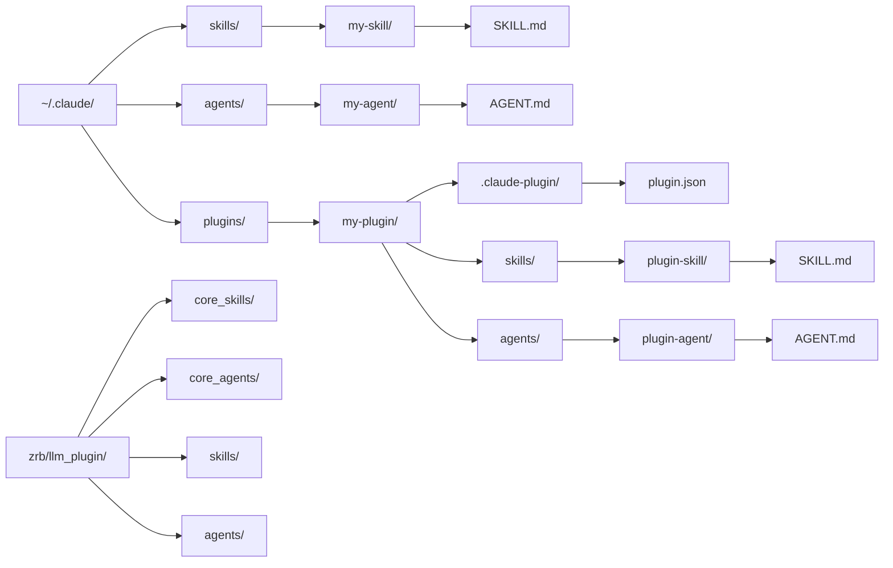

🔖 [Documentation Home](../README.md) > [Configuration](./) > [LLM Configuration](llm-config.md) > Tools

# LLM Tools & Extensions

The agent's tools and what feeds them: RAG, web search, hooks, skill and agent discovery, language servers, and the sandbox.

## Table of Contents

- [RAG (Retrieval-Augmented Generation) Configuration](#rag-retrieval-augmented-generation-configuration)
- [Search Engine Configuration](#search-engine-configuration)
  - [Google News RSS (Default)](#google-news-rss-default)
  - [SerpAPI (Google)](#serpapi-google)
  - [Brave Search](#brave-search)
  - [SearXNG (Self-hosted)](#searxng-self-hosted)
- [LLM Hooks Configuration](#llm-hooks-configuration)
- [Skill & Agent Search Configuration](#skill--agent-search-configuration)
  - [Search Priority](#search-priority)
  - [Directory Structure](#directory-structure)
- [LSP Server Selection](#lsp-server-selection)
- [Sandbox Configuration](#sandbox-configuration)

---

## RAG (Retrieval-Augmented Generation) Configuration

For RAG with vector databases such as ChromaDB.

| Variable | Description | Default |
|----------|-------------|---------|
| `ZRB_RAG_EMBEDDING_API_KEY` | API key for embedding service | None |
| `ZRB_RAG_EMBEDDING_BASE_URL` | Embedding API URL | None |
| `ZRB_RAG_EMBEDDING_MODEL` | Embedding model | `text-embedding-ada-002` |
| `ZRB_RAG_CHUNK_SIZE` | Text chunk size | `1024` |
| `ZRB_RAG_OVERLAP` | Chunk overlap size | `128` |
| `ZRB_RAG_MAX_RESULT_COUNT` | Max search results | `5` |

## Search Engine Configuration

Which internet search engine the LLM tools use.

| Variable | Description | Default |
|----------|-------------|---------|
| `ZRB_SEARCH_INTERNET_METHOD` | Search engine (`google_rss`, `serpapi`, `brave`, `searxng`) | `google_rss` |

### Google News RSS (Default)

Free; reads the Google News RSS feed. No API key, Docker, or configuration needed.

### SerpAPI (Google)

| Variable | Description | Default |
|----------|-------------|---------|
| `SERPAPI_KEY` | API key | (required) |
| `ZRB_SERPAPI_LANG` | Language | `en` |
| `ZRB_SERPAPI_SAFE` | Safe search | `off` |

### Brave Search

| Variable | Description | Default |
|----------|-------------|---------|
| `BRAVE_API_KEY` | API key | (required) |
| `ZRB_BRAVE_API_LANG` | Language | `en` |
| `ZRB_BRAVE_API_SAFE` | Safe search | `off` |

### SearXNG (Self-hosted)

| Variable | Description | Default |
|----------|-------------|---------|
| `ZRB_SEARXNG_PORT` | Port | `8080` |
| `ZRB_SEARXNG_BASE_URL` | Base URL | `http://localhost:8080` |
| `ZRB_SEARXNG_LANG` | Language | `en-US` |
| `ZRB_SEARXNG_SAFE` | Safe search | `0` |

## LLM Hooks Configuration

These knobs control the hook subsystem as a whole; each hook's own `enabled`/`timeout` fields and the hook file format are in the [Hooks Guide](../llm/hooks.md).

| Variable | Description | Default |
|----------|-------------|---------|
| `ZRB_HOOKS_ENABLED` | Enable the hook system globally; set `off` to disable all hooks (none load or fire) | `on` |
| `ZRB_HOOKS_DIRS` | Additional directories to scan for hook files (colon-separated; semicolon on Windows) | (empty) |
| `ZRB_HOOKS_TIMEOUT` | Default timeout for hook execution (ms) | `30000` |
| `ZRB_HOOKS_EXIT_TIMEOUT` | How long the chat TUI waits, as it exits, for hooks still running (ms) | `10000` |
| `ZRB_LLM_HOOKS` | Name allowlist for the hooks zrb dispatches — the env twin of `hook_registry`. Empty means all registered hooks; non-empty restricts dispatch to the named hooks (e.g. `journal-compliance-judge`). Finer edits (a hook with a matcher, command config) live in `zrb_init.py` via `hook_registry`. See [LLM Component Collections](./llm-collections.md). | (empty) |

`ZRB_HOOKS_ENABLED=off` disables the subsystem regardless of any `hooks.json`. `ZRB_LLM_HOOKS` filters on top of it: with the subsystem off, nothing fires even if a hook's name is allowed.

## Skill & Agent Search Configuration

Where Zrb looks for skills and agents, and whether built-in ones load.

| Variable | Description | Default |
|----------|-------------|---------|
| `ZRB_LLM_SEARCH_PROJECT` | Search project dirs (filesystem root → cwd) for config dir names | `on` |
| `ZRB_LLM_SEARCH_HOME` | Search home directory (`~/.claude/`, `~/.zrb/`) | `on` |
| `ZRB_LLM_ENABLE_BUILTIN_SKILLS` | Load the built-in utility skills (`llm_plugin/skills`). Core skills (`core_skills/`) are always on; user/project/plugin skills are unaffected | `on` |
| `ZRB_LLM_ENABLE_BUILTIN_AGENTS` | Load optional built-in sub-agents (`llm_plugin/agents`). Core agents (`core_agents/`) are always on; user/project/plugin agents are unaffected | `on` |
| `ZRB_LLM_SKILLS` | Name allowlist for the visible skill catalogue — the env twin of `skill_registry`. Empty means all discovered + built-in skills; non-empty keeps only the named ones (`LLM_ENABLE_BUILTIN_SKILLS` still gates built-ins independently). See [LLM Component Collections](./llm-collections.md). | (empty) |
| `ZRB_LLM_AGENTS` | Name allowlist for the sub-agent roster — the env twin of `sub_agent_registry`. Empty means all discovered + built-in agents; non-empty keeps only the named ones. See [LLM Component Collections](./llm-collections.md). | (empty) |
| `ZRB_LLM_CONFIG_DIR_NAMES` | Config subdirectory names to look for in each dir (colon-separated; semicolon on Windows) | `.claude:.zrb` |
| `ZRB_LLM_BASE_SEARCH_DIRS` | Explicit base dirs containing `skills/`, `agents/`, `plugins/` | (empty) |
| `ZRB_LLM_EXTRA_SKILL_DIRS` | Additional direct skill directories | (empty) |
| `ZRB_LLM_EXTRA_AGENT_DIRS` | Additional direct agent directories | (empty) |
| `ZRB_LLM_PLUGIN_DIRS` | Additional plugin directories | (empty) |

### Search Priority

Zrb scans these sources in order, and when two define a skill or agent with the same name, the later one wins (lowest to highest priority):

1. **Core Builtins** - `core_skills/` and `core_agents/` (always included)
2. **Optional Builtins** - `skills/` and `agents/` (controlled by their built-in toggles)
3. **User Home** - `~/.claude/`, `~/.zrb/` + plugins within
4. **Project Traversal** - Filesystem root → cwd for each config dir name + plugins within, so the directory nearest cwd wins
5. **Configured Plugins** - Directories in `ZRB_LLM_PLUGIN_DIRS`
6. **Base Search Dirs** - Directories in `ZRB_LLM_BASE_SEARCH_DIRS` + plugins within
7. **Extra Direct Dirs** - `ZRB_LLM_EXTRA_SKILL_DIRS`, `ZRB_LLM_EXTRA_AGENT_DIRS`

A project or home skill named like a built-in one (`core-coding`, say) replaces it.

### Directory Structure



## LSP Server Selection

LSP-backed tools (`AnalyzeCode`, the `Lsp*` tools) pick a server per file: your preference first, then the first *installed* server (command on `PATH`) matching the file's extension.

| Variable | Description | Default |
|----------|-------------|---------|
| `ZRB_LLM_LSP_PREFERRED_SERVERS` | Ordered, comma-separated LSP server names the agent prefers when multiple installed servers match a file (e.g. `pyright,gopls`). Names not matching a file are skipped, so one flat list can cover several languages. | (empty) |

```bash
export ZRB_LLM_LSP_PREFERRED_SERVERS="pyright,gopls"
```

```python
from zrb import CFG
CFG.LLM_LSP_PREFERRED_SERVERS = ["pyright", "gopls"]
```

Empty (default) uses installation/registry order. See [LSP Support](../llm/lsp-support.md) for the full rules and a per-call override.

## Sandbox Configuration

Opt-in filesystem containment for LLM tool calls, off by default. Its six knobs — `ZRB_LLM_SANDBOX_ENABLED`, `ZRB_LLM_SANDBOX_OS_SHELL`, `ZRB_LLM_SANDBOX_WRITABLE_PATHS`, `ZRB_LLM_SANDBOX_DENY_READ_PATHS`, `ZRB_LLM_SANDBOX_FALLBACK`, `ZRB_LLM_SANDBOX_ALLOW_ESCAPE` — are documented with the model they configure in [Sandbox](../llm/sandbox.md#configuration).
