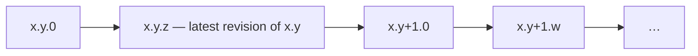
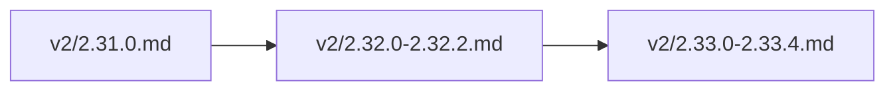

🔖 [Documentation Home](../../README.md) > [Contributing](./) > Maintainer Guide

# Maintainer Guide

For developers who contribute to or maintain Zrb itself: setup, tests, release, changelog, and the internals that need the most care.

---

## Table of Contents

- [Getting Started](#getting-started)
- [Publishing Zrb](#publishing-zrb)
- [Changelog](#changelog)
- [API Reference](#api-reference)
- [Inspecting Import Performance](#inspecting-import-performance)
- [Profiling Zrb](#profiling-zrb)
- [Testing Strategies](#testing-strategies)
  - [Process-wide state and pytest-xdist](#process-wide-state-and-pytest-xdist)
- [Evaluating the LLM Agent](#evaluating-and-improving-the-llm-agent)
  - [One-on-One LLM Session](#one-on-one-llm-session)
- [Architecture & Philosophy](#architecture--philosophy)
- [Context Propagation Internals](#context-propagation-internals)
- [LLM History Sanitization Layer](#llm-history-sanitization-layer)
- [Quick Reference](#quick-reference)

> 💡 **First time tracing a chat request?** Start with [LLM Chat Request Lifecycle](../llm/llm-chat-lifecycle.md), which walks `zrb llm chat "..."` from CLI to UI streaming with file paths at each step. This guide goes deeper on individual internals.

---

## Getting Started

### Environment Setup

First time only:

```bash
python -m venv .venv
```

Every session:

```bash
source .venv/bin/activate && poetry lock && poetry install
```

### Running Tests

```bash
./zrb-test.sh [path]
```

Pass nothing for the full suite, or a file / directory / `file::test_function` path to scope a run. CI runs the same script (`poetry run bash zrb-test.sh`), so a green local run means a green CI run.

`zrb-test.sh` gates in this order (some only on a full run):

| Gate | What it checks | If it fails |
|------|-----------------|-------------|
| `flake8 src/zrb --select=F` | Unused imports/vars, redefinitions (`src/` only) | Remove the dead import/var, or add the required `# lazy: <reason>` comment (see `AGENTS.md` → Imports) |
| `test/architecture/test_complexity_ratchet.py` (mccabe, via flake8) | A per-function complexity ratchet | Your function raised the *worst-in-repo* score — simplify it, or, if it's a registration/keybinding table (an accepted exception per `AGENTS.md`), mark it `# noqa: C901` with a one-line reason |
| `test/architecture/test_complexity_ratchet.py` (radon) | Same, scored per-function instead of summed into the enclosing function | Same fix |
| `test/architecture/test_private_test_access_ratchet.py` | Counts `test/` references into another object's private (`_foo`) attributes | Expose a public accessor instead (see `AGENTS.md` → Test Guidelines); rare accepted exceptions are listed in the test file's docstring |
| `test/architecture/test_sys_modules_patch_allowlist.py` | Every module shadowed by `patch.dict("sys.modules", ...)` is on a reviewed allowlist | `patch.dict` restores `sys.modules` by clear-and-update, which *deletes* anything first imported inside the block — unrecoverably for a C extension. If the guarded code can trigger a real first-time import, warm that module in `test/conftest.py`, then list the name (see the test file's docstring) |
| `pyright src/zrb` (full run only) | Static type check | Fix the reported type error |
| `pytest ... --cov-fail-under=94` (full run only) | ≥94% coverage | Add a test for the uncovered branch |

`zrb-test.sh` runs only the `flake8 --select=F` step directly; the four ratchets are ordinary pytest tests under `test/architecture/`. Each file's docstring documents its exact numbers and rationale.

**Not a gate, but bites often:** a new test file sharing a basename with another (e.g. two `test_manager.py`) fails pytest *collection*. Add an empty `__init__.py` to the new test directory (see `AGENTS.md` → Test Guidelines).

### Submitting a Change

- **Branches:** `feat/<short-name>` for features, `fix/<short-name>` for bug fixes.
- **Commits:** imperative subject (`Add X`, `Fix Y`), one logical change per commit. Don't bump `pyproject.toml`'s version — that's a maintainer-only commit tied to [publishing](#publishing-zrb).
- **Changelog:** most changes need an entry — see [Changelog](#changelog).
- **ADRs:** a non-trivial, consequential, and persistent design decision needs an Architecture Decision Record — see [`docs/adr/README.md`](../adr/README.md).
- **Code conventions** (naming, testing, imports, error handling) live in [`AGENTS.md`](../../AGENTS.md). It is written for AI coding agents, but every rule applies to humans too.

---

## Publishing Zrb

You need a [PyPI](https://pypi.org/) (or [TestPyPI](https://test.pypi.org/)) account and API token. Configure the token once, then publish:

```bash
poetry config pypi-token.pypi <your-api-token>
```

```bash
source ./project.sh
docker login -u stalchmst
zrb publish all
```

### About `README.pypi.md`

`pyproject.toml` points at `README.pypi.md`, not `README.md`. They differ only in `docs/X` link format:

| File | Link format | Purpose |
|------|-------------|---------|
| `README.md` | Relative (`docs/foo.md`) | Single source of truth — works locally, on GitHub, and offline |
| `README.pypi.md` | Absolute, tag-pinned (`https://github.com/state-alchemists/zrb/blob/2.25.3/docs/foo.md`) | Generated artifact — packaged by Poetry, shown on PyPI |

`README.pypi.md` is **gitignored** and generated by `scripts/build_pypi_readme.py`, which reads the version from `pyproject.toml` and rewrites every relative `docs/X` link to a tag-pinned GitHub URL, so `pypi.org/project/zrb/2.25.3/` always shows the docs as of that release. It is generated automatically by:

- `source ./project.sh` — before `poetry install`, so a fresh clone has the file.
- `zrb publish pip` — before `poetry publish --build`, so each release links to its own tag.

If you run `poetry build` / `poetry publish` directly, run `python scripts/build_pypi_readme.py` first or Poetry fails with "readme not found."

> ⚠️ **Tag format.** Release tags are bare `major.minor.patch` (e.g. `2.25.3`, no `v` prefix), and the script generates `/blob/2.25.3/...` accordingly. Keep this if you rewrite the URL template.

---

## Changelog

The changelog lives under `docs/changelog/`:

| Path | Scope |
|------|-------|
| `README.md` | Index page listing every minor version with links. |
| `v2/` | Per-minor-version files for the 2.x line (e.g. `2.38.0.md`, `2.35.0-2.35.3.md`). |
| `v3/` | Per-minor-version files for the 3.x line (e.g. `3.0.0.md`). |
| `v1.md` | Archive of the 1.x line (and the 1.0.0 rewrite from 0.x). |

### Writing an entry

Each release is a `## <version> (<Month D, YYYY>)` heading followed by one contiguous bullet list — no blank lines between entries:

```markdown
## 2.33.0 (June 6, 2026)

- **Feature: <Title>** (`path/to/module.py`, `test/path/to/test_module.py`): <what
  changed and why, past tense, anchored to concrete symbols>.
- **Fix: <Title>** (`path/to/module.py`): <the wrong behavior, then the new
  behavior>. Name the release that introduced it when fixing a shipped bug, so a
  reader can tell whether their version is affected.
```

- One flat `- **<Category>: <Title>** (`paths`): <prose>` bullet per change. No sub-bullets; a change too big for one bullet is usually two changes.
- Categories are free-form but conventionally `Feature` / `Improvement` / `Fix` / `Reliability` / `Security` / `Refactor` / `Performance` / `Chore` / `Documentation` / `Tests`.
- Past tense, factual, and anchored to something locatable (`module.py`, `ClassName`, an env var, `ADR-NNNN`).

### Collapsing (compaction)

Each patch release first lands in its own file under its line's directory (`v2/`, `v3/`). Once a minor ages out (a later minor opens), its per-patch files are merged into one range file that **keeps only two entries** — the minor bump and its final revision:



Worked example (2.31–2.33):



`2.31` had no patches (stays `2.31.0.md`); `2.32` collapsed `2.32.1` into `2.32.2` and its `2.32.0a1`–`b5` pre-releases into `2.32.0`; `2.33`, once it aged out, merged `2.33.1.md`–`2.33.4.md` into `2.33.4` in `2.33.0-2.33.4.md`. **The newest minor stays as separate per-patch files.**

The surviving entries must not lose the dropped history:

- The kept **`x.y.z` (latest)** entry **summarizes the cumulative changes** of every dropped patch `x.y.1`–`x.y.z`, not merely its own.
- The kept **`x.y.0`** entry **absorbs its pre-releases** (`x.y.0a*`/`x.y.0b*`). Headline features usually land there (the stable `.0` note often just says "consolidating the pre-release line below"), so dropping them without folding loses the real content.
- Mark a rolled-up entry with a one-line italic note under the heading: `_Cumulative summary of the X.Y.1–X.Y.Z patch line._`
- **Summarize, don't concatenate.** A 24-patch line becomes one release-note-sized entry grouped by theme; drop version-bump noise and test-only churn (one "expanded test coverage" mention suffices).
- Update `README.md` when renaming a file (e.g. `2.38.0.md` → `2.38.0-2.38.3.md`).

Dropped content stays recoverable from git, but the compacted file should convey what happened without it.

---

## API Reference

`./zrb-api-doc.sh [outdir]` renders the public API from docstrings into `dist/api` (gitignored, default outdir), using the annotations `src/zrb/py.typed` exposes to consumers.

It uses `pdoc` rather than `mkdocstrings` because `docs/` is plain markdown with no `mkdocs.yml`, and adopting mkdocs for one reference isn't worth it. The output is not committed: it regenerates from source, so a checked-in copy would only go stale.

Two tests keep the input complete: `test_public_api_docs.py` requires a docstring on every public member of every exported class and a documented parameter for every constructor argument a class adds; `test_public_api_contract.py` pins the surface against `public_api_snapshot.json`.

## Inspecting Import Performance

To decide whether a module should be lazy-loaded, use the stdlib `-X importtime`:

```bash
python -X importtime -c "import zrb" 2>importtime.log
```

Each line has **self** (µs in that module's own body) and **cumulative** (self + children) time. Sort by **self** — high cumulative with low self just means a heavy child. Use a warm run (import once first); the first run is dominated by cold disk I/O.

---

## Profiling Zrb

```bash
python -m cProfile -o .cprofile.prof -m zrb --help
```

| Tool | Output | Command |
|------|--------|---------|
| `snakeviz` | Interactive HTML | `pip install snakeviz && snakeviz .cprofile.prof` |
| `flameprof` | Flame graph SVG | `pip install flameprof && flameprof .cprofile.prof > flamegraph.svg` |

---

## Testing Strategies

Tests use `pytest` fixtures and `unittest.mock.patch` (decorator or context manager); see `test/` for examples and `AGENTS.md` → Test Guidelines for the rules.

### Process-wide state and `pytest-xdist`

`zrb-test.sh` runs `pytest -n auto`, whose default `--dist load` hands out tests **individually**, so which tests share a worker, and in what order, varies per run. State a test leaves in the process is read by an unpredictable set of later tests, surfacing as an intermittent failure in a test that never touched it. Every flake found in this suite so far has been this shape.

`test/conftest.py`'s autouse fixtures neutralize the known carriers: `os.environ`, the unscoped ambient `ContextVar`s, the memoized environment probes in `zrb.llm.prompt`, `current_agent_mode`'s shared mutable default, and filesystem hook discovery. A test that mutates something process-wide must restore it or add it there.

- **Clear on the way *out*, not just in.** Clearing a shared registry before each test protects *your* tests while leaking yours into whoever runs next.
- **An `lru_cache` keyed more narrowly than its inputs is poisoned by a mock.** If the function consults something outside its key (`$PATH`, an env var, a global), an answer computed under a `patch` sticks for the rest of the worker. Fix the key to cover everything the answer depends on, so the mock yields a different key instead of a wrong answer. Prefer driving a real input (a `tmp_path` CWD, a throwaway `$PATH`) over stubbing a stdlib global. Don't add a public `reset_*` seam just so a test can clear a cache.
- **`patch.dict("sys.modules", ...)` deletes real imports.** See the `test_sys_modules_patch_allowlist.py` row in the [gate table](#running-tests).

To reproduce a suspected order dependence, run the two tests together in one process (`pytest a::test_x b::test_y`) rather than through a full parallel run.

---

## Evaluating and Improving the LLM Agent

Agent quality is measured with evaluation challenges in a separate repository, [github.com/state-alchemists/llm-challenges](https://github.com/state-alchemists/llm-challenges); its README has the full protocol. The loop: run challenges for all model combinations → review `REPORT.md` for failures → refactor prompts or tools → re-run to confirm.

```bash
git clone https://github.com/state-alchemists/llm-challenges.git
cd llm-challenges/

# Quick verification test
python runner.py --models openai:gpt-4o google-gla:gemini-1.5-pro --timeout 120 --verbose

# Full test suite
python runner.py --timeout 3600 --parallelism 12 --verbose --models <model-list>
```

| What | Location |
|------|----------|
| Report | `experiment/REPORT.md` |
| Results | `experiment/results.json` |
| Prompts to optimize | `src/zrb/llm/prompt/markdown/` |
| Tools to optimize | `src/zrb/llm/tool/` |

### One-on-One LLM Session

To surface friction automated metrics miss, ask the model itself to rate the system prompt's helpfulness, effectiveness, efficiency, and ease of following:

```bash
zrb chat "What is your honest analysis about your current system prompt/instruction. How helpful/effective/efficient is it? How easy/difficult is it for you to follow the instruction. Is that ergonomics? Give scores (1-10) for each aspect"
```

---

## Architecture & Philosophy

Core design decisions (strict `asyncio`, the `Any*` decoupled interface pattern, data flow) are in **[Architecture, Philosophy, & Conventions](./architecture.md)**.

---

## Context Propagation Internals

Zrb threads execution state through async coroutines with `contextvars.ContextVar` instead of explicit parameters. Seventeen `ContextVar`s are indexed in `src/zrb/contextvars.py`, split into five layers. Update this section whenever you add, remove, or rename one.

### The Five Layers

**Layer 1 — Task execution** (`src/zrb/context/any_context.py`):

```python
current_ctx: ContextVar[AnyContext | None] = ContextVar("current_ctx", default=None)
```

The active `Context` for the executing task. Set at the start of `execute_task_action()`, reset in its `finally` block.

**Layer 2 — LLM agent execution** (`src/zrb/llm/agent_state.py`, `src/zrb/llm/approval/approval_channel.py`). All nine are set at the start of `run_agent()` and reset in its `finally` block:

| Variable | Type | Purpose |
|---|---|---|
| `current_ui` | `AnyUI \| None` | Active UI for output and user interaction |
| `current_tool_confirmation` | `AnyToolConfirmation` | Tool approval policy |
| `current_yolo` | `bool` | Auto-approve all tool calls |
| `current_approval_channel` | `AnyApprovalChannel \| None` | Remote approval handler |
| `current_hook_manager` | `HookManager \| None` | Hook manager for the run; nested tools (e.g. delegate) fire SubagentStart/Stop on it |
| `current_agent_run_scope` | `str` | Identifies this agent run to nested tools needing per-conversation state (e.g. `file_observation.py`'s read-before-overwrite tracking) — the session name for a top-level run, a fresh per-delegation id for a sub-agent, so a sub-agent never inherits what its parent or siblings observed |
| `current_small_model` | `str \| Model \| None` | The UI's own `small_model` (set by `/model small ...`), so `journal_compliance.py`'s judge model and other small-tier consumers resolve per-session instead of leaking one process-wide value across concurrent chat sessions |
| `current_multimodal_model` | `str \| Model \| None` | The UI's own `multimodal_model` (set by `/model multimodal ...`), read by the attachment-description pipeline and voice engine, per-session for the same reason |
| `current_model` | `str \| Model \| None` | The run's main model, so a helper needing its own model (the summarizer, the journal judge) falls back to it rather than to `CFG.LLM_MODEL` |

**Layer 3 — Permission state** (`src/zrb/llm/permission/state.py`):

| Variable | Type | Purpose |
|---|---|---|
| `current_permission_policy` | `PermissionPolicy \| None` | In-force tool ruleset (`None` = legacy yolo behavior). Set by `run_agent()` from the explicit arg or inherited from a parent run; reset in its `finally` block. |
| `current_agent_mode` | `AgentModeState` | Mutable holder whose `.mode` is `AgentMode.BUILD` or `AgentMode.PLAN`. Set by the `EnterPlanMode` / `ExitPlanMode` tools; `PLAN` makes `get_effective_policy()` return the read-only `PLAN_MODE_POLICY`. |

**Layer 4 — Sandbox state** (`src/zrb/llm/sandbox/state.py`):

| Variable | Type | Purpose |
|---|---|---|
| `current_sandbox_policy` | `SandboxPolicy \| None` | In-force filesystem-containment policy (`None` = resolve from `CFG.LLM_SANDBOX_*`, disabled unless the deployment opted in). Set by `run_agent()` from the explicit arg or inherited from a parent run; reset in its `finally` block. Consumed by the `_sandbox_gate` in `agent/common.py` and the shell tools' OS-sandbox wrapper. |

**Layer 5 — Tool ambient state** (`src/zrb/llm/tool/ambient_state.py`). Set and cleared by their owning tools (`src/zrb/llm/tool/worktree.py`, `src/zrb/llm/tool/ask.py`), not at a single entry point:

| Variable | Type | Purpose |
|---|---|---|
| `active_worktree` | `str` | Path of the worktree the agent is operating in (set by `EnterWorktree`, cleared by `ExitWorktree`) |
| `_current_session` | `str` | The active conversation's *display* session name, defaulted by tools (todo tools, `DelegateToAgent`, `BufferedUI`) called without an explicit `session=` — a client-supplied label with no uniqueness guarantee, never a resource-ownership key |
| `interactive_mode` | `bool` | Whether the chat session is interactive — gates `ask_user_question` so non-interactive runs short-circuit instead of blocking on stdin |
| `current_chat_session_id` | `str` | `ChatSessionManager`'s own unique session_id, bound once per message drive in `chat_session_runner.py`. Unlike `_current_session`, it is unique: `shell_background.py` tags background processes with it so `ChatSessionManager.remove_session()` cleans up exactly that session's processes, never a same-named one's |

### The Scoping Pattern

Every `ContextVar` follows the same RAII-style pattern:

```python
token = current_ctx.set(ctx)
try:
    ...task body...
finally:
    current_ctx.reset(token)  # restores the previous value
```

`reset(token)` restores the value from before `set()`, so nested calls (e.g. a sub-agent delegated from a parent) each get their own scope while inheriting the parent's values at entry.

### Inheritance Pattern

Agent context variables fall back to the ambient value, so a child agent without an explicit argument inherits its parent's — this is how YOLO mode, approval channels, and UI handles flow through nested agent calls:

```python
# run_agent.py — resolve effective value
effective_ui = ui_arg or current_ui.get()
effective_yolo = yolo or current_yolo.get()
```

A delayed live-sub-agent continuation starts *after* the original run's scope has ended. `AuthoritySnapshot` captures the original run's effective permission and sandbox authority while the scope is still active, and the continuation explicitly rebinds it, so a later, unrelated ambient context cannot broaden the continuation's authority.

### Resource Ownership and Cleanup

Tie each resource to the narrowest lifetime that can safely clean it up:

| Resource | Owner | Cleanup boundary |
|---|---|---|
| Chat driver task | `ChatSession` | Cancellation or chat-session removal |
| Background shell process | Chat session ID | Session removal or process shutdown |
| Live sub-agent session | Parent chat session ID | Agent completion or session removal |
| Activity-panel entry | Parent chat session ID | Sub-agent completion or session removal |
| Approval wait/future | Approval channel / chat session | Response, cancellation, or session removal |
| Agent run ContextVars | Agent run | `run_agent()` scope exit |
| Conversation history | Display conversation name | History manager persistence/retention |

Client-supplied display names are fine for labels and history files, never for ownership or cleanup keys. A resource that outlives one message must be owned by an opaque, stable identifier that cannot collide with another concurrent session.

### Why ContextVar (not Globals or Thread-locals)?

Zrb is fully asyncio-based, and thread-locals don't work with coroutines (many share a thread). A global dict keyed on task/session ID would work but needs lookups and manual lifecycle management. `ContextVar` integrates with the asyncio scheduler:

- `asyncio.create_task()` automatically copies the current context to the new task (PEP 567).
- `asyncio.gather()` runs coroutines in-place, sharing the caller's context.
- Token-based `reset()` ensures correct cleanup even if exceptions occur.

### Known Inefficiency: `env` Dict Copy

Every task `Context` (`context.py:25`) copies the whole shared env dictionary:

```python
self._env = shared_ctx.env.copy()
```

This is O(n) in env vars, once per task execution — not a bottleneck for typical workloads (< 100 vars, dozens of tasks). Under memory pressure from large fan-out (hundreds of concurrent tasks, large envs), look here first; a lazy/copy-on-write approach would remove the redundant copies.

### Gotcha: `asyncio.create_task()` and Context Timing

`execution.py:97` creates a new asyncio task for action execution:

```python
action_coro = asyncio.create_task(run_async(execute_action_with_retry(task, session)))
```

Python copies the context at `create_task()` time, so if the parent resets `current_ctx` before the task is scheduled, the task still sees the creation-time value. This is safe because `execute_action_with_retry` re-establishes its own `current_ctx` scope — keep it in mind if the execution model changes.

### Gotcha: `ThreadPoolExecutor` Does Not Copy the Context

A pool thread starts with an **empty** context — nothing ambient reaches work submitted to one, which silently turns every per-run value into its static default. `ThreadPoolHookExecutor` (the synchronous hook dispatcher) hit this: the self-review gate's reviewer resolved `CFG.LLM_MODEL` instead of the run's model, since `current_model` was unset in the thread. Anything crossing a thread boundary must copy the caller's context explicitly:

```python
executor.submit(contextvars.copy_context().run, callable, *args)
```

`contextvars.copy_context()` captures the values as they are at submission; the hook's own `current_*` writes stay inside the copy, so the pool thread never mutates the caller's scope. Prefer `asyncio.to_thread`, which copies the context for you, where the call site can be async.

Copy what is safe to use from the other thread, not everything. The hook executor runs each hook in an event loop of its own, so it clears `current_ui`, `current_tool_confirmation` and `current_approval_channel` in the copy (`_copy_context_for_hook`): all three are driven from the caller's loop, and a hook tool reaching one would cross threads.

---

## LLM History Sanitization Layer

pydantic-ai sends the full conversation history to the provider every turn, and several providers reject a history they themselves produced one turn earlier. This section covers those failure modes and the defensive layer Zrb adds on top of pydantic-ai.

### The Core Problem: Provider Inconsistency

For a tool call without text, the provider returns:

```json
{"role": "assistant", "content": null, "tool_calls": [...]}
```

This is valid per the OpenAI spec, and pydantic-ai stores it as a `ModelResponse` with only a `ToolCallPart` (no `TextPart`). Next turn, pydantic-ai serializes the same history back:

```json
{"role": "assistant", "content": null, "tool_calls": [...]}
```

Some providers — including DeepSeek and several OpenAI-compatible APIs — **reject this identical structure** with:

```
Invalid assistant message: content or tool_calls must be set
```

This is a provider-side inconsistency, not a pydantic-ai parsing bug or a corrupt response. Thinking models behave the same way: DeepSeek R1 (and similar) emit `reasoning_content` alongside `content: null`, and echoing that message without `reasoning_content` returns:

```
Missing reasoning_content field
```

### Known Affected Providers

| Provider / Model | Symptom | Root Cause |
|---|---|---|
| DeepSeek V3.2+, V4 | `"content or tool_calls must be set"` | Rejects `content: null` in echoed history |
| DeepSeek R1 (pre pydantic-ai 1.90) | `"Missing reasoning_content field"` | `reasoning_content` dropped from echo |
| AWS Bedrock custom models (`zai.glm-5`, etc.) | `ValidationException` (empty message) | Strict message-structure validation; exact rule not disclosed by provider |
| Ollama (some models) | HTTP 400 with tool/function error | References non-existent tool name in response |

The `is_invalid_tool_call_error` classifier retries only when the error has **both** an entity keyword (`"tool"`, `"function"`) **and** a problem keyword (`"unknown"`, `"invalid"`, `"not defined"`, `"not found"`), so a generic 400 like `"Invalid JSON body"` is not misclassified.

### The Orphaned Tool Pair Problem

History compression (when the conversation exceeds the token limit) splits history into "to summarize" and "to keep" slices at a turn boundary. But a turn can span an assistant message that calls a tool and the following user message holding its result. If the split falls between a `ToolCallPart` (in the `ModelResponse`) and its `ToolReturnPart` (in the next `ModelRequest`), the kept slice has a call with no return, and Bedrock and other providers return `ValidationException`.

### The Sanitization Layer

`sanitize_history()` runs at three points:

1. **Before every `converse_stream` call** (`runner.py` — `_execution_loop`)
2. **On the result history** after a successful stream (`runner.py` — after `AgentRunResultEvent`)
3. **After history compression** on the kept slice (`history_summarizer.py` — `summarize_history`), which runs *all four steps* unconditionally so the returned history is provider-clean

The steps run in a fixed order held in the `_SANITIZE_STEPS` tuple (`history_utils.py`), so reordering is a visible edit to that tuple. Each step's output must be valid input for the next:

| Step | Function | What it fixes |
|------|----------|---------------|
| 1 | `filter_nil_content` | `None`/`""` content in any part type (replaced with `"(empty)"`, or `"null"` for `ToolReturnPart`); injects `TextPart("(tool call)")` only in a `ModelResponse` with **neither** text **nor** tool calls. A tool-call-only response is left text-less (every provider accepts it; `openai_patch` omits the `content` field) — a placeholder there leaks `"(tool call)"` into history, which weaker models echo back as literal output. |
| 2 | `sanitize_orphaned_tool_calls` | Removes unmatched `ToolCallPart`/`ToolReturnPart` pairs; patches text-less messages left behind |
| 3 | Drop empty messages | Removes `ModelRequest`/`ModelResponse` objects with no parts left after steps 1–2 |
| 4 | `ensure_alternating_roles` | Merges consecutive same-role messages by concatenating their `parts` lists (prevents back-to-back assistant or user messages) |

Step 2 is skipped when `allow_orphaned_tool_calls=True`, which must be set whenever `deferred_tool_results` is passed to `agent.run_stream_events()`: there, history `ToolCallPart`s legitimately lack a `ToolReturnPart` because their returns are in `current_results`. Removing them would silently break tool execution.

```python
# runner.py — _execution_loop
cursor.begin_round(
    sanitize_history(
        cursor.history,
        allow_orphaned_tool_calls=(cursor.results is not None),
    )
)
```

Before and after the pipeline, `_detect_problems()` logs invariant violations at DEBUG: nil content, text-less `ModelResponse`s, consecutive same-role messages, and orphaned tool pairs. It costs nothing in production and helps trace provider 400s. A problem still present *after* the pipeline means the step order (or a step's contract) is wrong.

### The OpenAI Serializer Patch

`filter_nil_content` fixes the problem at the `ModelMessage` level; `openai_patch.py` adds a complementary serialization-level fix by monkey-patching `OpenAIChatModel._MapModelResponseContext._into_message_param`. Upstream sets `content = None` whenever there is no text, which serializes to `"content": null`:

```python
# pydantic-ai 2.27.0
if not self.texts and not self.tool_calls:
    return None                       # nothing to send: emit no message at all
...
if self.texts:
    message_param['content'] = '\n\n'.join(self.texts)
else:
    message_param['content'] = None   # sent as "content": null
```

The patch drops the `else`, so `content` is omitted when tool calls are present — valid per the OpenAI spec and accepted by all known providers. The first-line empty-response guard is upstream's, reproduced verbatim; returning a message there would be the same 400 in a different disguise.

No model profile flag disables the null, so the patch is still required as of 2.27.0. Upstream documents `_into_message_param` as an override hook, which makes the patch supportable even though its class is private. It is applied once at import (`runner.py` calls `patch_openai_model_response_serialization()` at module load); if pydantic-ai renames the target, the miss is logged at WARNING and `filter_nil_content` remains the fallback.

### The `strip_thinking_parts` Retry

Some providers reject history containing `ThinkingPart`s even after sanitization (e.g. a DeepSeek model behind a non-DeepSeek provider that can't serialize `reasoning_content`). The retry loop detects a 400 matching `"missing reasoning_content"` or `"reasoning_content field"` (`is_missing_reasoning_content_error`), then `strip_thinking_parts()` removes every `ThinkingPart` from every `ModelResponse` and retries once. A message left with no parts (or no text part) gets a single `TextPart("(tool call)")` to stay valid.

### The Generic Opaque-400 Fallback

Some providers return opaque 400s with no usable message (GLM-5 on Bedrock: `ValidationException` with an empty `Message`). Rather than catalog every variant, `retry_loop.py` has a catch-all that fires **once** for any unclassified HTTP 400:

1. It applies `strip_to_text_only()` to the history, collapsing each structured part to plain text **within its parent message's allowed part types** — pydantic-ai's `_map_user_message` (`models/openai.py`) hits `assert_never` on any non-`{System,User,ToolReturn,Retry}PromptPart` in a `ModelRequest`:
   - In `ModelResponse`: `BaseToolCallPart`/`BuiltinToolReturnPart`/`ThinkingPart` → `TextPart` with descriptive labels (e.g. `[Tool: deploy({"env":"prod"})]`, `[Result (deploy): started]`).
   - In `ModelRequest`: `ToolReturnPart` and tool-linked `RetryPromptPart` → `UserPromptPart` with the same kind of label (a `TextPart` inside a `ModelRequest` would crash the OpenAI mapper). Both sides of every call/return pair are stripped together, so no `tool_call_id` cross-reference survives to orphan. Nil/empty content becomes `"."`; tool results are truncated to 500 chars.
2. It retries with the sanitised history.

Plain `{"role": "user"|"assistant", "content": "..."}` text is the lowest common denominator every text-generation provider accepts. The handler is gated on `current_message is not None`, so it never fires during deferred-result tool-loop iterations, where stripping structure could orphan call/return pairs.

It sits **last among the HTTP-400 handlers** in `handle_stream_error`, after transient, prompt-too-long, missing-reasoning, and invalid-tool-call, so the DeepSeek path fires first and this stays a last resort. (The deferred-mismatch handler below comes after it textually but is gated on a pydantic `UserError`, not an HTTP 400, so their order is immaterial.)

### The Deferred-Results-After-Summarization Recovery

A separate failure arises *between* deferred-tool iterations. After a deferred tool is approved or denied, the loop re-enters `agent.run_stream_events()` with the resolved `DeferredToolResults`. If the summarizer ran in between, it could drop the **entire `ModelResponse` whose `tool_calls` match `current_results`** — no orphaned *part* for `allow_orphaned_tool_calls` to preserve. pydantic-ai's `_handle_deferred_tool_results` then raises a `UserError` containing *"does not contain any unprocessed tool calls"* (or *"does not contain a `ModelResponse`"*).

Two defenses cover this (see ADR-0040):

1. **Prevention (`runner.py`, `_execution_loop`)** — the deferred-tool branch calls `cursor.carry_forward()` (`turn_cursor.py`), the only place `TurnCursor.history` is set from `run_history`, never reapplying processors mid-deferral. It is unconditional because `_process_deferred_requests` populates `current_results.approvals` for every resolved call (approved, denied, or hook-blocked), so a "skip the summarizer?" guard would be true on every deferred iteration anyway. Processors already ran in `_prepare_history` before the first stream call, and the summarizer still runs on every non-deferred iteration.

   ```python
   # runner.py — _execution_loop, deferred-tool branch
   cursor.carry_forward()  # never reapply the summarizer mid-deferral
   ```

2. **Recovery (`retry_loop.py`, `handle_stream_error`)** — a one-shot handler (gated by `deferred_mismatch_retry_done`) catches the `UserError`, clears the stale `current_results` via `RetryOutcome.clear_results`, and retries so the model generates fresh tool calls. It returns the **intact `run_history`** (not `None`) as `new_history`, because the runner assigns `outcome.new_history` to `cursor.history` unconditionally and `sanitize_history` raises `TypeError` on `None`.

### The Empty-Completion Guard

A weak or overloaded provider can also **succeed** with no real content: zero output tokens, no tool call, and empty text or just the `"(tool call)"` placeholder (from `filter_nil_content`, or imitated by the model). Unguarded, that placeholder reaches the user as the answer.

`_execution_loop` (`runner.py`) checks `_is_empty_completion(result_output)` after the stream — *after* the `DeferredToolRequests` branch (a deferred result is a legitimate outcome) and *before* the `SESSION_END` hooks. It returns `True` only for a **str** output that is blank or one of `_EMPTY_COMPLETION_MARKERS` (`"(tool call)"` and the bare `"(tool call"` imitation); structured outputs are never caught.

On a hit, the loop regenerates the turn: `_history_without_trailing_response(run_history)` drops the degenerate trailing `ModelResponse` (keeping tool returns, so the deferred-resume case works), `current_message`/`current_results` reset to `None`, and it re-requests. This is bounded by `RetryState.max_empty_completion_retries` (default 2), after which it raises a clear `RuntimeError` ("Model returned an empty response …"). Real answers are non-empty prose, so it never rejects real output.

### Re-checking a Mitigation Against a New pydantic-ai

Each layer works around a *provider* bug, not a pydantic-ai one, so upgrades rarely retire any. Re-audit on a minor bump anyway: a dead layer keeps rewriting history for no reason.

Audited against **2.27.0**; every layer is still load-bearing:

| Layer | Verdict |
|---|---|
| `filter_nil_content` | Keep. Object-level guard against `None`/`""` content; nothing upstream normalizes this. |
| `openai_patch` | Keep. `_into_message_param` still writes `content = None` beside `tool_calls`, and no profile flag disables it. |
| `sanitize_orphaned_tool_calls` | Keep. The orphans are created by *zrb's* summarizer splitting a turn, so no upstream change can remove them. |
| `ensure_alternating_roles` | Keep. Same origin as above. |
| `strip_thinking_parts` retry | Keep. Error-triggered and free when it does not fire; the providers that reject echoed thinking still exist. |
| Opaque-400 text-only fallback | Keep. Deliberately provider-agnostic; upstream classifies transport errors, not provider quirks. |
| Deferred-mismatch recovery | Keep, and re-check the strings. It matches on `UserError` text raised by `_agent_graph`; both phrases are unchanged in 2.27.0. |
| Empty-completion guard | Keep. Guards a *successful* stream with no content — not an error path upstream ever sees. |

Two upstream changes were adopted: `ModelHTTPError` now carries `headers` and a parsed `retry_after`, which `get_retry_wait` reads before falling back to exponential backoff, and `known_model_names()` replaces unwrapping `KnownModelName.__value__` for `/model` completion.

### File Map

| File | Responsibility |
|------|---------------|
| `src/zrb/llm/agent/run/history_utils.py` | `sanitize_history()`, `_SANITIZE_STEPS`, `filter_nil_content()`, `strip_thinking_parts()`, `strip_to_text_only()`, `TurnPruneFloor` |
| `src/zrb/llm/agent/run/turn_cursor.py` | `TurnCursor` — the loop state `_execution_loop` threads across rounds; `carry_forward()` and `commit_round()` are the two invariants ADR-0040 depends on |
| `src/zrb/llm/message.py` | `sanitize_orphaned_tool_calls()`, `ensure_alternating_roles()`, `validate_tool_pair_integrity()` |
| `src/zrb/llm/agent/run/openai_patch.py` | Monkey-patch for `content: null` serialization |
| `src/zrb/llm/agent/run/error_classifier.py` | `is_missing_reasoning_content_error()`, `is_invalid_tool_call_error()` |
| `src/zrb/llm/agent/run/retry_loop.py` | Retry decisions including `strip_thinking_parts`, the opaque-400 fallback, and the deferred-mismatch recovery (`deferred_mismatch_retry_done` / `clear_results`) |
| `src/zrb/llm/agent/run/runner.py` | `_execution_loop`: never reapplies history processors mid-deferral |
| `src/zrb/llm/summarizer/history_summarizer.py` | Calls `sanitize_history()` on the kept slice after compression |

---

## Quick Reference

| Task | Command |
|------|---------|
| Publish | `zrb publish all` |
| Profile imports | `python -X importtime -c "import zrb" 2>importtime.log` |
| Generate profile | `python -m cProfile -o .cprofile.prof -m zrb --help` |
| Visualize (snakeviz) | `snakeviz .cprofile.prof` |
| Visualize (flame) | `flameprof .cprofile.prof > flamegraph.svg` |
| Clone + run LLM challenges | `git clone https://github.com/state-alchemists/llm-challenges && cd llm-challenges && python runner.py --models <list> --verbose` |
| Run one-on-one LLM session | `zrb chat "What is your honest analysis about your current system prompt..."` |

---

🔖 [Documentation Home](../../README.md) > [Contributing](./) > Maintainer Guide
