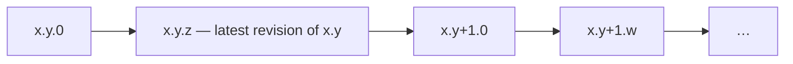
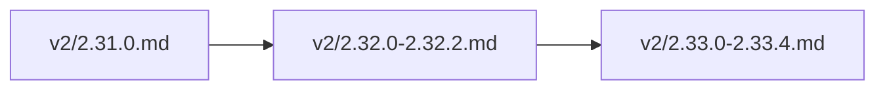

🔖 [Documentation Home](../../README.md) > [Contributing](./) > Maintainer Guide

# Maintainer Guide

For developers who contribute to or maintain Zrb itself: setup, tests, release, and changelog. Deep internals (context propagation, history sanitization) live in the technical specs linked below.

---

## Table of Contents

- [Getting Started](#getting-started)
- [Publishing Zrb](#publishing-zrb)
- [Changelog](#changelog)
- [API Reference](#api-reference)
- [Inspecting Import Performance](#inspecting-import-performance)
- [Profiling Zrb](#profiling-zrb)
- [Testing Strategies](#testing-strategies)
  - [Process-wide state and pytest-xdist](#process-wide-state-and-pytest-xdist)
- [Evaluating the LLM Agent](#evaluating-and-improving-the-llm-agent)
  - [One-on-One LLM Session](#one-on-one-llm-session)
- [Architecture & Philosophy](#architecture--philosophy)
- [Context Propagation Internals](#context-propagation-internals) (moved to technical specs)
- [LLM History Sanitization Layer](#llm-history-sanitization-layer) (moved to technical specs)
- [Quick Reference](#quick-reference)

> 💡 **First time tracing a chat request?** Start with [LLM Chat Request Lifecycle](../llm/llm-chat-lifecycle.md), which walks `zrb llm chat "..."` from CLI to UI streaming with file paths at each step. This guide goes deeper on individual internals.

---

## Getting Started

### Environment Setup

First time only:

```bash
python -m venv .venv
```

Every session:

```bash
source .venv/bin/activate && poetry lock && poetry install
```

### Running Tests

```bash
./zrb-test.sh [path]
```

Pass nothing for the full suite, or a file / directory / `file::test_function` path to scope a run. CI runs the same script (`poetry run bash zrb-test.sh`), so a green local run means a green CI run.

`zrb-test.sh` gates in this order (some only on a full run):

| Gate | What it checks | If it fails |
|------|-----------------|-------------|
| `flake8 src/zrb --select=F` | Unused imports/vars, redefinitions (`src/` only) | Remove the dead import/var, or add the required `# lazy: <reason>` comment (see `AGENTS.md` → Imports) |
| `test/architecture/test_complexity_ratchet.py` (mccabe, via flake8) | A per-function complexity ratchet | Your function raised the *worst-in-repo* score — simplify it, or, if it's a registration/keybinding table (an accepted exception per `AGENTS.md`), mark it `# noqa: C901` with a one-line reason |
| `test/architecture/test_complexity_ratchet.py` (radon) | Same, scored per-function instead of summed into the enclosing function | Same fix |
| `test/architecture/test_private_test_access_ratchet.py` | Counts `test/` references into another object's private (`_foo`) attributes | Expose a public accessor instead (see `AGENTS.md` → Test Guidelines); rare accepted exceptions are listed in the test file's docstring |
| `test/architecture/test_sys_modules_patch_allowlist.py` | Every module shadowed by `patch.dict("sys.modules", ...)` is on a reviewed allowlist | `patch.dict` restores `sys.modules` by clear-and-update, which *deletes* anything first imported inside the block — unrecoverably for a C extension. If the guarded code can trigger a real first-time import, warm that module in `test/conftest.py`, then list the name (see the test file's docstring) |
| `pyright src/zrb` (full run only) | Static type check | Fix the reported type error |
| `pytest ... --cov-fail-under=95` (full run only) | ≥95% coverage | Add a test for the uncovered branch |

`zrb-test.sh` runs only the `flake8 --select=F` step directly; the four ratchets are ordinary pytest tests under `test/architecture/`. Each file's docstring documents its exact numbers and rationale.

**Not a gate, but bites often:** a new test file sharing a basename with another (e.g. two `test_manager.py`) fails pytest *collection*. Add an empty `__init__.py` to the new test directory (see `AGENTS.md` → Test Guidelines).

### Submitting a Change

- **Branches:** `feat/<short-name>` for features, `fix/<short-name>` for bug fixes.
- **Commits:** imperative subject (`Add X`, `Fix Y`), one logical change per commit. Don't bump `pyproject.toml`'s version — that's a maintainer-only commit tied to [publishing](#publishing-zrb).
- **Changelog:** most changes need an entry — see [Changelog](#changelog).
- **ADRs:** a non-trivial, consequential, and persistent design decision needs an Architecture Decision Record — see [`docs/adr/README.md`](../adr/README.md).
- **Code conventions** (naming, testing, imports, error handling) live in [`AGENTS.md`](../../AGENTS.md). It is written for AI coding agents, but every rule applies to humans too.

---

## Publishing Zrb

You need a [PyPI](https://pypi.org/) (or [TestPyPI](https://test.pypi.org/)) account and API token. Configure the token once, then publish:

```bash
poetry config pypi-token.pypi <your-api-token>
```

```bash
source ./project.sh
docker login -u stalchmst
zrb publish all
```

### About `README.pypi.md`

`pyproject.toml` points at `README.pypi.md`, not `README.md`. They differ only in `docs/X` link format:

| File | Link format | Purpose |
|------|-------------|---------|
| `README.md` | Relative (`docs/foo.md`) | Single source of truth — works locally, on GitHub, and offline |
| `README.pypi.md` | Absolute, tag-pinned (`https://github.com/state-alchemists/zrb/blob/2.25.3/docs/foo.md`) | Generated artifact — packaged by Poetry, shown on PyPI |

`README.pypi.md` is **gitignored** and generated by `scripts/build_pypi_readme.py`, which reads the version from `pyproject.toml` and rewrites every relative `docs/X` link to a tag-pinned GitHub URL, so `pypi.org/project/zrb/2.25.3/` always shows the docs as of that release. It is generated automatically by:

- `source ./project.sh` — before `poetry install`, so a fresh clone has the file.
- `zrb publish pip` — before `poetry publish --build`, so each release links to its own tag.

If you run `poetry build` / `poetry publish` directly, run `python scripts/build_pypi_readme.py` first or Poetry fails with "readme not found."

> ⚠️ **Tag format.** Release tags are bare `major.minor.patch` (e.g. `2.25.3`, no `v` prefix), and the script generates `/blob/2.25.3/...` accordingly. Keep this if you rewrite the URL template.

---

## Changelog

The changelog lives under `docs/changelog/`:

| Path | Scope |
|------|-------|
| `README.md` | Index page listing every minor version with links. |
| `v2/` | Per-minor-version files for the 2.x line (e.g. `2.38.0.md`, `2.35.0-2.35.3.md`). |
| `v3/` | Per-minor-version files for the 3.x line (e.g. `3.0.0.md`). |
| `v1.md` | Archive of the 1.x line (and the 1.0.0 rewrite from 0.x). |

### Writing an entry

Each release is a `## <version> (<Month D, YYYY>)` heading followed by one contiguous bullet list — no blank lines between entries:

```markdown
## 2.33.0 (June 6, 2026)

- **Feature: <Title>** (`path/to/module.py`, `test/path/to/test_module.py`): <what
  changed and why, past tense, anchored to concrete symbols>.
- **Fix: <Title>** (`path/to/module.py`): <the wrong behavior, then the new
  behavior>. Name the release that introduced it when fixing a shipped bug, so a
  reader can tell whether their version is affected.
```

- One flat `- **<Category>: <Title>** (`paths`): <prose>` bullet per change. No sub-bullets; a change too big for one bullet is usually two changes.
- Categories are free-form but conventionally `Feature` / `Improvement` / `Fix` / `Reliability` / `Security` / `Refactor` / `Performance` / `Chore` / `Documentation` / `Tests`.
- Past tense, factual, and anchored to something locatable (`module.py`, `ClassName`, an env var, `ADR-NNNN`).

### Collapsing (compaction)

Each patch release first lands in its own file under its line's directory (`v2/`, `v3/`). Once a minor ages out (a later minor opens), its per-patch files are merged into one range file that **keeps only two entries** — the minor bump and its final revision:



Worked example (2.31–2.33):



`2.31` had no patches (stays `2.31.0.md`); `2.32` collapsed `2.32.1` into `2.32.2` and its `2.32.0a1`–`b5` pre-releases into `2.32.0`; `2.33`, once it aged out, merged `2.33.1.md`–`2.33.4.md` into `2.33.4` in `2.33.0-2.33.4.md`. **The newest minor stays as separate per-patch files.**

The surviving entries must not lose the dropped history:

- The kept **`x.y.z` (latest)** entry **summarizes the cumulative changes** of every dropped patch `x.y.1`–`x.y.z`, not merely its own.
- The kept **`x.y.0`** entry **absorbs its pre-releases** (`x.y.0a*`/`x.y.0b*`). Headline features usually land there (the stable `.0` note often just says "consolidating the pre-release line below"), so dropping them without folding loses the real content.
- Mark a rolled-up entry with a one-line italic note under the heading: `_Cumulative summary of the X.Y.1–X.Y.Z patch line._`
- **Summarize, don't concatenate.** A 24-patch line becomes one release-note-sized entry grouped by theme; drop version-bump noise and test-only churn (one "expanded test coverage" mention suffices).
- Update `README.md` when renaming a file (e.g. `2.38.0.md` → `2.38.0-2.38.3.md`).

Dropped content stays recoverable from git, but the compacted file should convey what happened without it.

---

## API Reference

`./zrb-api-doc.sh [outdir]` renders the public API from docstrings into `dist/api` (gitignored, default outdir), using the annotations `src/zrb/py.typed` exposes to consumers.

It uses `pdoc` rather than `mkdocstrings` because `docs/` is plain markdown with no `mkdocs.yml`, and adopting mkdocs for one reference isn't worth it. The output is not committed: it regenerates from source, so a checked-in copy would only go stale.

Two tests keep the input complete: `test_public_api_docs.py` requires a docstring on every public member of every exported class and a documented parameter for every constructor argument a class adds; `test_public_api_contract.py` pins the surface against `public_api_snapshot.json`.

## Inspecting Import Performance

To decide whether a module should be lazy-loaded, use the stdlib `-X importtime`:

```bash
python -X importtime -c "import zrb" 2>importtime.log
```

Each line has **self** (µs in that module's own body) and **cumulative** (self + children) time. Sort by **self** — high cumulative with low self just means a heavy child. Use a warm run (import once first); the first run is dominated by cold disk I/O.

---

## Profiling Zrb

```bash
python -m cProfile -o .cprofile.prof -m zrb --help
```

| Tool | Output | Command |
|------|--------|---------|
| `snakeviz` | Interactive HTML | `pip install snakeviz && snakeviz .cprofile.prof` |
| `flameprof` | Flame graph SVG | `pip install flameprof && flameprof .cprofile.prof > flamegraph.svg` |

---

## Testing Strategies

Tests use `pytest` fixtures and `unittest.mock.patch` (decorator or context manager); see `test/` for examples and `AGENTS.md` → Test Guidelines for the rules.

### Process-wide state and `pytest-xdist`

`zrb-test.sh` runs `pytest -n auto`, whose default `--dist load` hands out tests **individually**, so which tests share a worker, and in what order, varies per run. State a test leaves in the process is read by an unpredictable set of later tests, surfacing as an intermittent failure in a test that never touched it. Every flake found in this suite so far has been this shape.

`test/conftest.py`'s autouse fixtures neutralize the known carriers: `os.environ`, the unscoped ambient `ContextVar`s, the memoized environment probes in `zrb.llm.prompt`, `current_agent_mode`'s shared mutable default, and filesystem hook discovery. A test that mutates something process-wide must restore it or add it there.

- **Clear on the way *out*, not just in.** Clearing a shared registry before each test protects *your* tests while leaking yours into whoever runs next.
- **An `lru_cache` keyed more narrowly than its inputs is poisoned by a mock.** If the function consults something outside its key (`$PATH`, an env var, a global), an answer computed under a `patch` sticks for the rest of the worker. Fix the key to cover everything the answer depends on, so the mock yields a different key instead of a wrong answer. Prefer driving a real input (a `tmp_path` CWD, a throwaway `$PATH`) over stubbing a stdlib global. Don't add a public `reset_*` seam just so a test can clear a cache.
- **`patch.dict("sys.modules", ...)` deletes real imports.** See the `test_sys_modules_patch_allowlist.py` row in the [gate table](#running-tests).

To reproduce a suspected order dependence, run the two tests together in one process (`pytest a::test_x b::test_y`) rather than through a full parallel run.

---

## Evaluating and Improving the LLM Agent

Agent quality is measured with evaluation challenges in a separate repository, [github.com/state-alchemists/llm-challenges](https://github.com/state-alchemists/llm-challenges); its README has the full protocol. The loop: run challenges for all model combinations → review `REPORT.md` for failures → refactor prompts or tools → re-run to confirm.

```bash
git clone https://github.com/state-alchemists/llm-challenges.git
cd llm-challenges/

# Quick verification test
python runner.py --models openai:gpt-4o google-gla:gemini-1.5-pro --timeout 120 --verbose

# Full test suite
python runner.py --timeout 3600 --parallelism 12 --verbose --models <model-list>
```

| What | Location |
|------|----------|
| Report | `experiment/REPORT.md` |
| Results | `experiment/results.json` |
| Prompts to optimize | `src/zrb/llm/prompt/markdown/` |
| Tools to optimize | `src/zrb/llm/tool/` |

### One-on-One LLM Session

To surface friction automated metrics miss, ask the model itself to rate the system prompt's helpfulness, effectiveness, efficiency, and ease of following:

```bash
zrb chat "What is your honest analysis about your current system prompt/instruction. How helpful/effective/efficient is it? How easy/difficult is it for you to follow the instruction. Is that ergonomics? Give scores (1-10) for each aspect"
```

---

## Architecture & Philosophy

Core design decisions (strict `asyncio`, the `Any*` decoupled interface pattern, data flow) are in **[Architecture, Philosophy, & Conventions](./architecture.md)**.

---

## Context Propagation Internals

Moved to [Context Propagation (Technical Specification)](../technical-specs/context-propagation.md): the five `ContextVar` layers, the scoping and inheritance patterns, resource ownership, and the thread/task gotchas.

---

## LLM History Sanitization Layer

Moved to [LLM History Sanitization (Technical Specification)](../technical-specs/llm-history-sanitization.md): the provider inconsistencies, the four-step `sanitize_history()` pipeline, the retry fallbacks, and the pydantic-ai re-audit table.

---

## Quick Reference

| Task | Command |
|------|---------|
| Publish | `zrb publish all` |
| Profile imports | `python -X importtime -c "import zrb" 2>importtime.log` |
| Generate profile | `python -m cProfile -o .cprofile.prof -m zrb --help` |
| Visualize (snakeviz) | `snakeviz .cprofile.prof` |
| Visualize (flame) | `flameprof .cprofile.prof > flamegraph.svg` |
| Clone + run LLM challenges | `git clone https://github.com/state-alchemists/llm-challenges && cd llm-challenges && python runner.py --models <list> --verbose` |
| Run one-on-one LLM session | `zrb chat "What is your honest analysis about your current system prompt..."` |

---

🔖 [Documentation Home](../../README.md) > [Contributing](./) > Maintainer Guide
