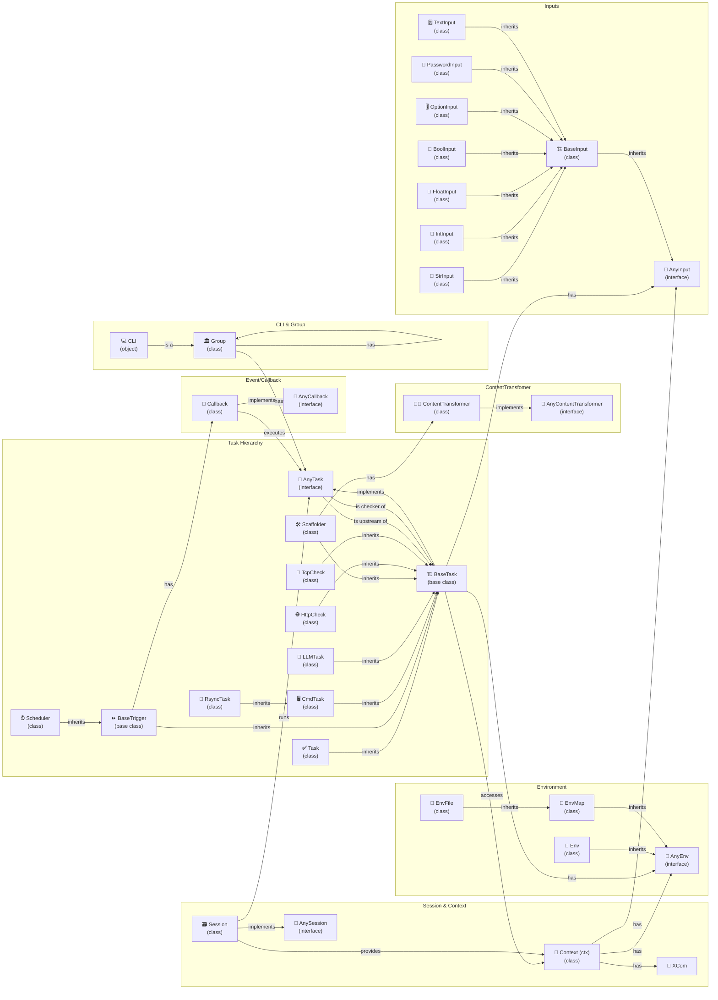

🔖 [Home](../../README.md) > [Documentation](../README.md)

# Core Concepts

```mermaid
flowchart LR
    %% Layout: group related nodes in subgraphs to avoid overlap
    subgraph CLI_Group ["CLI & Group"]
        direction TB
        CLI["💻 CLI<br />(object)"]
        Group["🏛️ Group<br/>(class)"]
    end

    subgraph Task_Hierarchy ["Task Hierarchy"]
        direction TB
        AnyTask["🧩 AnyTask<br/>(interface)"]
        BaseTask["🏗️ BaseTask<br/>(base class)"]
        Task["✅ Task<br/>(class)"]
        BaseTrigger["⏩ BaseTrigger<br/>(base class)"]
        Scheduler["⏰ Scheduler<br/>(class)"]
        CmdTask["🖥️ CmdTask<br/>(class)"]
        LLMTask["🤖 LLMTask<br >(class)"]
        Scaffolder["🛠️ Scaffolder<br/>(class)"]
        HttpCheck["🌐 HttpCheck<br/>(class)"]
        RsyncTask["🔄 RsyncTask<br/>(class)"]
        TcpCheck["📡 TcpCheck<br/>(class)"]
    end

    subgraph ContentTransformerBlock ["ContentTransfomer"]
        direction TB
        AnyContentTransformer["🧩 AnyContentTransformer<br/>(interface)"]
        ContentTransformer["🐦‍🔥 ContentTransformer<br/>(class)"]
    end

    subgraph CallbackBlock ["Event/Callback"]
        direction TB
        AnyCallback["🧩 AnyCallback<br/>(interface)"]
        Callback["🔔 Callback<br/>(class)"]
    end

    subgraph ContextBlock ["Session & Context"]
        direction TB
        AnySession["🧩 AnySession<br/>(interface)"]
        Session["🗃️ Session<br/>(class)"]
        Context["🧠 Context (ctx)<br/>(class)"]
        XCom["🔄 XCom"]
    end

    subgraph EnvBlock ["Environment"]
        AnyEnv["🧩 AnyEnv<br/>(interface)"]
        Env["🌿 Env<br/>(class)"]
        EnvMap["🧬 EnvMap<br/>(class)"]
        EnvFile["📄 EnvFile<br/>(class)"]
    end
    subgraph InputBlock ["Inputs"]
        AnyInput["🧩 AnyInput<br/>(interface)"]
        BaseInput["🏗️ BaseInput<br/>(class)"]
        StrInput["📝 StrInput<br/>(class)"]
        IntInput["🧮 IntInput<br/>(class)"]
        FloatInput["🔢 FloatInput<br/>(class)"]
        BoolInput["🔘 BoolInput<br/>(class)"]
        OptionInput["🎚️ OptionInput<br/>(class)"]
        PasswordInput["🔑 PasswordInput<br/>(class)"]
        TextInput["🗒️ TextInput<br/>(class)"]
    end

    %% CLI/Group relations
    CLI -->|is a| Group
    Group -->|has| AnyTask
    Group -->|has| Group

    %% Task hierarchy
    BaseTask -->|implements| AnyTask
    Task -->|inherits| BaseTask
    BaseTrigger -->|inherits| BaseTask
    Scheduler -->|inherits| BaseTrigger
    CmdTask -->|inherits| BaseTask
    LLMTask -->|inherits| BaseTask
    Scaffolder -->|inherits| BaseTask
    HttpCheck -->|inherits| BaseTask
    RsyncTask -->|inherits| CmdTask
    TcpCheck -->|inherits| BaseTask

    %% BaseTask properties and access
    BaseTask -->|has| AnyEnv
    BaseTask -->|has| AnyInput
    BaseTask -->|accesses| Context
    AnyTask -->|is upstream of| BaseTask
    AnyTask -->|is checker of| BaseTask

    %% Content transformer
    ContentTransformer -->|implements| AnyContentTransformer
    Scaffolder -->|has| ContentTransformer

    %% Callback usage
    Callback -->|implements| AnyCallback
    Callback -->|executes| AnyTask
    BaseTrigger -->|has| Callback

    %% Session/Context relations
    Session -->|implements| AnySession
    Session -->|runs| AnyTask
    Session -->|provides| Context
    Context -->|has| AnyEnv
    Context -->|has| AnyInput
    Context -->|has| XCom

    %% Expanded Env relationships
    Env -->|inherits| AnyEnv
    EnvMap -->|inherits| AnyEnv
    EnvFile -->|inherits| EnvMap

    %% Expanded Input relationships
    BaseInput -->|inherits| AnyInput
    StrInput -->|inherits| BaseInput
    IntInput -->|inherits| BaseInput
    FloatInput -->|inherits| BaseInput
    BoolInput -->|inherits| BaseInput
    OptionInput -->|inherits| BaseInput
    PasswordInput -->|inherits| BaseInput
    TextInput -->|inherits| BaseInput
```

---
🔖 [Home](../../README.md) > [Documentation](../README.md)
