🔖 [Home](../../README.md) > [Documentation](../README.md)

---

# Core Concepts

Welcome to the heart of Zrb! Understanding these core concepts will empower you to build powerful, flexible, and efficient automations. These are the fundamental building blocks you'll use to bring your workflows to life.

---

## 🗺️ How It All Fits Together

The following diagram shows how Zrb's main components interact.

```mermaid
flowchart LR
    subgraph User
        direction TB
        CLI["💻 Command Line"]
        WebUI["🌐 Web UI"]
    end

    subgraph ZrbEngine["Zrb Engine"]
        direction TB
        Session["🗃️ Session"]
        Runner["🏃 Runner"]
        Context["🧠 Context (ctx)"]
    end

    subgraph TaskDefinition["Your Code (zrb_init.py)"]
        direction TB
        Group["🏛️ Group"]
        Task["✅ Task"]
        Input["📝 Input"]
        Env["🌿 Env"]
        XCom["🔄 XCom"]
    end

    User -- "Triggers" --> Runner
    Runner -- "Creates" --> Session
    Session -- "Manages" --> Task
    Runner -- "Executes" --> Task
    Task -- "Receives" --> Context
    Context -- "Provides Access To" --> Input
    Context -- "Provides Access To" --> Env
    Context -- "Provides Access To" --> XCom
    Group -- "Organizes" --> Task
```

---

## 🔑 Key Components

Here’s a breakdown of the most important concepts in Zrb.

### [How It Works: The Zrb Lifecycle](./how-it-works.md)
Before diving into the components, see the step-by-step lifecycle of a task from command-line execution to completion. This provides the "big picture" of how everything fits together.

### [CLI and Group](./cli-and-group.md)
The `cli` object is the root of all your tasks. You can organize tasks into `Group`s to create a clean, hierarchical command structure, making your automations easy to navigate and run.

### [Task](./task/README.md)
A **Task** is the fundamental unit of work. It can be a simple shell command, a Python function, or a complex, multi-step operation. Zrb offers specialized tasks for common needs like running commands, interacting with AI, or checking services.

### [Input](./input/README.md)
**Inputs** make your tasks interactive and reusable. They allow you to pass parameters from the command line or web UI. Zrb supports various types, including strings, numbers, booleans, passwords, and more.

### [Env](./env/README.md)
Manage configuration and secrets securely with **Env**. Tasks can access environment variables from the OS, `.env` files, or values defined directly in your code, keeping sensitive data out of your scripts.

### [Session and Context](./session-and-context/README.md)
A **Session** represents a single execution of a task workflow. During a session, each task receives a **Context** object (`ctx`), which is its window to the outside world—providing access to inputs, environment variables, and shared data.

### [XCom (Cross-Communication)](./session-and-context/xcom.md)
**XCom** is how tasks talk to each other. When one task produces a result that another task needs, XCom is the mechanism used to pass that data along, enabling complex, dependent workflows.

### [Built-in Tasks](./builtin-tasks.md)
Zrb comes with a rich library of pre-built tasks for common operations like managing Git repositories, making HTTP requests, generating random data, and more. These save you time and effort by providing ready-to-use solutions.

---

🔖 [Home](../../README.md) > [Documentation](../README.md)

➡️ [Next: Advanced Topics](../advanced-topics/README.md)