🔖 [Home](../../README.md) > [Documentation](../README.md)

# Core Concepts

Welcome to the heart of Zrb! Understanding these core concepts will empower you to build powerful, flexible, and efficient automations. Whether you're running simple scripts or orchestrating complex workflows, these are the fundamental building blocks you'll be working with.

The following diagram provides a bird's-eye view of the main objects and classes in Zrb and how they relate to each other.

```mermaid
flowchart LR
    %% Layout: group related nodes in subgraphs to avoid overlap
    subgraph CLI_Group ["CLI & Group"]
        direction TB
        CLI["💻 CLI<br />(object)"]
        Group["🏛️ Group<br/>(class)"]
    end

    subgraph Task_Hierarchy ["Task Hierarchy"]
        direction TB
        AnyTask["🧩 AnyTask<br/>(interface)"]
        BaseTask["🏗️ BaseTask<br/>(base class)"]
        Task["✅ Task<br/>(class)"]
        BaseTrigger["⏩ BaseTrigger<br/>(base class)"]
        Scheduler["⏰ Scheduler<br/>(class)"]
        CmdTask["🖥️ CmdTask<br/>(class)"]
        LLMTask["🤖 LLMTask<br >(class)"]
        Scaffolder["🛠️ Scaffolder<br/>(class)"]
        HttpCheck["🌐 HttpCheck<br/>(class)"]
        RsyncTask["🔄 RsyncTask<br/>(class)"]
        TcpCheck["📡 TcpCheck<br/>(class)"]
    end

    subgraph ContentTransformerBlock ["ContentTransfomer"]
        direction TB
        AnyContentTransformer["🧩 AnyContentTransformer<br/>(interface)"]
        ContentTransformer["🐦‍🔥 ContentTransformer<br/>(class)"]
    end

    subgraph CallbackBlock ["Event/Callback"]
        direction TB
        AnyCallback["🧩 AnyCallback<br/>(interface)"]
        Callback["🔔 Callback<br/>(class)"]
    end

    subgraph ContextBlock ["Session & Context"]
        direction TB
        AnySession["🧩 AnySession<br/>(interface)"]
        Session["🗃️ Session<br/>(class)"]
        AnySharedContext["🧩 AnySharedContext<br/>(interface)"]
        SharedContext["🧠 SharedContext<br/>(class)"]
        AnyContext["🧩 AnyContext<br/>(interface)"]
        Context["🧠 Context (ctx)<br/>(class)"]
        XCom["🔄 XCom"]
    end

    subgraph EnvBlock ["Environment"]
        direction TB
        AnyEnv["🧩 AnyEnv<br/>(interface)"]
        Env["🌿 Env<br/>(class)"]
        EnvMap["🧬 EnvMap<br/>(class)"]
        EnvFile["📄 EnvFile<br/>(class)"]
    end
    subgraph InputBlock ["Inputs"]
        direction TB
        AnyInput["🧩 AnyInput<br/>(interface)"]
        BaseInput["🏗️ BaseInput<br/>(class)"]
        StrInput["📝 StrInput<br/>(class)"]
        IntInput["🧮 IntInput<br/>(class)"]
        FloatInput["🔢 FloatInput<br/>(class)"]
        BoolInput["🔘 BoolInput<br/>(class)"]
        OptionInput["🎚️ OptionInput<br/>(class)"]
        PasswordInput["🔑 PasswordInput<br/>(class)"]
        TextInput["🗒️ TextInput<br/>(class)"]
    end

    %% CLI/Group relations
    CLI -->|is a| Group
    Group -->|has| AnyTask
    Group -->|has| Group

    %% Task hierarchy
    BaseTask -->|implements| AnyTask
    Task -->|inherits| BaseTask
    BaseTrigger -->|inherits| BaseTask
    Scheduler -->|inherits| BaseTrigger
    CmdTask -->|inherits| BaseTask
    LLMTask -->|inherits| BaseTask
    Scaffolder -->|inherits| BaseTask
    HttpCheck -->|inherits| BaseTask
    RsyncTask -->|inherits| CmdTask
    TcpCheck -->|inherits| BaseTask

    %% BaseTask properties and access
    BaseTask -->|has| AnyEnv
    BaseTask -->|has| AnyInput
    BaseTask -->|accesses| AnyContext
    AnyTask -->|is upstream of| BaseTask
    AnyTask -->|is checker of| BaseTask

    %% Content transformer
    ContentTransformer -->|implements| AnyContentTransformer
    Scaffolder -->|has| AnyContentTransformer

    %% Callback usage
    Callback -->|implements| AnyCallback
    Callback -->|executes| AnyTask
    BaseTrigger -->|has| AnyCallback

    %% Session/Context relations
    Session -->|implements| AnySession
    Session -->|runs| AnyTask
    Session -->|has| AnySharedContext
    Session -->|provides| AnyContext
    SharedContext -->|implements| AnySharedContext
    AnyContext -->|inherits| AnySharedContext
    Context -->|implements| AnyContext
    Context -->|has| AnyEnv
    Context -->|has| AnyInput
    Context -->|has| XCom

    %% Expanded Env relationships
    Env -->|inherits| AnyEnv
    EnvMap -->|inherits| AnyEnv
    EnvFile -->|inherits| EnvMap

    %% Expanded Input relationships
    BaseInput -->|inherits| AnyInput
    StrInput -->|inherits| BaseInput
    IntInput -->|inherits| BaseInput
    FloatInput -->|inherits| BaseInput
    BoolInput -->|inherits| BaseInput
    OptionInput -->|inherits| BaseInput
    PasswordInput -->|inherits| BaseInput
    TextInput -->|inherits| BaseInput
```

## Key Components

Here’s a brief introduction to the most important components in Zrb.

### [CLI and Group](./cli-and-group.md)
The entry point for all your tasks. The `cli` object is the root, and you can organize your tasks into `Group`s to create a clean, hierarchical structure. This is how you expose your automations to the command line.

### [Task](./task/README.md)
The fundamental unit of work in Zrb. A `Task` can be anything from a simple shell command to a complex Python function. Zrb provides many specialized task types out of the box for common operations like running commands, checking services, or interacting with AI.

### [Input](./input/README.md)
Inputs make your tasks interactive and reusable. They allow you to pass parameters to your tasks from the command line, web UI, or even from other tasks. Zrb supports various input types, including strings, numbers, booleans, and options.

### [Environment](./env/README.md)
Manage configuration and secrets with `Env`. Tasks can securely access environment variables from the operating system, `.env` files, or defined directly in your code.

### [Session and Context](./session-and-context/README.md)
A `Session` represents a single run of a task workflow. Within a session, each task receives a `Context` object (usually called `ctx`), which is the primary way a task interacts with its environment, accesses inputs, environment variables, and communicates with other tasks.

### [XCom (Cross-Communication)](./session-and-context/xcom.md)
`XCom` is the mechanism for tasks to exchange data. When one task produces a result that another task needs, `XCom` is the way to pass it along.

---
🔖 [Home](../../README.md) > [Documentation](../README.md)
