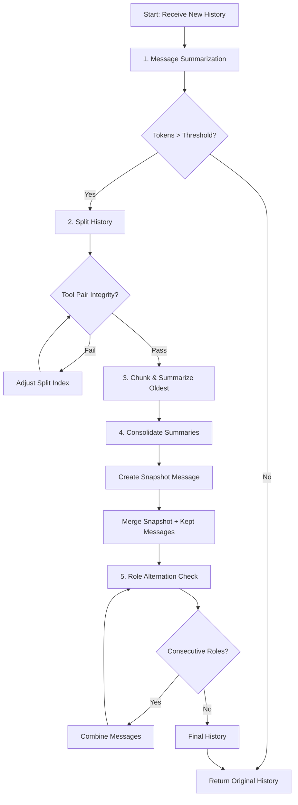

# LLM History Summarization Logic

This document details the internal mechanics of `zrb`'s LLM history summarization system. The system is designed to maintain conversation context within the token limits of the LLM while strictly adhering to provider constraints (such as role alternation and tool call integrity).

## Overview

The summarization process is a pipeline that transforms a raw list of `ModelMessage` objects into a compressed list of messages. It operates on two levels:

1.  **Message-Level Summarization**: Compressing individual large messages (e.g., massive tool outputs) before they even reach the history limit.
2.  **Conversation-Level Summarization**: Compressing the oldest part of the conversation into a "State Snapshot" when the total token count exceeds the `conversational_token_threshold`.

## The Summarization Pipeline

### 1. Message Summarization
Before assessing the total history size, `zrb` iterates through each message.
- **Target**: `ToolReturnPart` or `TextPart` with excessive content.
- **Action**: If a message part exceeds `message_token_threshold` (default: 50% of conversation threshold), it is summarized individually using a "Message Summarizer" agent.
- **Result**: The original large content is replaced with a summary (e.g., "Summary of tool output: ...").

### 2. History Analysis
The system calculates the total token count of the (possibly message-summarized) history.
- **Triggers**: Summarization is triggered if:
  - Total tokens > `conversational_token_threshold`.
  - OR Number of messages > `summary_window`.

### 3. History Splitting (The "Safe Split")
If summarization is triggered, the history is split into two segments: `to_summarize` (oldest) and `to_keep` (newest).
- **Goal**: Maximize `to_summarize` to free up space, but keep at least `summary_window` messages in `to_keep`.
- **Constraint**: **Tool Pair Integrity**.
  - A split MUST NOT occur between a `ToolCall` and its corresponding `ToolReturn`.
  - If a split point would break a pair, the system moves the split index earlier (to keep the pair in `to_keep`) or later (to include the pair in `to_summarize`), prioritizing safety.
- **Fallback**: If no safe split is found (e.g., a massive tool loop), it falls back to a "best effort" split or summarizes everything except the last user message.

### 4. Chunked Summarization
The `to_summarize` segment is converted to text and processed.
- **Chunking**: If the text is too large for a single context window, it is split into chunks (e.g., 2000 tokens).
- **Processing**: Each chunk is summarized independently by the "Conversational Summarizer" agent.
- **Consolidation**: The partial summaries are concatenated. If the result is still too large or contains multiple `<state_snapshot>` tags, a final consolidation pass merges them into a single coherent `<state_snapshot>`.

### 5. Context Restoration
The final summary is wrapped in a system message:
> "SYSTEM: Automated Context Restoration... <state_snapshot>..."

### 6. Role Alternation Enforcement
Modern LLMs (like Anthropic's Claude or OpenAI's GPT-4 via strict APIs) require alternating roles: `User` -> `Assistant` -> `User`.
- **Problem**: Summarization or tool usage can sometimes result in consecutive `User` messages (e.g., `User` prompt -> `ToolReturn` (counts as User in some schemas) -> `User` summary).
- **Solution**: The `_ensure_alternating_roles` function scans the final message list:
  - **User + User**: Merges content into a single `User` message with multiple parts.
  - **Assistant + Assistant**: Merges content into a single `Assistant` message.
  - **Tool Sequences**: Preserves `User` (prompt) -> `Assistant` (call) -> `User` (return) flows correctly.

## Flowchart

## Edge Case Handling

| Case | Handling Strategy |
| :--- | :--- |
| **Orphaned Tool Return** | `validate_tool_pair_integrity` detects if a `ToolReturn` exists without its `ToolCall`. The splitter adjusts to include the call or exclude the return. |
| **Infinite Summarization Loop** | `summarize_long_text` has a strict `depth` limit (default: 5). If max depth is reached, text is forcibly truncated. |
| **Massive Tool Output** | Handled in Step 1. If strict truncation is needed, `limiter.truncate_text` is used before LLM processing. |
| **Mixed Content (Images/Binary)** | `message_to_text` converts complex parts to placeholder text (e.g., `[Image URL: ...]`) to save tokens while preserving semantic awareness. |
| **Prompt Injection** | User input inside the history is treated as data. The system prompts explicitly instruct the LLM to treat the content as "conversation history" to be summarized, minimizing injection risks. |

## Configuration

Control the behavior via `.env` or `config.py`:
- `ZRB_LLM_CONVERSATIONAL_SUMMARIZATION_TOKEN_THRESHOLD`: Max tokens before full summarization triggers.
- `ZRB_LLM_MESSAGE_SUMMARIZATION_TOKEN_THRESHOLD`: Max tokens for a single message part.
- `ZRB_LLM_HISTORY_SUMMARIZATION_WINDOW`: Number of recent messages to ideally keep.
