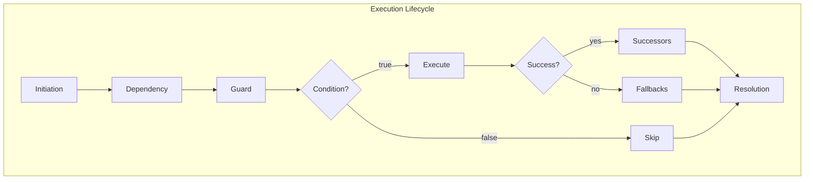

🔖 [Documentation Home](../../README.md) > [Core Concepts](./) > Tasks & Execution Lifecycle

# Tasks & Execution Lifecycle

A `Task` is the fundamental unit of work in Zrb. It represents a discrete action, such as running a shell command or executing a Python function. All tasks are defined in `zrb_init.py` files.

---

## Table of Contents

- [The `zrb_init.py` File](#the-zrb_initpy-file)
- [Task Creation](#task-creation)
- [Execution Dependencies](#execution-dependencies-upstreams)
- [Flow Control](#flow-control-successors-fallbacks-and-conditions)
- [The Execution Lifecycle](#the-execution-lifecycle-how-it-works)
- [Quick Reference](#quick-reference)

---

## The `zrb_init.py` File

This is your magic file. When you run `zrb`, it searches for `zrb_init.py` in the current directory and then recursively in all parent directories up to your home directory. This creates a powerful inheritance system where tasks defined in a parent directory are available to all its subdirectories.

```
/home/user/
├── zrb_init.py          ← Global tasks (available everywhere)
└── project/
    ├── zrb_init.py      ← Project tasks (available in project/)
    └── app/
        └── zrb_init.py  ← App tasks (available in project/app/)
```

> 💡 **Tip:** When you run `zrb` from `/home/user/project/app`, you can access tasks defined in all three `zrb_init.py` files.

---

## Task Creation

You have three main ways to define a task:

### 1. Direct Instantiation

Ideal for standard, built-in task types.

```python
from zrb import cli, CmdTask, Task

# A shell command
echo_task = cli.add_task(CmdTask(name="echo", cmd="echo 'Hello'"))

# A pure Python lambda
calc_task = cli.add_task(Task(name="calc", action=lambda ctx: 1 + 1))
```

### 2. The `@make_task` Decorator

The cleanest way to wrap standard Python logic into a Zrb workflow.

```python
from zrb import cli, make_task

@make_task(name="python-hello", group=cli)
def my_task(ctx):
    ctx.print("Hello from Python!")
```

### 3. Subclassing `BaseTask`

Best when you need to create a reusable task type with complex internal state.

```python
from zrb import Task, cli

class MyTask(Task):
    def run(self, ctx):
        print("Complex logic here")

cli.add_task(MyTask(name="complex-job"))
```

---

## Execution Dependencies (Upstreams)

Tasks rarely operate in isolation. A task will not execute until all its upstreams have successfully completed.

### Method A: Bitwise Operators `>>` and `<<`

Zrb tasks override the shift operators for clean pipeline definitions.

```python
from zrb import cli, CmdTask

task_a = cli.add_task(CmdTask(name="task-a", cmd="echo A"))
task_b = cli.add_task(CmdTask(name="task-b", cmd="echo B"))
task_c = cli.add_task(CmdTask(name="task-c", cmd="echo C"))

# task_a runs before task_b
task_a >> task_b 
# Equivalent to: task_b << task_a

# A task can trigger multiple downstreams:
task_b >> [task_c, other_task]

# Multiple tasks can trigger a single downstream:
task_c << [task_a, task_b]
```

> ⚠️ **Note:** You cannot do `[task_a, task_b] >> task_c`. Put the list on the right side of `<<`, or use the initialization parameter.

### Method B: Initialization Parameter

Best for tasks depending on multiple parallel prerequisites.

```python
task_c = cli.add_task(
    CmdTask(
        name="task-c", 
        cmd="echo C",
        upstream=[task_a, task_b]  # task_c waits for BOTH to finish
    )
)
```

---

## Flow Control: Successors, Fallbacks, and Conditions

### Conditional Execution (`execute_condition`)

If `execute_condition` evaluates to `False`, the task skips its action but gracefully unblocks its downstreams.

```python
@make_task(
    name="deploy",
    group=cli,
    # Can be a boolean, f-string, or callable
    execute_condition=lambda ctx: ctx.env.ENVIRONMENT == "production"
)
def deploy_app(ctx): ...
```

### Successors (On Success)

Tasks that execute *only if* the main task completes successfully.

```python
notify_success = Task(name="notify", action=lambda ctx: print("Success!"))

main_job = cli.add_task(
    CmdTask(name="job", cmd="echo 'Doing work'", successor=[notify_success])
)
```

### Fallbacks and Retries (On Failure)

Tasks that execute *only if* the main task fails permanently.

```python
alert = CmdTask(name="alert", cmd="echo 'CRITICAL FAILURE'")

flaky_job = cli.add_task(
    CmdTask(
        name="flaky", 
        cmd="exit 1", 
        retries=2,           # Try 3 times total
        retry_period=5.0,    # Wait 5s between retries
        fallback=[alert]     # Run 'alert' if it permanently fails
    )
)
```

---

## The Execution Lifecycle: How It Works

When you run `zrb my-task`, here is the exact sequence of events:

| Step | Phase | Description |
|------|-------|-------------|
| 1 | **Initiation** | CLI parser identifies `my-task`, creates Session and Context, parses CLI flags into Inputs |
| 2 | **Dependency Resolution** | Zrb checks the DAG, recursively calls `.run()` on all upstream tasks |
| 3 | **Execution Guard** | Evaluates `execute_condition`. If false, task is marked "skipped" |
| 4 | **Action & Readiness** | Executes core `action`. Concurrently runs `readiness_check` tasks. Marks "ready" when checks pass |
| 5 | **Resolution** | Return value pushed to XCom. If successful, triggers Successors. If failed, exhausts `retries` then triggers Fallbacks |



---

## Quick Reference

| Task Creation | Syntax |
|---------------|--------|
| Direct | `cli.add_task(CmdTask(name="x", cmd="..."))` |
| Decorator | `@make_task(name="x", group=cli)` |
| Subclass | `class MyTask(Task): def run(self, ctx): ...` |

| Dependency | Syntax |
|------------|--------|
| Chain | `task_a >> task_b` |
| Parallel | `upstream=[task_a, task_b]` |

| Flow Control | Parameter |
|--------------|-----------|
| Condition | `execute_condition=lambda ctx: ...` |
| On success | `successor=[task]` |
| On failure | `fallback=[task]` |
| Retry | `retries=2, retry_period=5.0` |

---