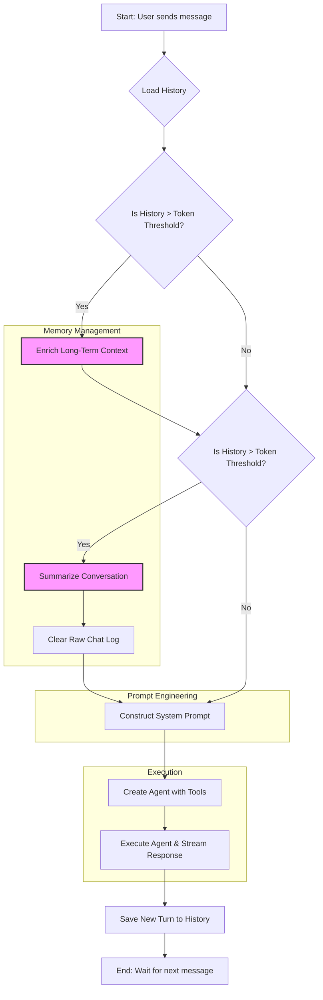

🔖 [Home](../../../../README.md) > [Documentation](../../../README.md) > [Installation and Configuration](../../README.md) > [Configuration](./README.md)

# LLM Workflow: How `zrb` Thinks

The `zrb` LLM tasks (`llm-ask` and `llm-chat`) are designed to provide intelligent, context-aware assistance by managing a sophisticated workflow. This document breaks down the step-by-step process of how the agent handles a conversation, enriches its understanding, and generates responses.

## The Core Workflow

The entire process is orchestrated by the `LLMTask`, which acts as the brain behind the operation. Here’s a visual representation of the workflow:

---

### Step-by-Step Breakdown

1.  **Load History**: When you run `llm-chat` or `llm-ask`, the first thing `zrb` does is load the conversation history. This history is divided into three parts:
    *   **Long-Term Context**: Stable facts and key information gathered over time.
    *   **Narrative Summary**: A condensed, story-like summary of the conversation so far.
    *   **Raw Chat Log**: The verbatim, turn-by-turn log of the most recent interactions.

2.  **Context Enrichment**: If the raw chat log grows too large (exceeding a configured token limit), a dedicated LLM call is triggered. This call analyzes the recent conversation and extracts new, stable facts to add to the **Long-Term Context**. This ensures that the agent "remembers" important details you've mentioned previously without needing to re-read the entire chat log every time.

3.  **History Summarization**: After context enrichment, if the history is still too long, another LLM call is made. This time, it condenses the raw chat log into the **Narrative Summary**. Once summarized, the raw log is cleared. This process is like converting a detailed transcript into a "previously on" segment, keeping the agent up-to-date without getting bogged down in details.

4.  **Prompt Construction**: This is where the magic happens. `zrb` builds a comprehensive system prompt that gives the agent its personality, instructions, and all the context it needs. The prompt is assembled from:
    *   **Persona & Base Prompt**: Defines the agent's core identity and thinking process.
    *   **Special Instructions**: Provides domain-specific guidance (e.g., for software engineering tasks).
    *   **Context Block**: A rich collection of information, including:
        *   System details (OS, current directory).
        *   The enriched **Long-Term Context**.
        *   The **Narrative Summary**.
        *   Contexts and Notes from `ZRB.md` files (see [LLM Context and Workflow Requirements](../../../technical-specs/llm-context.md)).
        *   The full content of any local files or directories you reference with `@` (e.g., `what is in @src/main.py?`).

5.  **Agent Execution**: With the prompt finalized, a `pydantic-ai` agent is created. This agent is equipped with a set of powerful tools (for file I/O, shell commands, web searches, etc.) and the meticulously crafted prompt. It then processes your message, and its response is streamed back to you in real-time.

6.  **Save History**: Finally, your message and the agent's response are saved to the history file, ready for the next interaction.

This structured approach to memory and context management allows the `zrb` agent to handle long, complex conversations and interact with your local development environment in a powerful and intelligent way.

---
🔖 [Home](../../../../README.md) > [Documentation](../../../README.md) > [Installation and Configuration](../../README.md) > [Configuration](./README.md)
> [Next: LLM Rate Limiter](./llm-rate-limiter.md)
