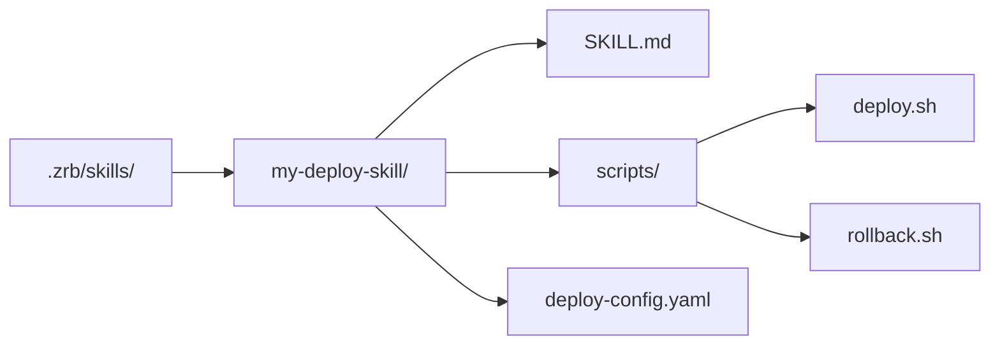

🔖 [Documentation Home](../../README.md) > [LLM](./) > Claude Code Compatibility

# Claude Code Compatibility

Zrb is designed to be highly compatible with **Claude Code** configurations. This allows you to leverage your existing Claude skills, agents, and hooks within Zrb's automated workflows.

> 💡 Weighing zrb against Claude Code and other harnesses (opencode, DeepSeek Harness, Pi)? See [Choosing Between Agent Harnesses](harness-comparison.md).

---

## Table of Contents

- [Project Instructions](#1-project-instructions-claudemd)
- [Skills](#2-skills-skillmd)
- [Agents and Subagents](#3-agents-and-subagents-agentmd)
- [Hooks](#4-hooks-hooksjson)
- [Plugins](#5-plugins)
- [Quick Reference](#quick-reference)

---

## 1. Project Instructions (CLAUDE.md)

Zrb automatically detects `AGENTS.md`, `CLAUDE.md`, `GEMINI.md`, and `README.md` files in `~/.claude/` and in every directory from the filesystem root down to your current working directory. The system prompt lists the paths it found, not their contents, and tells the model to read the project ones that bear on the work before editing. Files in your home directory or `~/.claude/` are listed separately as user-level guidance, to read only when relevant.

> 💡 **Tip:** Use `AGENTS.md` for technical project documentation and `CLAUDE.md` for Claude-specific instructions.

---

## 2. Skills (SKILL.md)

Zrb supports Claude-style skills. A skill is defined by a `SKILL.md` (or `*.skill.md`) file; zrb also accepts Python skills as `SKILL.py` / `*.skill.py`.

### Discovery Paths

| Location | Type |
|----------|------|
| `~/.claude/skills/` | User-level (Claude) |
| `~/.zrb/skills/` | User-level (Zrb) |
| `.claude/skills/`, `.zrb/skills/` in every directory from the filesystem root down to the current directory | Project-level |
| `<config dir>/plugins/<plugin>/skills/` | Plugins inside any of the config dirs above |
| `ZRB_LLM_PLUGIN_DIRS` | Plugin directories (see [Plugins](#5-plugins)) |

### Skill Format

Skills can use YAML frontmatter for metadata:

```markdown
---
name: my-custom-skill
description: Performs a specialized task
user-invocable: true
---
# My Custom Skill

Detailed instructions for the LLM on how to perform this skill.
```

| Field | Description |
|-------|-------------|
| `name` | Skill identifier (the `/name` command) |
| `description` | Brief description |
| `user-invocable` | Default `true`; `false` hides it from the `/` menu |
| `disable-model-invocation` | `true` stops the model from activating it on its own (user-invocable only) |
| `argument-hint` | Shown in autocomplete, e.g. `[filename]` |
| `allowed-tools` | Tools usable without a permission prompt while the skill is active (list or comma-separated string) |

### Companion Files

When a skill lives in its own dedicated directory with a `SKILL.md` or `SKILL.py` entry point, other files in that directory (scripts, templates, configs, reference docs) are **auto-discovered** and surfaced to the LLM on activation. This allows skill authors to bundle helper tooling alongside instructions.

**Convention:** `SKILL.md` / `SKILL.py` in a subdirectory enables companion discovery. Flat `*.skill.md` files shared across a directory do not — they share the namespace with other skills and companions aren't unambiguous.

Example directory structure:



When the skill is activated (via `/my-deploy-skill` or `ActivateSkill`), the LLM sees the companion file listing and can read or use them during execution.

The `ActivateSkill` tool also returns the skill directory path and companion file listing alongside the skill content.

---

## 3. Agents and Subagents (AGENT.md)

Zrb can spawn subagents defined in Claude-style `AGENT.md` (or `*.agent.md`) files — or, as in Claude Code, any plain `*.md` file inside an `agents/` directory. Python agents (`AGENT.py` / `*.agent.py`) are accepted too. Zrb's built-in agents are split into two groups: `core_agents/` is always available, while the optional `agents/` directory is controlled by `ZRB_LLM_ENABLE_BUILTIN_AGENTS`. Core agents are listed before optional agents when Zrb advertises available delegates.

### Discovery Paths

| Location | Type |
|----------|------|
| `~/.claude/agents/` | User-level (Claude) |
| `~/.zrb/agents/` | User-level (Zrb) |
| `.claude/agents/`, `.zrb/agents/` in every directory from the filesystem root down to the current directory | Project-level |
| `<config dir>/plugins/<plugin>/agents/` | Plugins inside any of the config dirs above |
| `ZRB_LLM_PLUGIN_DIRS` | Plugin directories (see [Plugins](#5-plugins)) |
| `src/zrb/llm_plugin/core_agents/` | Zrb built-in core agents (always available) |
| `src/zrb/llm_plugin/agents/` | Zrb optional built-in agents (toggleable) |

### Agent Format

Agents use YAML frontmatter to define their identity and capabilities:

```markdown
---
name: specialized-coder
description: Expert in a specific domain
model: openai:gpt-4o
tools: [Read, Grep]
---
# Specialized Coder Prompt

You are an expert coder specializing in...
```

Tool names are zrb's tool names (`Read`, `Write`, `Edit`, `Grep`, `Glob`, `Shell`, …); Claude's `Bash` is accepted as an alias for `Shell`, and a name that matches no tool is silently dropped. Both YAML list (`[Read, Glob]`) and comma-separated string (`Read, Glob, Grep`) formats are accepted for `tools` and `disallowedTools`, matching the [Claude Code sub-agent spec](https://code.claude.com/docs/en/sub-agents#supported-frontmatter-fields).

| Field | Description |
|-------|-------------|
| `name` | Agent identifier |
| `description` | Brief description for delegation |
| `model` | LLM model for this agent |
| `tools` | Allowlist of available tools. Accepts a YAML list (`[Read, Glob]`) or a comma-separated string (`Read, Glob, Grep`) |
| `disallowedTools` | Denylist of tools to remove. Accepts the same formats as `tools`. Applied after `tools` |

---

## 4. Hooks (hooks.json)

Zrb supports Claude-compatible lifecycle hooks, read from `hooks.json` and `hooks/` under `~/.zrb/`, `~/.claude/`, and the `.zrb/`/`.claude/` directories from the filesystem root down to the current directory, plus the `hooks` block of Claude's `settings.json`/`settings.local.json`. See the [Hooks Guide](./hooks.md) for the full [discovery order](./hooks.md#hook-locations), configuration, and [differences from Claude Code](./hooks.md#differences-from-claude-code).

---

## 5. Plugins

Zrb's plugin system is built on top of these compatibility layers. By setting `ZRB_LLM_PLUGIN_DIRS` to a colon-separated (semicolon on Windows) list of paths, you can distribute and share collections of agents and skills that follow the Claude standard.

```bash
export ZRB_LLM_PLUGIN_DIRS="/opt/zrb-plugins:/home/user/my-plugins"
```

Each listed path is a directory **of** plugins. A plugin is a subdirectory carrying a `.claude-plugin/plugin.json` manifest; its `skills/` and `agents/` are loaded:

```
/opt/zrb-plugins/
└── my-plugin/
    ├── .claude-plugin/plugin.json
    ├── skills/
    └── agents/
```

Hooks are the exception: they are read from `hooks.json` and `hooks/` directly under each listed path, not from inside each plugin (see [Hook Locations](./hooks.md#hook-locations)).

---

## Quick Reference

| Feature | File Pattern | Discovery Path |
|---------|--------------|----------------|
| Project Instructions | `AGENTS.md`, `CLAUDE.md`, `GEMINI.md`, `README.md` | `~/.claude/`, then root → current dir (listed, not loaded) |
| Skills | `SKILL.md`, `*.skill.md`, `SKILL.py`, `*.skill.py` | `skills/` directories |
| Agents | `AGENT.md`, `*.agent.md`, `*.md` in `agents/`, `AGENT.py`, `*.agent.py` | `agents/` directories (plus zrb's built-in `core_agents/`) |
| Hooks | `hooks.json`, `*.json`/`*.yaml`/`*.hook.py`, `settings.json` `hooks` block | `.claude/`, `.zrb/`, `hooks/` directories |

---

🔖 [Documentation Home](../../README.md) > [LLM](./) > Claude Code Compatibility
