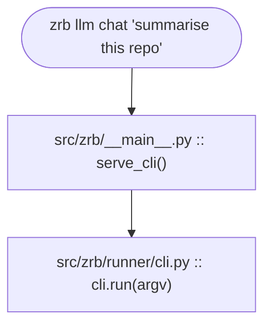
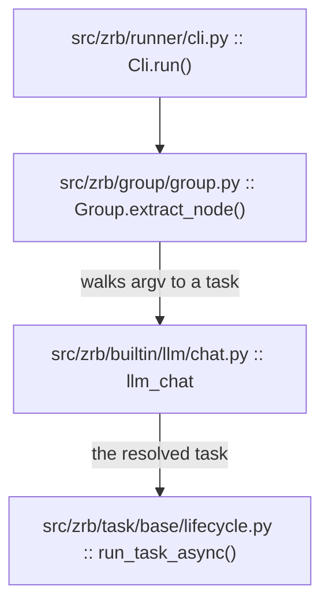
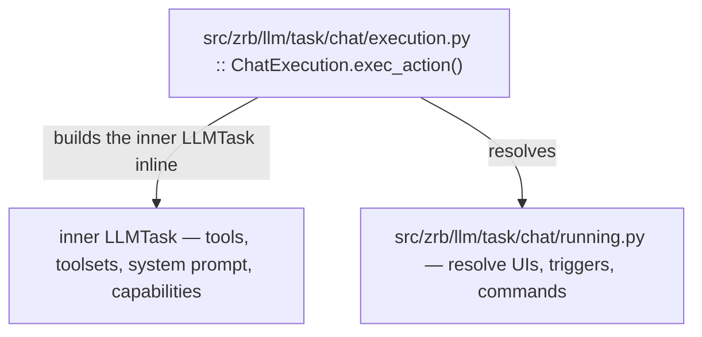
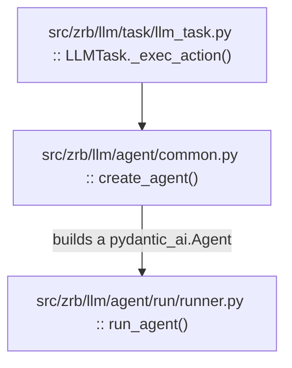
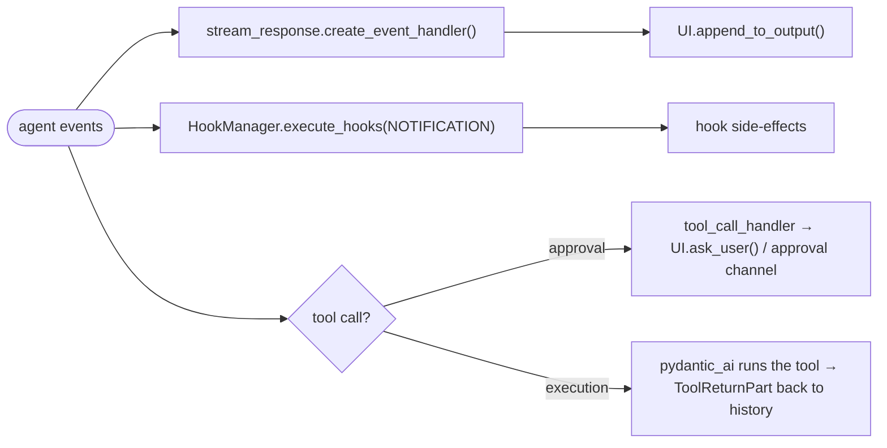
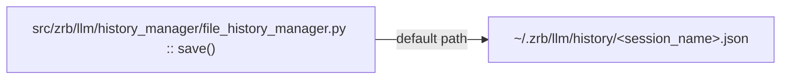

🔖 [Documentation Home](../../README.md) > [LLM](./) > LLM Chat Request Lifecycle

# Anatomy of a `zrb llm chat` Request

You typed `zrb llm chat "summarise this repo"`. What just happened?

This page traces a single request top-to-bottom — every file the request lands in, in order. Use it as a navigation map: when you need to debug or extend a stage, the file path under each step is where to start reading. Existing docs go deeper at each layer; this page only stitches them together.

---

## Table of Contents

- [Stage 1 — CLI bootstrap](#stage-1--cli-bootstrap)
- [Stage 2 — Task resolution & invocation](#stage-2--task-resolution--invocation)
- [Stage 3 — `LLMChatTask` build & UI selection](#stage-3--llmchattask-build--ui-selection)
- [Stage 4 — Inner `LLMTask` & agent run](#stage-4--inner-llmtask--agent-run)
- [Stage 5 — `run_agent` execution loop](#stage-5--run_agent-execution-loop)
- [Stage 6 — UI streaming, hooks, approvals](#stage-6--ui-streaming-hooks-approvals)
- [Stage 7 — History persistence & shutdown](#stage-7--history-persistence--shutdown)
- [Cheat sheet: who owns what](#cheat-sheet-who-owns-what)

---

## Stage 1 — CLI bootstrap



`serve_cli()` configures the root logger, then loads every `zrb_init.py` it can find walking from `cwd` up to `$HOME` (this is how task definitions in parent directories become available — see [tasks-and-lifecycle.md](../core-concepts/tasks-and-lifecycle.md#the-zrb_initpy-file)). It then calls `cli.run(sys.argv[1:])`.

`cli` (`src/zrb/runner/cli.py`) is an `AnyGroup` populated at import time with the built-in `llm chat` task plus anything user `zrb_init.py` files registered.

---

## Stage 2 — Task resolution & invocation



`Group.extract_node(["llm", "chat", "summarise this repo"])` returns the `llm_chat` task plus residual args. `run_task_async()` builds a `Session` + `SharedContext`, then enters the standard task execution lifecycle (the 5-step flow described in [architecture.md](../contributing/architecture.md#the-task-execution-lifecycle)).

For non-LLM tasks, the lifecycle ends here. For an `LLMChatTask`, the action handler delegates into the chat machinery.

---

## Stage 3 — `LLMChatTask` build & UI selection



`LLMChatTask` (`src/zrb/llm/task/chat/task.py`) is a plain `BaseTask` subclass
that composes its behavior as parts (ADR-0035): `ChatExecution`
(`execution.py`) owns `exec_action`, `ChatRunning` (`running.py`) resolves
UIs/triggers/commands. Since 2.65.3 these are **composed attributes**
(`self._execution`, `self._running`), not base classes.

Three things happen here:

1. **Build the inner `LLMTask`** with the resolved tools, toolsets, system prompt, capabilities, and history processors (inside `ChatExecution.exec_action`). Heavy collaborator: `zrb.llm.prompt.PromptManager` assembles the system prompt; `zrb.llm.skill.SkillManager`, `zrb.llm.hook.HookManager`, and `zrb.llm.agent.subagent.sub_agent_manager` contribute their respective pieces.
2. **Resolve UIs** from `ui_factories` (or fall back to the default TUI). For `zrb llm chat`, this ends up being the prompt-toolkit UI in `src/zrb/llm/ui/default/ui.py`. See [llm-custom-ui.md](./llm-custom-ui.md) for the UI factory contract.
3. **Wrap approval channels** — if multiple are present, in a `MultiplexApprovalChannel`. Otherwise the single channel passes through.

The chat task then calls into the inner `LLMTask` execution path.

---

## Stage 4 — Inner `LLMTask` & agent run



`LLMTask._exec_action()` resolves dynamic attributes (model, system prompt, message), calls `create_agent()` to build a `pydantic_ai.Agent`, then enters `run_agent()`.

`run_agent()` is where five agent and permission `ContextVar`s get bound: `current_ui`, `current_tool_confirmation`, `current_yolo`, `current_approval_channel`, and `current_permission_policy`. They're reset in the matching `finally`. (`current_agent_mode` is *not* bound here — it is set by the plan-mode tools.) See [maintainer-guide.md#context-propagation-internals](../contributing/maintainer-guide.md#context-propagation-internals) for the full ContextVar map.

---

## Stage 5 — `run_agent` execution loop

```mermaid
flowchart TD
    Loop["src/zrb/llm/agent/run/runner.py :: _execution_loop()"] --> Sanitize["sanitize_history() — history_utils.py"]
    Sanitize --> Stream["agent.run(event_stream_handler=...) — pydantic_ai"]
    Stream --> Collect["collect events and tool calls"]
    Collect -->|exception| Retry["retry_loop.py — retry, strip thinking, or give up"]
    Collect -->|result.output / result.all_messages()| Post["sanitize_history(result) — history_utils.py"]
    Retry --> Sanitize
    Post -->|next turn| Sanitize
```

This is the heart. Every turn:

1. **Sanitize history** before the model call. Four steps in fixed order: `filter_nil_content` → `sanitize_orphaned_tool_calls` → drop empty messages → `ensure_alternating_roles`. Why each step exists, and which providers' bugs each one neutralises, is documented in [maintainer-guide.md#llm-history-sanitization-layer](../contributing/maintainer-guide.md#llm-history-sanitization-layer).
2. **Stream events** from `pydantic_ai` via the `event_stream_handler` passed to `agent.run()` — the handler also registers the live `RunContext` on the UI, so a message sent mid-turn can be steered into this same run instead of queuing (ADR-0078). `result_output`/`run_history` come from `agent.run()`'s direct return value, not a stream-witnessed event; `_execution_loop` re-fires a synthetic `AgentRunResultEvent` through the per-event handler afterward so usage accounting keeps working. The OpenAI client also gets a runtime monkey-patch from `openai_patch.py` so it never serialises `"content": null` when there are tool calls.
3. **Classify exceptions** (`error_classifier.py`) and decide whether to retry, strip thinking parts, or give up (`retry_loop.py`).
4. **Sanitize the result history** after a successful turn so the next call sees a provider-clean message list.

If the loop hits compression because the conversation exceeded `LLM_CONVERSATIONAL_SUMMARIZATION_TOKEN_THRESHOLD` (or the message count exceeded `LLM_HISTORY_SUMMARIZATION_WINDOW`), control transfers to:

```
src/zrb/llm/summarizer/history_summarizer.py :: summarize_history()
```

…which produces a "kept" slice and runs all four sanitization steps on it before handing back. Tool-call/return pairs that get split across the compression boundary are scrubbed in step 2.

---

## Stage 6 — UI streaming, hooks, approvals

While the agent streams events, three side channels are active:



Tool approval flow:
- If the tool is intrinsically interactive (e.g. `AskUserQuestion`, registered via `register_always_auto_approve`), it is auto-approved first — a separate prompt would render before the question itself (ADR-0062).
- If `current_yolo` is `True` (or the tool is in the selective YOLO set), the tool runs immediately.
- Otherwise the call goes through `current_tool_confirmation` (terminal) or `current_approval_channel` (remote). For HTTP chat, `MultiplexApprovalChannel` lets the SSE backend handle the prompt.

UI streaming uses `prompt_toolkit` for the default TUI; HTTP chat uses SSE. Both implement the same `AnyUI`. See `src/zrb/llm/ui/base/ui.py` for the contract; [llm-custom-ui.md](./llm-custom-ui.md) for authoring.

Hook events fire at well-defined points (USER_PROMPT_SUBMIT, PRE_TOOL_USE, POST_TOOL_USE, POST_TOOL_USE_FAILURE, NOTIFICATION, SESSION_START, SESSION_END, …). See [hooks.md](./hooks.md) for the full event list and authoring patterns.

### Tracing an AGENT-type hook (journal-compliance)

The built-in journal-compliance judge (`llm/hook/journal_compliance.py`, see [hooks.md](./hooks.md#built-in-example-the-journal-compliance-judge)) is the one hook type whose builder can't live in `hook/creator.py` next to the command/prompt builders — building an agent means importing the agent subsystem, which already depends on `hook.manager` to fire `PreToolUse`/`PostToolUse`, so a direct import back would recreate that cycle. If it misbehaves, the real call path crosses that seam:

1. `journal_compliance.py::register_journal_compliance_hook` — a hook factory, seeded into every fresh `HookManager`'s `_hook_factories` (`hook/manager.py.__init__`). Builds the `HookConfig`: system prompt, `LogActivity`/`WriteJournalNote`/`SearchJournal` tools, and the `event_data.wrote_files` matcher.
2. `agent/run/runner.py` fires `HookEvent.STOP`, computing `wrote_files` via `hook/turn_evidence.py`.
3. `hook/manager.py::_select_inner_hook`, for `HookType.AGENT`, calls `get_agent_hook_builder()` (`hook/agent_hook_registry.py`) instead of importing the agent package directly — that's the circular-dependency seam.
4. `agent/__init__.py` imports `agent/hook_agent.py` as an import side effect at package load, which calls `register_agent_hook_builder(create_agent_hook)`. This is *why* the registry already has a builder by the time step 3 runs in any real process (every entry point imports `zrb.llm.agent` before a hook manager ever scans).
5. `agent/hook_agent.py::create_agent_hook` resolves `tools` (config-gated on `LLM_JOURNAL_ENABLED`) and calls `run_llm_hook` (`hook/creator.py`) — the actual LLM round-trip.
6. Back in `hook/manager.py`: matcher evaluation (`matcher.py`), priority sort, and — since journal-compliance is `async: true` — fire-and-forget dispatch and drain/timeout handling on shutdown.

A hook-only test that never imports `zrb.llm.agent` sees `get_agent_hook_builder()` return `None` at step 3 and gets a logged "agent hooks unavailable" placeholder instead — expected, not a bug.

---

## Stage 7 — History persistence & shutdown



After the loop terminates (success, error, or user exit):
- The final history is sanitized one more time and persisted by the active `HistoryManager`.
- If snapshot/rewind is enabled, `SnapshotManager` writes a checkpoint.
- The five agent-level `ContextVar`s reset (their `finally` block in `run_agent()`).
- Background tasks (refresh loop, system-info loop, message queue, triggers) are cancelled and awaited (`UI.cleanup_background_tasks()` in `default/lifecycle.py`).

Control returns up through `LLMChatTask._exec_action` → `run_task_async` → `cli.run` → `serve_cli` → process exit.

---

## Cheat sheet: who owns what

| Concern | File |
|---------|------|
| CLI entry | `src/zrb/__main__.py` |
| Task tree resolution | `src/zrb/runner/cli.py`, `src/zrb/group/{any_group,group}.py` |
| Task execution lifecycle | `src/zrb/task/base/{execution,lifecycle,monitoring}.py` |
| `llm chat` task definition | `src/zrb/builtin/llm/chat.py` |
| Chat task + parts | `src/zrb/llm/task/chat/{task,running,execution}.py` |
| Inner LLM task | `src/zrb/llm/task/llm_task.py` |
| Agent factory | `src/zrb/llm/agent/common.py` |
| Run loop | `src/zrb/llm/agent/run/runner.py` |
| History sanitization | `src/zrb/llm/agent/run/history_utils.py`, `src/zrb/llm/message.py` |
| OpenAI serializer patch | `src/zrb/llm/agent/run/openai_patch.py` |
| Retry / error classification | `src/zrb/llm/agent/run/{retry_loop,error_classifier}.py` |
| Compression / summarisation | `src/zrb/llm/summarizer/history_summarizer.py` |
| Default TUI | `src/zrb/llm/ui/default/ui.py` (composes `base/ui.py` + 7 parts: lifecycle, output, confirmation, selection, message editing, agent picker, keybindings) |
| HTTP chat UI | `src/zrb/runner/chat/http_ui.py` + SSE backend |
| Hooks | `src/zrb/llm/hook/manager.py`, `creator.py`, `process_{io,kill}.py`, `matcher.py`, `agent_hook_registry.py`, `journal_compliance.py` |
| Sub-agents | `src/zrb/llm/agent/subagent/` |
| Permission policy | `src/zrb/llm/permission/` |
| Persistence | `src/zrb/llm/history_manager/file_history_manager.py` |
| Snapshots | `src/zrb/llm/snapshot/manager.py` |
| ContextVars index | `src/zrb/contextvars.py` |

---

## See Also

- [Architecture, Philosophy, & Conventions](../contributing/architecture.md) — *why* the framework looks like this
- [Maintainer Guide](../contributing/maintainer-guide.md) — context propagation, history sanitization, profiling
- [LLM Integration](./llm-integration.md) — public-facing usage of `LLMTask` / `LLMChatTask`
- [Tasks & Execution Lifecycle](../core-concepts/tasks-and-lifecycle.md) — the generic task lifecycle this doc layers on top of
- [Hooks](./hooks.md), [LLM Custom UI](./llm-custom-ui.md), [LSP Support](./lsp-support.md), [MCP Support](./mcp-support.md) — extension points

🔖 [Documentation Home](../../README.md) > [LLM](./) > LLM Chat Request Lifecycle
