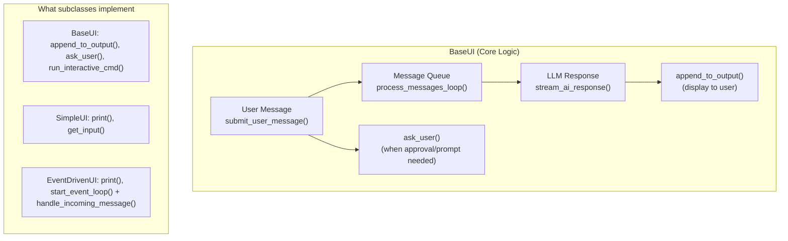
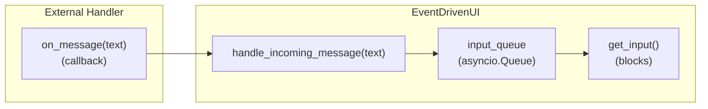
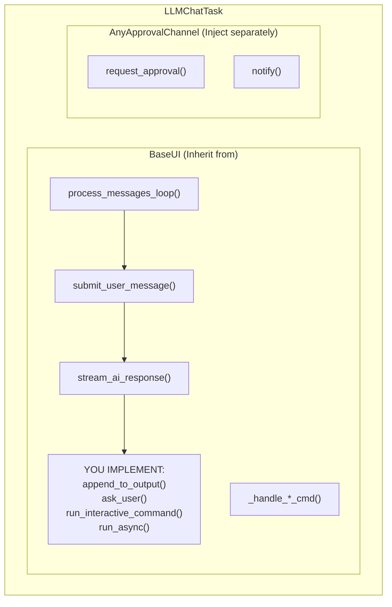

🔖 [Documentation Home](../../README.md) > [LLM](./) > Custom UI

# LLM Custom UI and Approval Channels

Zrb's LLM tasks accept custom UIs and approval channels, so the agent can run over Telegram, Slack, Discord, a web app, or any other non-terminal interface.

---

## Table of Contents

- [Choosing a Level](#choosing-a-level)
- [Quick Start](#quick-start)
- [Level 1: SimpleUI (Request-Response)](#level-1-simpleui-request-response)
- [Level 2: EventDrivenUI (Callbacks)](#level-2-eventdrivenui-callbacks)
- [Level 3: BaseUI (Full Control)](#level-3-baseui-full-control)
- [BufferedOutputMixin (Rate-Limited Backends)](#bufferedoutputmixin-rate-limited-backends)
- [UIConfig](#uiconfig)
- [create_ui_factory()](#create_ui_factory)
- [Multiple Channels (CLI + External)](#multiple-channels-cli--external)
- [Approval Channels](#approval-channels)
- [Implementation Tips](#implementation-tips)
- [Working Examples](#working-examples)

---

## Choosing a Level

Every UI shares one message loop inside `BaseUI`; the levels differ only in how much of it you write yourself.



| Level | Base class | You implement | You get for free | Best for |
|-------|------------|---------------|------------------|----------|
| **1** | `SimpleUI` | `print()`, `get_input()` | All of BaseUI, plus a default `run_async()` and `__init__` | CLI, file logging, synchronous I/O |
| **2** | `EventDrivenUI` | `print()`, `start_event_loop()` | All of SimpleUI, plus an input queue and message routing | Telegram, Discord, WhatsApp (callbacks); HTTP API, WebSocket |
| **3** | `BaseUI` | `__init__`, `append_to_output()`, `ask_user()`, `run_interactive_command()`, `run_async()` | Message loop, command handling, LLM interaction, `UIConfig`-based settings | Custom event loops, multiplexers |

**Start with `SimpleUI`**; move up only when your backend requires it. Add [`BufferedOutputMixin`](#bufferedoutputmixin-rate-limited-backends) for rate-limited backends (Telegram, Discord).

`test/llm/ui/test_extension_levels.py` builds a minimal subclass at each level implementing exactly the "You implement" column and registering it via `create_ui_factory`, so this table cannot silently go stale.

### How SimpleUI maps onto BaseUI

| BaseUI method | SimpleUI method | What SimpleUI does |
|---------------|-----------------|--------------------|
| `append_to_output(*values, sep, end)` | `print(text: str)` | Joins values with sep/end, calls async `print()` |
| `ask_user(prompt: str)` | `get_input(prompt: str)` | Direct pass-through |
| `run_interactive_command(cmd, shell)` | *(default)* | Shows a "not supported" message |
| `run_async()` | *(default)* | Starts `process_messages_loop()`, handles lifecycle |

So moving from `BaseUI` to `SimpleUI` drops the event loop, the lifecycle and the ~15-parameter `__init__` (one `super().__init__()` call with a `UIConfig` replaces it).

---

## Quick Start

```python
from zrb.builtin.llm.chat import llm_chat
from zrb.llm.ui import SimpleUI, create_ui_factory

class MyUI(SimpleUI):
    async def print(self, text: str, kind: str = "text") -> None:
        """Display output to user. Called when AI responds or system messages."""
        print(text, end="", flush=True)

    async def get_input(self, prompt: str) -> str:
        """Wait for user input. Called for chat input and tool approvals."""
        return await asyncio.to_thread(input, prompt or "You> ")

# One-line registration
llm_chat.ui_factories = [create_ui_factory(MyUI)]
```

`print()` is the output path (AI responses, system messages); `get_input()` is the input path (user chat, approvals, prompts).

---

## Level 1: SimpleUI (Request-Response)

For backends where you **control the event loop** and can **block on input**.

- **`async print(text: str)`** — called for AI responses, system messages and errors. Receives pre-formatted text (emojis, formatting included).
- **`async get_input(prompt: str)`** — called when waiting for chat input or approvals. Blocks until input arrives; `prompt` may be empty for approvals.

Both must be `async` — see [Implementation Tips](#1-async-methods). The [Quick Start](#quick-start) is the minimal CLI.

### Example: File Logger

```python
import asyncio
from pathlib import Path
from zrb.builtin.llm.chat import llm_chat
from zrb.llm.ui import SimpleUI, create_ui_factory

class LoggingUI(SimpleUI):
    """Logs all output to file, CLI for input."""

    def __init__(self, log_file: str = "chat.log", **kwargs):
        super().__init__(**kwargs)
        self.log_path = Path(log_file)

    async def print(self, text: str, kind: str = "text") -> None:
        # Display to terminal
        print(text, end="", flush=True)
        # Append to log file
        self.log_path.write_text(self.log_path.read_text() + text)

    async def get_input(self, prompt: str) -> str:
        return await asyncio.to_thread(input, prompt or "You> ")

llm_chat.ui_factories = [
    lambda ctx, task, hm, **kw: LoggingUI(
        ctx=ctx, llm_task=task, history_manager=hm, log_file="session.log"
    )
]
```

### Example: Structured Logging UI

```python
import asyncio
import json
from datetime import datetime
from zrb.builtin.llm.chat import llm_chat
from zrb.llm.ui import SimpleUI, create_ui_factory

class StructuredLogUI(SimpleUI):
    """Outputs structured JSON for each message."""

    def __init__(self, output_file: str = "messages.jsonl", **kwargs):
        super().__init__(**kwargs)
        self.output_file = output_file

    async def print(self, text: str, kind: str = "text") -> None:
        record = {
            "timestamp": datetime.now().isoformat(),
            "type": "output",
            "content": text.strip()
        }
        with open(self.output_file, "a") as f:
            f.write(json.dumps(record) + "\n")

    async def get_input(self, prompt: str) -> str:
        return await asyncio.to_thread(input, prompt or "You> ")

llm_chat.ui_factories = [create_ui_factory(StructuredLogUI)]
```

---

## Level 2: EventDrivenUI (Callbacks)

For backends where **messages arrive via callbacks/handlers**. You implement `print(text)` (send output to your backend) and `start_event_loop()` (register handlers and start listening), both async.

Your handler passes each incoming message to **`handle_incoming_message(text)`**, which routes it:

1. If `get_input()` is blocked (an `ask_user` is waiting) → puts the text on `input_queue`, unblocking it.
2. Otherwise → submits the text as a new message to the LLM.



### Example: Telegram Bot

```python
import asyncio
from telegram.ext import Application, MessageHandler, filters
from zrb.builtin.llm.chat import llm_chat
from zrb.llm.ui import EventDrivenUI, create_ui_factory

class TelegramUI(EventDrivenUI):
    """Telegram bot using EventDrivenUI."""

    def __init__(self, bot_token: str, chat_id: int, **kwargs):
        # Store backend-specific params before super().__init__
        self.bot_token = bot_token
        self.chat_id = chat_id
        self._app = None
        super().__init__(**kwargs)

    async def print(self, text: str, kind: str = "text") -> None:
        """Send AI response to Telegram."""
        if self._app:
            # Telegram has 4096 char limit per message
            for chunk in self._split_message(text, 4000):
                await self._app.bot.send_message(self.chat_id, chunk)

    async def start_event_loop(self) -> None:
        """Start Telegram bot and register handlers."""
        self._app = Application.builder().token(self.bot_token).build()

        async def handle(update, context):
            text = update.message.text
            # This routes automatically:
            # - If waiting for input → unblocks get_input()
            # - Otherwise → sends to LLM
            self.handle_incoming_message(text)

        self._app.add_handler(MessageHandler(filters.TEXT, handle))
        await self._app.initialize()
        await self._app.start()
        await self._app.updater.start_polling()

        # Keep running until cancelled
        while True:
            await asyncio.sleep(1)

    def _split_message(self, text: str, max_len: int) -> list[str]:
        """Split long messages while preserving word boundaries."""
        if len(text) <= max_len:
            return [text]
        # Simple split - you may want smarter logic for code blocks
        chunks = []
        while text:
            chunk = text[:max_len]
            last_newline = chunk.rfind('\n')
            if last_newline > max_len // 2:
                chunk = text[:last_newline + 1]
            chunks.append(chunk)
            text = text[len(chunk):]
        return chunks

# Register - ONE line!
llm_chat.ui_factories = [
    create_ui_factory(TelegramUI, bot_token=BOT_TOKEN, chat_id=CHAT_ID)
]
```

### Example: Discord Bot

```python
import asyncio
import discord
from zrb.builtin.llm.chat import llm_chat
from zrb.llm.ui import EventDrivenUI, create_ui_factory

class DiscordUI(EventDrivenUI):
    """Discord bot using EventDrivenUI."""

    def __init__(self, token: str, channel_id: int, **kwargs):
        self.token = token
        self.channel_id = channel_id
        self._client = None
        super().__init__(**kwargs)

    async def print(self, text: str, kind: str = "text") -> None:
        """Send AI response to Discord."""
        if self._client:
            channel = self._client.get_channel(self.channel_id)
            if channel:
                # Discord has 2000 char limit
                for chunk in [text[i:i+1900] for i in range(0, len(text), 1900)]:
                    # Strip ANSI codes for Discord
                    from zrb.util.cli.style import remove_style
                    await channel.send(remove_style(chunk))

    async def start_event_loop(self) -> None:
        """Start Discord bot and register handlers."""
        intents = discord.Intents.default()
        intents.message_content = True
        self._client = discord.Client(intents=intents)

        @self._client.event
        async def on_message(message):
            if message.author.bot:
                return
            if message.channel.id != self.channel_id:
                return
            self.handle_incoming_message(message.content)

        await self._client.start(self.token)

# Register
llm_chat.ui_factories = [
    create_ui_factory(DiscordUI, token=DISCORD_TOKEN, channel_id=CHANNEL_ID)
]
```

### HTTP API / WebSocket

An HTTP or WebSocket handler calls `handle_incoming_message()` just as a bot callback does. The built-in reference is `zrb.runner.chat.http_ui.create_http_ui_factory` (used by the FastAPI chat session runner): it subclasses `EventDrivenUI`, broadcasts `print()` output over server-sent events, and routes `handle_incoming_message()` from the request handler into an `asyncio.Queue` that `get_input()` awaits. Use it directly or copy its shape; `examples/chat-sse/` is the runnable version.

---

## Level 3: BaseUI (Full Control)

Use `BaseUI` when you need a custom `run_async()`, a real `run_interactive_command()`, low-level `append_to_output()`, or a custom multiplexer.



### What you implement

| Item | Purpose | Complexity |
|------|---------|------------|
| `__init__()` | Initialize with `ctx`, `llm_task`, `history_manager`, a `ui_config`, and a handful of others | Medium (boilerplate) |
| `append_to_output(*values, sep, end, file, flush)` | Display output | Low |
| `ask_user(prompt: str)` | Block for user input | Medium |
| `run_interactive_command(cmd, shell)` | Execute shell commands | Low (or return error) |
| `run_async()` | Start and run the event loop | **High** — must manage lifecycle |

**Free:** `process_messages_loop()` (queue-based processing), `submit_user_message()`, `stream_ai_response()`, command handlers (`/help`, `/exit`, `/save`, `/load`, `/model`, `/exec`, `/yolo`), history management, and tool confirmation handling.

### Customising a built-in command

Every slash command is a `handle_<name>_command(text) -> bool` method on `BaseUI`. `command_table()` binds handlers to the UI instance, so overriding one in your subclass replaces the built-in:

```python
class MyUI(SimpleUI):                       # or BaseUI, EventDrivenUI
    def handle_save_command(self, text: str) -> bool:
        name = text.removeprefix("/save").strip()
        if not name:
            return False                    # not consumed -> falls through
        my_backend.store(name, self.last_ai_response())
        return True                         # consumed -> no further handlers run
```

Return `True` when consumed, `False` to let the next handler (and finally the LLM) see it. To add a command or change priority order, override `commands.command_table()`.

### Optional methods

| Method | Default | Purpose |
|--------|---------|---------|
| `invalidate_ui()` | No-op | Redraw/refresh UI |
| `on_exit()` | No-op | Cleanup on shutdown |
| `ask_user_choice(spec)` | Formats the spec as numbered text and delegates to `ask_user` | Override for an arrow-key-selectable widget |
| `stream_to_parent()` | Calls `append_to_output` | For multiplexed UIs |
| `_get_output_field_width()` | None | Custom text width for formatting (read by the diff/markdown formatters through the public `output_field_width` property) |
| `record_tool_call_block(collapsed, full)` | Falls back to `append_to_output(collapsed, end="", kind="tool_call")` | Print a tool-call/result line that a toggle-capable UI can later expand in place |
| `mark_thinking_block_start()` | No-op | Record where a live thinking block begins, so it can be collapsed once it ends |
| `collapse_thinking_block(collapsed, full)` | No-op | Collapse the block opened by `mark_thinking_block_start()`; the thinking text still reaches the UI via the normal `append_to_output` stream |

The last three are looked up with `getattr(ui, name, None)` — implement them only for collapsible tool-call/thinking blocks (like the default TUI's `Ctrl+O`).

### Example: WebSocket Backend

```python
import asyncio
import json
from websockets.server import serve
from zrb.llm.ui import BaseUI
from zrb.builtin.llm.chat import llm_chat

class WebSocketUI(BaseUI):
    """WebSocket UI with full control."""

    def __init__(self, websocket, **kwargs):
        super().__init__(**kwargs)
        self.ws = websocket
        self._input_queue: asyncio.Queue[str] = asyncio.Queue()

    def append_to_output(self, *values, sep=" ", end="\n", **kwargs):
        """Send output to WebSocket."""
        text = sep.join(str(v) for v in values) + end
        # Schedule async send
        asyncio.create_task(self.ws.send(text))

    async def ask_user(self, prompt: str) -> str:
        """Wait for user input via WebSocket."""
        if prompt:
            await self.ws.send(f"❓ {prompt}")
        return await self._input_queue.get()

    async def run_interactive_command(self, cmd, shell=False):
        """Shell commands not supported."""
        await self.ws.send("⚠️ Shell commands not supported in WebSocket mode")
        return 1

    async def run_async(self) -> str:
        """Run message loop and WebSocket listener."""
        # Start the message processing loop
        self.process_messages_task = asyncio.create_task(
            self.process_messages_loop()
        )

        # Send initial message if provided
        if self.initial_message:
            self.submit_user_message(self.llm_task, self.initial_message)

        # Listen for WebSocket messages
        async def receive_messages():
            async for msg in self.ws:
                try:
                    data = json.loads(msg)
                    if data.get("type") == "user_input":
                        await self._input_queue.put(data["content"])
                except json.JSONDecodeError:
                    await self.ws.send("❌ Invalid JSON")

        receive_task = asyncio.create_task(receive_messages())
        try:
            while True:
                await asyncio.sleep(1)
        except asyncio.CancelledError:
            pass
        finally:
            receive_task.cancel()
            self.process_messages_task.cancel()
        return self.last_output

# Server setup
async def handle_connection(websocket, path):
    ui = WebSocketUI(
        websocket=websocket,
        ctx=...,  # Your context
        llm_task=llm_chat,
        history_manager=...,  # Your history manager
        # In zrb 3.x, per-field kwargs like `yolo_xcom_key`/`assistant_name`
        # were folded into a single `ui_config` object.
        ui_config=UIConfig(yolo_xcom_key="yolo", assistant_name="AI"),
    )
    await ui.run_async()

async def main():
    async with serve(handle_connection, "localhost", 8765):
        await asyncio.Future()  # Run forever
```

---

## BufferedOutputMixin (Rate-Limited Backends)

Streaming sends one API call per token chunk, which trips message-rate limits (Telegram: ~30 messages/sec, Discord: ~5 messages/sec). `BufferedOutputMixin` batches output and flushes it periodically — "H", "e", "l", "l", "o" become one `send 'Hello'` call. It also drops spinner/progress fragments that would otherwise repeat in a chat channel.

```python
from zrb.llm.ui import EventDrivenUI, BufferedOutputMixin

class TelegramUI(EventDrivenUI, BufferedOutputMixin):
    """Telegram UI with output buffering to avoid rate limits."""

    def __init__(self, bot_token: str, chat_id: int, **kwargs):
        # Initialize EventDrivenUI
        EventDrivenUI.__init__(self, **kwargs)
        # Initialize buffering (0.3s interval, 3000 char max)
        BufferedOutputMixin.__init__(self, flush_interval=0.3, max_buffer_size=3000)

        self.bot_token = bot_token
        self.chat_id = chat_id
        self._app = None

    async def print(self, text: str, kind: str = "text") -> None:
        """Buffer output instead of sending immediately."""
        self.buffer_output(text)

    async def _send_buffered(self, text: str) -> None:
        """Called automatically when buffer flushes."""
        if self._app:
            await self._app.bot.send_message(self.chat_id, text)

    async def start_event_loop(self) -> None:
        # Start bot
        self._app = Application.builder().token(self.bot_token).build()

        async def handle(update, context):
            self.handle_incoming_message(update.message.text)

        self._app.add_handler(MessageHandler(filters.TEXT, handle))
        await self._app.initialize()
        await self._app.start()
        await self._app.updater.start_polling()

        # Start periodic flush
        await self.start_flush_loop()

        # Keep running
        while True:
            await asyncio.sleep(1)

    async def on_exit(self):
        """Clean shutdown - flush remaining buffer."""
        await self.stop_flush_loop()
```

| Parameter | Default | Description |
|-----------|---------|-------------|
| `flush_interval` | 0.5 (`CFG.LLM_UI_FLUSH_INTERVAL`, in ms: `500`) | Seconds between flushes |
| `max_buffer_size` | 2000 (`CFG.LLM_UI_MAX_BUFFER_SIZE`) | Characters before a forced flush |

---

## UIConfig

`UIConfig` is **the** UI configuration object: `BaseUI.__init__` takes one `ui_config: UIConfig | None` parameter (not 25 individual ones), and every concrete UI (`SimpleUI`, `EventDrivenUI`, the built-in TUI, the web UI) is built from it. Each field defaults from its `CFG.LLM_UI_COMMAND_*` env twin ([env-vars.md](../configuration/env-vars.md)), read lazily so a `zrb_init.py` change still wins — so every UI backend agrees on the shipped command aliases.

```python
from zrb.llm.ui import UIConfig, create_ui_factory

# Bundle all configuration in one object
config = UIConfig(
    # Identity
    assistant_name="MyBot",
    
    # Commands (customize or disable)
    exit_commands=["/quit", "/bye", "/stop"],
    info_commands=["/help", "/?"],
    is_yolo=True,  # Auto-approve all tools
    
    # Disable specific commands
    exec_commands=[],  # No shell access
)

# Pass to factory
llm_chat.ui_factories = [create_ui_factory(MyUI, ui_config=config)]
```

| Field | Default | Description |
|-------|---------|-------------|
| `assistant_name` | `CFG.LLM_ASSISTANT_NAME` | Name shown in prompts |
| `ascii_art` | `CFG.LLM_ASSISTANT_ASCII_ART` | Banner art |
| `jargon` | `CFG.LLM_ASSISTANT_JARGON` | Tagline |
| `greeting` | `"{LLM_ASSISTANT_NAME}\n{LLM_ASSISTANT_JARGON}"` | Greeting shown at start |
| `exit_commands` | `CFG.LLM_UI_COMMAND_EXIT` | Commands to exit |
| `info_commands` | `CFG.LLM_UI_COMMAND_INFO` | Show help |
| `save_commands` | `CFG.LLM_UI_COMMAND_SAVE` | Save conversation |
| `load_commands` | `CFG.LLM_UI_COMMAND_LOAD` | Load conversation |
| `attach_commands` | `CFG.LLM_UI_COMMAND_ATTACH` | Attach files |
| `rewind_commands` | `CFG.LLM_UI_COMMAND_REWIND` | Rewind to a previous turn |
| `redirect_output_commands` | `CFG.LLM_UI_COMMAND_REDIRECT_OUTPUT` | Copy/save the last response |
| `yolo_toggle_commands` | `CFG.LLM_UI_COMMAND_YOLO_TOGGLE` | Toggle auto-approve |
| `set_model_commands` | `CFG.LLM_UI_COMMAND_SET_MODEL` | Switch model |
| `exec_commands` | `CFG.LLM_UI_COMMAND_EXEC` | Run shell commands |
| `btw_commands` | `CFG.LLM_UI_COMMAND_BTW` | Side-channel message |
| `plan_commands` | `CFG.LLM_UI_COMMAND_PLAN_TOGGLE` | Toggle plan mode |
| `copy_commands` | `CFG.LLM_UI_COMMAND_COPY` | Copy the transcript |
| `voice_commands` | `CFG.LLM_UI_COMMAND_VOICE` | Toggle voice dictation |
| `photo_commands` | `CFG.LLM_UI_COMMAND_PHOTO` | Attach a photo |
| `summarize_commands` | `CFG.LLM_UI_COMMAND_SUMMARIZE` | Summarize/compress history |
| `is_yolo` | `False` | Auto-approve: `True` for all tools, or a `frozenset` of tool names (e.g. `frozenset({"Write", "Edit"})`) for selective |
| `yolo_xcom_key` | `"yolo"` | xcom key the session reads/writes when yolo is toggled at run time |
| `show_ollama_models` | `CFG.LLM_SHOW_OLLAMA_MODELS` | Whether the model picker lists local Ollama models |
| `show_pydantic_ai_models` | `CFG.LLM_SHOW_PYDANTIC_AI_MODELS` | Whether the model picker lists models known to pydantic-ai |
| `conversation_session_name` | `""` | Session name (empty = random) |

Set a command list to `[]` to disable that command. An `LLMChatTask` (`llm_chat` included) exposes the same object as a settable `ui_config` property — see [LLM Component Collections](../configuration/llm-collections.md#3-per-task--instance-arguments--override-one-host).

---

## create_ui_factory()

`LLMChatTask` calls each UI factory with eight parameters:

```python
def factory(
    ctx: AnyContext,              # Task context
    llm_task: LLMTask,            # LLM task instance
    history_manager: HistoryManager,  # History manager
    ui_commands: dict,            # Command configuration
    initial_message: str,         # First message (if any)
    initial_conversation_name: str,  # Session name
    initial_yolo: "bool | frozenset[str]",  # Auto-approve mode (True/False, or a set of tool names for selective auto-approve)
    initial_attachments: list,    # Files to attach
) -> BaseUI:
    ...
```

Writing that by hand means building a `UIConfig` and merging `ui_commands` into it yourself. `create_ui_factory()` does it for you:

```python
from zrb.llm.ui import create_ui_factory, UIConfig

# One-line registration with automatic parameter mapping
config = UIConfig(assistant_name="MyBot", is_yolo=True)
llm_chat.ui_factories = [
    create_ui_factory(MyUI, ui_config=config, bot_token=TOKEN, chat_id=12345)
]
```

It (1) maps the eight standard parameters onto `UIConfig`, (2) merges `ui_commands` from the task configuration, and (3) passes extra kwargs (`bot_token`, `chat_id`) to `MyUI.__init__()`.

---

## Multiple Channels (CLI + External)

To run the default terminal UI **and** an external channel (Telegram, SSE, WebSocket) together, append instead of replacing — `append_ui_factory()` (or `append_ui()` for an instance) and `append_approval_channel()`:

```python
from zrb.builtin.llm.chat import llm_chat
from zrb.llm.ui import create_ui_factory
from zrb.llm.approval import TerminalApprovalChannel

# Default terminal UI is used automatically; add Telegram on top
llm_chat.append_ui_factory(
    create_ui_factory(TelegramUI, bot_token=BOT_TOKEN, chat_id=CHAT_ID)
)

# Both channels can approve/deny
llm_chat.append_approval_channel(TelegramApprovalChannel(bot, CHAT_ID))
llm_chat.append_approval_channel(TerminalApprovalChannel(my_ui))
```

The framework then wraps them automatically:

| Class | Module | Behavior |
|-------|--------|----------|
| `MultiUI` | `zrb.llm.ui` | **Output** broadcasts to all UIs; **input** waits for the first response from any channel |
| `MultiplexApprovalChannel` | `zrb.llm.approval` | First approval response wins (CLI or external) |

### The primary child

One child is the **primary** — `MultiUI(uis, main_ui_index=0)` picks it, defaulting to the first. The primary runs the main event loop, and `MultiUI` reads these state members off it only:

| Member | What `MultiUI` uses it for |
| --- | --- |
| `snapshot_manager` | Taking a filesystem snapshot before each turn, so `/rewind` works |
| `history_manager` | Loading the message count that a rewind restores to |
| `conversation_session_name` | Naming the session a turn runs under |
| `plan_mode_active` | Reading *and writing* the `/plan` badge as the agent switches mode mid-run |
| `small_model` / `multimodal_model` | Binding the `/model small ...` and `/model multimodal ...` overrides for the run |
| `last_output` | Reporting the session's final answer when a turn produced no result data |

All are part of `AnyUI`, with inert `None`/`False`/`""` defaults from `UIStateDefaultsMixin` (real ones from `BaseUI`). So a UI that keeps none of this state **works as a secondary child, but disables snapshots, rewind and plan mode as the primary**. If yours goes in the `main_ui_index` slot, implement them for real — or keep the terminal UI primary and add yours alongside. A primary with its own `snapshot_manager` should build it with a callable returning the current `conversation_session_name` (as `BaseUI` does), or set the manager's `session_name` on every change; otherwise rewind stays on the session's starting conversation.

### Optional enrichment hooks

`MultiUI` forwards twelve richer output events to children that implement them, and skips children that don't — which is why a Telegram channel can ignore block-collapsing and still receive everything through `append_to_output`. They are not part of `AnyUI` for the same reason. Implement one only when your channel renders it better than a plain line:

| Hook | Fired when |
| --- | --- |
| `accumulate_usage(usage, context_usage)` | A run reports token totals — needed for a session token meter |
| `append_markdown(markdown_text)` | Markdown reaches the pane (the assistant's answer, or a markdownish user paste) — a child without it gets the pre-rendered text |
| `mark_text_block_start()` | The assistant begins a text block |
| `collapse_text_block(collapsed, full)` | That text block ends, with a short and a full form |
| `mark_thinking_block_start()` | The assistant begins a reasoning block |
| `collapse_thinking_block(collapsed, full)` | That reasoning block ends |
| `update_tool_prepare(key, text)` | A tool call is being prepared |
| `update_shell_output(key, text)` | A running shell command emits output |
| `finish_shell_output(key, collapsed, full)` | That shell command completes |
| `record_tool_call_block(collapsed, full)` | A tool call and its result are printed — a child without it gets the collapsed line |
| `replay_history(messages)` | A conversation is replayed on resume |
| `update_system_info()` | A turn ended and the child should refresh its system/git status line |

The canonical list is `test/architecture/test_multi_ui_fanout_surface.py`, which fails if `MultiUI` fans out a name not on it.

---

## Approval Channels

For tool confirmations, implement `AnyApprovalChannel`:

```python
from zrb.llm.approval import AnyApprovalChannel, ApprovalContext, ApprovalResult

class TelegramApprovalChannel(AnyApprovalChannel):
    """Send approval requests to Telegram."""

    def __init__(self, bot, chat_id: int):
        self.bot = bot
        self.chat_id = chat_id

    async def request_approval(self, context: ApprovalContext) -> ApprovalResult:
        """Ask user to approve tool execution."""
        from zrb.util.cli.style import remove_style

        # Show tool info
        msg = (
            f"🔧 Tool Request\n"
            f"Name: {context.tool_name}\n"
            f"Args: {context.tool_args}\n"
            f"\nApprove? (y/n)"
        )
        await self.bot.send_message(self.chat_id, remove_style(msg))

        # Wait for response (you need to implement this)
        response = await self._wait_for_response()
        approved = response.lower() in ("y", "yes", "")

        return ApprovalResult(
            approved=approved,
            message="Approved" if approved else "Denied"
        )

    async def notify(self, message: str, context: ApprovalContext | None = None) -> None:
        """Send notification to user."""
        from zrb.util.cli.style import remove_style
        await self.bot.send_message(self.chat_id, remove_style(message))

# Register
llm_chat.approval_channels = [TelegramApprovalChannel(bot, CHAT_ID)]
```

| `AnyApprovalChannel` method | Purpose |
|--------|---------|
| `request_approval(context)` | Ask user to approve/deny tool execution |
| `notify(message, context)` | Send informational message |

| `ApprovalContext` field | Description |
|-------|-------------|
| `tool_name` | Name of the tool to execute |
| `tool_args` | Arguments passed to the tool |
| `tool_call_id` | Identifier for the specific tool call (required) |
| `session_id` | Session identifier (optional) |
| `conversation_id` | Conversation identifier (optional) |
| `user_id` | User identifier (optional) |
| `extra` | Extra metadata dict (optional) |

Built-in channels: `TerminalApprovalChannel` (default terminal confirmation, uses the UI) and `NullApprovalChannel` (auto-approves everything — YOLO mode):

```python
from zrb.llm.approval import NullApprovalChannel

# Auto-approve all tool calls
llm_chat.approval_channels = [NullApprovalChannel()]

# Or enable via UIConfig
config = UIConfig(is_yolo=True)
llm_chat.ui_factories = [create_ui_factory(MyUI, ui_config=config)]
```

---

## Implementation Tips

### 1. Async methods

`print()` and `get_input()` **must be async**. The base class schedules `print()` whenever `append_to_output()` is called, which may happen from a sync context.

```python
# CORRECT - async methods
class MyUI(SimpleUI):
    async def print(self, text: str, kind: str = "text") -> None:  # ✓ async
        await some_async_send(text)

    async def get_input(self, prompt: str) -> str:  # ✓ async
        return await asyncio.to_thread(input, prompt)

# WRONG - sync methods will cause issues
class BadUI(SimpleUI):
    def print(self, text: str) -> None:  # ✗ Not async
        print(text)
```

### 2. Strip ANSI codes for remote UIs

Telegram, Discord and similar don't render terminal ANSI codes:

```python
from zrb.util.cli.style import remove_style

async def print(self, text: str, kind: str = "text") -> None:
    clean_text = remove_style(text)  # Strip ANSI codes
    await self.bot.send_message(self.chat_id, clean_text)
```

### 3. Time out remote input

```python
async def get_input(self, prompt: str) -> str:
    await self.print(f"❓ {prompt}")
    try:
        # Timeout after 5 minutes
        return await asyncio.wait_for(
            self.input_queue.get(),
            timeout=300
        )
    except asyncio.TimeoutError:
        return "cancel"  # Or raise to abort
```

### 4. One UI instance per user in multi-user backends

```python
# Per-user session storage
sessions: dict[int, EventDrivenUI] = {}

async def on_message(update, context):
    user_id = update.message.from_user.id

    # Get or create session
    if user_id not in sessions:
        sessions[user_id] = MyUI(
            ctx=ctx,
            llm_task=llm_chat,
            history_manager=history_manager,
            # ...
        )
        asyncio.create_task(sessions[user_id].run_async())

    # Route message to correct session
    sessions[user_id].handle_incoming_message(update.message.text)
```

---

## Working Examples

| Example | Location | Level | Pattern |
|---------|----------|-------|---------|
| Minimal CLI | `examples/chat-minimal-ui/` | 1 | SimpleUI |
| Telegram Bot | `examples/chat-telegram/` | 2 | EventDrivenUI + BufferedOutputMixin |
| Telegram + CLI | `examples/chat-telegram/` | 2+ | Multi-UI (dual mode) |
| HTTP API (SSE) | `examples/chat-sse/` | 2 | EventDrivenUI, CLI + SSE dual mode |

🔖 [Documentation Home](../../README.md) > [LLM](./) > Custom UI
