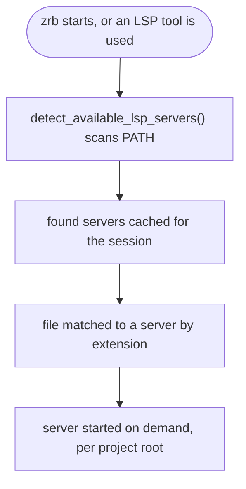
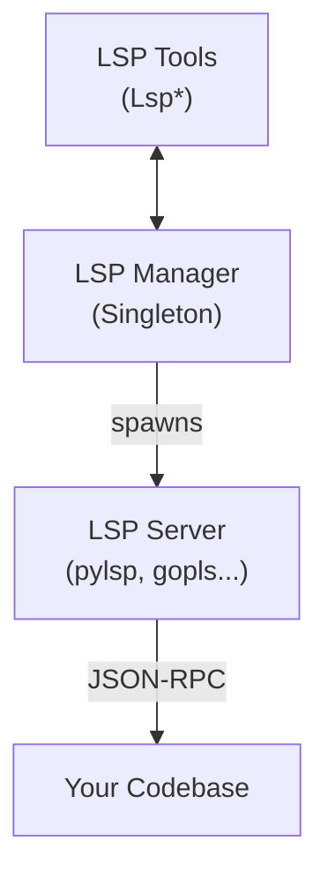

🔖 [Documentation Home](../../README.md) > [LLM](./) > LSP Support

# LSP (Language Server Protocol) Support

When a language server is installed, zrb's assistant gets IDE-like code intelligence: go-to-definition, find-references, document and workspace symbols, diagnostics, hover info, and rename. LSP answers with precise symbol names, locations, and types, which costs far fewer tokens than reading whole files.

---

## Table of Contents

- [Supported Languages](#supported-languages)
- [Installation](#installation)
- [Auto-Detection](#auto-detection)
- [Custom LSP Servers](#custom-lsp-servers)
- [Available Tools](#available-tools)
- [Usage Examples](#usage-examples)
- [How It Works](#how-it-works)
- [Troubleshooting](#troubleshooting)

---

## Supported Languages

The built-in catalogue (`LSP_SERVER_CONFIGS` in `src/zrb/llm/lsp/configs.py`) covers 21 servers. The **Name** column is the registry key you use in `ZRB_LLM_LSP_PREFERRED_SERVERS`.

| Language | Name | Extensions | Install Command |
|----------|------|------------|-----------------|
| **Python** | `pyright` | `.py`, `.pyi`, `.pyw` | `npm install -g pyright` |
| **Python** | `pylsp` | `.py`, `.pyi`, `.pyw` | `pip install python-lsp-server` |
| **Python** | `jedi` (jedi-language-server) | `.py`, `.pyi`, `.pyw` | `pip install jedi-language-server` |
| **Go** | `gopls` | `.go` | `go install golang.org/x/tools/gopls@latest` |
| **TypeScript/JavaScript** | `typescript-language-server` | `.ts`, `.tsx`, `.js`, `.jsx`, `.mjs`, `.cjs` | `npm install -g typescript-language-server typescript` |
| **Rust** | `rust-analyzer` | `.rs` | `rustup component add rust-analyzer` |
| **C/C++** | `clangd` | `.c`, `.cpp`, `.cc`, `.cxx`, `.h`, `.hpp`, `.hxx` | `sudo apt install clangd` or `brew install llvm` |
| **Ruby** | `ruby-lsp` | `.rb`, `.rake`, `.gemspec` | `gem install ruby-lsp` |
| **Ruby** | `solargraph` | `.rb`, `.rake`, `.gemspec` | `gem install solargraph` |
| **Java** | `jdtls` | `.java` | Download from [Eclipse](https://download.eclipse.org/jdtls/) |
| **PHP** | `intelephense` | `.php`, `.phtml`, … | `npm install -g intelephense` |
| **C#** | `omnisharp` | `.cs` | `dotnet tool install -g OmniSharp` |
| **C#** | `csharp-ls` | `.cs` | `dotnet tool install -g csharp-ls` |
| **Swift** | `sourcekit-lsp` | `.swift` | Included with Xcode/Swift |
| **Kotlin** | `kotlin-language-server` | `.kt`, `.kts` | Download from [GitHub](https://github.com/fwcd/kotlin-language-server) |
| **Scala** | `metals` | `.scala`, `.sc` | Install via [coursier](https://coursier.io/) |
| **Lua** | `lua-language-server` | `.lua` | `brew install lua-language-server` |
| **YAML** | `yaml-language-server` | `.yaml`, `.yml` | `npm install -g yaml-language-server` |
| **JSON** | `json-language-server` (vscode-json-languageserver) | `.json`, `.jsonc` | `npm install -g vscode-json-languageserver` |
| **HTML** | `html-language-server` (html-languageserver) | `.html`, `.htm` | `npm install -g html-languageserver` |
| **CSS** | `css-language-server` (css-languageserver) | `.css`, `.scss`, `.less` | `npm install -g css-languageserver` |

Rows are in registry order, which decides [which server wins](#multiple-lsp-servers-conflict) when several are installed.

---

## Installation

Install the server(s) for your language from the table above, e.g.:

```bash
pip install python-lsp-server                           # Python
go install golang.org/x/tools/gopls@latest              # Go
npm install -g typescript-language-server typescript    # TypeScript/JavaScript
rustup component add rust-analyzer                      # Rust
```

Check what zrb detects, from Python:

```python
from zrb.llm.lsp.server import detect_available_lsp_servers

servers = detect_available_lsp_servers()
for name, path in servers.items():
    print(f"✅ {name}: {path}")
```

Or start `zrb llm chat` and ask *"What LSP servers are available on my system?"* — the assistant answers with the `LspListServers` tool.

---

## Auto-Detection

No configuration is needed: a server counts as installed when its command is on `PATH` (checked with `shutil.which`).



- The LSP tools are registered with the agent only when at least one server is detected.
- Detection is cached for the process lifetime. After installing a server mid-session, call `lsp_server_configs.invalidate_detection()` (from `zrb.llm.lsp.configs`) or restart; registering a config invalidates it automatically.

---

## Custom LSP Servers

To use a server not in the catalogue — another language, an in-house server, a custom binary — register it from your `zrb_init.py`:

```python
from zrb.llm.lsp.configs import LSPServerConfig
from zrb.llm.lsp.manager import lsp_manager

lsp_manager.register_lsp_server(
    "zls",  # unique key, also usable in ZRB_LLM_LSP_PREFERRED_SERVERS
    LSPServerConfig(
        name="zls",
        command=["zls"],            # how to launch it (must be on PATH)
        language_ids=["zig"],       # LSP language identifiers
        file_extensions=[".zig"],   # files this server handles
    ),
)
```

Registered servers behave exactly like built-ins:

- **Auto-detection** — `detect_available_lsp_servers()` reports them when `command[0]` is on `PATH` (via `shutil.which`).
- **File matching** — a file whose extension is in `file_extensions` resolves to this server.
- **Selection / preference** — the name participates in `ZRB_LLM_LSP_PREFERRED_SERVERS` and per-call `preferred_servers` ordering.
- **Override** — registering a name that already exists (e.g. `"pyright"`) replaces the built-in config for that name.

User entries are merged over the built-in table in a single module-level registry (`lsp_server_configs`). Call `register_lsp_server()` once at startup, before the first LSP query.

👉 Runnable end-to-end example: [`examples/lsp-config`](../../examples/lsp-config).

---

## Available Tools

| Tool | Description |
|------|-------------|
| `LspFindDefinition` | Find where a symbol is defined |
| `LspFindReferences` | Find all usages of a symbol |
| `LspGetDiagnostics` | Get errors, warnings, hints for a file |
| `LspGetDocumentSymbols` | List all symbols in a file |
| `LspGetWorkspaceSymbols` | Search symbols across workspace |
| `LspGetHoverInfo` | Get type info and docs at position |
| `LspRenameSymbol` | Rename a symbol across the project |
| `LspListServers` | List detected LSP servers |

---

## Usage Examples

### In Chat

```
Where is the LSPManager class defined?
Show me all symbols in src/zrb/llm/lsp/manager.py
Are there any errors in server.py?
Find all references to find_definition
What LSP servers are available?
```

### In AnalyzeCode

`AnalyzeCode` uses LSP automatically to pre-analyze files for symbol structure:

```python
from zrb.llm.tool.code import analyze_code

result = await analyze_code("./src", "What classes are defined?")
```

### Programmatic Usage

```python
from zrb.llm.lsp.manager import lsp_manager

# List available servers
servers = lsp_manager.list_available_servers()

# Get document symbols
symbols = await lsp_manager.get_document_symbols("src/my_file.py")

# Find definition
result = await lsp_manager.find_definition("MyClass", "src/my_file.py")

# Get diagnostics
diags = await lsp_manager.get_diagnostics("src/my_file.py")

# Clean up
await lsp_manager.shutdown_all()
```

---

## How It Works



**Symbol-based API.** LLMs think "find class MyClass", not "go to line 42, column 10", so zrb resolves positions for you:

```python
# Traditional LSP (positions)
await lsp.goto_definition(file_path, line=42, character=10)

# zrb LSP Manager (symbol names)
await lsp_manager.find_definition("MyClass", "src/my_file.py")
```

**Lazy start, per project root:**

1. First LSP call for a file → walk up to its project root (see [markers](#project-root-not-detected)).
2. Start the server process for that language and root.
3. Reuse it for later calls (a dead server is restarted).
4. Stop everything with `lsp_manager.shutdown_all()`.

---

## Troubleshooting

### LSP Server Not Detected

**Symptom:** `LspListServers` shows fewer servers than expected.

**Solution:** make sure the binary is on your `PATH`:

```bash
# Check if binary is accessible
which pylsp
which gopls
which typescript-language-server

# Add to PATH if needed
export PATH="$HOME/.local/bin:$PATH"  # for pip-installed
export PATH="$HOME/go/bin:$PATH"        # for Go
export PATH="$(npm bin -g):$PATH"       # for npm -g
```

### LSP Server Start Failure

**Symptom:** errors when using LSP tools.

**Solution:** test the server manually:

```bash
# Test pylsp
echo '{"jsonrpc":"2.0","id":1,"method":"initialize","params":{"rootUri":"file:///tmp"}}' | pylsp

# Test gopls
echo '{"jsonrpc":"2.0","id":1,"method":"initialize","params":{"rootUri":"file:///tmp"}}' | gopls serve
```

### Project Root Not Detected

**Symptom:** LSP works for some files but not others.

**Solution:** make sure an ancestor directory has one of these markers: `.git`, `pyproject.toml`, `setup.py`, `setup.cfg`, `requirements.txt`, `go.mod`, `Cargo.toml`, `package.json`, `build.gradle`, `pom.xml`, `Gemfile`, `composer.json`, `*.csproj`, `Makefile`, `CMakeLists.txt`.

### Multiple LSP Servers Conflict

**Symptom:** the wrong server is used for a file.

**How selection works.** For each file, the manager picks:

1. **Your preference** — `ZRB_LLM_LSP_PREFERRED_SERVERS`, tried in order; names not installed or not matching the file's extension are skipped.
2. Otherwise, the **first installed server matching the extension**, in registry order ([table above](#supported-languages); custom servers come after built-ins).

**Solution — set `ZRB_LLM_LSP_PREFERRED_SERVERS`** (comma-separated, ordered). Since non-matching names are skipped, one flat list can cover several languages; it applies to the agent's LSP tools and every other caller:

```bash
# Prefer pyright over pylsp for Python; gopls is used for Go (non-matching names skip)
export ZRB_LLM_LSP_PREFERRED_SERVERS="pyright,gopls"
```

```python
# or programmatically
from zrb import CFG
CFG.LLM_LSP_PREFERRED_SERVERS = ["pyright", "gopls"]
```

Installing only the server you want for a language also works, as a coarser lever.

**Per-call override.** A direct `get_server` call may pass its own list, which replaces the env var:

```python
from zrb.llm.lsp.manager import lsp_manager

server = await lsp_manager.get_server(
    "src/zrb/example.py",
    preferred_servers=["pyright", "pylsp", "jedi"],
)
```

---

## Related Topics

- [LLM Integration](./llm-integration.md) - AI assistant overview
- [Custom Tools](./extending-the-llm.md#custom-tools-and-sub-agents) - Adding your own tools

---

🔖 [Documentation Home](../../README.md) > [LLM](./) > LSP Support
