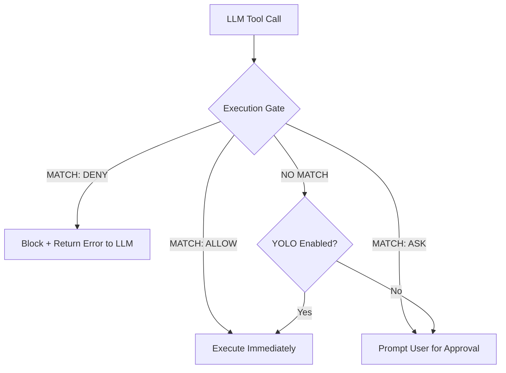

🔖 [Documentation Home](../README.md) > [LLM](./) > Permission Policy

# Permission Policy System

Zrb includes a first-match-wins permission system that decides which tools an LLM agent may call. It is a security gate: an agent stays inside the boundaries you set even when YOLO mode is on.

> **Permission vs. sandbox.** The permission policy controls *intent* — which tool calls the user agrees to. The opt-in [sandbox](sandbox.md) controls *blast radius* — what an approved call can actually touch on the filesystem. At execution time the two gates (defined in `agent/gates.py`) run back-to-back in the tool wrappers in `agent/common.py`: `permission_gate` first, then `sandbox_gate`.

---

## Table of Contents

- [Overview](#overview)
- [How it Works](#how-it-works)
- [Defining a Policy](#defining-a-policy)
- [The Precedence Chain](#the-precedence-chain)
- [Strict ASK (YOLO Override)](#strict-ask-yolo-override)
- [Configuration](#configuration)

---

## Overview

The Permission Policy system allows you to define rules based on **Capabilities** (e.g., `READ`, `EDIT`, `EXECUTE`) and **Tool Names**. Each rule specifies an action: `ALLOW`, `DENY`, or `ASK`.

- **`ALLOW`**: The tool call is automatically approved (auto-YOLO for this specific case).
- **`DENY`**: The tool call is blocked silently; the model receives a "Blocked" message, and no user prompt is shown.
- **`ASK`**: The user must explicitly approve the tool call via the UI or approval channel.

---

## How it Works

The system evaluates tool calls through an **Execution Gate** before they are actually invoked.



### Capabilities

The `Capability` enum lives in `src/zrb/llm/permission/capability.py`; the built-in tools are tagged in `src/zrb/llm/common_tools.py`:

| Capability | Description | Example Tools |
|------------|-------------|---------------|
| `READ` | Pure-read operations | `Read`, `LS`, `Glob`, `Grep` |
| `EDIT` | Filesystem mutation | `Write`, `Edit` |
| `EXECUTE` | Arbitrary side effects | `Shell`, `RunZrbTask` |
| `NETWORK` | Outbound network access | `WebSearch`, `WebFetch` |
| `DELEGATE` | Spawning sub-agents | `DelegateToAgent` |
| `META` | Harness control | `TodoWrite`, `AskUserQuestion` |
| `UNKNOWN` | Untagged (e.g. third-party or MCP tools) | — |

#### Tagging your own tools

A tool you add is `UNKNOWN` until you tag it, so a rule like `read:allow` never matches it and [Plan Mode](plan-mode.md) denies it. Tag the callable before registering it:

```python
from zrb.llm.permission import Capability, tag


def lookup_ticket(ticket_id: str) -> str:
    """Return a ticket's title and status."""
    ...


llm_chat.append_tool(tag(lookup_ticket, Capability.READ))
```

For a tool defined inside a toolset, where the original callable is not what zrb sees, put the tag in its definition's metadata instead: `metadata=capability_metadata(Capability.READ)`, also from `zrb.llm.permission`.

---

## Defining a Policy

A `PermissionPolicy` is an ordered tuple of `Rule` objects.

```python
from zrb.llm.permission import PermissionPolicy, Rule, ALLOW, DENY, ASK, Capability

my_policy = PermissionPolicy(
    (
        # Deny editing any .env or .git files
        Rule("Edit", DENY, arg_pattern="*.env"),
        Rule("Edit", DENY, arg_pattern="**/.git/**"),
        # Allow all reads
        Rule(Capability.READ, ALLOW),
        # Force confirmation for all shell commands
        Rule("Shell", ASK),
        # Deny everything else by default
        Rule("*", DENY),
    )
)
```

### Rule Matching

Rules can match on:
1.  **Exact Tool Name:** e.g., `"Shell"`, `"Read"`, `"Write"`.
2.  **Capability:** e.g., `Capability.EDIT`.
3.  **Wildcard:** `"*"` matches everything.
4.  **Arg Pattern:** An optional `fnmatch` glob matched against salient arguments (`path`, `file_path`, `command`, `url`, `agent_name`, and a few others). `*` also matches `/`, so `**/.env` matches `/repo/.env` but not a bare relative `.env`. The pattern is matched against the arguments of the call being decided, at every point the policy is consulted — so an `arg_pattern` `ASK` is a [Strict ASK](#strict-ask-yolo-override) for the calls it matches, and a call it does not match falls through to the later rules.

---

## The Precedence Chain

When pydantic-ai requests a tool call, Zrb resolves the outcome using this priority order:

0.  **Always-Approve:** Tools that *are* the user interaction (e.g. `AskUserQuestion`) are auto-approved unconditionally — gating them behind a prompt is meaningless, since approval would render *before* the question itself. A tool opts in by self-registering via `register_always_auto_approve(...)`, so the guarantee travels with the tool and holds in every path (main agent, sub-agents, web), independent of any policy list below.
1.  **Tool Policy:** Argument-level rules registered in code (`auto_approve("Read")`, command validators). A match is final. Writing your own: [Customizing Tool Approval](tool-approval.md#skipping-the-prompt-tool-policies).
2.  **Permission Policy:** If a rule matches, its action is final — `ALLOW` approves, `DENY` blocks, and `ASK` is a *hard* ask: it does not prompt here, it removes the YOLO shortcut below so the call must reach a human.
    In a non-interactive run (`--interactive false`) a hard `ASK` cannot reach a human, so it is settled here: `ExitPlanMode` is approved and any other `ASK`ed tool is denied.
3.  **YOLO Toggle:** If YOLO is ON, the call is approved.
4.  **`PermissionRequest` hook:** fires now that the call will prompt; a [hook](hooks.md) may allow or deny it.
5.  **Approval Channel:** Remote/multi-channel handlers.
6.  **CLI Fallback:** User is prompted in the terminal.

A permission-policy `DENY` is additionally enforced at execution time, so it holds even for a call that an earlier level approved.

---

## Strict ASK (YOLO Override)

A critical security feature of the system is the **Strict ASK** behavior.

If a Permission Policy explicitly returns `ASK` for a tool call, the system **ignores the YOLO toggle** and forces a manual confirmation. This ensures that high-risk transitions (like exiting [Plan Mode](./plan-mode.md)) can never be automated away by a model.

---

## Configuration

You can set the default policy globally or per-task.

### Global Configuration

```bash
export ZRB_LLM_PERMISSIONS="read:allow,edit:ask,execute:ask,*:deny"
```

### Gating the built-in `zrb llm chat`

To constrain the chat task that `zrb llm chat` runs, set `permissions` on the built-in `llm_chat` task in your `zrb_init.py`:

```python
from zrb.builtin.llm.chat import llm_chat

llm_chat.permissions = my_policy
```

`permissions` is a read/write property, so this also works to change the policy after construction on any task.

### Per-Task Configuration

Both `LLMTask` and `LLMChatTask` accept a `permissions` argument — pass the policy directly when you define your own task:

```python
from zrb import LLMChatTask, LLMTask, cli
from zrb.llm.ui import UIConfig

safe_task = cli.add_task(
    LLMTask(
        name="safe-single-shot",
        permissions=my_policy,
    )
)

safe_chat = cli.add_task(
    LLMChatTask(
        name="safe-chat",
        permissions=my_policy,
        ui_config=UIConfig(greeting="I'm operating under a strict permission policy."),
    )
)
```

Run a custom task by its own name (`zrb safe-chat`), not `zrb llm chat` — the latter runs the built-in `llm_chat` covered above.

Or set the default for every task via environment variable:

```bash
export ZRB_LLM_PERMISSIONS="read:allow,edit:ask,execute:ask,*:deny"
zrb llm chat
```

**Precedence:** the explicit `permissions` argument wins over `ZRB_LLM_PERMISSIONS`, which wins over the ambient policy a parent run set (how sub-agents inherit their parent's policy). Plan Mode's read-only preset overrides all of them while it is active.

### Advanced: the ambient policy ContextVar

Under the hood every policy resolves to the `current_permission_policy` ContextVar, which each tool call reads via `get_effective_policy()`. The `permissions=` argument is the normal way to set it. For dynamic cases — e.g. choosing a policy at runtime based on live state — scope it with the `permission_policy` context manager from `zrb.llm.permission.state`:

```python
from zrb.llm.permission.state import permission_policy

with permission_policy(my_dynamic_policy):
    ...  # policy is guaranteed to unwind here, even on exception
```

The explicit `permissions=` argument, when given, takes precedence over a value set this way.

To build a policy from the same shapes `permissions=` and `ZRB_LLM_PERMISSIONS` accept, call `resolve_policy` from `zrb.llm.permission`. It takes a `PermissionPolicy`, a shorthand (`"ask"`), a `"key:action"` list string (`"edit:deny,Shell:ask,*:allow"`), or a list of `Rule`s or `{"key", "action", "arg_pattern"}` dicts. `None` or `""` returns `None`, meaning nothing is constrained.

### Debugging decisions

With `ZRB_LOGGING_LEVEL=DEBUG`, the permission-policy layer logs one JSON `policy_decision` event per tool call (its decision and the tool name), and the [sandbox](sandbox.md) logs one per shell command it wraps. Tool arguments are never logged. Code of your own that decides approvals, such as a custom approval channel, can emit the same event with `record_policy_decision(layer=..., decision=..., tool_name=..., reason=...)` from `zrb.llm.permission`.

---
🔖 [Documentation Home](../README.md) > [LLM](./) > Permission Policy
