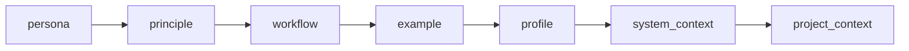

🔖 [Documentation Home](../../README.md) > [LLM](./) > Programming the Prompt

# Programming the Prompt

Both `LLMTask` and `LLMChatTask` are "just" tasks, and everything the model reads is a value you supply — a string, a template, a Python callable, or a fully composed `PromptManager`. This page walks the **ladder**, from the one-liner you reach for 90% of the time up to a model-adaptive, multi-section prompt assembled at runtime.

Climb only as far as your problem requires; each rung builds on the one below.

---

## Table of Contents

- [The one mental model: message vs. system prompt](#the-one-mental-model-message-vs-system-prompt)
- [The ladder at a glance](#the-ladder-at-a-glance)
- [Rung 1 — a plain string](#rung-1--a-plain-string)
- [Rung 2 — a template (inject data with `Tpl`)](#rung-2--a-template-inject-data-with-tpl)
- [Rung 3 — a callable](#rung-3--a-callable)
- [Rung 4 — the system prompt](#rung-4--the-system-prompt)
- [Rung 5 — composing sections with `PromptManager`](#rung-5--composing-sections-with-promptmanager)
- [Rung 6 — sections that reflect live state](#rung-6--sections-that-reflect-live-state)
- [Rung 7 — file-backed sections and profiles](#rung-7--file-backed-sections-and-profiles)
- [See also](#see-also)

---

## The one mental model: message vs. system prompt

Before the ladder, the distinction that everything else hangs on:

| | `message` | `system_prompt` / `prompt_manager` |
|---|---|---|
| **Answers** | *What should the agent do this turn?* | *Who is the agent, and what does it always know?* |
| **Lifetime** | This request | Every request in the conversation |
| **Rendered?** | Only when wrapped in `Tpl` | Only when wrapped in `Tpl` |
| **In a chat** | The opening user turn | Persona + standing rules the user then converses against |

When you have some data (a command's output, a file, an API response) and want the LLM to act on it, the question is always: **is this data "the task" or "background"?**

- *The task* → put it in `message` (`Tpl("Summarize this:\n{...}")`).
- *Background the user will ask about* → put it in the system prompt, and leave `message` for the user.

The rest of this page is how to get data into either one.

---

## The ladder at a glance

| Rung | Mechanism | Reach for it when |
|---|---|---|
| 1 | `message="plain string"` | The instruction is fixed. |
| 2 | `message=Tpl("… {ctx.xcom['x'].pop()} …")` | Inject an upstream task's output, an input, or an env var. |
| 3 | `message=lambda ctx: …` | You need real Python to build the prompt. |
| 4 | `system_prompt=…` (string or callable) | Set persona / standing rules, or seed a chat with context and leave `message` empty. |
| 5 | `prompt_manager=PromptManager(include_sections=[…])` | Reorder or drop the built-in prompt sections. |
| 6 | `pm.append_prompt(...)` / `pm.add_live_context(...)` | Content must reflect live runtime state, or land after the built-ins. |
| 7 | Override `markdown/` files + `ZRB_LLM_PROFILE` | Author prompts as files, with per-model-class profile phrasing. |

---

## Rung 1 — a plain string

The floor. `message` is the user prompt; a bare string is sent as-is.

```python
from zrb import cli, LLMTask

cli.add_task(
    LLMTask(
        name="haiku",
        message="Write a haiku about the sea.",
    )
)
```

## Rung 2 — a template (inject data with `Tpl`)

`message` is a `StrAttr`. A bare string is a **literal** — braces reach the model untouched. Wrap it in `Tpl` to have every `{ ... }` expression evaluated against the active context before the prompt is sent. This is Python **f-string** syntax — single braces, not Jinja `{{ }}`.

Three sources are almost always what you want:

- `{ctx.xcom['task-name'].pop()}` — an **upstream task's output** (see [XCom Deep Dive](../core-concepts/xcom-deep-dive.md)).
- `{ctx.input.some_input}` — a **declared CLI input**.
- `{ctx.env.SOME_VAR}` — an **environment variable**.

This is the tool-free way to hand the model everything it needs to decide. A `CmdTask` runs a command; its stdout stringifies straight into the prompt (a `CmdResult`'s `str()` is its `output`), and the LLM reasons over it — no custom tool required:

```python
from zrb import cli, CmdTask, LLMTask, Tpl

# 1. A deterministic command produces context. Its output lands in XCom.
diff = cli.add_task(CmdTask(name="collect-diff", cmd="git diff --staged"))

# 2. The LLM reads that output straight from the template and decides.
review = cli.add_task(
    LLMTask(
        name="review",
        upstream=[diff],  # guarantees `collect-diff` has run first
        message=Tpl(
            "You are a code reviewer. Review the staged diff below and reply "
            "with a bulleted list of concerns, or 'LGTM' if there are none.\n\n"
            "{ctx.xcom['collect-diff'].pop()}"
        ),
    )
)

diff >> review
```

`review`'s answer is itself pushed to XCom under `review`, so a downstream task consumes it exactly the same way — `fetch → reason → act`, with the LLM as the middle node. See [the pipeline-node pattern](programming-the-agent.md#the-agent-as-a-pipeline-node) for the full three-step shape.

> **Literal braces need nothing.** A prompt containing a code sample or a JSON blob is safe as a plain string — it is never rendered. Only reach for `Tpl` when you actually want substitution, and note that a `Tpl` is all-or-nothing: a template that interpolates *and* contains literal braces wants Rung 3's callable instead.

## Rung 3 — a callable

When the prompt needs branching, loops, or a call into your own code, pass a `Callable[[AnyContext], str]` instead of a string. It runs once per execution with the active context.

```python
def build_message(ctx) -> str:
    raw = str(ctx.xcom["collect-diff"].pop())
    if not raw.strip():
        return "There is no staged diff. Reply with exactly: NOTHING TO REVIEW."
    return f"Review this diff and list concerns:\n\n{raw}"

LLMTask(name="review", upstream=[diff], message=build_message)
```

A callable is not rendered afterwards — you are already in Python, so build the final string yourself.

## Rung 4 — the system prompt

Everything above shaped the *per-turn message*. To set **who the agent is** — persona, standing rules, background knowledge that should persist across every turn — use `system_prompt`. It takes the same shapes (string or `Callable[[AnyContext], str]`).

```python
LLMTask(
    name="deploy-helper",
    system_prompt="You are a cautious release engineer. Never suggest force-pushing.",
    message=Tpl("{ctx.input.request}"),
)
```

Two things to internalize:

1. **`system_prompt` follows the same rule as `message`** — a plain string is literal. For `{ ... }` substitution in a system-prompt *string*, wrap it in `Tpl` — or, more commonly, pass a callable and interpolate in Python:

   ```python
   system_prompt=lambda ctx: f"You are deploying to {ctx.env.DEPLOY_TARGET}. Be careful in prod.",
   ```

2. **`system_prompt` is sugar over the next rung.** Under the hood, both tasks wrap it into `PromptManager(prompts=[system_prompt])`. So when a single string is no longer enough, you are not switching mechanisms — you are just naming the `PromptManager` it was already building for you.

### Seeding a chat with context

For an interactive `LLMChatTask`, the system prompt is where you put data the user will *ask about*, leaving `message` empty so the human drives the conversation. A `CmdTask` can feed it the same way:

```python
from zrb import cli, CmdTask, LLMChatTask
from zrb.llm.ui import UIConfig

status = cli.add_task(CmdTask(name="git-status", cmd="git status && git log --oneline -20"))

chat = cli.add_task(
    LLMChatTask(
        name="ask-repo",
        upstream=[status],
        # Rendered callable → the command output becomes standing knowledge.
        system_prompt=lambda ctx: (
            "You are a git assistant. Here is the current repository state; "
            "answer the user's questions about it.\n\n"
            f"{ctx.xcom['git-status'].pop()}"
        ),
        ui_config=UIConfig(greeting="Ask me anything about the current repo state."),
        # No `message` → the TUI opens and waits for the user.
    )
)

status >> chat
```

Now `zrb ask-repo` runs the command, hands the output to the model as background, and drops the user into a conversation about it.

## Rung 5 — composing sections with `PromptManager`

The system prompt Zrb ships is not one blob — it is an ordered list of **sections**, each owning one concern. Five are file-backed rule sections, two carry runtime facts:



| Section | Purpose |
|---------|---------|
| `persona` | AI identity + response style |
| `principle` | The operating principle underlying the rules |
| `workflow` | The whole rulebook: priority order, turn sequence, skill activation, working loop, verify gate, tool usage, recovery |
| `example` | Answer-scale and stance demonstrations |
| `profile` | Model-class calibration (autonomy register) — resolved as `profile.{name}.md` |
| `system_context` | Stable runtime facts (OS / CWD / model / detected tools) |
| `project_context` | Project docs (`AGENTS.md`, `CLAUDE.md`, `README.md`, …) |

Three things are **not** sections:

- **The skill catalogue** (core skills, available skills, active-skill contents) is part of `workflow`, via the `{CORE_SKILLS}`/`{AVAILABLE_SKILLS}`/`{PREACTIVATED_SKILLS}` placeholders. Each list is capped by `LLM_MAX_SKILLS_IN_CATALOG`, with overflow pointing to the `SearchSkill` tool.
- **Per-tool rules** live in each tool's docstring, which pydantic-ai ships with the schema on every request (ADR-0045).
- **Volatile per-turn state** (time, git status, todos, worktree, interactivity) is injected into the latest user turn as a `<live-context>` block, so the cached system prompt stays byte-stable.

A `PromptManager` lets you control that assembly. Two independent levers:

- **`prompts=[...]`** — extra content appended after the built-ins. This is exactly what `system_prompt` populates.
- **`include_sections=[...]`** — the full ordered list of section names to emit. Drop or reorder the built-ins; the built-in set itself is fixed (ADR-0044).

Dropping a section is an intentional deployment trade-off: shipped prompt files
are plain markdown and are not conditionally rewritten. Keep the sections that
the remaining instructions depend on (ADR-0046).

```python
from zrb import cli, LLMChatTask
from zrb.llm.prompt.manager import PromptManager

pm = PromptManager(
    prompts=["Prefer standard-library solutions over new dependencies."],
    include_sections=[
        "persona", "workflow", "system_context", "project_context",
        # dropped: principle, example, profile
    ],
)

cli.add_task(LLMChatTask(name="lean-chat", prompt_manager=pm))
```

You can also set the order without touching code, via the `ZRB_LLM_INCLUDE_SECTIONS` env var (comma-separated, order-sensitive; see [LLM Configuration → Prompt Component Configuration](../configuration/llm-config.md#prompt-component-configuration)). A *new* name in `include_sections` resolves to nothing (ADR-0044).

**Task scope vs. registry scope.** Each task exposes its manager as `task.prompt_manager`. The same API exists at registry scope: `prompt_registry.set_prompts` / `append_prompt` in `zrb_init.py` changes the default **every** task starts from (`PromptManager(prompts=None)` defers there); a task's `prompts=` argument or mutation overrides just that task. Each layer's append/remove ops stack on the one below — see [LLM Component Collections](../configuration/llm-collections.md).

## Rung 6 — sections that reflect live state

The built-in section set is fixed, so there are no user-defined system-prompt sections (ADR-0044). Two public hooks cover the same ground:

- **`pm.append_prompt(...)`** — static, dynamic, or full-middleware content emitted **after** all built-in sections; part of the cached system prompt.
- **`pm.add_live_context(name, provider)`** — inject volatile per-turn state into the `<live-context>` block appended to each user message, **without** invalidating the cacheable system-prompt prefix.

`append_prompt()` takes a static string, a `Callable[[AnyContext], str]`, or a *full middleware* `Callable[[ctx, current_prompt, next], str]` that can rewrite the whole assembled prompt (detected by arity — 3+ parameters):

```python
from zrb import LLMChatTask

task = LLMChatTask(name="chat")

# Static text
task.prompt_manager.append_prompt("Always answer in British English.")

# Dynamic text — receives the active context
import datetime
def date_note(ctx) -> str:
    return f"Today's date is {datetime.date.today():%Y-%m-%d}."
task.prompt_manager.append_prompt(date_note)

# Full middleware — `current_prompt` is everything assembled so far
def strip_blank_lines(ctx, current_prompt, nxt):
    cleaned = "\n".join(line for line in current_prompt.splitlines() if line.strip())
    return nxt(ctx, cleaned)
task.prompt_manager.append_prompt(strip_blank_lines)
```

`add_live_context(name, provider)` registers a `Callable[[AnyContext], str]` whose non-empty output joins the `<live-context>` block — for content that must reflect live state (time, git status, deploy target). Return `""` to emit nothing; a provider that throws is logged and skipped.

```python
pm = PromptManager()
pm.add_live_context("sprint", lambda ctx: f"Active sprint: {load_current_sprint()}")
```

The `add_live_context` provider runs every turn, so the injected block always reflects current state. Providers run in registration order, after the built-in live-context lines (time, git, worktree, mode, todos); re-registering the same name replaces the previous provider. Siblings: `pm.remove_live_context(name)`, `pm.get_live_contexts()`, `pm.set_live_contexts(pairs)`.

👉 Runnable end-to-end example: [`examples/live-context`](../../examples/live-context).

## Rung 7 — file-backed sections and profiles

Section wording ships as files, so you can override any of them without Python: place a same-named file higher on the override chain (project override → env → base-prompt-dir → package) and it replaces the packaged wording, `{PLACEHOLDER}` substitution included — e.g. `persona.md` in `ZRB_LLM_PROMPT_DIR` replaces the packaged persona. The chain's env vars and the list of overridable names are in [LLM Configuration → Prompt Customization Hierarchy](../configuration/llm-config.md#prompt-customization-hierarchy).

Independently, `ZRB_LLM_PROFILE` selects one of three **profiles** — `minimal`, `standard`, or `capable` — that swap the final `profile` section via `profile.{name}.md`, and for `minimal` only, drop the delegate (sub-agent) tools:

| Profile | `profile` section | Delegate tools |
|---------|-------------------|----------------|
| `minimal` | `profile.minimal.md` — concise, one clear next action | not registered |
| `standard` | `profile.standard.md` — balance autonomy with clear communication | registered |
| `capable` | `profile.capable.md` — strong ownership of substantial work | registered |

A profile changes **only** the `profile` section and the `minimal` delegate restriction — not `persona` / `principle` / `workflow` / `example`, their wording, or the rest of the tool surface (ADR-0049). `minimal` targets very small models (~3B), which cannot use delegation well, so the delegate tools would be pure token cost (ADR-0058). Override a profile's wording by dropping a `profile.{name}.md` into `ZRB_LLM_PROMPT_DIR`; run `ZRB_LLM_PROFILE=minimal` for a session on a small local model. An explicit name never changes with the model; only `auto` does, and an unrecognized value falls back to `standard`.

`auto` (the default) derives the profile from the model id. It never guesses from a family name (`deepseek`, `qwen`, `llama` each span tiny→frontier); it reads a **stated size**:

| Profile | `auto` selects it when |
|---------|------------------------|
| `minimal` | a stated count of 4B or less — `qwen2.5:3b`, `deepseek-r1:1.5b`, `qwen2.5:0.5b`; or a small-tier label served locally — `ollama:phi4-mini`, `lmstudio:gemma-tiny` |
| `standard` | a stated count above 4B and up to 14B — `qwen3-12b`, `llama-3-8b`; or an id that declares nothing |
| `capable` | a stated count above 14B — `llama-3-70b`, `llama-3.1-405b` |

- The count is a **number**: `1.5b` is 1.5B, not 5B.
- With two counts the first wins, so an MoE id reads as its total parameters (`qwen3-30b-a3b` → 30B → `capable`).
- A count outranks a label: `some-mini-32b` stays `capable`.
- A label **alone** never selects `minimal` — `nano`/`tiny` also name hosted models (`gpt-5-nano`) far stronger than a local 3B. It does with a **local provider prefix** (`ollama:`, `lmstudio:`, `llamacpp:`, `localai:`), e.g. `ollama:phi4-mini` (3.8B on a laptop). Ollama's hosted `:cloud` suffix is excluded, so `ollama:kimi-k2.6:cloud` stays `standard`.

See `AGENTS.md` → *LLM Prompt System*, ADR-0049.

---

## See also

- [Programming the Agent](programming-the-agent.md) — the full map: tools, hooks, dynamic prompts, history processors, agent-as-pipeline-node
- [XCom Deep Dive](../core-concepts/xcom-deep-dive.md) — how task outputs flow into `{ctx.xcom[...]}`
- [LLMChatTask API Reference](../task-types/llmchat-task.md) — the full constructor and builder API
- [LLM Assistant & AI Tasks](llm-integration.md) — TUI, `LLMTask`/`LLMChatTask` usage
- [Extending the LLM](extending-the-llm.md) — tools, sub-agents, context management
- `AGENTS.md` → *LLM Prompt System* and ADR-0044, ADR-0049 — section resolution, profiles and the auto ladder

🔖 [Documentation Home](../../README.md) > [LLM](./) > Programming the Prompt
