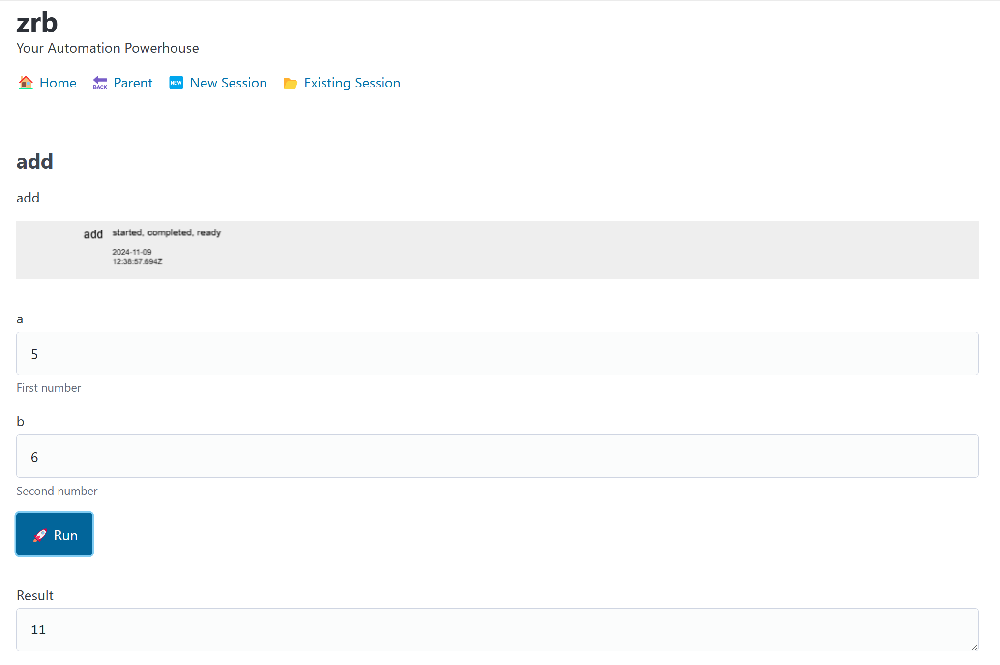

🔖 [Table of Contents](../README.md)

# Defining A Task

This example demonstrates how to create a simple math tool using Zrb, a powerful automation framework. We'll create an "add" function within a "math" group.

## Code Example

Create a file named `zrb_init.py` with the following content:

```python
from zrb import cli, Task, Group, IntInput

# Create a 'math' group
math = cli.add_group(Group("math", description="Math tools"))

# Add an 'add' task to the 'math' group
math.add_task(Task(
    name="add",
    input=[
        IntInput("a", description="First number"),
        IntInput("b", description="Second number")
    ],
    action=lambda ctx: ctx.input.a + ctx.input.b
))
```

This code does the following:
1. Imports necessary components from Zrb.
2. Creates a "math" group for organizing related tools.
3. Adds an "add" task to the "math" group, which takes two integer inputs and returns their sum.

## Usage

After defining the task, you can access it in various ways:

### 1. Using CLI with Positional Arguments

```bash
zrb math add 4 5
```

Output:
```
9
To run again: zrb math add --a 4 --b 5
```

### 2. Using CLI with Keyword Arguments

```bash
zrb math add --a 4 --b 5
```

Output:
```
9
To run again: zrb math add --a 4 --b 5
```

### 3. Using CLI with Incomplete Arguments

If you provide incomplete arguments, Zrb will prompt for the missing values:

```bash
zrb math add 4
```

Output:
```
b [0]: 5
9
To run again: zrb math add --a 4 --b 5
```

### 4. Using Web Interface

Zrb also provides a web interface for interacting with your tasks:

```bash
zrb server start
```

This command starts a web server, allowing you to access and run your tasks through a browser interface.

The web interface will be available at `http://localhost:21213`.




### 5. Using HTTP API

Alternatively, you can also interact with your tasks using HTTP API:

```bash
curl -X 'POST' \
  'http://localhost:21213/api/v1/task-sessions/math/add' \
  -H 'accept: application/json' \
  -H 'Content-Type: application/json' \
  -d '{"a": 4, "b": 5}'
```

Zrb will return a session name.

```
{"session_name":"warm-disk-3092"}
```

You can then use the session name to the status and the final result of your tasks.

```bash
curl -X 'GET' \
  'http://localhost:21213/api/v1/task-sessions/math/add/warm-disk-3092' \
  -H 'accept: application/json'
```

The result wil be in JSON. If you want to use a custom script to parse the JSON, you should:

- Make sure the `finished` response is `true`
- Fetch the `final_result` response (in this case it is `9`)

```json
{
  "name": "warm-disk-3092",
  "start_time": "2024-12-25 09:57:59.772322",
  "main_task_name": "add",
  "path": [
    "math",
    "add"
  ],
  "input": {
    "a": 4,
    "b": 5
  },
  "final_result": "9",
  "finished": true,
  "log": [],
  "task_status": {
    "add": {
      "history": [
        {
          "status": "started",
          "time": "2024-12-25 09:57:59.772322"
        },
        {
          "status": "completed",
          "time": "2024-12-25 09:57:59.772686"
        },
        {
          "status": "ready",
          "time": "2024-12-25 09:57:59.772723"
        }
      ],
      "is_started": true,
      "is_ready": true,
      "is_completed": true,
      "is_skipped": false,
      "is_failed": false,
      "is_permanently_failed": false,
      "is_terminated": true
    }
  }
}
```


## Key Features Demonstrated

- **Group Creation**: Organizing related tasks into a group ("math").
- **Task Definition**: Creating a task with a name, inputs, and an action.
- **Input Handling**: Using `IntInput` to specify and validate integer inputs.
- **Flexible CLI Usage**: Supporting both positional and keyword arguments.
- **Interactive Prompts**: Requesting missing arguments when needed.
- **Web Interface**: Providing a graphical interface for task execution.
- **HTTP API**: Providing a HTTP API for task execution.

## Next Steps

- Explore creating more complex tasks and groups.
- Investigate additional input types provided by Zrb.
- Learn about task dependencies and advanced Zrb features.

For more information, refer to the Zrb documentation or run `zrb --help` for available commands and options.

🔖 [Table of Contents](../README.md)
