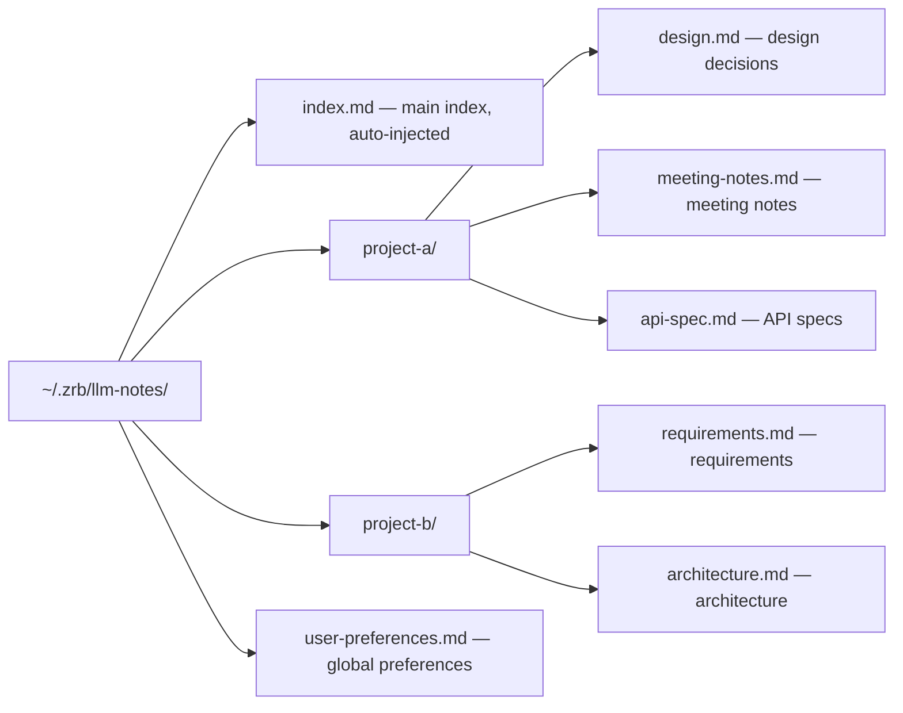

🔖 [Documentation Home](../../README.md) > [Technical Specs](./llm-context.md)

# LLM Journal System (Technical Specification)

Zrb provides a directory-based journal system for maintaining persistent context across LLM sessions. This allows the assistant to remember project-specific details, user preferences, and local environment information through a hierarchical file system structure.

---

## Table of Contents

- [Overview](#1-overview)
- [Storage Mechanism](#2-storage-mechanism)
- [Prompt Injection](#3-prompt-injection)
- [Automatic Creation](#4-automatic-creation)
- [Configuration Placeholders](#5-configuration-placeholders)
- [Documentation Separation](#6-documentation-separation)

---

## 1. Overview

The journal is a directory of Markdown files organized hierarchically by topic or project, giving the assistant a structured place to keep context that outlives a single session.

| Property | Value |
|----------|-------|
| Storage | Directory of Markdown files |
| Organization | Hierarchical, by topic or project |
| Entry point | `index.md`, the only file injected into a session |
| Written by | `LogActivity` and `WriteJournalNote`, which own the on-disk format |

---

## 2. Storage Mechanism

Journal entries are stored in a directory structure with a central index file.

| Setting | Environment Variable | Default |
|---------|---------------------|---------|
| Enabled | `ZRB_LLM_JOURNAL_ENABLED` | `on` |
| Journal Directory | `ZRB_LLM_JOURNAL_DIR` | `~/.zrb/llm-notes/` |
| Index File | `ZRB_LLM_JOURNAL_INDEX_FILE` | `index.md` |
| Injected index cap | `ZRB_LLM_JOURNAL_INDEX_MAX_CHARS` | `2500` |

`ZRB_LLM_JOURNAL_ENABLED=false` turns the whole subsystem off. There is no
journal prompt section to suppress — the journal *is* its three tools
(`SearchJournal`, `LogActivity`, `WriteJournalNote`), so the flag unregisters
them in `apply_common_tools`, and `render_journal_index` checks the same flag
for the `<journal-index>` injection. The model is then never told a journal
exists (ADR-0053).

`ZRB_LLM_JOURNAL_DIR` is **not** an off switch: clearing it falls back to
`~/.zrb/llm-notes/` rather than disabling journaling.

### Directory Organization



### Index File Structure

```markdown
# Journal Index

## Project A
- [Design Decisions](project-a/design.md)
- [Meeting Notes](project-a/meeting-notes.md)
- [API Specifications](project-a/api-spec.md)

## Project B  
- [Requirements](project-b/requirements.md)
- [Architecture](project-b/architecture.md)

## Global Preferences
- [User Preferences](user-preferences.md)
```

---

## 3. Prompt Injection

The `index.md` snapshot is deliberately kept **out of** the cached system prompt (`src/zrb/llm/prompt/live_context.py::render_journal_index`). Embedding the mutable index in the cached prefix would invalidate that cache every time the agent journaled mid-session (ADR-0042), so instead it travels through the conversation itself, as part of the `<live-context>` block appended to the latest **user** message — never the system prompt.

The index is only injected at the two moments it could otherwise be missing from context:

- **The first turn** — when history is still empty, `render_live_context(..., inject_journal_index=True)` appends the snapshot.
- **History summarization** — `summarize_history` re-seeds the index into the freshly-compressed history so it survives compaction.

On every other turn, the block is simply omitted — the agent is expected to already have it from earlier in the conversation.

When present, the block is wrapped as its own tag inside the live-context payload:

```
<journal-index>
Your persistent memory (index file: index.md). Use SearchJournal for full entries.
[content of index.md, capped at ZRB_LLM_JOURNAL_INDEX_MAX_CHARS]
</journal-index>
```

When the content exceeds the cap it is cut **on a line boundary** and ` (...more)`
is appended, and the header gains a pointer to the rest:

```
Your persistent memory (index file: index.md). Truncated at `(...more)`; Read /abs/path/to/index.md for the rest. Use SearchJournal for full entries.
```

Cutting on a line boundary matters because the entries are facts about the user —
half a sentence is worse than none. Overflow is dropped from the **end**, so the
index should be written most-durable-first. `WriteJournalNote` enforces that
order when it creates the root index: identity and standing preferences first,
unbounded "Recent Insights" last, so growth only ever evicts itself.

Nothing is injected at all when the index file is missing, unreadable, or empty;
when `ZRB_LLM_JOURNAL_INDEX_MAX_CHARS` is `0`; or when
`ZRB_LLM_JOURNAL_ENABLED` is `false`. A missing block therefore does not prove
an empty journal — and nothing tells the model so. Stating the caveat would
cost either prompt weight or a tool docstring paid for on every request, so it
is a known gap rather than shipped text (`render_journal_index`'s docstring
records it). It matters only when
`ZRB_LLM_JOURNAL_INDEX_MAX_CHARS` is `0` while the journal tools stay
registered — a deliberate and unusual pairing.

---

## 4. Automatic Creation

`search_journal` (`src/zrb/llm/tool/journal.py`, exposed to the agent as `SearchJournal`) calls `os.makedirs(..., exist_ok=True)` when the configured directory is absent and reports the same empty result an unmatched search returns.

That behaviour is deliberate. Reporting a missing directory as an error made the whole memory layer read as unavailable, and the agent responded by declaring it could not journal rather than by writing its first note. An unwritten journal is *empty*, not broken.

**The rest of the tree is created by the writers, not by the agent.** `LogActivity` and `WriteJournalNote` (`src/zrb/llm/tool/journal_write.py`) derive every path and timestamp themselves, create the root index and the five directory indexes on first write, and maintain the link graph — each note registered in its directory index, each forward link matched by a reciprocal backlink. The agent supplies content; the structure is code (ADR-0053).

---

## 5. Configuration Placeholders

The journal system uses configuration placeholders that are automatically replaced in prompts:

| Placeholder | Replaced With |
|-------------|---------------|
| `{CFG_LLM_JOURNAL_DIR}` | Journal directory path |
| `{CFG_LLM_JOURNAL_INDEX_FILE}` | Index filename |
| `{CFG_ROOT_GROUP_NAME}` | Root group name (e.g., "zrb") |
| `{CFG_LLM_ASSISTANT_NAME}` | Assistant name |
| `{CFG_ENV_PREFIX}` | Environment variable prefix |

---

## 6. Documentation Separation

| Location | Content Type |
|----------|-------------|
| `AGENTS.md` | Technical documentation (architecture, conventions, patterns) |
| Journal | Non-technical notes, reflections, project context |

> 💡 **Best Practice:** Use `AGENTS.md` for rules the LLM must follow. Use the journal for information the LLM should remember.

🔖 [Documentation Home](../../README.md) > [Technical Specs](./llm-context.md)
