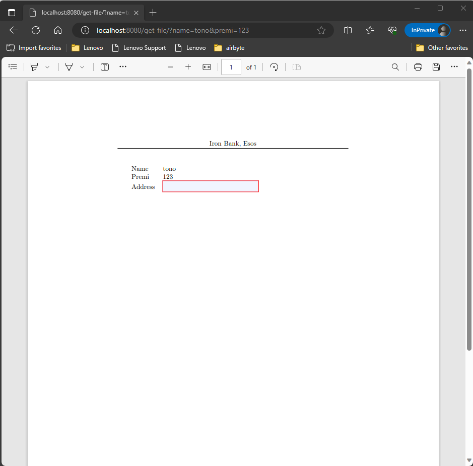

🔖 [Table of Contents](../README.md) / [Tutorials](README.md)

# The Requirement

Can Zrb help me generate a PDF form? It would be nice if it comes with a web interface.

# Generating PDF Form

To generate a PDF file, you can use a utility named `pdflatex`. If you are using ubuntu/debian, you can install the software by invoking the following command.

```bash
sudo apt-get install pdflatex
```

## Preparing LaTeX File

Next, you need to create a LaTeX file as follows.

```tex
\documentclass{article}
\usepackage{hyperref}

\usepackage{fancyhdr}

\pagestyle{fancy}
\fancyhf{} % clear all header and footer fields
\fancyhead[C]{Iron Bank, Esos}
\fancyfoot{} % clear footer
\fancyfoot[R]{Confidential}

\begin{document}

\begin{Form}
\begin{tabular}{ll}
    Name & applicant-name \\
    Premi & applicant-premi \\
    Address & \TextField[name=address,width=5cm]{} \\
\end{tabular}
\end{Form}

\end{document}
```

Save the LaTeX file as `_automate/form-template/applicant-premi-applicant-name.tex`.

The LaTeX file contains some information:

- It has `Iron Bank, Esos` as page header. The position of the header is `centered`
- It has `Confidential` as page footer. The position of the header is on the `right`
- It has a table containing two rows, each with two columns:
    - The first row contains `Name` and `application-name`
    - The first row contains `Premi` and `application-premi`
    - The first row contains `Address` and a text input.

We will override `application-name` and `application-premi` programmatically later.

## Creating the Task

Once the LaTeX template has been prepared, you can proceed to make the task to generate the PDF file.

```bash
zrb project add cmd-task --project-dir . --task-name create-form
```

Modify `_automate/create_form.py` into this:


```python
from zrb import CmdTask, ResourceMaker, runner, StrInput
from zrb.builtin.group import project_group
import os

CURRENT_DIR = os.path.dirname(__file__)
TEMPLATE_DIR = os.path.join(CURRENT_DIR, 'form-template')
RESULT_DIR = os.path.join(CURRENT_DIR, '../src/result')


applicant_name = StrInput(name='applicant-name', default='John Doe')
applicant_premi = StrInput(name='applicant-premi', default='12345')
applicant_address = StrInput(name='applicant-address', default='Jakarta')
inputs = [applicant_name, applicant_premi, applicant_address]


create_tex = ResourceMaker(
    name='create-tex',
    inputs=inputs,
    template_path=TEMPLATE_DIR,
    destination_path=RESULT_DIR,
    replacements={
        'applicant-name': '{{input.applicant_name}}',
        'applicant-premi': '{{input.applicant_premi}}',
        'applicant-address': '{{input.applicant_address}}',
    }
)

create_form = CmdTask(
    name='create-form',
    description='create form',
    group=project_group,
    inputs=inputs,
    upstreams=[create_tex],
    cwd=RESULT_DIR,
    cmd=[
        'pdflatex \\',
        '--jobname "{{ input.applicant_premi}}-{{ input.applicant_name }}" \\',
        '"{{ input.applicant_premi}}-{{ input.applicant_name }}.tex"',
        'rm "{{ input.applicant_premi}}-{{ input.applicant_name }}.aux"',
        'rm "{{ input.applicant_premi}}-{{ input.applicant_name }}.log"',
        'rm "{{ input.applicant_premi}}-{{ input.applicant_name }}.out"',
    ]
)
runner.register(create_form)
```

We define two tasks:

- __create_tex:__ Creating a LaTeX file under `src/result`.
- __create_form:__ Turn the created LaTex file into a pdf file.

Finally, you can try this out by invoking:

```bash
zrb project create-form --applicant-name Smith --applicant-premi 12345
```

Once you run the command, you will find `12345-Smith.pdf` under `src/result`.

# Accessing Task Using Web Interface

Now, let's wrap the task into a web interface.

First of all, make sure you have Uvicorn and Fastapi installed

```bash
pip install uvicorn==0.24.0.post1
pip install fastapi==0.104.1
```

Next, you make a file named `web.py`

```python
from fastapi import FastAPI
from fastapi.responses import FileResponse
from _automate.create_form import create_form

import os

CURRENT_DIR = os.path.dirname(__file__)
RESULT_DIR = os.path.join(CURRENT_DIR, 'src/result')

create_form_fn = create_form.to_function(is_async=True)

app = FastAPI()


# Endpoint to send a file as a response
@app.get("/get-file/")
async def get_file(name: str, premi: str):
    await create_form_fn(applicant_name=name, applicant_premi=premi)
    return FileResponse(f'{RESULT_DIR}/{premi}-{name}.pdf')

```

Finally, you start the web app by invoking the following command:

```bash
uvicorn web:app --host 0.0.0.0 --port 8080
```

To test the application, you can point your browser to `http://localhost:8080/get-file?name=tono&premi=123`



That's it.

🔖 [Table of Contents](../README.md) / [Tutorials](README.md)
